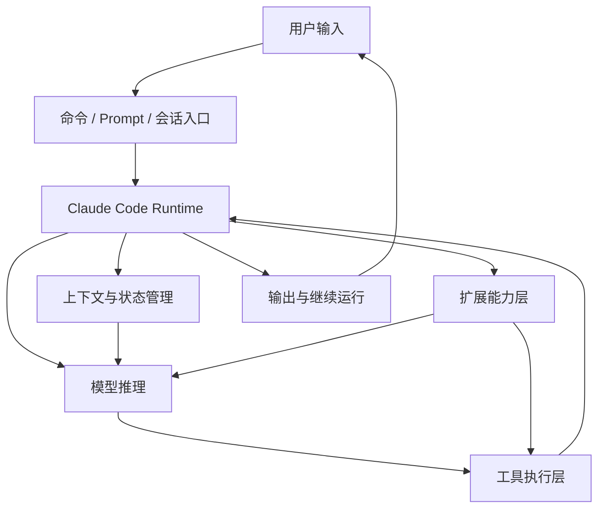

# 卷一 01｜Claude Code 到底是什么系统

## 导读

- **所属卷**：卷一：Claude Code 系统全景导论
- **卷内位置**：01 / 06
- **上一篇**：无
- **下一篇**：[下一篇：Claude Code 由哪些核心对象组成](./02-tool-system-overview.md)

如果第一次看 Claude Code，很容易把它理解成一个会聊天的 CLI，或者一组能调工具的工程功能集合。这样理解不算错，但远远不够。真正的问题是：**Claude Code 到底是一套怎样的系统？**

如果这个问题不先讲清，后面无论去看主循环、工具、上下文，还是 skill、agent、MCP 这些扩展能力，读起来都会像在逛一堆分散源码，而不是在理解同一个 runtime。

所以这一篇先不急着深挖某个局部，而是先做一件更基础的事：

> **先把 Claude Code 看成一个完整系统，再决定后面各个局部该怎么理解。**

---

## 先给判断：Claude Code 不是聊天壳，而是 Agent Runtime

如果只看表面，Claude Code 很像一个更强的命令行聊天工具：

- 你输入一句话
- 模型回复一段内容
- 中间偶尔调工具
- 最后把结果打印回终端

但如果把源码和运行方式一起看，真正更准确的判断是：

> **Claude Code 不是“会聊天的 CLI”，而是一套把模型、运行时、执行能力、上下文和扩展能力编织在一起的 agent runtime。**

这里最关键的不是“它能不能聊天”，而是：

- 它能不能把一次用户输入变成一轮可持续展开的 agent turn
- 它能不能把模型意图落成真实执行动作
- 它能不能在执行过程中继续维持上下文、状态和恢复能力
- 它能不能继续吸纳 skill、agent、subagent、MCP、plugin 这些扩展能力

也就是说，Claude Code 的核心不是一个聊天前端，而是：

> **一套能够组织模型推理、工具执行、状态持续与能力扩展的运行时系统。**

如果这一点不先立住，后面几卷几乎都会看歪。

---

## 为什么很多人会先把它看浅

之所以容易误判，是因为 Claude Code 最显眼的一层恰好不是它最本质的一层。

用户最先接触到的往往是：

- 一个 CLI 界面
- 一轮对话输入输出
- 一些命令和 slash command
- 一些“帮我读文件 / 改代码 / 跑命令”的直接体验

这些都是真实存在的，但它们更像是**表层交互面**，不是系统本体。

如果顺着这层表象去理解，就会自然得到几个偏浅的结论：

### 1. 它像一个加强版聊天壳
错不在这里，而在于这只解释了“用户怎么看见它”，没有解释“系统怎么运作”。

### 2. 它像一组工具调用能力的集合
这也不算错，但如果只停在这里，就会把 tool 看成若干功能点，而看不见 runtime 如何调度、约束、展示、恢复和继续推进。

### 3. 它像一套工程 productivity features
这更接近产品视角，但仍然没进入系统视角。你会知道它有哪些功能，却不知道这些功能为什么能被放进同一套运行时里。

换句话说，Claude Code 最容易被看浅，不是因为它表面做得不够明显，而是因为：

> **它最先暴露给用户的，是交互层；而真正该先理解的，是运行时层。**

---

## Claude Code 的系统总图

如果先把细节都压住，Claude Code 至少可以先被看成下面这张图里的系统：

这张图不用看得太细，先抓住三件事就够了。

### 1. 用户并不是直接面对模型
用户输入先进的不是“裸模型”，而是 Claude Code runtime。也就是说，真正接住用户请求的是运行时系统，不是单一模型 API。

### 2. 模型也不是直接面对世界
模型虽然能推理，但真正把意图落成动作，还要经过工具执行层、权限约束、上下文管理和扩展能力层。

### 3. 系统不是“一轮结束就归零”
Claude Code 不是收一条输入、吐一条输出就结束，而是始终在维护：

- 当前消息历史
- 当前状态
- 当前上下文
- 当前可用能力
- 当前运行中的任务

所以它更像一个持续运行的 agent runtime，而不是一次性问答界面。

---

## 从系统角度看，Claude Code 至少有五层

如果把这套系统进一步压成稳定的阅读对象，我觉得最值得先认清的是下面五层。

### 第一层：交互入口层
这一层回答的是：

- 用户到底通过什么入口把意图送进系统
- 普通 prompt、命令、slash command、后续扩展入口分别在什么位置

这一层很显眼，但不是最深的一层。

### 第二层：主循环 / Runtime 编排层
这一层回答的是：

- 一次请求怎么被组织成一轮 agent turn
- 模型输出怎样继续触发工具、继续推理、继续回应
- 为什么 Claude Code 不是“一问一答结束”

这是系统真正动起来的核心层。

### 第三层：执行能力层
这一层回答的是：

- 模型产生的结构化意图如何落成真实动作
- tool 在系统里是什么
- 为什么工具不是“函数列表”，而是正式执行对象

这是 Claude Code 把“智能”接到“行动”上的关键接口层。

### 第四层：上下文与状态层
这一层回答的是：

- Claude Code 如何在多轮运行中维持上下文
- 为什么要有 context construction、session、collapse、compact、restore 这些机制
- 为什么这套系统不会越跑越乱

如果没有这层，Claude Code 只能是一轮一轮地短促工作，无法持续推进复杂任务。

### 第五层：扩展能力层
这一层回答的是：

- skill、agent、subagent、MCP、plugin 这些能力如何被装进系统
- 为什么 Claude Code 不是一个封闭产品，而是一套会继续长能力的 runtime

这一层决定了 Claude Code 的上限不只是“内置功能”，而是“可继续装配的能力系统”。

可以先把这五层记成一句话：

> **Claude Code 先接住用户，再组织主循环，再把模型意图落成执行，再维持上下文与状态，最后不断接入新的能力。**

---

## 这套系统真正难的地方不在“会不会调工具”

如果只从产品宣传语看，Claude Code 最容易被记住的是：

- 会读文件
- 会改代码
- 会跑命令
- 会用 subagent
- 会接 MCP

但这些都只是“能力名词”。

真正困难、也真正决定它系统水平的，是下面这些问题：

### 1. 一次请求如何被组织成一轮可持续工作的 agent turn
不是“答一句”就结束，而是可能继续调用工具、继续处理结果、继续做下一步。

### 2. 模型意图怎样被稳定地翻译成执行动作
不是让模型直接碰世界，而是让 runtime 接住它的结构化意图，再决定怎么执行、怎么约束、怎么展示。

### 3. 长任务与多轮任务如何持续下去
不是每轮都从零开始，而是能记住、压缩、恢复、继续推进。

### 4. 新能力如何被接进来而不把系统搞散
不是多加几个功能按钮，而是 skill、agent、MCP、plugin 这些东西都能放进同一套 runtime 语义里。

所以更准确地说：

> **Claude Code 的价值不在于“它会几个动作”，而在于它怎样把这些动作组织进一套可以持续工作的系统。**

---

## 为什么这本书要先这样读

如果现在就一头扎进具体文件，比如先去看 BashTool、FileReadTool、runAgent、compact、MCP auth，你当然也能看懂很多局部细节。

但问题是：

- 你会知道它们各自做了什么
- 却不一定知道它们为什么会出现在同一套系统里
- 也不一定知道它们在整张地图上各自站在哪

这就是为什么这本书的阅读路径不该按“源码目录”来组织，而应该按“读者理解坡度”来组织。

先有系统地图，再有局部细节，读者脑子里才会形成一个稳定的理解顺序：

1. 它是什么系统
2. 它由什么对象组成
3. 它怎么跑一轮
4. 它怎么执行
5. 它怎么持续
6. 它怎么扩展

后面每一卷，其实都只是在继续拆这六个问题中的一部分。

---

## 这一卷之后会继续拆什么

新卷一接下来会顺着下面这条路径往前推：

### 02｜Claude Code 由哪些核心对象组成
先把 prompt、command、tool、agent、skill、context、session、runtime 这些对象认全。

### 03｜一次请求是怎么跑成一次 Agent Turn 的
从系统总图切到动态主线，但只先看总流程。

### 04｜Claude Code 怎么把模型意图落成执行能力
进入 tool runtime 的总图，不急着深挖具体工具。

### 05｜Claude Code 怎么维持上下文、状态与持续工作
解释为什么这套系统不是“一问一答后就重启”。

### 06｜Claude Code 怎么长出更多能力
把 skill、agent、subagent、MCP、plugin 的扩展地图先立起来，并顺手把后面几卷导航出去。

也就是说，卷一读完以后，你不一定已经掌握某个局部实现，但你脑子里应该已经有了一张稳定的 Claude Code 系统地图。后面再进入主循环、工具系统、上下文管理或扩展机制时，你看到的就不再是散点文件，而是同一套 runtime 的不同侧面。

---

## 一句话收口

> Claude Code 最重要的，不是它会不会聊天，也不是它能不能调工具，而是它怎样把模型、运行时、执行能力、上下文和扩展能力编织成一套可持续工作的 agent runtime。这一卷的任务，就是先把这张地图替你搭出来。
