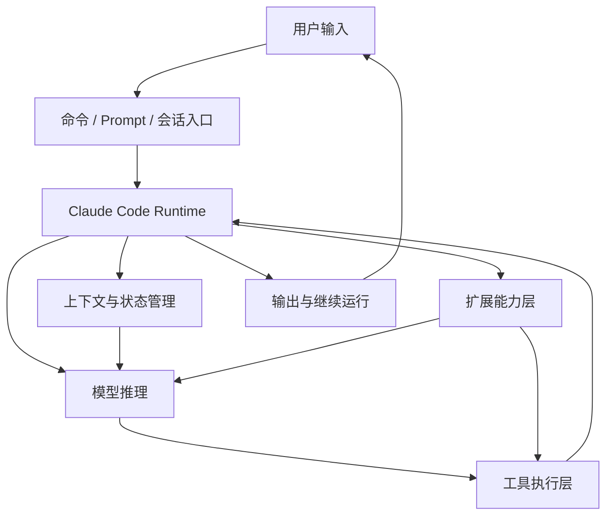

# 卷一 01｜Claude Code 到底是什么系统

## 导读

- **所属卷**：卷一：Claude Code 系统全景导论
- **卷内位置**：01 / 06
- **上一篇**：无
- **下一篇**：[下一篇：Claude Code 由哪些核心对象组成](./02-tool-system-overview.md)

Claude Code 最容易被误认成一个会聊天的 CLI，或者一组能调工具的工程功能集合。但如果把它只理解到这一步，后面几乎所有源码都会看歪。

更准确的判断是：

> **Claude Code 不是聊天壳，而是一套把模型推理、运行时编排、执行能力、上下文管理与扩展机制组织在一起的 agent runtime。**

这也是为什么卷一不先去钻某个局部模块，而是先把整张系统地图立起来。

---

## 为什么它最容易先被看浅

Claude Code 最先暴露给用户的，往往是它最表面的一层：

- 一个命令行界面
- 一轮输入和一轮输出
- 一些可以直接调用的工具能力
- 一些看起来很“产品功能”的 skill、agent、MCP、plugin

所以很自然就会得到一个偏浅的理解：它好像只是一个更强的聊天工具，或者一个“能写代码、能跑命令”的命令行产品。

问题不在于这些观察是错的，而在于它们只解释了：

- 用户怎么接触到 Claude Code
- 却没有解释 Claude Code 是怎么运作的

而真正决定 Claude Code 难度和价值的，恰恰不是它表面暴露出来的这些交互动作，而是：

> **它怎样把用户输入、模型推理、工具执行、上下文维持和能力扩展组织进同一套运行时。**

换句话说，Claude Code 最容易被看浅，不是因为它做得不够复杂，而是因为它最先暴露给你的，恰好不是它最本质的一层。

---

## Claude Code 的系统总图

如果先把局部细节都压住，Claude Code 至少可以先被看成下面这张系统图：

这张图最值得先抓住的一点不是“模块有哪些”，而是：

> **用户和模型之间，真正站着的是一层 Claude Code runtime。**

这一层既接住用户输入，也约束模型能力；既把模型意图翻译成执行动作，也负责维持上下文、状态和后续继续运行的能力。

也正因为中间存在这层 runtime，Claude Code 才不会退化成两种更浅的东西：

- 不是“用户直接面对裸模型”
- 也不是“模型直接面对真实世界”

它真正做的是在两者之间建立一套可组织、可约束、可持续的运行秩序。

---

## 如果把它从外到内拆开，最值得先站稳五层台阶

如果把 Claude Code 从外到内拆开来看，读者最值得先站稳的是五层台阶。它们不是五个并列盒子，而是五个越来越深的理解层。

### 第一层：交互入口层

这一层回答的是：

- 用户到底通过什么入口把意图送进系统
- 普通 prompt、命令、slash command，以及后面会看到的扩展入口分别在什么位置

这一层最显眼，也最容易让人误判，因为你最先看到的通常就是这一层。所以如果只停在这里，Claude Code 很容易被误看成一个交互产品，而不是运行时系统。

### 第二层：主循环 / Runtime 编排层

再往里一层，才是系统真正动起来的地方。

这一层回答的是：

- 一次请求怎么被组织成一轮 agent turn
- 模型输出怎样继续触发工具、继续推理、继续回应
- 为什么 Claude Code 不是“一问一答结束”，而是可以持续推进一项任务

也就是说，第一层只是“你怎么把问题送进来”，第二层才开始回答“系统怎么把这件事跑起来”。

### 第三层：执行能力层

主循环继续往里，才会撞上真正把模型意图落成现实动作的那一层。

这一层回答的是：

- tool 在系统里是什么
- 为什么模型不是直接“调函数”
- runtime 怎样把结构化意图翻译成真实执行动作

如果没有这一层，Claude Code 的智能就永远只能停在“会说”，而不能稳定地落成“会做”。

### 第四层：上下文与状态层

但系统能跑起来，还不等于它能持续工作。

这一层回答的是：

- Claude Code 如何在多轮运行中维持上下文
- 为什么会有 context construction、session、collapse、compact、restore 这些机制
- 为什么这套系统不会越跑越乱、越跑越膨胀到不可继续

这一层真正解决的不是“能不能做动作”，而是“能不能持续工作”。

### 第五层：扩展能力层

再往里看，你会发现 Claude Code 还不是一个封闭系统。

这一层回答的是：

- skill、agent、subagent、MCP、plugin 这些能力如何被装进来
- 为什么 Claude Code 的上限不只是“当前内置了什么功能”
- 为什么它看起来像一个产品，但本质上又像一个不断长能力的运行时平台

也就是说，Claude Code 的终点不是“已经有一组 feature”，而是“它还可以继续长出新的能力”。

如果把这五层先记成一句话，就是：

> **Claude Code 先接住用户，再组织主循环，再把模型意图落成执行，再维持上下文与状态，最后不断接入新的能力。**

---

## 这套系统真正难的，不是“它会几个动作”

如果只从产品功能表去看，Claude Code 最容易被记住的是：

- 会读文件
- 会改代码
- 会跑命令
- 会用 subagent
- 会接 MCP

这些都是真的，但它们都只是“能力名词”。

Claude Code 真正难、也真正值钱的地方，不在于“它会几个动作”，而在于它怎样把这些动作组织进同一套系统里：

- 一次请求如何被组织成一轮可持续工作的 agent turn
- 模型意图怎样被稳定翻译成执行动作
- 长任务和多轮任务如何被上下文与状态系统继续托住
- 新能力如何被接进来而不把整个系统搞散

所以更准确地说：

> **Claude Code 的价值不在于“它会做什么”，而在于“它怎样把会做的这些事组织成一套可以持续工作的系统”。**

---

## 为什么这本书要先这样读

如果现在就一头扎进具体文件，比如先去看 BashTool、FileReadTool、runAgent、compact、MCP auth，你当然也能看懂很多局部细节。

但问题是：

- 你会知道它们各自做了什么
- 却不一定知道它们为什么会出现在同一套系统里
- 也不一定知道它们在整张地图上各自站在哪

这就是为什么这本书的阅读路径不该按“源码目录”来组织，而应该按“读者理解坡度”来组织。

先有系统地图，再有局部细节，读者脑子里才会形成一个稳定的理解顺序：

1. 它是什么系统
2. 它由什么对象组成
3. 它怎么跑一轮
4. 它怎么执行
5. 它怎么持续
6. 它怎么扩展

后面每一卷，其实都只是在继续拆这六个问题中的一部分。

---

## 接下来卷一会继续补哪几块地图

到这里，Claude Code 这张总地图已经先立起来了。接下来卷一后面的 5 篇，不再重新介绍这套系统，而是沿着这张地图继续补齐每一块关键层次。

### 02｜Claude Code 由哪些核心对象组成
补的是“对象地图”这一块：先把 prompt、command、tool、agent、skill、context、session、runtime 这些对象认全。

### 03｜一次请求是怎么跑成一次 Agent Turn 的
补的是“动态主线”这一块：从系统总图切到主循环，但只先看总流程。

### 04｜Claude Code 怎么把模型意图落成执行能力
补的是“执行能力层”这一块：解释 tool runtime 为什么是模型意图落地的关键接口层。

### 05｜Claude Code 怎么维持上下文、状态与持续工作
补的是“持续工作层”这一块：说明为什么这套系统不是一问一答后就重启。

### 06｜Claude Code 怎么长出更多能力
补的是“扩展地图”这一块：把 skill、agent、subagent、MCP、plugin 放回同一张能力地图里，并顺手把后面几卷导航出去。

换句话说，第一篇不是为了讲完，而是为了先让后面每一篇都知道自己该补哪块地图。

---

## 一句话收口

> Claude Code 最重要的，不是它会不会聊天，也不是它能不能调工具，而是它怎样把模型、运行时、执行能力、上下文和扩展能力编织成一套可持续工作的 agent runtime。这一篇的任务，就是先把这张地图替你搭出来。
