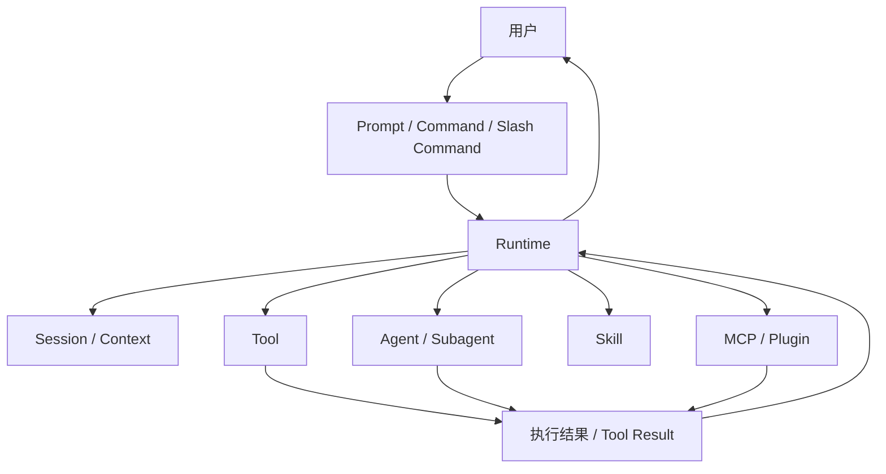

# 卷一 02｜Claude Code 由哪些核心对象组成

## 导读

- **所属卷**：卷一：Claude Code 系统全景导论
- **卷内位置**：02 / 06
- **上一篇**：[上一篇：Claude Code 到底是什么系统](./01-tool-overview-and-bash-entry.md)
- **下一篇**：[下一篇：一次请求是怎么跑成一次 Agent Turn 的](./03-bashtool-is-not-just-shell.md)

上一篇先把 Claude Code 立成了一套 agent runtime。这一篇往前再推一步：如果它真是一套 runtime，那里面最关键的对象分别是什么，它们又是怎么协作的？

如果这个问题不先说清，后面去看主循环、工具、上下文、skill、agent、MCP 这些细节时，很容易重新掉回“功能堆”的理解方式：这里一个能力，那里一个模块，最后看见很多名词，却看不见它们为什么属于同一套系统。

所以这一篇的任务不是讲某个对象的实现细节，而是先搭出一张对象地图：

> **Claude Code 不是一条单线系统，而是多类对象协同工作的运行时；后面所有细节，本质上都可以回收到这张对象地图里理解。**

---

## 先给判断：Claude Code 不是单线流程，而是对象协同的 runtime

很多人第一次理解 Claude Code，脑子里的画面更像一条线：

- 用户输入一句话
- 模型想一想
- 工具执行一下
- 系统回一句话

这条线当然存在，但它只说明了“事情大概怎么流过去”，还没有说明“到底是谁在参与这条流程”。

更准确的看法是：

> **Claude Code 不是靠单条流程线运转，而是靠多类对象在 runtime 里分工协作。**

这些对象并不处在同一个层次上。有些对象更靠近用户入口，有些对象负责把系统跑起来，有些对象本身就是能力单元，还有些对象负责把系统继续扩展下去。

所以这一篇真正要解决的，不是“列功能”，而是先回答三个问题：

1. Claude Code 里到底有哪些核心对象
2. 这些对象各自站在系统的什么位置
3. 后面为什么所有实现细节都能回收到这张对象地图里

---

## Claude Code 的核心对象关系图

如果先把具体实现细节都压住，Claude Code 里最值得先认清的对象大致可以先画成下面这样：

这张图不追求字段级准确，而是先抓对象关系。它至少先说明了五件事：

1. **用户不是直接面对模型内部实现，而是先通过 prompt / command 这类入口对象进入系统**
2. **真正把这些入口接住的是 runtime，不是某个孤立模块**
3. **tool、agent、skill、MCP / plugin 不是一层里的同义词，而是不同类型的能力对象**
4. **session / context 不是附属记录，而是整套系统能持续工作的背景层**
5. **执行结果也不是原样飘回来，而是重新进入 runtime，被系统继续组织和呈现**

如果把上一篇的重点是“Claude Code 是什么系统”，那这一篇的重点就是：

> **这套系统不是空的，它是由一组职责不同、层次不同、关系不同的对象撑起来的。**

---

## 先把这些对象分成四层看

理解对象地图，一个很稳的办法不是一上来就挨个讲名词，而是先按层次看。因为对象之间最容易混淆的，不是名字，而是层级。

### 第一层：入口对象

这一层最靠近用户，回答的是：

> **用户到底通过什么东西把意图送进系统？**

这里最典型的是：

- prompt
- command
- slash command

它们的共同点不是“都是字符串”，而是：**它们都是用户意图的入口形态。**

这层对象最容易被误看成“Claude Code 的全部”，因为用户首先看见的往往就是这一层。但如果只停在这里，就会把 Claude Code 看成一个交互界面，而不是一个 runtime。

### 第二层：运行时对象

这一层回答的是：

> **谁来接住这些输入，并把系统真正跑起来？**

这里的核心对象是：

- runtime
- session
- context

runtime 决定系统怎么组织一轮工作；session 和 context 决定这轮工作不是凭空发生，也不是一轮结束就彻底归零。

如果把这一层漏掉，后面所有对象都会看成“散装能力”；只有把 runtime 和 session / context 放回中间层，整张对象地图才会立住。

### 第三层：执行与能力对象

这一层回答的是：

> **系统靠什么把模型意图落成真实动作，或者把任务继续推下去？**

这里最典型的是：

- tool
- agent
- subagent

这三个词常被混着用，但它们不是一个层级上的替换词。

- **tool** 更像正式执行对象：接输入、跑动作、回结果。
- **agent / subagent** 更像任务分工对象：它们不是单个动作，而是把一段更完整的工作交给另一个运行单元继续处理。

也就是说，tool 更接近“能力落地”，agent 更接近“任务转交”。

### 第四层：扩展对象

这一层回答的是：

> **Claude Code 为什么不是一套封闭系统，它怎么继续长能力？**

这里最典型的是：

- skill
- MCP
- plugin

它们的共同点不是“都是扩展”，而是：**它们都在回答系统怎样继续接入新的能力。**

但它们接入能力的方式并不一样：

- skill 更像给 agent 提供程序化工作方法
- MCP 更像把外部能力或外部系统接进 runtime 可调用范围
- plugin 更接近系统级扩展位

所以这一层最重要的，不是把它们并排背下来，而是先知道：它们都属于“系统继续长能力”的那一侧。

---

## 逐个对象看，最应该先抓什么

把层次立住之后，再逐个看这些对象，就不会再像一堆散词。

## 1. Prompt / Command：它们不是内容，而是入口对象

对用户来说，最直观的当然是“我输入了一段话”或者“我执行了一个命令”。但在对象地图里，更重要的是：

> **prompt 和 command 的意义，不是它们写了什么，而是它们是系统入口。**

这意味着它们决定的是：

- 用户意图怎么被编码进系统
- Claude Code 先拿到的是哪类请求
- 后面 runtime 应该以哪种方式接住它

所以这一层不是“文本内容层”，而是“入口协议层”。

## 2. Runtime：它不是背景板，而是对象关系的组织者

上一篇已经立过 runtime 的系统定位，这一篇要再补一层：

> **runtime 不只是中间那层系统，它还是对象关系的组织者。**

也就是说，prompt 不会自己跑成 tool_use，tool 也不会自己决定什么时候执行，session / context 也不会自己维持秩序。真正把这些对象接成一套系统的，是 runtime。

换句话说，runtime 在对象地图里不是“又一个对象”，而是：

- 决定对象如何进入系统
- 决定对象如何协作
- 决定对象结果如何回流

它是整张对象地图真正的中轴。

## 3. Session / Context：它们不是附属记录，而是系统记忆层

很多系统都会有“上下文”这种词，但在 Claude Code 里，这层不能被简单理解成聊天历史。

更准确一点说：

> **session / context 不是附属记录，而是 runtime 的记忆层。**

没有这层，Claude Code 就很难维持：

- 一轮任务和下一轮任务的连续性
- 已经读过的内容和当前推理的关系
- 系统为什么还能继续工作，而不是每轮都从头再来

所以在对象地图里，session / context 不是“为了方便才加的配件”，而是持续工作能力的一部分。

## 4. Tool：它不是函数菜单，而是正式执行对象

卷一后面还会专门讲执行能力层，但在对象地图里，tool 最值得先抓住的一点已经可以先立起来：

> **tool 在 Claude Code 里不是函数菜单，而是正式执行对象。**

它的意义在于：

- 它给 runtime 一个稳定的能力接口
- 它把“模型想做什么”变成“系统真的做了什么”
- 它的结果也不是孤立返回，而是继续回到 runtime 里被组织

所以 tool 不是一个局部概念，它在对象地图里对应的是“能力落地”这一侧。

## 5. Agent / Subagent：它们不是更大的 tool，而是任务分工对象

如果 tool 更像动作级对象，那 agent / subagent 更像任务级对象。

最值得先抓住的一点是：

> **agent / subagent 不是“更大的工具”，而是把一段工作交给另一个运行单元继续处理。**

这意味着它们解决的问题，不是“调用某个能力”，而是：

- 任务如何拆开
- 任务如何转交
- 一个更长的工作单元如何在系统里继续跑

所以在对象地图里，它们应该被看成“任务分工与继续执行”的对象，而不是“超级工具”。

## 6. Skill：它不是 feature 列表，而是程序化工作方法

skill 很容易被误看成“额外功能包”。

但从对象地图角度，更准确的理解是：

> **skill 更像给 agent 提供的一套程序化工作方法。**

它不只是“增加一个功能按钮”，而是在告诉系统：

- 这个场景该怎么做
- 该先读什么
- 该走哪条步骤链
- 该调用什么能力

所以 skill 在对象地图里，不是某个局部功能，而是扩展工作方法的对象。

## 7. MCP / Plugin：它们都在回答“系统怎么继续长能力”

MCP 和 plugin 容易被分别讨论，但在卷一的对象地图里，先不需要急着分实现细节。

最重要的是先知道：

> **它们都属于系统的扩展对象。**

也就是它们都在回答同一个问题：Claude Code 怎么在当前能力之外，继续接入新的能力边界。

至于它们具体怎样接、接得多深、各自控制权在哪里，这些都可以后面再拆。卷一这一篇只需要先把它们放回“扩展对象”这一层。

---

## 为什么后面所有细节都能回收到这张对象地图里

对象地图的意义，不是让你背名词，而是让你后面读源码时始终知道自己在看什么。

比如：

- 你在看输入解析，其实是在看入口对象怎么进入 runtime
- 你在看主循环，其实是在看 runtime 怎么组织这些对象协作
- 你在看 tool 系统，其实是在看能力对象怎么落地
- 你在看 context / session，其实是在看记忆层怎么托住系统连续性
- 你在看 skill / MCP / plugin，其实是在看扩展对象怎么把系统继续长出去

所以这张对象地图真正值钱的地方在于：

> **它给后面的所有实现细节提供了一个统一回收点。**

没有这张图，后面每一卷都像在读不同系统；有了这张图，后面每一卷只是从不同方向继续拆同一套 runtime。

---

## 接下来最自然的是从对象地图切到动态主线

到这里，静态对象地图已经先立住了。接下来卷一最自然的下一步，不是继续给对象补更多定义，而是回答另一个问题：

> **这些对象一旦进入运行时，一次请求到底是怎么跑成一轮 agent turn 的？**

也就是说，第二篇的任务是把对象认全；第三篇的任务，就是把这些对象沿着动态主线真正跑起来。

---

## 一句话收口

> Claude Code 不是几个名词并排摆在一起的功能系统，而是一组入口对象、运行时对象、执行对象和扩展对象协同工作的 runtime。这一篇的任务，就是先把这张对象地图搭出来，让后面所有细节都能回收到同一张图里理解。
