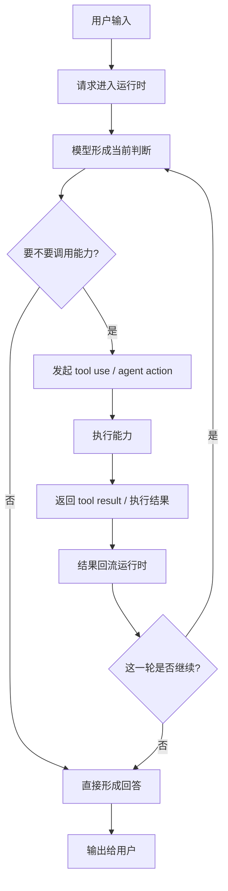

# 卷一 03｜一次请求是怎么跑成一次 Agent Turn 的

## 导读

- **所属卷**：卷一：Claude Code 系统全景导论
- **卷内位置**：03 / 06
- **上一篇**：[上一篇：Claude Code 由哪些核心对象组成](./02-tool-system-overview.md)
- **下一篇**：[下一篇：Claude Code 怎么把模型意图落成执行能力](./04-filereadtool.md)

前两篇先立了两件事：Claude Code 是一套 agent runtime，而这套 runtime 里又有一组职责不同的核心对象。接下来最自然的问题就是：这些对象一旦进入运行时，一次请求到底是怎么真正跑起来的？

这也是这一篇的主问题：

> **为什么 Claude Code 的基本运行单位不是“回一句话”，而是一轮可以持续展开的 agent turn？**

如果这个问题不先讲清，后面去看工具系统、上下文系统，甚至 skill / agent / MCP 的扩展能力时，很容易又退回“一次输入，对应一次输出”的浅理解。那样看到的只是局部动作，看不到系统为什么能继续工作。

所以这一篇不深挖实现细节，只先把动态主线立起来。

---

## 先给判断：Claude Code 的基本运行单位不是单条回复，而是一轮 Agent Turn

最容易形成的直觉是：

- 用户发来一个请求
- 模型生成一个回答
- Claude Code 把这个回答显示出来

这个直觉只对了一半。因为在 Claude Code 里，一次请求经常不会直接结束在“一条回答”上，而会继续展开成：

- 模型先判断该做什么
- 系统触发某个工具或能力
- 工具返回结果
- 模型基于结果继续推理
- 必要时再调用下一步能力
- 最后才形成阶段性输出，或者继续下一轮工作

所以更准确的说法是：

> **Claude Code 的基本运行单位不是“单条回复”，而是一轮可持续展开的 agent turn。**

这也是为什么后面很多源码看起来不像普通聊天系统：它真正要组织的，不是一条回答，而是一整轮工作过程。

---

## 一次请求的大致总流程

如果先把实现细节都压住，一次典型请求大致可以先画成下面这条主线：

看这张图时，最值得先抓住的不是具体节点名，而是三条主线判断：

1. **一次请求不会天然停在模型第一次输出**
2. **执行结果会重新回到 runtime，而不是直接结束**
3. **系统每次都在判断：这一轮是该继续，还是该收口**

也就是说，Claude Code 真正组织的是一个闭环，而不是一条直线。

---

## 为什么这里一定要叫 Agent Turn

这里不用“单次回复”，而用“agent turn”，不是为了显得高级，而是因为两者关心的根本不是同一件事。

### 单次回复关心的是“说了什么”

如果把 Claude Code 理解成聊天系统，那一次运行最自然的单位就是：

- 用户说一句
- 系统回一句

这个单位最关心的是文本输出。

### Agent Turn 关心的是“这一轮工作怎么推进”

但在 Claude Code 里，一轮运行真正要处理的是：

- 当前该先推理还是先执行
- 该调用哪个能力
- 结果回来之后要不要继续
- 什么时候该收口
- 什么时候该把控制权交还给用户

所以这里的“turn”不是一句话的轮次，而是一次完整的工作轮次。

这也是为什么“agent turn”这个词在这里更准确：

> **它强调的不是回复文本，而是系统如何把这一轮工作继续推下去。**

---

## 这条动态主线至少包含四个关键阶段

如果把一轮 agent turn 再压得更清楚一点，它至少会经过下面四个阶段。

### 第一阶段：接住输入

这一阶段回答的是：

> **用户的请求怎样进入当前运行时？**

这里看起来最简单，但它决定了这一轮工作的起点：

- 当前请求是什么
- 当前上下文里已经有什么
- 系统要把这次输入接到哪条工作线上

换句话说，这一步不是“收到一句话”这么简单，而是把这次请求正式并入当前运行时。

### 第二阶段：形成当前判断

这一阶段回答的是：

> **系统在这一刻认为下一步最该做什么？**

这一步可能会得到两类结果：

- 直接形成回答
- 触发下一步能力

也就是说，模型在这里不只是“生成内容”，而是在当前上下文里做一个运行判断：这一轮到底该继续推理，还是先去做事。

### 第三阶段：调用能力并拿回结果

如果当前判断不是直接回答，那这一轮就会进入执行阶段。

这一阶段回答的是：

> **系统怎样把当前意图落成动作，并把结果重新带回来？**

这里可能触发的能力并不只有一种，但从动态主线角度看，它们都在做同一件事：

- 让系统从“想做什么”进入“真的做了什么”
- 再把执行结果重新带回当前 turn

所以这一阶段最重要的不是某个具体工具，而是：**执行结果必须回流运行时。**

### 第四阶段：判断这一轮是否继续

结果回来以后，这一轮并不会自动结束。

接下来还要回答：

> **当前结果已经足够收口，还是还要继续展开？**

这一步是整条动态主线最关键的地方之一，因为它决定了：

- 系统是该结束这一轮
- 还是继续基于新结果发起下一步动作

也正因为有这一层判断，Claude Code 才不会退化成：

- 调一次能力
- 回一个结果
- 整轮立刻结束

它真正做的是：**一边执行，一边判断这一轮是不是还应该继续。**

---

## 把它压成一句闭环：输入 → 判断 → 执行 → 回流 → 继续 / 收口

如果整篇只记一句动态主线，其实可以记成：

> **输入进入运行时 → 系统形成当前判断 → 必要时调用能力 → 结果回流运行时 → 决定继续还是收口。**

这句很值，因为后面无论去看工具系统、上下文系统还是扩展能力，基本都可以回收到这个闭环里。

- 工具系统，是在看“执行”这一段怎么落地
- 上下文系统，是在看“输入 / 判断 / 回流”为什么能持续成立
- 扩展能力，是在看“可调用能力”为什么还能继续长

所以第三篇在卷一里的作用，不是把某条源码链讲透，而是先把**动态闭环**立起来。

---

## 为什么后面很多系统都要回到这条动态主线理解

有了前两篇的系统地图和对象地图之后，这一篇再立动态主线，读者脑子里会多出一个非常重要的坐标：

> **后面看到的复杂系统，本质上都是在服务这一轮 agent turn 怎么成立、怎么继续、怎么收口。**

比如：

- 你后面看工具系统，本质上是在看“执行”这一步如何被 runtime 接住
- 你后面看上下文与状态，本质上是在看“这一轮为什么能接着跑而不丢失连续性”
- 你后面看扩展能力，本质上是在看“这一轮还能调用哪些新的能力边界”

所以动态主线真正值钱的地方在于：

> **它把后面的很多局部系统，都拉回到同一条工作闭环里理解。**

---

## 接下来最自然的是看模型意图怎么落成执行能力

到这里，第三篇只先把“一轮怎么跑起来”的动态主线立住。接下来最自然的问题不是继续讲主循环细节，而是沿着这条主线往下走一步：

> **当系统判断“该做事了”，Claude Code 到底是怎么把模型意图落成执行能力的？**

这就是下一篇的任务。

---

## 一句话收口

> Claude Code 的基本运行单位不是“用户说一句、系统回一句”，而是一轮会在输入、判断、执行、结果回流与继续/收口之间不断推进的 agent turn。这一篇的任务，就是先把这条动态主线立起来，让后面的执行层、状态层和扩展层都有统一的运行坐标。