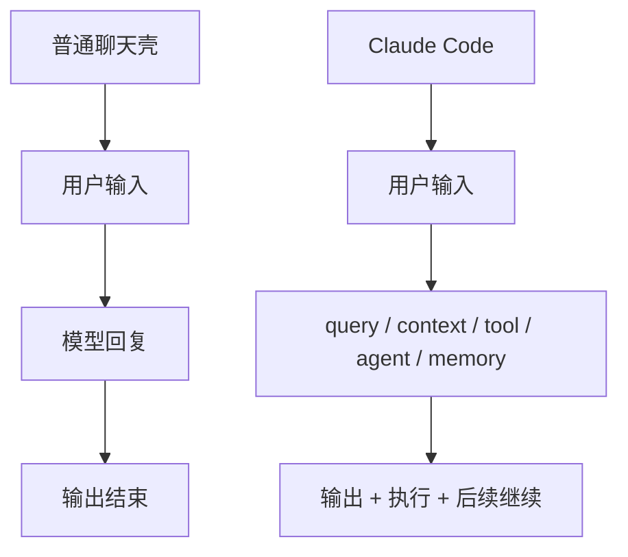
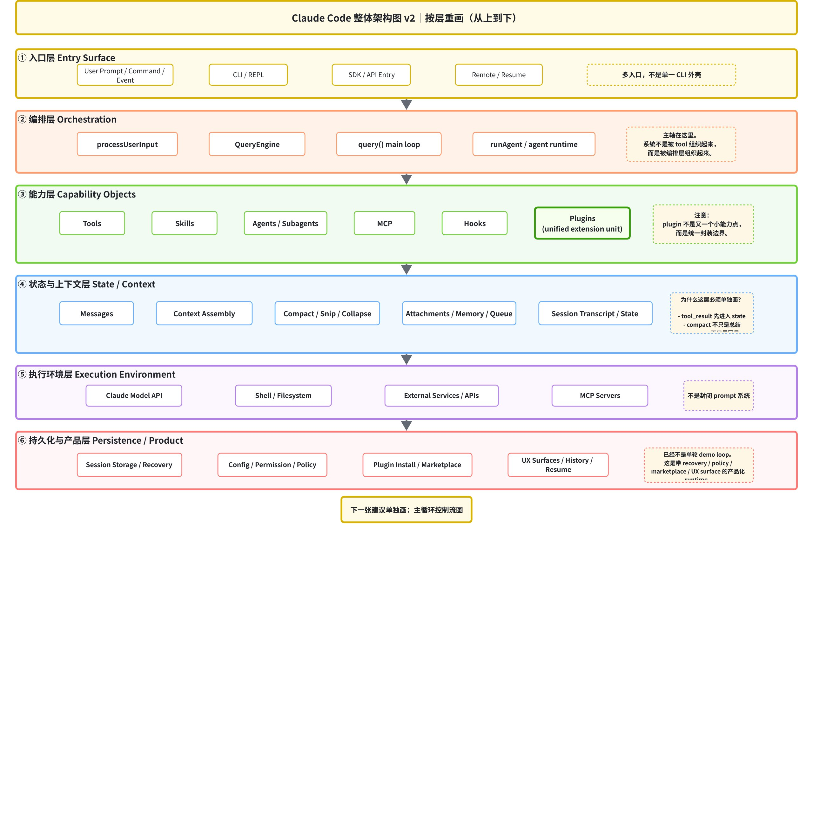

# 卷一 01｜Claude Code 到底是什么系统

## 导读

- **所属卷**：卷一：Claude Code 系统全景导论
- **卷内位置**：01 / 06
- **上一篇**：无
- **下一篇**：[下一篇：Claude Code 由哪些核心对象组成](./02-what-are-the-core-objects.md)

把 Claude Code 看成一个会聊天的 CLI，会看浅；把它看成一组能读文件、改代码、跑命令的功能集合，也还是会看浅。

更准确地说，它是一层 runtime：

> **负责接住用户输入，组织一轮轮 agent turn，调度执行能力，维护上下文与状态，并把 skill、agent、subagent、MCP、plugin 这类扩展能力接进同一套运行流程。**

所以 Claude Code 不是聊天壳，也不是工具菜单，而是一套把模型推理、运行时编排、执行能力、上下文管理与扩展机制组织在一起的 agent runtime。

如果这一点不先立住，后面无论去看主循环、工具、上下文还是扩展能力，都会像在看一堆分散源码，而不是在理解同一个系统。

---

## 补图：Claude Code vs 普通聊天壳

这张补图最想压住的不是“Claude Code 功能更多”，而是：**普通聊天壳更像一次输入对应一次回复，Claude Code 中间站着的是一层真正负责组织运行的 runtime。**

## 为什么 Claude Code 最容易先被看浅

Claude Code 最先暴露给用户的，往往只是它最表面的一层：

- 一个命令行界面
- 一轮输入和一轮输出
- 一些可以直接调用的工具能力
- 一些看起来很“产品功能”的 skill、agent、MCP、plugin

所以它很容易先被理解成一个更强的聊天工具，或者一个会调很多能力的命令行产品。

但这只是你接触它的方式，不是它真正工作的方式。真正决定 Claude Code 难度和价值的，不是表面有哪些功能，而是它怎样把这些能力组织进同一套可持续运行的 runtime。

---

## Claude Code 的系统总图

如果先把局部细节都压住，Claude Code 至少可以先被看成下面这张系统图：

*图：Claude Code 整体分层架构图。它不是把所有源码对象一次讲完，而是先把系统分成入口层、编排层、能力层、状态与上下文层、执行环境层，以及持久化与产品层，帮助读者先站稳全局视角。*

这张图最值得先抓住的一点不是“模块有哪些”，而是：

> **用户和模型之间，真正站着的是一层 Claude Code runtime。**

这层 runtime 至少做五件事：

1. 接住用户输入，把请求送进系统
2. 组织一轮 agent turn，让推理、执行、回应可以持续推进
3. 把模型意图翻译成真实执行动作，而不是停在“会说”
4. 维持上下文与状态，让系统不会每轮都像重新开始
5. 把新的能力接进来，同时维持整体运行秩序

如果少了这层，Claude Code 就会退化成两种更浅的东西：

- 要么只是“用户直接面对模型”
- 要么只是“模型直接调外部能力”

而 Claude Code 真正提供的，是中间这层运行组织能力。

---

## 如果把它从外到内拆开，最值得先站稳五层台阶

理解 Claude Code，最稳的办法不是一头扎进某个文件，而是先站稳五层台阶。它们不是五个并列模块，而是五个层层加深的问题。

### 第一层：交互入口层

这一层只回答一个问题：

> **用户的意图从哪里进入系统？**

这里包括 prompt、命令、slash command，以及各种扩展入口。它最显眼，所以也最容易让人误判：如果只停在这里，Claude Code 就会像一个交互产品，而不是运行时系统。

### 第二层：主循环 / Runtime 编排层

第二层回答的是：

> **一条输入，怎样被组织成一轮可以继续推进的 agent turn？**

这一层决定的不是“怎么回复一句话”，而是系统怎么继续推理、继续调用能力、继续把任务往前推进。没有这一层，Claude Code 就只剩下一问一答；有了这一层，它才开始像一个能持续工作的 agent runtime。

### 第三层：执行能力层

第三层回答的是：

> **模型形成的意图，怎样真正落成可以执行的动作？**

这里的重点不是“有多少 tool”，而是 runtime 怎样把模型输出组织成正式执行对象。换句话说，工具在这里不是一个函数菜单，而是系统把“想做什么”落成“真的做了什么”的接口层。

### 第四层：上下文与状态层

第四层回答的是：

> **系统怎么在多轮和长任务里不中途失忆、失控或重新开始？**

Claude Code 真正要托住的，不只是几轮聊天记录，而是长期工作的连续性。所以这一层关心的是：系统如何维持上下文、状态和任务延续能力，让一项任务能继续跑下去，而不是每轮都像从零开始。

### 第五层：扩展能力层

第五层回答的是：

> **新的能力怎么被接进来，同时不把整个系统搞散？**

skill、agent、subagent、MCP、plugin 这些能力放在这里看，重点就不再是“功能越来越多”，而是 Claude Code 如何在保持运行秩序的前提下继续长能力。

把这五层先记成一句话，就是：

> **Claude Code 先接住用户，再组织主循环，再把模型意图落成执行，再维持上下文与状态，最后不断接入新的能力。**

也正因为这样，Claude Code 真正难的地方，不在于“它会几个动作”，而在于它怎样把这些动作组织成一套可以持续工作的系统。

---

## 为什么这本书要先这样读

如果现在就一头扎进具体文件，比如先去看 BashTool、FileReadTool、runAgent、compact、MCP auth，你当然也能看懂很多局部细节。

但那样你更容易得到的是一堆局部知识，而不是一张稳定地图。先有系统地图，再有局部细节，读者脑子里才会形成一个更稳的理解顺序：

1. 它是什么系统
2. 它由什么对象组成
3. 它怎么跑一轮
4. 它怎么执行
5. 它怎么持续
6. 它怎么扩展

这就是卷一的任务：先把地图立起来，再沿着地图一层层往里走。

---

## 接下来卷一会继续补哪几块地图

接下来几篇不会再重新定义 Claude Code，而是沿着这张地图继续往里补：先认清核心对象，再看一轮 agent turn 怎么跑起来，然后依次进入执行能力、上下文与状态，以及扩展能力。

换句话说，第一篇不是为了讲完，而是为了先把后面几篇的阅读坐标系搭出来。

---

## 一句话收口

> Claude Code 的关键，不是它表面上会多少动作，而是它有没有一层 runtime，能把输入、推理、执行、状态和扩展组织成同一套可持续工作的系统。这一篇的任务，就是先把这层系统组织能力看清楚。
