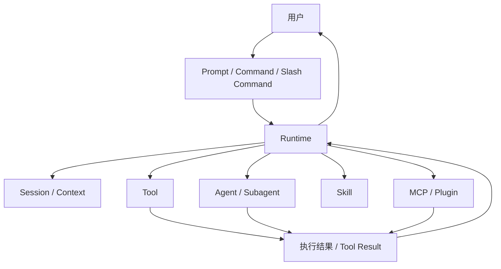
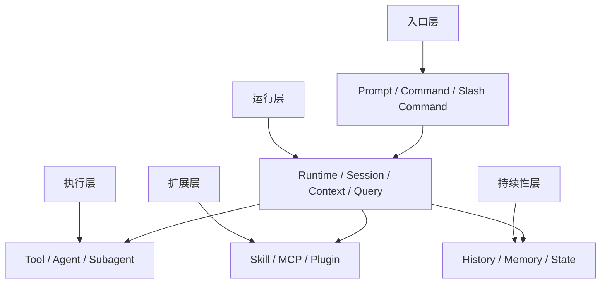
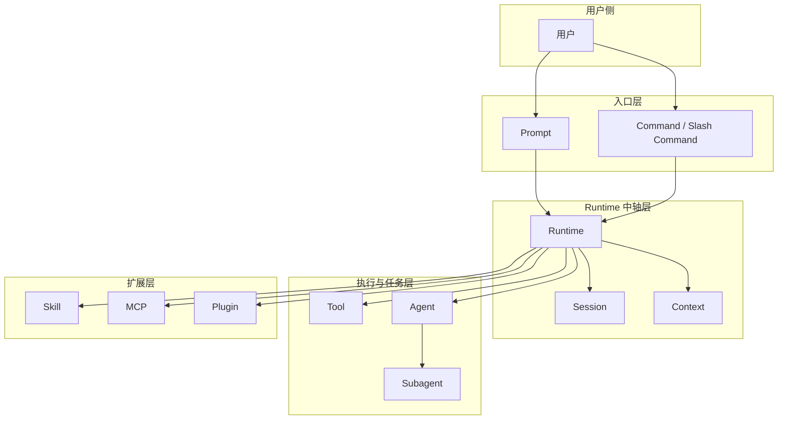

# 卷一 02｜Claude Code 由哪些核心对象组成

## 导读

- **所属卷**：卷一：Claude Code 系统全景导论
- **卷内位置**：02 / 06
- **上一篇**：[上一篇：Claude Code 到底是什么系统](./01-claude-code-what-system-is-this.md)
- **下一篇**：[下一篇：一次请求是怎么跑成一次 Agent Turn 的](./03-how-a-request-becomes-an-agent-turn.md)

上一篇先把 Claude Code 立成了一套 agent runtime。这一篇接着回答另一个基础问题：如果它真是一套 runtime，那里面最关键的对象分别是什么，它们又是怎么协作的？

如果这个问题不先说清，后面去看主循环、工具、上下文、skill、agent、MCP 这些细节时，很容易又掉回“功能堆”的理解方式：看见很多名词，却看不见它们为什么属于同一套系统。

所以这一篇只做一件事：

> **先把 Claude Code 的对象地图搭出来。**

更准确地说：

> **Claude Code 不是一条单线系统，而是多类对象协同工作的运行时；后面所有细节，本质上都可以回收到这张对象地图里理解。**

---

## 先给判断：这篇不是列名词，而是先搭对象地图

很多人第一次理解 Claude Code，脑子里的画面更像一条线：

- 用户输入一句话
- 模型想一想
- 工具执行一下
- 系统回一句话

这个理解不算错，但它只看见了流程，没有看见参与流程的对象。

更接近真实情况的说法是：

> **Claude Code 是多类对象在 runtime 里协同工作的系统。**

所以这一篇不展开实现细节，只先回答一件事：这套系统里有哪些核心对象，它们分别站在什么位置。

---

## Claude Code 的核心对象关系图

如果先把实现细节都压住，Claude Code 里最值得先认清的对象大致可以先画成下面这样：

先不要急着背名词。看这张图时，最值得先抓的其实只有三条辨认规则：

1. **入口对象**先把用户意图送进系统
2. **runtime** 站在中间，负责组织对象之间的协作
3. **tool / agent / skill / MCP / plugin** 这些对象都和“能力”有关，但它们并不属于同一种东西

如果把上一篇回答的是“Claude Code 是什么系统”，那这一篇要回答的就是：

> **这套系统到底是由哪些对象撑起来的。**

但只看关系图还不够。读者接下来最容易卡住的，不是“对象有哪些”，而是：

> **这些对象分别站在哪一层？**

所以这篇最好再补一张分层图，把“谁和谁协作”推进到“谁在什么层级里协作”。

---

## 补图：核心对象分层图

这张补图的作用，是把“对象有哪些”推进成“对象分别站在哪一层”。这样后面再看主循环、工具、上下文和扩展能力时，读者更容易把它们收回同一张对象地图。

## 再把这些对象压成一张分层图

如果把关系先收一收，只看它们各自站位，可以先记成下面这样：

这张图和前一张图的分工不一样：

- **前一张图**告诉你：对象之间怎样协作
- **这一张图**告诉你：对象各自站在哪一层

两张图合起来，读者脑子里才会同时有：

- 协作关系
- 层级关系
- 后面继续读每一卷时的基本坐标

---

## 先把这些对象分成四层看

理解对象地图，一个很稳的办法不是一上来就挨个讲名词，而是先按层次看。因为这些对象最容易混淆的，不是名字，而是层级。

### 第一层：入口对象

这一层回答的是：

> **用户的意图从哪里进入系统？**

这里最典型的是：

- prompt
- command
- slash command

它们的共同点不是“都是文本”，而是它们都是**系统入口对象**。这层最靠近用户，所以也最容易被误看成 Claude Code 的全部；但如果只停在这里，就会把 Claude Code 看成一个交互界面，而不是一个 runtime。

### 第二层：运行时对象

这一层回答的是：

> **谁把这些输入接住，并把系统真正跑起来？**

这里最关键的是：

- runtime
- session
- context

runtime 负责组织协作，session / context 负责托住连续性。没有这一层，后面所有对象都会变成散装能力。

### 第三层：执行与任务对象

这一层回答的是：

> **系统靠什么把意图落成动作，或者把任务继续推下去？**

这里最典型的是：

- tool
- agent
- subagent

它们都和“能力落地”有关，但不是一种分工：

- **tool** 更接近执行一个动作
- **agent** 更接近接手一段工作
- **subagent** 更接近把工作拆出去，在相对独立的会话里继续跑

这样一压，后面再看 tool 系统和多 agent 结构，边界就不容易重新混掉。

### 第四层：扩展对象

这一层回答的是：

> **系统怎么继续长能力？**

这里最典型的是：

- skill
- MCP
- plugin

它们不等于同一种扩展机制，但都属于“把新的能力边界接进系统”这一侧。

---

## 四层立住之后，最容易混的其实只有三组边界

如果四层对象图已经立住，后面最值得补的就不是把每个对象都再讲一遍，而是把最容易混淆的几组边界补清楚。

## 1. Runtime vs Session / Context

这组最容易混，因为它们都在系统中间层。

最简单的辨认方式是：

- **runtime** 负责组织
- **session / context** 负责托住连续性

也就是说，runtime 更像系统的中轴：

- 接住输入
- 组织对象协作
- 决定结果怎么回流

而 session / context 更像系统的记忆层：

- 让当前工作不是凭空发生
- 让前后轮之间保持连续性
- 让系统不会每次都像从零开始

所以它们都在“中间层”，但分工并不一样：

> **runtime 管组织，session / context 管连续性。**

## 2. Tool vs Agent / Subagent

这组也最容易混，因为它们都和“系统做事”有关。

最简单的辨认方式是：

- **tool** 更像执行一个动作
- **agent / subagent** 更像接手一段工作

tool 的重点在于：

- 给 runtime 一个稳定能力接口
- 把“模型想做什么”落成“系统真的做了什么”

agent / subagent 的重点则在于：

- 把任务拆开
- 把任务转交
- 让更长的一段工作继续跑下去

所以它们不是大小关系，也不是“tool 的升级版”。

> **tool 更像做动作，agent 更像接工作。**

## 3. Skill vs MCP / Plugin

这一组都属于扩展对象，但扩展的方式不一样。

最简单的辨认方式是：

- **skill** 更像给 agent 提供一套做事方法
- **MCP / plugin** 更像把新的能力边界接进系统

skill 关心的是：

- 这个场景该怎么做
- 先读什么
- 走什么步骤链
- 调用什么能力

而 MCP / plugin 更接近：

- 系统还能接入什么外部能力
- Claude Code 的能力边界还能往外长到哪里

所以 skill 不是 tool，也不是 agent；它更像工作方法层。MCP / plugin 也不是简单“附加功能”，它们属于能力接入层。

---

## 为什么后面所有细节都能回收到这张对象地图里

对象地图的意义，不是让你背一串名词，而是让你后面读源码时始终知道自己在看什么。

你后面看到的很多内容，其实都能回收到这四层对象图里：

- 输入解析，回收到入口对象
- 主循环组织，回收到运行时对象
- tool 系统和 agent 调度，回收到执行与任务对象
- skill / MCP / plugin，回收到扩展对象

所以这张图真正值钱的地方在于：

> **它给后面的所有实现细节提供了统一坐标系。**

有了这张图，后面几篇不再像在看不同系统，而是在继续拆同一套 runtime 的不同对象关系。

---

## 接下来最自然的是从对象地图切到动态主线

到这里，静态对象地图已经先立住了。接下来最自然的下一步，不是继续给对象补更多定义，而是回答另一个问题：

> **这些对象一旦进入运行时，一次请求到底是怎么跑成一轮 agent turn 的？**

也就是说，第二篇的任务是把对象认全；第三篇的任务，就是把这些对象沿着动态主线真正跑起来。

---

## 一句话收口

> Claude Code 不是几个名词并排摆在一起的功能系统，而是一组入口对象、运行时对象、执行与任务对象、扩展对象协同工作的 runtime。这一篇的任务，就是先把这张对象地图搭出来，让后面所有细节都能回收到同一张图里理解。
