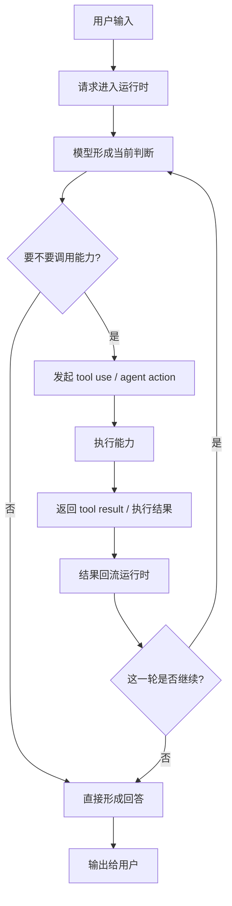
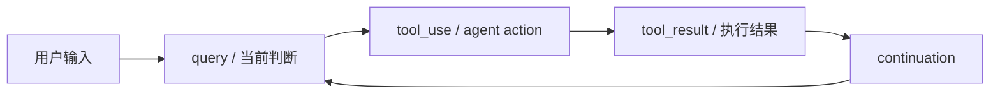
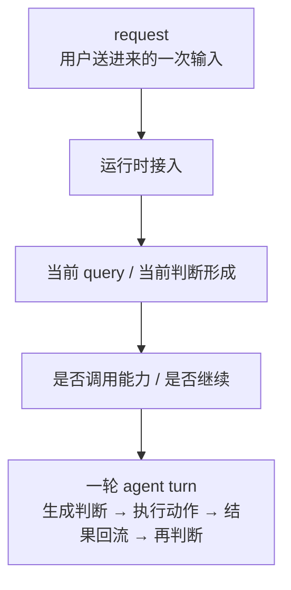

# 卷一 03｜一次请求是怎么跑成一次 Agent Turn 的

## 导读

- **所属卷**：卷一：Claude Code 系统全景导论
- **卷内位置**：03 / 06
- **上一篇**：[上一篇：Claude Code 由哪些核心对象组成](./02-what-are-the-core-objects.md)
- **下一篇**：[下一篇：Claude Code 怎么把模型意图落成执行能力](./04-how-intent-becomes-execution.md)

前两篇先立了两件事：Claude Code 是一套 agent runtime，而这套 runtime 里又有一组职责不同的核心对象。接下来最自然的问题就是：这些对象一旦进入运行时，一次请求到底是怎么真正跑起来的？

这篇只回答一个问题：

> **为什么 Claude Code 的基本运行单位不是“回一句话”，而是一轮可以持续展开的 agent turn？**

---

## 先给判断：一次请求不会天然停在首条回复

最容易形成的直觉是：

- 用户发来一个请求
- 模型生成一个回答
- 系统把这条回答显示出来

但在 Claude Code 里，一次请求经常不会结束在第一条文本输出上。更常见的情况是：

- 模型先判断下一步该做什么
- 系统调用某个能力
- 能力返回结果
- 结果重新进入当前运行时
- 系统再判断这一轮是继续，还是收口

所以这里真正的基本单位，不是一条 reply，而是一轮会持续推进、直到收口的工作回合。

> **普通回复是单次生成；agent turn 是“生成判断 → 调用能力 → 结果回注 → 再判断”的闭环。**

第三篇最该先立住的，就是这条动态主线。

---

## 一次请求的大致总流程

如果先把实现细节都压住，一次典型请求大致可以先画成下面这条主线：

看这张图时，最值得先抓住的不是节点名，而是这条最小差异：

> **普通聊天更像“生成一次就结束”；agent turn 更像“生成判断、执行动作、结果回流、再判断是否继续”的闭环。**

也正因为结果会重新回到当前运行时，Claude Code 组织的才不是一句话，而是一轮工作过程。

如果把这条主线再压得更短一点，其实可以只记下面这个闭环：

这张图和前一张总流程图的分工也不一样：

- **前一张图**强调一轮请求大致会经过哪些阶段
- **这一张图**强调为什么它不是“一次回答”，而是一个会回到当前判断里的闭环

读者只要把这张闭环图记住，后面再进工具卷、上下文卷、扩展卷时，就更容易知道自己看到的是闭环里的哪一段。

---

## 补图：request 和 agent turn 的边界

这张补图要切开的，是两个经常被混成一件事的对象：**request 是入口对象，agent turn 是运行单位。** 请求进来之后，只有被 runtime 组织成可持续推进的一轮工作回合，它才真正变成 turn。

## 为什么这里一定要叫 Agent Turn

这里不用“单次回复”，而用“agent turn”，不是为了显得高级，而是因为两者关心的根本不是同一件事。

### 单次回复关心的是“说了什么”

如果把 Claude Code 理解成聊天系统，那一次运行最自然的单位就是：

- 用户说一句
- 系统回一句

这个单位最关心的是文本输出。

### Agent Turn 关心的是“这一轮工作怎么推进，什么时候结束”

但在 Claude Code 里，一轮运行真正要处理的是：

- 当前该先回答，还是先做事
- 该调用哪个能力
- 结果回来之后要不要继续
- 什么时候该把这一轮收口

所以这里的 turn 不是一句话的轮次，而是一整个工作回合。

只要结果回来了、任务还没收口，这一轮通常就还没结束。

> **agent turn 的重点不是“生成一条消息”，而是维护一个持续判断中的工作回合。**

---

## 这条动态主线至少包含四个关键阶段

如果把一轮 agent turn 再压得更清楚一点，它至少会经过下面四个阶段。

### 第一阶段：接住输入

这一阶段最关键的信息是：

> **进入系统的不是一条孤立消息，而是一条被并入当前运行态的请求。**

也就是说，Claude Code 不是简单“收到一句话”，而是要把这次输入接到当前上下文、当前状态和当前工作线上。

### 第二阶段：形成当前判断

这一阶段最关键的信息是：

> **这里产出的不一定是答案，更可能是“下一步该怎么做”的决策。**

这一刻系统要判断的，不只是“怎么回复”，而是：

- 现在就收口
- 还是先调用某个能力

所以这一步的核心不是生成文本，而是生成当前决策。

### 第三阶段：调用能力并拿回结果

这一阶段最关键的信息是：

> **关键不是调用了某个能力，而是结果必须回到同一轮运行里。**

从动态主线角度看，不管触发的是 tool、agent 还是别的执行能力，最重要的都不是“做过一个动作”，而是：

- 系统从“想做什么”进入“真的做了什么”
- 执行结果再回到当前 turn

如果结果不能回流，这一轮就很难继续推进。

### 第四阶段：判断这一轮是否继续

这一阶段最关键的信息是：

> **是否收口，决定了这一轮 turn 的边界。**

结果返回后，系统不会因为“已经做过一次动作”就自动结束。它还要继续判断：

- 当前结果是否已经足够支持最终输出
- 还是还需要继续调用下一步能力

也正因为这个“继续还是收口”的判断存在，turn 才不是一次工具调用，而是一整个可持续推进的工作回合。

---

## 把整条主线压成一句工作模型

如果整篇只记一句动态主线，其实可以记成：

> **输入进入运行时 → 系统形成当前判断 → 必要时调用能力 → 结果回流运行时 → 决定继续还是收口。**

这句最重要的价值，不是概括流程，而是给后面的很多系统提供统一坐标：

- 工具系统，是在看“执行”这一段怎么落地
- 上下文系统，是在看“这一轮为什么能持续成立”
- 扩展能力，是在看“这一轮还能调用哪些新的能力边界”

所以第三篇在卷一里的作用，不是把某条源码链讲透，而是先把**动态闭环**立起来。

---

## 接下来最自然的是看模型意图怎么落成执行能力

到这里，这一篇只先把“一轮怎么跑起来”的动态主线立住。接下来最自然的问题就是：

> **当系统判断“该做事了”，Claude Code 到底是怎么把模型意图落成执行能力的？**

这就是下一篇的任务。

---

## 一句话收口

> Claude Code 的基本运行单位不是“用户说一句、系统回一句”，而是一轮在输入、判断、执行、结果回流与继续/收口之间持续推进的 agent turn。只要结果回来了、任务还没收口，这一轮通常就还没有结束。
