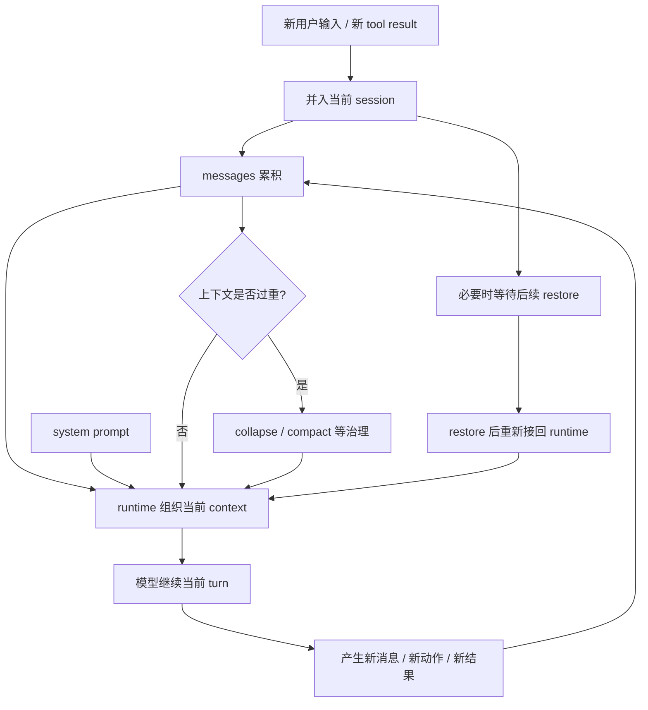
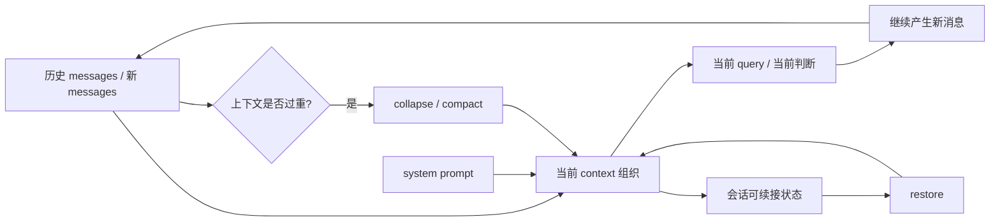

# 卷一 05｜Claude Code 怎么维持上下文、状态与持续工作

## 导读

- **所属卷**：卷一：Claude Code 系统全景导论
- **卷内位置**：05 / 06
- **上一篇**：[上一篇：Claude Code 怎么把模型意图落成执行能力](./04-how-intent-becomes-execution.md)
- **下一篇**：Claude Code 怎么长出更多能力

前四篇已经解释了三件事：Claude Code 是一套 runtime；一次请求会被组织成 agent turn；模型意图还能被落成真实执行动作。

但只看到这里，读者还会剩下一个关键疑问：

> **为什么 Claude Code 不是做完一轮就像重新开始，而是能把同一件工作持续接着跑？**

这篇回答的就是这个问题。

先把核心判断摆出来：

> **Claude Code 真正难的，不只是让模型会做事，而是让系统能在多轮、长任务和中断之后继续工作而不失控；上下文与状态管理，是这套 runtime 的生命线。**

---

## 先看一个最小场景：为什么“能持续”本身就是系统问题

假设 Claude Code 正在处理一个稍长的任务：

1. 用户先提出目标
2. 系统读了几个文件，拿到一批 tool result
3. 模型据此形成下一步判断
4. 任务还没结束，下一轮又要继续

这时系统马上会遇到四个问题：

- 前面发生过什么，哪些要继续带着
- 当前这一轮真正要参考什么，哪些旧材料已经太重
- 系统仍要按什么规则工作，不能越跑越偏
- 如果中断了，之后还能不能把同一条工作线接回来

所以 Claude Code 面对的不是“多记一点聊天历史”这么简单，而是：

> **怎样让一条工作线在变长之后还能继续跑。**

这就是为什么这一篇不该先盯着 compact、collapse、restore 的名字，而要先看到它们共同在解决什么：

> **持续工作能力，是 message、context、system prompt、session 以及一整套减负/续接机制共同维持出来的。**

---

## 一轮继续工作时，到底有哪些层一起在起作用

理解这一层，最稳的办法不是先背定义，而是先看协作图。

这张图里最该先抓住的，不是术语，而是分工：

- **messages** 在积累工作材料
- **context** 在组织当前这一轮真正带着跑的视图
- **system prompt** 在稳定系统级工作边界
- **session** 在托住“这还是同一条工作线”
- **collapse / compact / restore** 在必要时减负或续接

也就是说，Claude Code 的“持续工作”不是某个单点功能，而是几层东西一起在维持。

---

## 先把四个核心位置摆正

### 1. message：工作过程留下来的基本材料

message 最适合先理解成：

> **Claude Code 在一轮轮工作里积累下来的基本记录材料。**

用户输入、模型输出、tool use、tool result，都会变成这条工作线的一部分。

它解决的是：**发生过什么。**

但 message 还不是最终送给模型的完整工作视图。因为系统不能只是把历史原样堆上去，还要进一步组织、筛选和减负。

### 2. context：当前真正带着跑的工作视图

context 更像 runtime 为当前这一轮整理出来的有效工作视图。

它关心的是：

- 这轮继续判断时，到底该带什么
- 哪些旧内容仍然重要
- 哪些已经可以折叠、压缩，或者只保留更轻的表示

所以可以先记成：

> **message 更像原材料，context 更像当前工作视图。**

### 3. system prompt：始终顶在前面的运行约束

如果只有 message 和 context，Claude Code 仍然可能越跑越偏。因为长任务里变重的不只是信息，还有行为边界。

system prompt 更适合先理解成：

> **每轮继续工作时，始终顶在最前面的系统级运行约束与角色说明。**

它回答的不是“历史发生过什么”，而是：

- 你是谁
- 你按什么规则工作
- 你怎样调用能力
- 你要遵守哪些边界

所以它更像运行地基，而不是会话记忆。

### 4. session：把前后几轮接成同一条工作线的容器

session 解决的是另一个问题：

> **为什么前后几轮能被理解成同一件持续推进的工作，而不是几次偶然相邻的请求？**

最简单的理解是：

> **session 是 Claude Code 用来托住一条连续工作线的会话容器。**

它让历史材料、当前状态、后续恢复，都还属于同一条线。

如果把四者压成一句区分，可以记成：

- **message**：发生过什么
- **context**：这轮带什么继续跑
- **system prompt**：系统按什么规则继续跑
- **session**：为什么这还是同一条工作线

---

## Claude Code 真正要解决的，不是“记住全部”，而是“减负但别断线”

只要任务稍微长一点，历史消息和 tool result 就会迅速变多。问题不在于这些内容有没有价值，而在于它们不能永远都以原始体积继续带着跑。

于是系统会同时面对两种风险：

### 风险一：上下文越来越重，当前 query 越来越难继续

如果所有历史都完整保留，当前这一轮要带着跑的东西会越来越多。最终系统会变贵、变慢，或者越来越难判断什么才重要。

### 风险二：历史裁得太狠，工作连续性被剪断

但如果系统只是简单删历史，也会立刻失去另一种能力：

- 当前任务为什么会走到这里
- 之前已经试过什么
- 哪些结论已经成立
- 后面应该沿着哪条线继续

所以 Claude Code 需要的不是“记更多”或者“删更多”，而是：

> **减轻上下文负担，同时保住工作连续性。**

而这正是 collapse、compact、restore 这些机制存在的理由。

---

## collapse、compact、restore 到底各自解决什么场景

这一篇不展开实现差异，只先把三者的职责边界讲清。

### 1. collapse：旧内容还属于当前工作线，但不必每次完整展开

collapse 最适合先理解成一种**读时折叠 / 工作视图治理**。

它处理的场景是：

- 某些旧内容还不能算“无关”
- 但当前 query 已经不需要每次都原样带着它们
- 那就先把它们折成更轻的工作投影

所以 collapse 解决的不是“如何总结整个会话”，而是：

> **如何让还相关的旧内容，用更轻的形态继续参与当前工作。**

### 2. compact：工作线已经太重，需要重组为新的可运行骨架

compact 处理的是更重的场景。

它不是“顺手写个摘要”，而是面对一种更明确的工程问题：

- 当前会话已经长到不适合继续原样背着跑
- 系统需要把它压成一种更轻、但仍能继续工作的形态

所以 compact 的职责可以压成一句话：

> **把过长的工作线重组为新的可继续运行骨架。**

也正因为这样，它比 collapse 更重：前者更像让旧内容换一种带法，后者更像在会话已经过长时重整骨架。

### 3. restore：工作被中断后，把同一条线重新接回 runtime

restore 处理的不是“当前太重”，而是“中断之后怎么续上”。

它要解决的是：

- 之前那条工作线没有结束
- 但当前运行已经停下来或切开了
- 后面还要把它重新接回系统继续推进

所以 restore 最值得记住的不是“恢复聊天记录”，而是：

> **把之前那条会话线里的有效状态重新接回 runtime。**

三者并排看，可以先记成：

- **collapse**：旧内容还在，但先折轻一点再带着跑
- **compact**：会话太长了，重组为新的可运行骨架
- **restore**：工作线中断后，再重新接回系统

这样边界就比“都是为了续跑”更清楚了。

---

## 为什么这一层不是附属 feature，而是 runtime 的基础能力

如果把 Claude Code 看成一个会调工具的聊天产品，那上下文管理很容易被误解成一种辅助体验：工具是主角，状态只是配角。

但只要把它放回前四篇建立的 runtime 视角里，判断就会反过来。

因为执行能力解决的是：**系统能不能做事。**

而上下文与状态层解决的是：**系统能不能把同一件事持续做下去。**

没有执行能力，Claude Code 做不成事；没有上下文与状态治理，它做不长、做不稳，也做不连续。

所以这一层不是附属 feature，而是 agent runtime 能否成立的基础条件。

---

## 把 messages / prompt / compact / restore 再压成一张关系图

这张图只表达一件事：Claude Code 的上下文不是一团静态记忆，而是一条会不断累积、治理、减负和续接的工作链。

---

## 这一篇在卷一里的作用：把“会跑、能执行”推进到“能持续”

把卷一前五篇连起来看，逻辑已经比较完整：

- 第一篇回答：Claude Code 是什么系统
- 第二篇回答：它有哪些核心对象
- 第三篇回答：一次请求怎样跑成 agent turn
- 第四篇回答：模型意图怎样落成执行能力
- 第五篇回答：这套系统怎样在长任务里维持上下文、状态与连续性

所以第五篇的任务，不是抢先讲完 compact 或 session restore 的源码细节，而是先替后面的上下文卷立一个总判断：

> **Claude Code 的持续工作能力，本质上是 message、context、system prompt、session 与压缩/恢复机制共同构成的系统工程。**

等这个判断立住，后面再进入上下文卷时，读者就不会把 compact、collapse、restore 看成几个零散技巧，而会知道它们都在回答同一个主问题：

> **系统怎样长期工作而不失忆，也不失控。**

---

## 一句话收口

> Claude Code 之所以能持续工作，不是因为它“多记了一点聊天历史”，而是因为 runtime 持续维护 message、context、system prompt 与 session 这条工作链，并在必要时通过 collapse、compact、restore 等机制减负、重组和续接。持续工作能力不是附属 feature，而是这套系统能否成立的生命线。
