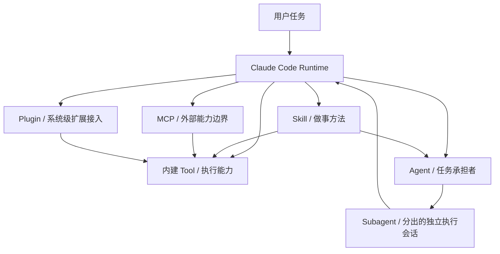
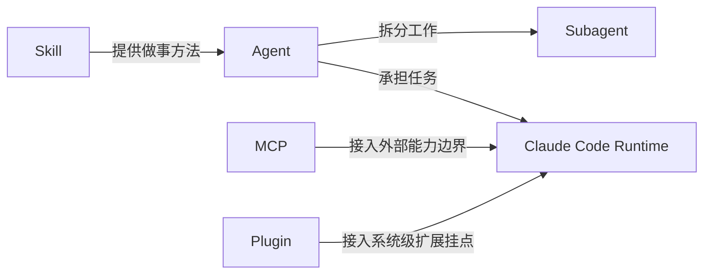

# 卷一 06｜Claude Code 怎么长出更多能力

## 导读

- **所属卷**：卷一：Claude Code 系统全景导论
- **卷内位置**：06 / 06
- **上一篇**：Claude Code 怎么维持上下文、状态与持续工作
- **下一篇**：卷二起，分别进入主循环、工具系统、上下文系统与扩展系统等专题卷

卷一前面几篇，已经把 Claude Code 的几层基础骨架立了起来：

- 它不是聊天壳，而是一套 runtime
- 它不是功能堆，而是多类对象协同工作的系统
- 它不是回一句话，而是一轮轮推进的 agent turn
- 它不是模型直接做事，而是通过执行能力层把意图落成动作
- 它也不是跑一轮就清零，而是靠上下文与状态维持持续工作

到这里，卷一还剩最后一个问题：

> **Claude Code 为什么不是一个封闭系统，而是一套还能继续长能力的 runtime？**

如果这个问题不补上，前面几篇建立起来的系统感仍然是不完整的。因为一个真正的 runtime，不只要会跑、会执行、会持续，还得能在不把自己搞散的前提下继续接入新能力。

这篇要讲清的，就是这张扩展能力地图。

先把核心判断摆在前面：

> **Claude Code 不是一个固化产品，而是一套能够持续吸纳新能力的可扩展 runtime。skill、agent、subagent、MCP、plugin 这些对象都在帮它长能力，但它们长的不是同一层能力。**

---

## 先给判断：Claude Code 的厉害，不只是“已经会很多”，而是“还能继续长”

很多人第一次接触 Claude Code，容易被它现成的能力列表吸引：

- 能读文件
- 能改代码
- 能跑命令
- 能调工具
- 能分配任务
- 能接外部系统

这种感觉当然没错，但还不够。

因为如果你只把 Claude Code 理解成“一组已经做好的能力”，它更像一个不断加按钮的产品；而如果你把它理解成一套 **还能继续吸纳能力的 runtime**，你看到的才是它真正的系统边界。

两者差别很大：

- 产品视角更关心：现在已经有哪些功能
- runtime 视角更关心：新的能力能怎样被接进来，并被纳入同一套运行秩序

所以这篇最该先立住的判断不是“Claude Code 会的东西很多”，而是：

> **Claude Code 从一开始就不是封闭系统，它的架构天然在为继续长能力留位置。**

---

## 扩展能力地图：Claude Code 到底往哪里长能力

如果先把实现细节都压住，Claude Code 的扩展能力大致可以先看成下面这张图：

看这张图时，最值得先抓住的不是名词，而是两个方向：

### 第一，Claude Code 的扩展不只是一种

它不是只靠某一个“插件系统”往外长，也不是只靠增加工具往外长。

它至少有几种不同方向：

- **长做事方法**：skill
- **长任务承担与分工能力**：agent / subagent
- **长外部能力边界**：MCP
- **长系统级接入与整合能力**：plugin

所以这里不是一个单点扩展模型，而是一张多层扩展地图。

### 第二，这些能力都要重新回到 runtime 里被组织

不管能力是从哪一层接进来的，Claude Code 都不会因为“接进来了”就自动变成一个好系统。

真正关键的是：

- 它们能不能进入当前 turn
- 能不能和上下文、状态、执行链协同
- 能不能被同一套 runtime 编排

也就是说，Claude Code 不是靠“外挂很多”变强，而是靠：

> **新的能力被接进来之后，仍然回到同一套 runtime 里工作。**

这就是它为什么不是封闭系统，但也不是散装系统。

---

## 先把最容易混的五个对象摆正位置

这一篇最容易失控的地方，是把 skill、agent、subagent、MCP、plugin 都写成“某种扩展”。这样说不算错，但边界会糊。

更稳的办法，是先回答：

> **它们分别在系统里长的到底是哪一种能力？**

---

## 1. Skill：长的是“怎么做”的方法能力

先说最容易被误会的 skill。

很多人第一次看到 skill，会把它理解成一种工具包，或者一种外挂功能。这么理解会偏掉一点。

更准确地说，skill 更像是在告诉 agent：

- 遇到这个任务，先怎么看
- 应该走什么步骤
- 要注意什么边界
- 优先调哪些能力

所以 skill 更像什么？

> **更像一套做事方法，而不是一个独立执行对象。**

它回答的不是“系统能不能做这个动作”，而是：

> **这个场景应该怎么组织做法。**

所以 skill 的位置，不在底层执行接口，也不在外部能力边界，而更接近 Claude Code 的**工作方法层**。

这也解释了为什么 skill 虽然会显著改变 Claude Code 的表现，但它本身并不等于新的底层权限，也不等于一个新的独立 agent。

把它压成一句话：

> **skill 长的是方法，不是动作。**

---

## 2. Agent：长的是“能接手一段工作”的任务能力

如果说 skill 更像方法层，那 agent 就已经明显不是同一类东西了。

agent 的重点不是“告诉系统怎么做”，而是：

- 让系统有一个相对稳定的工作人格或工作角色
- 能接住某类任务
- 在任务范围内组织自己的工具、技能、上下文和执行路径

所以 agent 在 Claude Code 里的位置，更像：

> **一个任务承担者。**

它不是单个动作接口，也不是单纯方法说明，而是一段工作流程的承接单位。

从系统分工看，tool 更像“做一个动作”，agent 更像“接一段工作”；这点和第二篇对象地图是接上的。

所以 agent 长出来的，不是一个新按钮，而是：

> **系统开始拥有新的工作角色、新的任务边界、新的组织方式。**

这也是 Claude Code 为什么能从“一个 agent 在做事”，逐渐长成“多个角色在协作做事”。

---

## 3. Subagent：长的是“把工作继续分出去”的并行与隔离能力

subagent 可以看成 agent 体系里的进一步分化。

如果说 agent 是一个任务承担者，那么 subagent 更强调的是：

- 某段工作可以被拆出去
- 被放到相对独立的执行会话里
- 在和主线保持关联的同时，减少互相干扰

所以 subagent 的重点，不是“比 agent 更高级”，也不是“tool 的加强版”。

它真正长出来的是一种很关键的 runtime 能力：

> **系统不仅能做事，还能把工作分出去做。**

这件事很重要，因为一旦任务变长、变复杂、变多线程，仅靠单条主线很容易互相打断。subagent 的价值就在于，它让 Claude Code 不只是“持续工作”，还能开始出现：

- 分工
- 隔离
- 并行推进
- 结果回收

所以它不是单纯多开几个窗口，而是 runtime 在任务组织层面长出新的能力。

把它压成一句话：

> **agent 是接工作，subagent 是把工作拆出去继续做。**

---

## 4. MCP：长的是“系统原本边界之外的能力接入”

到了 MCP，这篇终于从“系统内部怎么组织工作”转到“系统还能往外接什么能力”。

理解 MCP，一个很稳的办法是先不要把它想成某种具体协议细节，而是先把它看成：

> **Claude Code 和外部能力边界之间的一层正式接入面。**

它的意义，不在于“又多一种调用方式”，而在于：

- Claude Code 不必只用内建能力
- 它还能把系统外部的能力接进来
- 接进来之后，这些能力还能被当前 runtime 消费

所以 MCP 长出来的，不是方法层，也不是任务承担者，而是：

> **能力边界本身在往外扩。**

这也是 Claude Code 不像一个封闭产品的重要原因。封闭产品的能力边界，通常在出厂时就差不多定了；而 Claude Code 这种 runtime，更像是把“如何接入边界外能力”也做成了系统的一部分。

所以到了这里，Claude Code 才真正开始像一个**可持续扩展的能力平台**。

---

## 5. Plugin：长的是“系统级整合与扩展挂点”

plugin 和 MCP 很容易被并排看，但它们不完全是一回事。

更稳的理解方式是：

- MCP 更像能力边界的正式接入
- plugin 更像系统级扩展挂点

也就是说，plugin 关心的往往不只是“多一个外部能力”，而是：

- 系统怎样被接入新的整合层
- 某类能力怎样以更系统化的方式被挂进来
- 某些运行行为怎样被扩展或改造

所以 plugin 的位置更接近：

> **系统接入层与整合层。**

这也是为什么这篇不细讲 plugin loader 细节。卷一此处更重要的，不是 loader 怎么实现，而是先看清：plugin 代表的是 Claude Code 在**系统级扩展面**上也预留了位置。

把它压成一句话：

> **MCP 更像接能力边界，plugin 更像接系统挂点。**

---

## 把这五个对象压成一张位置关系图

如果把刚才这五个对象再压缩一次，可以先记成下面这张关系图：

这张图最重要的，不是精确实现，而是帮你在脑子里先分清：

- skill：方法层
- agent：任务承担层
- subagent：任务拆分与隔离层
- MCP：外部能力接入层
- plugin：系统级扩展接入层

只要这个位置关系先摆正，后面几卷再进入细节时，读者就不容易把它们重新看成一堆平铺名词。

---

## 为什么 Claude Code 不是“越加越乱”，而是还能继续长能力

到这里，名词已经摆得差不多了。接下来更关键的问题是：

> **为什么这些东西接进来之后，Claude Code 没有退化成一堆互相不认的外挂？**

因为它们虽然在长不同层的能力，但最后都还要回到同一套 runtime 里被组织。

至少有三点值得先抓住。

### 第一，Claude Code 长的是分层能力，不是无边界功能堆积

它不是把所有扩展都塞进同一层里。

而是把不同问题拆成不同层：

- 怎么做：skill
- 谁来接：agent
- 怎么拆出去：subagent
- 外面还能接什么：MCP
- 系统怎样被进一步扩展：plugin

因为分层清楚，所以新能力增加时，不必全都挤进同一个概念里。

### 第二，所有扩展最后都要重新进入当前运行时

无论能力从哪里来，Claude Code 都还得回答这些问题：

- 它怎么进入当前 turn
- 怎么和上下文协同
- 怎么和执行链协同
- 怎么回到当前任务推进中

只要这套 runtime 编排还在，系统就不是散的。

### 第三，Claude Code 把“长能力”本身做成了系统职责的一部分

很多系统是先做完，再慢慢补扩展。

Claude Code 更像是一开始就把“未来还会继续长能力”纳进了自己的系统假设里。所以它不是在一个原本封闭的壳上打补丁，而是在 runtime 层面给未来能力预留了结构位置。

这就是为什么它更像一个会持续生长的系统，而不是一份静态功能清单。

---

## 这一篇其实也在替后面几卷重新分流

作为卷一收尾，这篇不能只讲“它能扩展”，还得顺手把读者往后面几卷送出去。

因为到这里，卷一真正完成的，不是局部细节，而是一张完整的总地图：

- 01 先立住：Claude Code 是什么系统
- 02 再认清：这套系统有哪些核心对象
- 03 再看到：一次请求怎么跑成一轮 agent turn
- 04 再补上：模型意图怎么落成执行能力
- 05 再补上：系统怎么维持上下文、状态与持续工作
- 06 最后收口：这套 runtime 怎么继续长出更多能力

接下来往后读，最自然的分流大致是这样的：

### 往卷二去：继续追主循环与 agent turn

如果你现在最关心的是：

- 一轮 turn 内部到底怎么组织
- 运行时主循环怎样持续推进
- 判断、执行、继续、收口的细节怎样展开

那接下来就应该往主循环相关卷走。

### 往卷三去：进入工具与执行能力系统

如果你现在最关心的是：

- tool runtime 更细的结构
- 具体工具如何成为标准执行接口
- 执行能力怎样被编排、控制与反馈

那接下来应该往工具系统卷走。

### 往卷四去：进入上下文、状态与持续工作系统

如果你现在最关心的是：

- Claude Code 如何长期工作
- context、session、compact、restore 这一侧的逻辑
- 为什么系统不会每轮都从零开始

那接下来应该往上下文与状态卷走。

### 往卷五、卷六去：进入扩展能力系统

如果你现在最关心的是：

- skill 在 runtime 里到底怎样起作用
- agent / subagent 怎样组织分工
- MCP、plugin 这些外部接入面到底怎么接上系统

那后面就会进入扩展能力相关的专题卷。

也就是说，卷一到这里才算真正完成它的任务：

> **先把整套 Claude Code runtime 的系统地图立起来，再把读者稳定地送往不同专题卷。**

---

## 用一句更稳的话收住卷一

如果把卷一六篇压成一句总判断，其实可以记成：

> **Claude Code 不是一个会聊天、会调工具的封闭产品，而是一套把输入、对象、主循环、执行能力、上下文管理和扩展机制组织在一起，并且还能继续长能力的 agent runtime。**

到这里，卷一的价值就已经很明确了。

它不是先把某个局部讲得最深，而是先让后面所有局部都有地方可放。等你后面再去读工具、上下文、skill、agent、MCP、plugin，就不会像在看一堆零散实现，而是在继续拆同一套系统。

---

## 一句话收口

> Claude Code 之所以不是封闭系统，不是因为它“附加功能很多”，而是因为它把长能力这件事本身做进了 runtime：skill 长方法，agent 长任务承担，subagent 长任务拆分，MCP 长外部能力边界，plugin 长系统级扩展挂点。它不是一份静态功能清单，而是一套还能继续生长的运行时系统。
