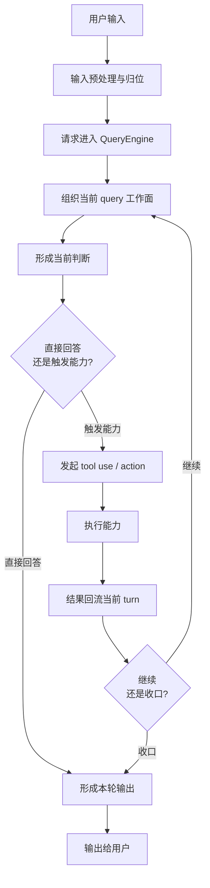

# 卷二 01｜一次请求怎么进入 Claude Code 的主循环

## 导读

- **所属卷**：卷二：用户输入怎么变成一次完整的 agent turn
- **卷内位置**：01 / 08
- **上一篇**：[卷一 03｜一次请求是怎么跑成一次 Agent Turn 的](../volume-1/03-how-a-request-becomes-an-agent-turn.md)
- **下一篇**：卷二 02｜用户输入在进入运行时之前经历了什么

卷一第 3 篇已经立过一张低分辨率的动态闭环图：输入进入运行时，系统形成当前判断，必要时调用能力，结果回流，再决定继续还是收口。

但到了卷二，这张图还不够用。因为卷二不再满足于说“它会这样跑”，而是要开始回答：

> **一条用户请求进入 Claude Code 之后，整条主线到底是怎样真正展开的？**

这篇作为卷二总起篇，只做一件事：

> **先把“一次请求怎么进入主循环”的总图立起来。**

先把时间顺序看清，再把后面几篇分别拆哪一步交代清楚。

---

## 先给判断：进入主循环，不是把一句话交给模型，而是把一次请求接成一条可持续推进的工作链

最容易形成的直觉是：

- 用户发来一句话
- Claude Code 把这句话送给模型
- 模型回一段话
- 系统显示出来

但这条理解太薄了。

从运行时角度看，一次请求真正进入 Claude Code 的方式更接近下面这句：

> **Claude Code 的主循环不是“收输入、回输出”的单步过程，而是一条把请求接入运行时、形成当前判断、触发能力、接回结果并持续推进的工作链。**

这句话里有三个重点。

### 第一，它先接住的是“运行请求”，不是裸输入

用户表面上只说了一句话，但运行时真正接住的，已经是一份要被并入当前会话、当前约束和当前能力边界里的请求。

### 第二，它先产出的不一定是答案，而是当前判断

请求一旦进入主循环，系统首先要形成的，不一定是最终回答，更可能是：

- 这轮该直接回答
- 还是先触发某个能力
- 还是要等结果回来后继续推进

### 第三，它天然是一条会回流的链

只要中间发生了 tool use、agent action 或其他执行动作，这一轮就不会停在第一次模型输出上。执行结果还要重新回到主循环，成为下一步判断的输入。

所以这篇真正要立住的，不是“入口函数在哪里”，而是：

> **一次请求进入 Claude Code 之后，会被接成一条持续推进的主循环时间线。**

---

## 先看整条时间线：一次请求进入主循环之后，会经过哪几步

先把细节都压住，只看卷二需要读者记住的总图。

这张图里最重要的，不是节点名字，而是时间顺序。

卷二接下来要做的，就是沿着这条顺序往下拆：

1. 输入先怎么被整理和归位
2. 请求怎样真正进入 QueryEngine
3. 当前 query 怎样被组织成一个工作面
4. 系统怎样形成“这一轮下一步该做什么”的判断
5. 执行结果怎样重新回到当前 turn
6. 一轮 turn 什么时候继续，什么时候收口

换句话说，卷二不是组件词典，而是一条按时间顺序展开的运行线。

---

## 为什么卷二要先立主循环总图

如果一上来就拆 `QueryEngine`、tool use、context，读者很容易只记住一堆局部机制，却看不见它们在同一条时间线上的位置。

所以卷二先立总图：请求怎样被接入，怎样形成当前判断，怎样触发能力，怎样把结果接回当前 turn。后面各篇，只是沿这条主线逐段展开。

---

## 从源码角度看，这一篇只先钉住“入口对象”，不展开入口层次

卷二这一篇不深挖源码，但也不能完全飘在概念上。这里先只钉住一个足够支撑总图的判断：

> **请求不是直接撞进模型，而是先被接进 `QueryEngine` 这样一个持续存在的 turn 级运行对象。**

`QueryEngine.ts` 里有一句很关键的注释：

> One QueryEngine per conversation. Each submitMessage() call starts a new turn within the same conversation.

这句话先帮卷二总起篇立住三件事：

- `QueryEngine` 不是一次性问答函数
- 它对应的是一段持续存在的 conversation
- 每次新请求进入时，系统处理的不是裸文本，而是一轮新的 turn

所以这篇只需要先把读者带到这里：

> **一次请求进入 Claude Code，不是进入一次孤立调用，而是进入一个会持续维护 messages、状态与运行约束的主循环世界。**

至于更细的问题，比如：

- 为什么真正入口要落在 `submitMessage(...)`
- `query(...)` 和入口对象是什么前后层次
- 输入在入口前后分别如何被装配

这些都留给卷二第 03 篇单独展开。

---

## 主循环推进的单位，其实是当前 turn

从聊天视角看，一次请求的终点像是一句回复；但从运行时视角看，真正被推进的是当前 turn。

这一轮 turn 会把请求并入当前消息流，形成当前判断；如果触发了能力，结果还会回流，再决定继续还是收口。

所以卷二真正想建立的，不是“Claude Code 会调用工具”，而是：

> **Claude Code 会把一次请求接成一个可持续推进的 current turn。**

---

## 卷二后文会沿这条线继续拆

后面几篇会顺着这张总图往下走：

- 第 2 篇讲进入运行时之前的输入前站
- 第 3 篇讲请求怎样真正进入 QueryEngine
- 第 4 篇讲当前 query 工作面怎样被组织起来
- 第 5 篇讲这一轮怎样形成“要不要调用能力”的当前判断
- 第 6 篇讲执行结果怎样重新回到当前 turn
- 第 7 篇讲这一轮什么时候继续，什么时候收口

这篇只先立总图，不深挖卷三的执行层细节，也不展开卷四的上下文治理细节；它借 `QueryEngine.ts` 锚定入口，但目标不是做文件导读，而是先把主循环时间线立住。

---

## 一句话收口

> 卷二要先立住的，不是某个组件，而是一次请求进入 Claude Code 主循环后的整条时间线：请求先被整理并接入运行时，再形成当前 query 工作面与当前判断，必要时触发能力，把结果接回当前 turn，最后决定这一轮继续还是收口。只有先留下这张总图，后面几篇才不会散成一堆局部机制。
