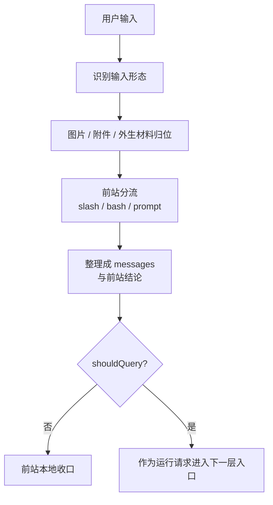

# 卷二 02｜用户输入在进入运行时之前经历了什么

## 导读

- **所属卷**：卷二：用户输入怎么变成一次完整的 agent turn
- **卷内位置**：02 / 08
- **上一篇**：[卷二 01｜一次请求怎么进入 Claude Code 的主循环](./01-how-a-request-enters-the-main-loop.md)
- **下一篇**：卷二 03｜请求是怎么进入 QueryEngine 的

卷二第 01 篇已经先把总图立出来了：一次请求要先进入主循环，形成当前判断，必要时触发能力，结果再回流，最后决定这一轮继续还是收口。

但总图刚立起来时，读者最容易低估的一步，恰恰是最前面那一小段：**用户输入并不是裸着进入运行时的。**

你在界面里看到的，也许只是一句话、一张图、一个 slash command，或者一段带 `@file` 的提示。但 Claude Code 真正接住它之前，会先做一轮前站处理：先判断它属于哪种输入，再把附件、上下文和元信息归位，最后把它整理成运行时能接住的消息形态。

所以这篇要回答的问题是：

> **用户输入为什么不是“原样进入主循环”，而是要先经历一轮整理、归位、消息化与前站分流？**

先把核心判断立住：

> **Claude Code 接住的不是一段原始输入，而是一份经过整理、归位、消息化后的运行请求。**

这篇只讲进入运行时之前的前站，不抢第 01 篇的总图职责，也不抢第 03 篇“正式进入 QueryEngine”的入口职责。这里真正要讲清的，是：**一条 request 在被正式接入运行时之前，已经先被整理成了什么。**

---

## 先看总图：输入在进入运行时之前，先经过一段前站整理

把源码细节先压住，只看卷二第 02 篇最该留下的时间顺序，大致是这样：

这张图最重要的一点是：

> **输入前站的职责不是把输入做干净，而是先决定这条输入是否、以及以什么运行语义进入运行时。**

也就是说，在真正进入运行时之前，Claude Code 先要回答几个问题：

- 这是普通文本，还是 slash command，还是 bash 输入？
- 这里面有没有图片、pasted contents、`@file`、`@agent`、MCP 资源这些要额外处理的东西？
- 哪些内容算用户原话，哪些只是系统补充的元信息？
- 这次输入是否真的要继续进入 query，还是应该在更前面就地处理？

只有这些问题先被解决，后面的运行时入口才有稳定的接入对象。

---

## 第一层：系统先识别的不是“意思”，而是输入形态

这一层最容易被忽略，因为它看起来不像“核心机制”，却决定了后面的全部走向。

从旧卷二的 `processUserInput(...)` 及相关路径看，输入前站最先做的事，不是理解用户意图，而是先识别输入形态。

这一步至少要先分出几类：

- 纯文本输入
- 带 content blocks 的输入
- pasted image / image blocks
- slash command
- bash 模式输入

这个顺序很重要。因为 Claude Code 先面对的不是语义问题，而是**输入材料是什么**。

比如一条输入如果不是单纯字符串，而是 `ContentBlockParam[]`，系统就要先把：

- 最后的 text block 视作主要文本
- 前面的 image blocks 保留下来
- 必要时做 resize 和 downsample
- 再把相关 image metadata 作为补充信息整理出来

这说明 Claude Code 在输入前站就已经默认：

> **用户输入不一定是“一个字符串”，而可能是多模态、分块、带附加材料的输入组合。**

所以第 02 篇的第一层判断可以先钉住：

> **在进入运行时之前，输入首先要被识别成某种可处理的输入形态，而不是直接按文本对待。**

---

## 第二层：图片、pasted contents 和附件，要先被归位成可处理材料

只要输入不是纯文本，系统就不能把它和用户原话混成一坨。

这时候输入前站要做的第二件事，就是把各种外来材料先归位。无论是 pasted image、content blocks，还是 `@file`、`@agent-xxx`、`@server:uri` 这类显式引用，关键都不是“补一点材料”，而是先把它们从用户原话里分离出来，整理成后续可以稳定处理的 attachment 或相关消息对象。

这一步真正解决的是分层问题：

- 用户原话，还是用户原话
- 图片、文件、资源这些外来材料，不伪装成一句普通文本
- 路径、尺寸、来源、引用对象等补充信息，也不和用户原话混写在一起

所以输入前站做的不是把一切都拼进一段 prompt，而是先把外来材料归位，再交给消息层决定它们以什么消息形态进入后续处理。

> **用户输入进入运行时前，已经先把“原话”和“附带材料”拆开了。**

---

## 第三层：前站分流的重点，不是识别命令，而是决定是否继续进入 query

很多人一看到 slash command，会自然觉得前站分流的任务就是“识别是不是命令”。这句话不算错，但还是太浅。

更准确地说，前站分流真正决定的是：

> **这条输入接下来要不要继续进入 query 路径。**

也就是说，同样是“用户输入”，系统前站看到的并不是同一回事：有些会继续变成后续运行请求，有些则会在更前面被本地处理或就地收口。

所以这里真正的门槛不是命令长什么样，而是：

- 这次输入是不是要继续进入模型路径
- 还是应当在前站就完成分流

这一步一旦做完，后面拿到的就不再是“未经判断的原始输入”，而是一份已经通过前站闸门的材料。

---

## 第四层：消息化，才是“可进入运行时”的真正门槛

输入被识别、归位、提取附件、完成分流之后，还没有真正进入运行时。中间还有一个关键动作：**消息化。**

这一点是第 02 篇最该保住的词之一。

因为 Claude Code 的下一层运行时，不直接消费“原始输入”，而是消费一组已经整理好的消息材料。这里至少包括：

- user messages
- attachment messages
- 必要时的 meta user messages
- 与 slash command / permission 相关的补充消息

旧卷二对这条线的判断很准：`processUserInput(...)` 的核心产物并不是“一条消息”，而是**一份输入处理决议**。它常常至少包含：

- `messages`
- `shouldQuery`
- 某些运行时附带信息，如 `allowedTools`、`model`、`resultText`

这说明输入前站的最终产物，不是一个文本字符串，而是：

> **一组可进入运行时的消息形态，加上本轮该怎么继续推进的前站结论。**

所以这里的“消息化”不能理解成机械包装。它更像是一次归并：

- 把用户原话和图片材料放进合适的消息结构
- 把 attachment 整理成可后续转译的消息对象
- 把 command / permission / meta 信息放进合适的位置
- 让后续入口拿到的，已经是一份结构稳定的运行请求

这一步完成后，请求才算具备了“被正式接入运行时”的资格。

---

## 第五层：`shouldQuery` 说明前站不仅整理输入，也负责前站闸门

第 02 篇还必须点到一个很关键的控制位：`shouldQuery`。

它的重要性在于，它说明输入前站的职责并不止于整理材料，还包括一层真正的前站闸门。

所以更准确地说，输入前站的产物不是“整理好的输入”，而是：

> **一份关于本轮 request 是否应继续进入 query 路径的前站判定。**

这也是为什么第 02 篇和第 03 篇必须分开：第 02 篇只讲进入正式入口之前，输入已经先被整理、消息化并经过前站分流；至于它随后怎样被正式接入 QueryEngine，那是下一篇的职责。

---

## 一句话收口

> 这篇真正要立住的是：用户输入在进入运行时之前，先要经历一段前站处理——识别输入形态，把图片、pasted contents 与附件归位，把用户原话和附带材料拆开，再整理成 messages 与 `shouldQuery` 这样的前站结论。Claude Code 因此接住的不是一段裸文本，而是一份已经通过前站闸门的运行请求。
