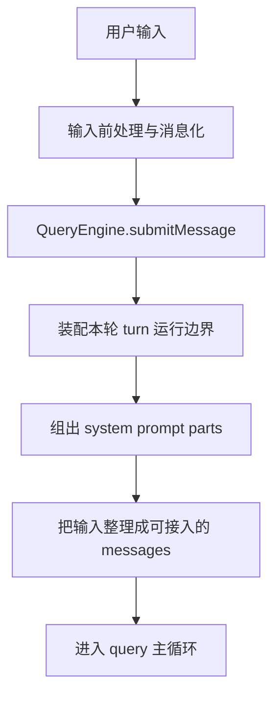

# 卷二 03｜请求是怎么进入 QueryEngine 的

## 导读

- **所属卷**：卷二：用户输入怎么变成一次完整的 agent turn
- **卷内位置**：03 / 08
- **上一篇**：[卷二 02｜用户输入在进入运行时之前经历了什么](./02-what-happens-before-user-input-enters-runtime.md)
- **下一篇**：[卷二 04｜当前 query 是怎么被组织起来的](./04-how-the-current-query-is-organized.md)

到了这一篇，卷二才算真正从“输入前站”迈进主循环入口。

前一篇讲的是：用户输入在真正进入运行时之前，不会以裸文本形态直接撞进系统，而是会先经历归并、整理和消息化。可读者此时还会有一个更尖锐的问题：**整理完之后，这条请求到底是从哪里正式进入 Claude Code 主循环的？**

这一篇要回答的，就是这个入口问题。

先把核心判断立住：**QueryEngine 不是普通函数入口，而是 Claude Code 把请求真正接入主循环的关键运行入口。**

这句话有两层意思。

第一，它不是“顺手把 prompt 发给模型”的薄封装；第二，一条请求一旦进入 QueryEngine，接下来就不再只是“处理一句话”，而是开始被当成一次完整的 agent turn 来装配、推进和收口。

所以这篇不去展开完整主循环，也不细拆 QueryEngine 里的每个内部函数。它只做一件事：让你看清楚，**什么叫“请求进入 QueryEngine”**，以及为什么从卷二结构上看，QueryEngine 会成为后面几篇的中轴对象。

边界也先说死：

- 这篇不重新承担卷二总起篇的总图职责
- 不在这里展开“回答还是行动”的分流判断
- 也不进入“这一轮什么时候继续、什么时候收口”的边界判定

这篇只负责把**正式入口**这件事讲硬。

---

## 先看总图：请求不是直接进模型，而是先被接进运行时入口

卷二前两篇如果压成一条时间线，大致是这样的：

这张图最该记住的一点是：**请求进入 QueryEngine，不等于“开始模型采样”；它先意味着这条请求被正式接入 Claude Code 的运行时组织层。**

也正因此，QueryEngine 在卷二里的位置不是一个普通组件，而像是一扇门：前面还是输入整理层，过了这里，才正式进入 turn 级运行。

---

## QueryEngine 为什么值得单独讲

如果只看名字，`QueryEngine` 很容易被误解成一个“负责 query 的地方”。这种理解不能说错，但太薄了。

从 `cc/src/QueryEngine.ts` 的 `submitMessage(...)` 看，它一上来处理的并不是某段 prompt 如何发给模型，而是这一轮运行时要先准备哪些基础条件：

- 当前工作目录 `cwd`
- commands、tools、mcpClients、agents
- `thinkingConfig`、`maxTurns`、`taskBudget`
- 当前 app state
- turn 级的 skill discovery 状态
- permission denial 跟踪
- transcript 持久化相关状态
- 当前会话持有的 `mutableMessages`

这说明一件很重要的事：**QueryEngine 看到的单位不是“一个字符串输入”，而是“一轮要被管理的运行时 turn”。**

真正进入 QueryEngine 之后，请求的身份就变了：它不再只是“用户说了一句话”，而是“系统现在要接住一轮新的工作回合，并把它纳入当前会话状态”。这也是为什么 QueryEngine 值得单独成篇：它标志着卷二从前处理前站，正式推进到主循环入口层。

---

## QueryEngine 在卷二主线里的位置

卷二的主问题是：**用户输入怎么变成一次完整的 agent turn。**

如果按时间顺序看，QueryEngine 的位置很特殊：它不直接替卷二回答全部问题，但它负责把请求从“前站材料”推进成“主循环里的活动回合”。

所以第 03 篇真正要做的，就是把“正式入口”钉牢。后面第 04、05、06、07 篇讲的，都是这扇门后面依次发生的事：

- 第 04 篇讲当前 query 工作面怎样形成
- 第 05 篇讲当前决策怎样成形
- 第 06 篇讲结果怎样回流当前 turn
- 第 07 篇讲这一轮什么时候继续、什么时候收口

---

## 真正的入口不在 query，而在 `submitMessage(...)`

这是这一篇最核心的源码判断。

很多人第一次看主链时，会天然把 `query(...)` 当成入口：名字就叫 query，看起来也像是主循环发生的地方。但从时序上说，**真正让一条请求进入主循环世界的入口，不是 `query(...)`，而是 `QueryEngine.submitMessage(...)`。**

为什么这么说？因为在 `query(...)` 被调用之前，`submitMessage(...)` 已经做了几件决定性的事：

- 清理本 turn 的发现状态，比如 `discoveredSkillNames`
- 根据当前配置决定初始 model 和 thinking config
- 通过 `fetchSystemPromptParts(...)` 拉取 `defaultSystemPrompt`、`userContext`、`systemContext`
- 结合 `customSystemPrompt`、`appendSystemPrompt` 等信息，装配出本轮 system prompt 基底
- 以 `processUserInput(...)` 处理当前输入
- 把输入结果推进到 `mutableMessages`
- 发出一条 `buildSystemInitMessage(...)`
- 最后才进入 `for await (const message of query(...))`

也就是说，`query(...)` 接到的已经不是“刚从用户那里来的原始输入”，而是：**一轮被 QueryEngine 预先装配过的运行请求。**

这也是为什么说 QueryEngine 是运行入口，而不是普通中转层。它不是把请求转一下手，而是先把请求改造成主循环可以接住的形态。

---

## 进入 QueryEngine，首先意味着“先装运行时，再谈输入”

`submitMessage(...)` 的开头很能说明问题。

它没有先问“prompt 是什么”，而是先处理：

- 这轮 turn 用什么 model
- 是否启用 thinking，以及怎么配置
- `canUseTool` 如何包装，便于跟踪 permission denials
- 当前 app state 是什么
- 当前是否要持久化 transcript
- 当前这轮的 skill discovery 状态是否需要清空

这背后对应的是一个架构判断：**Claude Code 接住请求的第一步，不是做文本理解，而是建立本轮运行边界。**

这是理解 QueryEngine 的关键。如果把它想成“文本入口”，很多后续设计都会显得啰嗦；但如果把它想成“turn 入口”，这些动作就都合理了，因为 turn 天生需要：

- 状态
- 权限
- 记账
- 持久化
- 历史消息缓冲

所以“请求进入 QueryEngine”这件事，真正指向的是：**系统把这一轮请求接进了一个可持续推进、可追踪、可恢复的运行容器。**

---

## 进入 QueryEngine，也意味着 prompt 组装开始从零件变成运行时材料

前一篇已经讲过，用户输入在进入主循环前会先被整理。但只看输入还不够，因为 Claude Code 从来不是“拿到一句话就发给模型”。

在 `submitMessage(...)` 里，真正很关键的一步是：

- `fetchSystemPromptParts(...)`

它拉回三块材料：

- `defaultSystemPrompt`
- `userContext`
- `systemContext`

随后，QueryEngine 再根据当前配置，把这些材料和：

- `customSystemPrompt`
- `appendSystemPrompt`
- 特定条件下的 memory mechanics prompt

一起装成最终要供本轮使用的 `systemPrompt`。

这一步说明：**进入 QueryEngine，意味着这轮请求开始被放进 Claude Code 的正式规则环境里。**

也就是说，系统此时不只是“收到了用户说什么”，而是在同时确定：

- 这轮运行遵循什么系统规则
- 用户侧背景如何注入
- 系统侧上下文如何拼接

所以 QueryEngine 不只是输入入口，它还是 prompt 装配入口。它把输入请求和运行规则放到同一个装配面里，后面 `query(...)` 才能接着展开。

---

## 进入 QueryEngine，不是把文本直接送进主循环，而是先走 `processUserInput(...)`

这一点，是卷二结构上很容易踩混的地方。

前一篇刚讲完输入整理，读者可能会以为：既然整理完了，那进入 QueryEngine 后就会直接进 `query(...)`。其实中间还有一步非常关键：

- `processUserInput(...)`

这一步意味着，QueryEngine 并不是无条件把当前输入送去 query，而是先把它翻译成当前会话可以接收的消息和副作用，再决定是否真的要 query。

从 `submitMessage(...)` 的处理流程能看到，`processUserInput(...)` 返回的至少包括：

- `messages`
- `shouldQuery`
- `allowedTools`
- `model`
- `resultText`

这几个结果非常重要，因为它们说明：**“进入 QueryEngine”并不等于“马上问模型”，而是系统先根据输入类型决定，这一轮接下来该怎么走。**

比如有些本地 slash command，可能就不会进入真正的 query，而是直接在本地完成，然后返回结果。换句话说，QueryEngine 的关键职责之一，是先把输入分流成“需要进入 query 的”和“可以在更前面就地收口的”。

这也给卷二后面的边界留出了空间：

- 第 04 篇再讲当前 query 如何组织
- 第 05 篇再讲当前决策如何形成

这里先只把入口讲清，不抢后面几篇的角色。

---

## `mutableMessages` 说明 QueryEngine 管的不是一次调用，而是活动会话

理解 QueryEngine，还有一个非常关键的观察点：它内部长期持有 `mutableMessages`。

这不是一个临时局部变量，而是 QueryEngine 维护的活动消息缓冲。当前 turn 的输入处理完后，新消息会被推进去；后面 query 过程中产生的 assistant、user、progress、attachment、compact boundary 等消息，也会持续写回这个状态。

这意味着什么？意味着 QueryEngine 不是 stateless wrapper。它不是“收一个 prompt，吐一个结果，然后什么都不记得”，而是：**在代表当前会话维护一份活着的消息状态。**

这个判断很重要，因为它直接解释了为什么“进入 QueryEngine”会成为卷二中轴。

一条请求一旦进入 QueryEngine，就不再是孤立调用，而是进入了一个会话级运行面：

- 当前消息历史会影响它
- 它会反过来更新消息历史
- transcript 会记录它
- permission/usage/error 等运行信息会围绕它继续累计

所以从读者模型上说，最好把 QueryEngine 想成：**主线程当前会话的运行入口与状态容器。**

---

## `buildSystemInitMessage(...)` 说明 QueryEngine 把“系统装配完成”显式标了出来

在真正进入 `query(...)` 之前，`submitMessage(...)` 还有一步很值得注意：

- 它会先拉当前 skills 和 enabled plugins
- 然后 `yield buildSystemInitMessage(...)`

这里面会带出本轮运行的一些关键初始化信息，比如：

- tools
- mcpClients
- model
- permissionMode
- commands
- agents
- skills
- plugins
- fastMode

这一点说明，QueryEngine 对“开始一轮 query”并不是模糊处理，而是有一个清楚的阶段切分：

1. 系统装配阶段
2. query 主循环阶段

这一步的意义，不只是给 UI 一个初始化消息，更重要的是它在运行语义上把边界立了出来：**系统先把这轮运行地图摆好，然后才把请求送进真正的主循环。**

所以如果要回答“进入 QueryEngine 意味着什么”，一个非常具体的答案就是：**意味着请求已经越过输入前站，进入了运行时装配层，并且即将被送入真正的 query 主循环。**

---

## 到了 `query(...)`，主循环才正式开始；但入口仍然是 QueryEngine

从 `QueryEngine.ts` 看，真正进入主循环的时刻，是这句：

- `for await (const message of query(...))`

但这并不推翻前面的判断，反而会进一步强化它。

因为 `query(...)` 更像主循环本体，而 QueryEngine 负责的是：

- 在前面把请求接进来
- 在中间把 query 启动起来
- 在后面继续治理 query 产出的消息流

`submitMessage(...)` 在 `query(...)` 之后仍然持续处理很多事情：

- assistant / user / compact boundary 消息怎样记录 transcript
- usage 如何从流式事件里累计
- `stop_reason` 怎样被捕获
- `structured_output` 如何抽取
- `max_turns_reached`、budget exceed 等错误如何转成结果
- compact boundary 到来时如何裁剪 `mutableMessages`
- 最终如何产出 result message

这说明 QueryEngine 和 `query(...)` 的关系不是二选一，而是前后层次关系：

- `query(...)` 是主循环发生的地方
- `QueryEngine` 是把请求接进来、把主循环挂起来、再把结果收口的地方

所以从卷二的角度，先讲 QueryEngine 很必要。因为如果连入口都没立起来，后面第 04 篇去讲“当前 query 如何组织”时，读者会缺少最关键的时序感：**为什么这一步现在才开始。**

---

## 把这篇压成一句话：进入 QueryEngine，就是请求被正式接入主循环世界

如果把前面的内容全部压缩，我会把这篇的核心结论写成下面这句：

> **请求进入 QueryEngine，不是指一段文本开始被模型处理，而是指这条请求被正式接入 Claude Code 的 turn 级运行入口：它开始带着状态、规则、消息历史和运行约束，进入主循环可接管的世界。**

这句话里最重要的有三个点：

- 是**正式接入**，不是路过
- 是**turn 级运行入口**，不是普通文本入口
- 是进入**主循环可接管的世界**，而不是直接等于主循环本体

只要这三个点立住，后面几篇就会顺很多。

因为你已经知道：

- 第 04 篇不是在讲凭空出现的 current query，而是在讲这条请求进入 QueryEngine 后，当前工作面是怎么组织起来的
- 第 05 篇不是在讲模型突然做决定，而是在讲这条已经进入主循环的请求，如何形成当前判断

也就是说，第 03 篇真正完成的，是把卷二的“入口门槛”立住。

---

## 这篇最值得留下的几个判断

### 判断 1
**真正的运行入口不在 `query(...)`，而在 `QueryEngine.submitMessage(...)`。**

### 判断 2
**进入 QueryEngine，意味着系统先装运行时，再处理输入；处理单位是 turn，不是裸文本。**

### 判断 3
**QueryEngine 同时是 prompt 装配入口：它把 system prompt parts、user/system context 和当前输入放进同一个运行装配面。**

### 判断 4
**`processUserInput(...)` 说明 QueryEngine 是主循环的守门层，不是无条件把输入丢给 query。**

### 判断 5
**`mutableMessages` 说明 QueryEngine 维护的是活动会话状态，所以一条请求进入这里之后，就进入了会话级运行。**

### 判断 6
**对卷二来说，QueryEngine 之所以是中轴对象，不是因为它最长，而是因为它把输入前站和主循环本体接了起来。**
