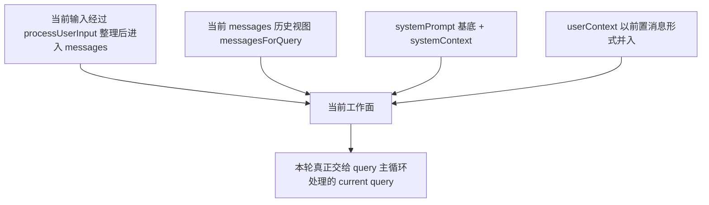
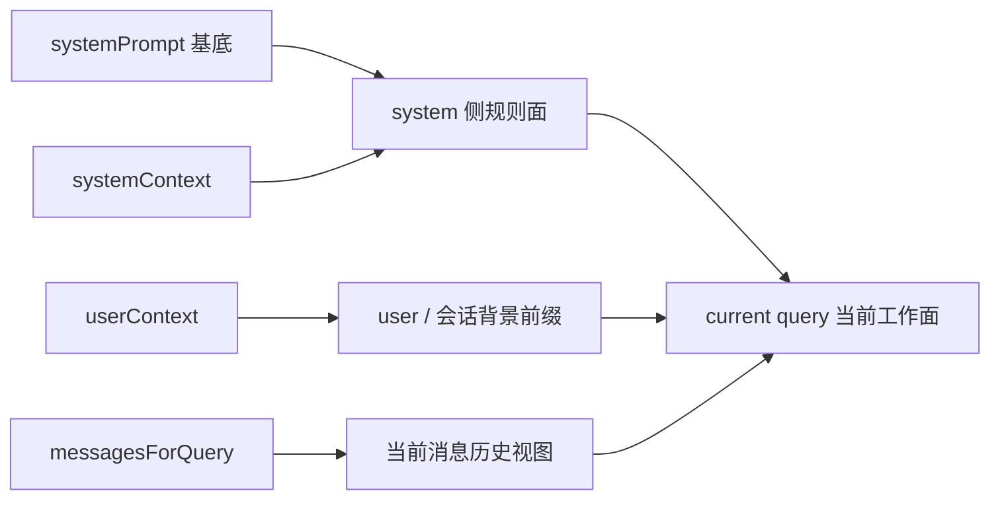

# 04｜当前 query 是怎么被组织起来的

到了这一篇，卷二要往前再推半步。

上一篇解决的是：一条请求怎样正式进入 QueryEngine。可请求一旦进来，读者紧接着会遇到另一个更容易混淆的问题：**系统现在面对的，到底还是“用户刚发来的那句话”，还是别的什么东西？**

这篇要回答的，就是这个问题。

先把核心判断立住：**当前 query 不是一段单独文本，而是带着上下文、messages 和系统约束形成的当前工作面。**

这里的“当前工作面”，不是一个修辞说法，而是卷二必须立住的中间层。因为从 `QueryEngine.submitMessage(...)` 往下走，Claude Code 真正送进主循环的，至少同时带着四类材料：

- 当前可用的 messages 视图
- 当前 system prompt 与 system context
- 当前 userContext
- 当前输入归位进消息流后的结果

只有把这层讲清，后一篇“系统怎么决定这一轮要不要调用能力”才不会显得像平地起跳。因为能力决策并不是对一句话做出的，而是对**当前工作面**做出的。

边界也先说清：

- 这篇不抢第 03 篇的正式入口职责
- 不抢第 05 篇的行动决策职责
- 不深挖 compact / restore / 长期上下文治理
- 不把 prompt、message、UI overlay 各自写成独立组件百科

这篇只做一件事：让你看清，**当请求已经进入 QueryEngine 之后，Claude Code 当前到底在面对什么。**

---

## 先看总图：当前 query 不是一句话，而是一块被装配好的工作面

如果把这一层压成一张图，Claude Code 当前面对的大致是下面这个结构：

这张图最重要的一点是：**current query 不是输入框里那一句话，而是这一轮真正交给系统处理的工作面。**

换句话说，用户看到的是一句输入；运行时接住的，是一块已经按位置组织过的材料组合。

---

## 第一步：请求进入 QueryEngine 后，先被放进持续存在的消息面里

从 `cc/src/QueryEngine.ts` 看，`submitMessage(...)` 处理当前请求时，最重要的背景之一，是 QueryEngine 手里已经持有一份会话级的 `mutableMessages`。

这意味着当前请求不是在真空里开始的。它一进来，就会被放进一条已经活着的消息链里：

- 之前的 user / assistant 消息还在
- 之前的 tool result 轨迹可能还在
- 之前的 compact boundary 之后那段可用历史还在
- 当前输入经 `processUserInput(...)` 整理后，也会被 push 进这份消息状态

所以，这里第一个必须改掉的误解是：**当前 query 不是“当前这句话”，而是“当前这句话落进现有消息面之后形成的本轮工作面”。**

这也是卷二为什么必须用“当前工作面”这个词，而不是只说“当前 prompt”。这里真正被组织起来的，不只是 prompt，还有这轮仍然有效的消息历史。

---

## 第二步：系统先取的不是一个 prompt，而是三块上下文材料

`submitMessage(...)` 里有一步非常关键：

- `fetchSystemPromptParts(...)`

这个函数从 `cc/src/utils/queryContext.ts` 拉回来的，不是一个完整 prompt 字符串，而是三块材料：

- `defaultSystemPrompt`
- `userContext`
- `systemContext`

这件事非常说明问题。

它说明 Claude Code 从一开始就没有把“当前 query”理解成一句输入配一段大 prompt；它先把会进入本轮工作面的不同语义层拆开拿出来，再决定后面怎么装配。

更准确地说：

- `defaultSystemPrompt` 提供规则层底稿
- `userContext` 提供当前用户 / 会话背景
- `systemContext` 提供本轮系统侧补充信息

所以这里最该记住的是：**current query 不是 message history，也不是 system prompt 单独一层，而是这些层共同构成的本轮工作面。**

---

## 第三步：`systemPrompt` 先被组出基底，但这还不是全部工作面

在 `QueryEngine.ts` 里，拿到 `defaultSystemPrompt` 之后，系统会继续把它和下面这些材料拼起来：

- `customSystemPrompt`（如果有）
- memory mechanics prompt（特定条件下）
- `appendSystemPrompt`（如果有）

然后通过 `asSystemPrompt([...])` 形成这一轮的 `systemPrompt` 基底。

这一步很关键，因为它说明：**当前 query 的规则层不是临时写一句“你是某某助手”就完了，而是明确存在一个本轮可用的系统规则底稿。**

再结合 `cc/src/constants/prompts.ts`，可以进一步看见这个规则层里面装的东西并不轻：

- Claude Code 的工作方式
- 工具使用边界
- 输出风格与行为约束
- 环境信息与工作目录
- 某些 session-specific guidance
- 以及 `enhanceSystemPromptWithEnvDetails(...)` 这类补强信息

所以这里最好记住一句话：**当前 query 的底座不是当前输入，而是当前规则环境。**

这也解释了为什么第 04 篇必须先于第 05 篇。因为系统是否做出行动决策，首先取决于它站在什么规则环境和消息环境上看当前问题。

---

## 第四步：`systemContext` 不是另一个大 prompt，而是本轮系统补充层

读源码时，一个很容易被忽略、但对理解 current query 很关键的细节在 `cc/src/query.ts`：

- `appendSystemContext(systemPrompt, systemContext)`

这行代码的含义很直接：本轮真正送给模型的 system 侧材料，不只是 QueryEngine 先组好的 `systemPrompt`，还会在 query 阶段再追加 `systemContext`。

这说明 `systemContext` 的语义位置，并不等于规则底稿本身。它更像：**在这轮工作面真正形成前，再补上一层系统侧说明。**

所以 current query 的 system 侧，至少可以拆成两层看：

1. 比较稳定的 system prompt 基底
2. 针对本轮附着上去的 system context

这层区分很重要。因为它让读者知道：Claude Code 组织当前 query 时，不是把所有内容提前糊成一团，而是保留了“底层规则”和“本轮补充”的差别。

---

## 第五步：`userContext` 不进 system 层，而是以前置消息形式进入当前工作面

同样是在 `cc/src/query.ts`，还有另一行非常关键：

- `messages: prependUserContext(messagesForQuery, userContext)`

这行代码直接说明，`userContext` 的进入方式和 `systemContext` 不一样。

- `systemContext` 是 append 到 system prompt 一侧
- `userContext` 是 prepend 到 messages 一侧

这不是实现小差别，而是 current query 的核心组织原则之一。它等于在告诉你：**Claude Code 认为“当前用户 / 会话背景”更适合作为消息面的前置背景，而不是系统规则的一部分。**

因此，如果把本轮工作面更精确地拆开，可以得到这样一个结构：

到这里，current query 的“工作面”含义就比“上下文很多”具体得多了：

- system 侧给规则
- userContext 给背景
- messagesForQuery 给当前可用历史

这三块一起，才是系统此刻真正面对的问题现场。

---

## 第六步：`messagesForQuery` 也不是完整 transcript，而是本轮可用历史视图

如果只看到 `messages` 这个词，读者很容易自然地把它理解成“到目前为止所有消息”。但 `query.ts` 很清楚地表明，本轮真正进入模型处理的不是原始 `messages`，而是：

- `messagesForQuery`

而这个 `messagesForQuery` 在进入调用前，会经历一系列整理动作，比如：

- `getMessagesAfterCompactBoundary(messages)`
- `applyToolResultBudget(...)`
- `snipCompactIfNeeded(...)`
- `microcompact(...)`
- `contextCollapse.applyCollapsesIfNeeded(...)`
- 以及后续的 `autocompact(...)`

这一步对本文尤其重要，因为它决定了 current query 里的“当前 messages”到底是什么意思。

更准确地说，它不是“会话全部历史”，而是**在当前这一轮仍然被保留、可供继续工作的消息视图**。因此，current query 的消息面不是静态存档，而是一块经过裁剪与投影的当前工作历史。

这正好也帮这篇守住与卷四的边界：

- 这篇只需要让读者知道，当前工作面里的 messages 已经是整理后的可用视图
- 不需要在这里深挖长期上下文治理、压缩恢复策略和更长时段的状态保持

---

## 第七步：当前输入会进入消息流，但不会以“裸文本”形态单独支配这一轮

回到 QueryEngine 入口，`processUserInput(...)` 的作用，在这一篇里可以重新理解一遍。

它的重要性不只是“处理 slash command、attachment、普通文本”，更重要的是：**它决定当前输入以什么形态进入当前工作面。**

在 `submitMessage(...)` 里，`processUserInput(...)` 返回的 `messagesFromUserInput` 会被 push 进 `mutableMessages`，然后后续 query 才基于这条更新后的消息链继续往下走。

这意味着：

- 当前输入不是悬空的一句话
- 它要先被整理成消息层的一部分
- 然后才和前面说的 system 侧、context 侧一起形成 current query

所以“当前 query 不是一次裸提问”这句话，不只是概念判断，而是直接对应源码时序的：**先把输入归位进消息面，再让整个工作面成形。**

这也正是它与第 02 篇的分工：第 02 篇讲“输入在进入运行时前经历了什么”，第 04 篇讲“输入一旦已经进入运行时，它在当前工作面里处在什么位置”。

---

## 第八步：有些与 prompt 相关的东西其实只属于 UI 组织，不属于当前 query 本体

这篇还有一个边界特别值得顺手讲清，不然很容易把“界面上围着 prompt 转的东西”全都误算进 current query。

`cc/src/context/promptOverlayContext.tsx` 管的是 prompt overlay：

- slash-command suggestion data
- dialog node
- 以及它们怎样浮在 prompt 上方显示

这类结构的作用，是组织交互界面，而不是组织模型本轮要处理的 current query。它解决的是“用户在输入框附近看到什么”，不是“模型此刻实际拿到什么”。

同样，`cc/src/services/PromptSuggestion/promptSuggestion.ts` 里的 prompt suggestion，也是在预测用户下一步可能会输入什么，并在合适条件下展示建议。它的核心逻辑是：

- 当前会话是否允许生成建议
- 最近 assistant 响应是否适合做建议
- 如果适合，就 fork 一次 suggestion generation

这类机制虽然也围绕 prompt 展开，但它服务的是**下一次可能的用户输入**，而不是本轮 current query 的装配本体。

把这一层边界立住很重要。否则很容易把“凡是和 prompt 有关的东西”都误装进 current query，最后文章就会从运行时组织一路滑到 UI 百科。

所以更准确地说：**current query 关注的是运行时当前工作面，不是输入框周围所有相关机制。**

---

## 第九步：把 current query 压成一个稳定模型

如果把前面所有层收起来，可以直接把 current query 记成四块：

1. **规则层**：`systemPrompt`
2. **系统补充层**：`systemContext`
3. **背景层**：`userContext`
4. **当前历史与当前输入层**：`messagesForQuery`，以及刚被归位进消息流的当前输入

把这四块合在一起，才是系统这一轮真正面对的当前工作面。也只有在这个前提下，后面第 05 篇的“当前决策”才成立：系统不是对一句话做决定，而是在这块工作面上形成下一步判断。

---

## 这一步为什么正好通向第 05 篇

到这里，读者应该已经能把卷二前四篇接成一条连续时间线：

1. 输入进入系统前，先经历前处理与归位
2. 请求被正式接入 QueryEngine
3. QueryEngine 把它放进当前会话与规则环境里
4. query 阶段再把 systemPrompt、systemContext、userContext、messagesForQuery 组织成当前工作面

这样，第 05 篇要回答的问题就自然出现了：

> **当当前工作面已经形成之后，系统怎么决定这一轮只是回答，还是要进一步触发能力？**

也就是说，第 04 篇的职责不是讲“决定”，而是讲“决定发生在什么工作面上”。

这个边界必须硬。因为：

- 第 03 篇负责正式入口
- 第 04 篇负责当前工作面
- 第 05 篇才负责行动决策

只要这三篇没有串线，卷二的时间顺序就会非常稳定。

---

## 把这篇压成一句话：当前 query 是被组织出来的当前工作面

如果把全文再压缩一次，我会把这篇的主结论写成下面这句：

> **Claude Code 当前面对的 query，不是单独一条用户输入，而是把 system prompt、system context、user context、当前可用 messages 视图和当前输入归位结果按位置组织之后形成的当前工作面。**

---

## 这篇最值得留下的几个判断

### 判断 1
**当前 query 不是当前这句话，而是当前这句话落进已有消息面之后形成的本轮工作面。**

### 判断 2
**`fetchSystemPromptParts(...)` 说明 Claude Code 一开始拿的是规则层、用户背景层、系统补充层三块材料，而不是一段现成大 prompt。**

### 判断 3
**`systemPrompt` 提供规则底稿，`systemContext` 在 query 阶段追加成系统补充层，两者共同构成当前工作面的 system 侧。**

### 判断 4
**`prependUserContext(messagesForQuery, userContext)` 说明 `userContext` 不属于 system 规则，而属于当前消息面的前置背景。**

### 判断 5
**`messagesForQuery` 不是完整 transcript，而是经过 compact / budget / collapse 等整理后的当前可用历史视图。**

### 判断 6
**prompt overlay 和 prompt suggestion 这类机制服务的是 UI 交互或下一次输入，不等于当前 query 本体。**

### 判断 7
**第 04 篇真正完成的，不是解释 prompt 细节，而是把“当前判断发生在什么工作面上”这件事讲清。**
