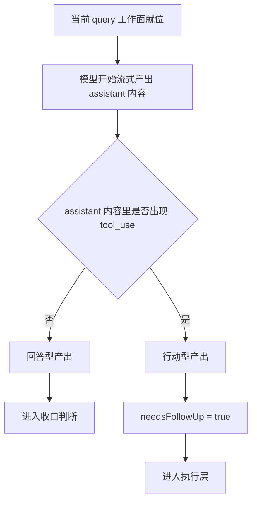

# 卷二 05｜系统怎么决定这一轮要不要调用能力

## 导读

- **所属卷**：卷二：用户输入怎么变成一次完整的 agent turn
- **卷内位置**：05 / 08
- **上一篇**：[卷二 04｜当前 query 是怎么被组织起来的](./04-how-the-current-query-is-organized.md)
- **下一篇**：[卷二 06｜tool use / action 之后，结果怎么重新回到当前 turn](./06-how-results-return-to-the-current-turn.md)

## 这篇要回答的问题

卷二走到这里，主线已经推进到一个关键节点：

- 请求已经进入 `QueryEngine`
- 当前这一轮的工作面已经被组织起来

接下来最关键的问题是：

> **模型什么时候只是继续回答，什么时候会把这一轮切到执行路径？**

这篇要立住的不是“工具系统很多”，而是一个更准确的判断：

> **Claude Code 判断这一轮要不要切到执行路径，不看模型“像不像想做事”，只看 assistant 输出里是否已经出现 runtime 可以接管的 `tool_use` 结构。**

只要这个结构出现，这一轮就不再只是回答，而是已经形成了**当前决策**：下一步该做什么、该把这一轮往执行层推进。

---

## 先给结论

### 结论一：Claude Code 判断是否进入执行层，看的不是抽象意图，而是 assistant 输出里有没有真实出现 `tool_use`

在 `query.ts` 里，系统一边流式接收 assistant 输出，一边扫描其中的内容块。

源码里有一句很关键的注释：

> `stop_reason === 'tool_use' is unreliable`

这说明 Claude Code 不把分流判断交给一个供应商字段，而是自己盯住消息内容：

- 如果 assistant message 里出现 `tool_use`
- 就把 `needsFollowUp = true`
- 然后把这轮推进到执行层

也就是说，这里真正的判断标准不是“模型好像想调用工具”，而是：

> **assistant 输出里是否已经形成了可执行的结构化决策。**

### 结论二：所谓“要不要调用能力”，本质上是在区分两类产物

站在主循环视角，assistant 这一轮的产出只有两类：

1. **回答型产出**：没有 `tool_use`，系统进入收口判断
2. **行动型产出**：出现 `tool_use`，系统继续把这一轮推进到执行层

所以这里真正的分流，不是 UI 意义上的“说话还是点按钮”，而是：

> **这一轮产出的到底是一个可以收口的回答，还是一个必须继续推进的当前决策。**

### 结论三：`tool_use` 不是执行本身，而是“当前决策已经足够明确，可以交给 runtime 继续处理”

这点必须说准。

`tool_use` 不等于动作已经发生，它表示的是：

- 模型没有停在泛泛建议
- 当前判断已经被表达成结构化动作意图
- runtime 可以接手，把它继续压到执行层

所以卷二在这里真正要建立的对象，不是“工具调用”本身，而是：

> **当前决策已经成形。**

---

## 先看这条分流线

### 图 1：直接回答 vs 触发能力 的决策分流图

这张图最该记住的，不是 `tool_use` 这个术语，而是这条分流：

> **当前这一轮先看 assistant 产出是不是已经变成“要继续做事”的决策；如果是，主循环就不能收口。**

---

## 关键点一：Claude Code 不相信“像是结束了”，只相信消息里有没有形成可接管的动作结构

在流式采样过程中，`query.ts` 会持续做两件事：

- 收集 `assistantMessages`
- 提取其中的 `tool_use` block

只要某条 assistant message 里出现 `tool_use`：

- `toolUseBlocks.push(...)`
- `needsFollowUp = true`

这意味着系统并不是等模型整轮说完，再模糊判断“这轮是不是大概需要工具”。

它是在流式过程中就确认：

> **assistant 已经不只是继续解释，而是在发出下一步行动指令。**

这也是为什么这里必须盯消息内容，而不是依赖 `stop_reason`。

因为 Claude Code 真正关心的不是“API 报了什么结束原因”，而是：

> **当前 assistant 输出有没有把工作正式委托出去。**

---

## 关键点二：一旦出现 `tool_use`，这一轮就不能按“回答完了”处理

这一点是卷二里最关键的分水岭之一。

流式采样结束后，系统先看 `needsFollowUp`：

- 如果是 **false**，才进入收口判断
- 如果是 **true**，就进入执行与结果回流链路

也就是说，Claude Code 判断这一轮能不能先收住，看的不是：

- assistant 已经说了多少话
- 这段话听起来像不像一个完整回答

而是：

- assistant 有没有在这一轮里发出 `tool_use`

只要已经发出，这轮就还没结束。

因为这说明当前工作还处在：

> **决策已经形成，但现实动作还没完成。**

这也解释了为什么卷三不会平地冒出来。

执行层不是附加功能，而是这一轮已经被 `tool_use` 推出去之后，主循环必然要走的后半段。

---

## 关键点三：`tool_use` 的价值，不是“会调工具”，而是把回答和行动决策分开了

如果把这里简单说成“模型有时会调用工具”，其实还不够。

更准确的说法是：

> **`tool_use` 把“继续解释”与“继续推进”区分开了。**

没有 `tool_use` 时，这一轮仍然停留在回答路径。
出现 `tool_use` 时，这一轮就已经从自然语言解释跨进了结构化动作意图。

这也是为什么 `tool_use` 在卷二这么重要。

它不是因为“工具厉害”，而是因为它让主循环第一次明确暴露出一个判断结果：

- 现在该收口
- 还是现在该继续做事

从这个角度看，`tool_use` 最重要的意义不是执行接口，而是：

> **当前决策已经可以被系统无歧义地识别出来。**

---

## 这一篇真正建立的对象：当前决策

如果把这篇只理解成“工具调用篇”，就会写窄。

这一篇真正要建立的是：

> **当前决策。**

因为这里决定的不只是“要不要调一个工具”，而是：

- 这一轮到这里能不能先收住
- 这一轮是不是还要继续向现实动作推进

`tool_use` 只是当前决策最清晰的一种外显形式。

所以这一篇最硬的判断，应该落在这里：

> **Claude Code 的关键产出不只是答案，而是“下一步是否继续、往哪里继续”的当前决策；当这个决策以 `tool_use` 形式出现时，主循环就会切到执行路径。**

---

## 和前后文的边界

### 它承接第 04 篇

第 04 篇讲的是：当前 query 为什么不是裸问题，而是一个已经组织起来的工作面。

这篇继续回答：

- 既然这个工作面已经形成
- 那系统怎么从中得出“回答”还是“继续做事”的当前判断

所以 04 讲**工作面**，05 讲**工作面产出的当前决策**。

### 它给第 06 篇铺路

第 06 篇会接着讲：

- 一旦进入执行层，结果怎么重新回到当前 turn

这篇只把前提立住：

> **为什么系统会被推进到那一步。**

### 它不抢第 07 篇的主题

这一篇不展开讨论“什么时候真正收口”。

我们这里只讲：

- 什么情况会从回答路径切到执行路径
- 为什么 `tool_use` 说明当前决策已经成形

至于结果回流之后，这一轮为什么继续、为什么停，尤其是 stop hooks、恢复分支、budget 等收口判定，那是第 07 篇再讲的事。

---

## 一句话收口

> **Claude Code 并不是默认调用能力，而是在每一轮 assistant 产出中先判断：当前结果究竟只是回答，还是已经形成了 runtime 可以接管的 `tool_use` 决策；只有后者出现时，主循环才会把这一轮推进到执行层。**

---

## 这篇最值得记住的几个判断

### 判断 1
**Claude Code 判断这一轮要不要继续，不依赖抽象 `stop_reason`，而依赖 assistant 输出里是否真实出现了 `tool_use`。**

### 判断 2
**`tool_use` 不是执行本身，而是当前决策已经被表达成 runtime 可以接住的结构化形式。**

### 判断 3
**一旦 `needsFollowUp = true`，这一轮就不能按“回答完了”处理，而必须进入执行与结果回流链路。**

### 判断 4
**工具 prompt 不只是在教模型怎么用工具，也在塑造“什么时候该调用能力、什么时候应该直接回答”的边界。**

### 判断 5
**这一篇真正建立的对象不是“工具调用”本身，而是主循环里的“当前决策”。它是卷二走向执行层的分水岭。**
