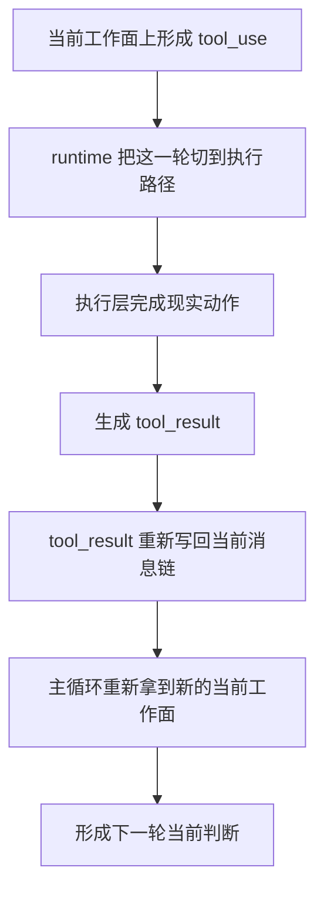

# 卷二 06｜tool use / action 之后，结果怎么重新回到当前 turn

## 这篇要回答的问题

第 05 篇已经把一个关键分水岭讲清了：

- 当前工作面已经形成
- assistant 不一定只产出回答
- 一旦出现 `tool_use`，这一轮就会从回答路径切到执行路径

但到这里还差一个更关键的问题：

> **为什么 Claude Code 不是调用一次能力就结束，而是要让执行结果重新回到当前 turn，成为下一步判断的输入？**

如果这里没讲清，读者很容易把主循环想成这样：

- 模型决定做事
- tool 跑一下
- 系统拿到结果
- 这一轮差不多就完了

这还是线性的，不是闭环的。

这篇真正要立住的判断是：

> **Claude Code 的闭环关键不在“调用过能力”，而在“执行结果重新进入当前 turn，成为下一步判断的输入”。**

也就是说，`tool_use` 只是把这一轮推出去；`tool_result` 真正做的，是把这一轮再接回来。

---

## 先给最小模型

把这一层压到最短，其实只有五步：

1. assistant 发出 `tool_use`
2. runtime 把动作执行掉
3. 执行结果被包装成 `tool_result`
4. `tool_result` 被写回当前消息链
5. 下一轮当前判断读到这份新结果

这里真正关键的，不是第 2 步“动作发生了”，而是第 4 步“结果回来了”。

因为在 `QueryEngine` 里，turn 的连续性依赖的是持续累积的消息状态。`submitMessage(...)` 开头就明确说明：同一个 conversation 会跨 turn 保留 `messages`、file cache、usage 等状态。

所以 Claude Code 让结果回到当前 turn 的方式，不是把返回值偷偷记在别处，而是把它重新写回消息序列。

再往下压一句：

> **执行完成，只代表外部动作有了结果；结果写回 messages，才代表当前 turn 重新拿回了这份结果。**

这也是为什么 `utils/messages.ts` 会把两类对象分得很清楚：

- `tool_use` 是 assistant message 里的动作表达
- `tool_result` 是回到消息链里的结果块

一旦结果以 `tool_result` 的形式回到这条链里，它就不再只是执行日志，而是下一轮当前判断可以直接消费的新输入。

---

## 先看这条最小闭环

### 图 1：`tool_use -> execution -> tool_result -> turn continuation`



这张图里最重要的不是 `tool_result` 这个名字，而是中间那一跳：

> **结果必须重新写回当前消息链，这一轮才真正回到了主循环。**

所以第 05 篇和这篇之间的硬分界，可以压成一句话：

- 第 05 篇解释：为什么这一轮会被推出去做事
- 这篇解释：做完之后，这一轮怎么被重新接回来

---

## 关键点一：回流的对象不是“底层返回值”，而是可进入消息协议的结果块

Claude Code 不是直接把某个 JavaScript 返回值塞回模型。

它中间先做了一层协议转换。

在 `utils/messages.ts` 里，工具结果最终会被组织成 `tool_result` 相关内容；例如 `createToolResultStopMessage(...)` 会明确构造：

```ts
{
  type: 'tool_result',
  content: ...,
  is_error: true,
  tool_use_id: toolUseID,
}
```

而普通工具结果在 `createToolResultMessage(...)` 里，也会先经过 `mapToolResultToToolResultBlockParam(...)`，再被包装成 user message。

这里真正关键的是：

> **Claude Code 回流的不是任意内部对象，而是已经被翻译成消息协议里的结果块。**

为什么这一步重要？

因为主循环后面消费的，不是底层执行器私有结构，而是消息。

只有先变成消息协议的一部分，这份结果才能继续进入当前 turn。

---

## 关键点二：结果回流时，系统会非常在意 `tool_use` 和 `tool_result` 的配对关系

如果结果回流只是“记一笔日志”，Claude Code 就不需要这么在意结构完整性。

但 `utils/messages.ts` 里专门有一个函数：`ensureToolResultPairing(...)`。

它做的事非常说明问题：

- 检查 `tool_use` 有没有对应的 `tool_result`
- 修补缺失配对
- 在严格模式下，配对出错甚至直接报错，而不是假装这轮还能正常继续

这背后的逻辑很直接：

> **如果 `tool_use` 和 `tool_result` 配不起来，当前 turn 的闭环就断了。**

因为主循环需要知道：

- 刚才到底发起了哪个动作
- 现在返回的是哪个动作的结果
- 这份结果应该接回哪一段工作链

所以这里不是“结果回来就行”，而是：

> **结果必须作为某次已发起动作的已知返回，被准确接回当前 turn。**

这也解释了为什么源码里会反复围绕 `tool_use_id` 做关联。

---

## 关键点三：结果一旦写回消息链，当前工作面就变了

`QueryEngine` 在处理消息流时，会持续把 assistant / user / progress / attachment 等消息推入 `mutableMessages`。

表面看这是记录历史，实际更重要的作用是：它定义了下一轮看到的当前工作面。

所以只要 `tool_result` 已经被写回这条消息链，下一轮 query 面对的就不再是旧问题，而是**带着新结果的当前工作面**。

这篇到这里就够了：

> **结果回流之后，主循环重新获得了下一轮当前判断所需的新输入。**

第 05 篇负责解释为什么这一轮会被推出去做事；这篇只负责解释做完之后怎样接回来。至于拿到结果以后什么时候收住，那留给第 07 篇。

---

## 图 2：结果回流主循环示意图


这张图最重要的，是中间这一跳：

> **结果回流的作用，不是追加一段执行记录，而是更新当前工作面。**

没有这一步，执行层和主循环之间就只是一次松散调用；有了这一步，Claude Code 才形成真正的动态闭环。

---

## 一句话收口

> Claude Code 的关键不只是发起 `tool_use`，而是把执行得到的 `tool_result` 重新写回当前消息链，让主循环拿回新的现实结果，并据此形成下一轮当前判断。结果回流不是附属细节，而是当前 turn 能继续成立的闭环接口。
