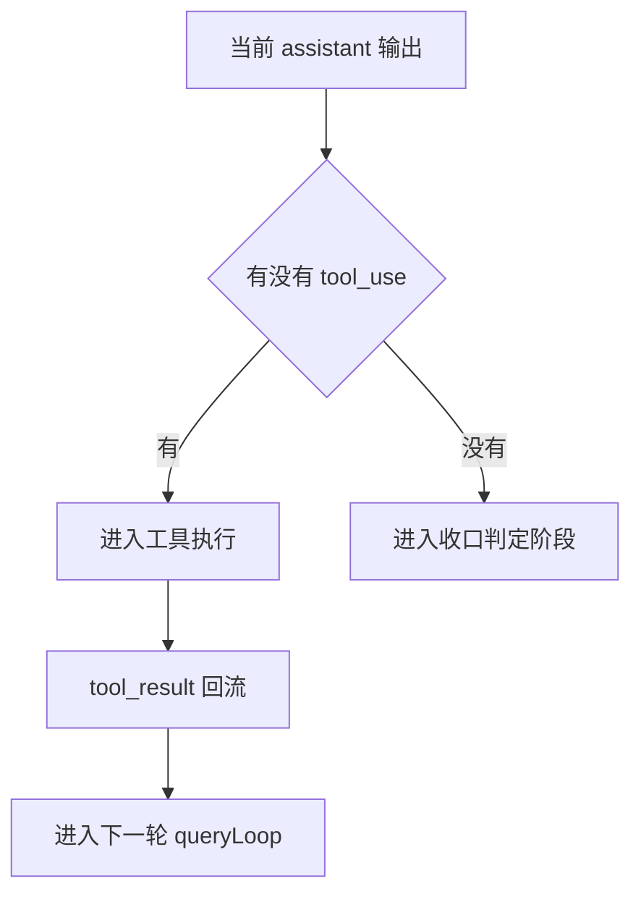
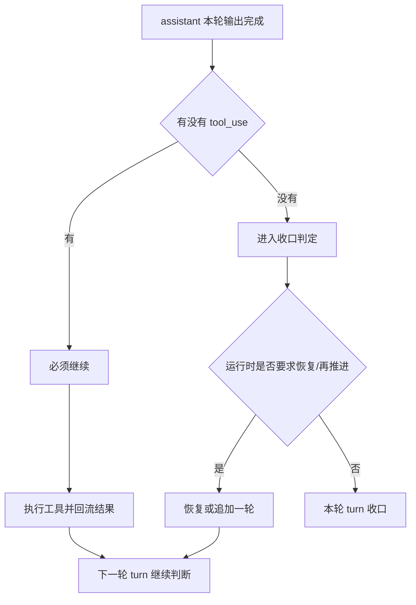

# 卷二 07｜一轮 Agent Turn 什么时候继续，什么时候收口

## 导读

- **所属卷**：卷二：用户输入怎么变成一次完整的 agent turn
- **卷内位置**：07 / 08
- **上一篇**：[卷二 06｜tool use / action 之后，结果怎么重新回到当前 turn](./06-how-results-return-to-the-current-turn.md)
- **下一篇**：[卷二 08｜把整条主循环重新压成一张稳定运行图](./08-stable-main-loop-map.md)

到第 6 篇为止，卷二已经把一条关键动态线拉出来了：

- 请求进入运行时
- 当前 query 被组织出来
- 模型形成当前判断
- 需要时发起 tool use
- 执行结果再回到当前 turn

但这条线还差最后一个关键问题：

> **结果回来了，为什么有时这一轮会继续，有时又会在这里收口？**

如果这个问题不讲清楚，读者很容易把 agent turn 理解成一种模糊感觉：

- 模型说了点话
- 工具跑了几次
- 差不多就结束

这不够。

Claude Code 里，一轮 turn 的边界不是靠“看起来差不多了”决定的，而是有一套很明确的运行逻辑：

- 只要当前输出还在把工作往后推，这一轮就继续
- 只有当模型不再要求后续动作，而且运行时也同意收口，这一轮才结束

这篇就只回答这个问题。

---

## 先给核心判断

> **Agent turn 的边界不由“说了一句话”决定，而由当前结果是否已经足够收口决定。**

再说得更运行时一点：

> **一轮 turn 会不会继续，首先看这一轮 assistant 输出里有没有把工作继续委托出去；如果没有，再看运行时有没有别的理由要求再来一轮。**

这句话里有两个层次：

1. **第一层是模型侧判断：有没有继续动作。**
2. **第二层是运行时侧判断：现在能不能真正收口。**

卷二里要特别把这两层拆开：

- 第 05 篇负责解释：为什么这一轮会从回答路径切到执行路径
- 这一篇负责解释：已经进入“可收口判定区”之后，运行时为什么有时还要求继续

这两层合在一起，才构成 Claude Code 对 turn 边界的真实定义。

---

## 先把最容易误会的一点拿掉：turn 不是“assistant 回完一条消息”就结束

很多人第一次看这条链，直觉会是：

- assistant 产出了一条消息
- 这条消息显示给用户
- 这一轮结束

但源码里的主循环根本不是按这个边界设计的。

在 `query.ts` 里，真正驱动整轮逻辑的是 `queryLoop(...)`。它每次拿到一轮 assistant 输出后，先做的不是“准备结束”，而是先判断：

- 这轮输出里有没有 `tool_use`
- 如果有，说明这一轮并没有完成，只是把工作推进到了执行阶段

源码里甚至明确写了：

- `stop_reason === 'tool_use' is unreliable`

也就是说，Claude Code 不把“这一轮该不该继续”寄托在 API 回的一个漂亮字段上，而是自己根据消息内容判断。

这件事很关键。

因为它说明 Claude Code 关心的不是：

- API 说没说停

而是：

- **当前 assistant 输出有没有把这轮工作继续往后推。**

只要还在往后推，就不能算收口。

---

## 一轮 turn 的第一道边界：assistant 有没有产出 `tool_use`

在 `query.ts` 里，这个判断非常直接。

主循环在流式读取模型输出时，会维护两个关键量：

- `toolUseBlocks`
- `needsFollowUp`

只要看到 `tool_use` block 出现，就会把：

- `needsFollowUp = true`

立起来。

这意味着 Claude Code 对“继续”的第一定义非常朴素：

> **如果 assistant 已经发起 tool use，这一轮就还没结束。**

为什么？因为这个时候 assistant 给出的还不是最终收口结果，而是：

- “去做这件事”
- “把结果拿回来”
- “我再根据结果继续判断”

这是一种中间态，不是终态。

可以先把这条最小逻辑画出来：

这张图想说明的不是工具怎么执行，而是：

> **tool use 的出现，本质上是在宣布：这一轮还要继续。**

所以 turn 的第一道边界，不在“说完”，而在“有没有把工作继续委托出去”。

---

## 为什么 tool result 回来之后，通常还要再进一轮

第 6 篇已经讲过，tool result 的意义不是“工具执行过了”，而是“执行结果重新回到当前 turn”。

但这一步的真正含义，到这一篇才完整。

因为结果回流之后，系统还不能直接把它当成终点。它还得再问一次：

- 这个结果是不是已经足够形成最终收口
- 还是这个结果只够支持下一步动作

所以 `tool_use -> execution -> tool_result` 这一段，本质上只是把主循环送回新的判断点。

源码里也正是这么做的：

- 先执行工具
- 再把 `assistantMessages`、`toolResults`、各种 attachment 重新拼回 `state.messages`
- 然后 `turnCount + 1`
- 再进入下一轮 `queryLoop`

这里最容易记住的一句话是：

> **tool result 不是 turn 的终点，而是 turn 继续判断的下一轮输入。**

这也是为什么有些人会误以为“一次工具调用就是一次 turn”，但实际上不是。

在 Claude Code 里，一轮 turn 的边界更接近：

- 当前工作是否已经闭合

而不是：

- 当前是否已经做过一次动作

---

## 所以真正的问题不是“有没有输出”，而是“当前工作闭合了没有”

把整条主循环压成一句话，其实就是：

> **现在这个结果，够不够把当前回合收住？**

如果不够，就继续。

最常见的两类“不够”是：

### 1. 模型已经发起了后续动作
这时 assistant 给出的不是终点，而是中间委托：

- 先去做
- 再把结果拿回来
- 然后继续判断

### 2. 结果回来了，但它还只是中间结果
比如：

- 查到了文件，但还没改
- 跑了命令，但还没归纳
- 读到了信息，但还没形成最终答复

这时候 `tool_result` 回流，只是把系统送回新的判断点，还不等于这轮已经闭合。

但这里还要再补一层：

- **即使这轮已经没有 `tool_use`，也不代表立刻结束。**

因为运行时还要做最后一轮收口检查。

---

## 第二道边界：没有 `tool_use` 之后，也不是立刻收口

这是理解 turn 边界最容易漏掉的一层。

在 `query.ts` 里，真正的大分叉是：

- `if (!needsFollowUp) { ... }`

但注意，这个分支的含义不是：

- “这一轮结束了”

而是：

- **“现在终于有资格进入收口判定阶段了。”**

这两个意思差很多。

进入这个分支以后，系统还会继续检查很多事情，例如：

- prompt-too-long 的恢复
- media size error 的恢复
- max output tokens 的恢复
- stop hooks 是否阻止继续
- token budget 是否建议再推进一轮

也就是说，Claude Code 真正的 stop 逻辑，不是单一条件，而是两级判断：

1. **assistant 这轮有没有发起后续动作**
2. **运行时后处理是否允许在这里收口**

把这层补上之后，turn 的边界才真正完整。

---

## `continue / stop` 的真实结构，其实更像一张两级决策图

这张图就是这一篇最想留给读者的主图之一。

它把两个非常容易混在一起的问题拆开了：

- **模型层面要不要继续**
- **运行时层面能不能结束**

只有这两关都过了，turn 才真的停下。

---

## 那么，运行时为什么会在“没有 tool use”之后还继续一轮

这一层不要展开成实现细节大全，但有几个关键原因必须立住。

### 一种情况：这轮不是任务完成，只是输出被截断了

在 `query.ts` 里，如果命中了 `max_output_tokens`，系统不会立刻把这轮当成结束。

它会先尝试两种恢复：

1. 如果当前还是默认上限，先把 `maxOutputTokensOverride` 提高后重试
2. 如果还是不够，就追加一条恢复消息，让模型直接续写

这说明 Claude Code 对“收口”的理解不是：

- 模型这次停了，所以结束

而是：

- **模型是不是已经把当前工作真正说完。**

如果没有，那就继续。

所以这里的 continue，本质上是在修复“形式上停了，但内容上没收完”的情况。

### 另一种情况：上下文或媒体问题是可恢复的

比如 prompt 太长、媒体太大，系统会优先尝试：

- context collapse
- reactive compact
- strip-retry

也就是说，这种 continue 不是任务逻辑上的继续，而是运行条件上的恢复。

它要先把这轮 turn 从“跑不动”修回“能继续跑”。

### 还有一种情况：stop hook 明确要求别在这里停

在没有 `needsFollowUp` 之后，系统还会跑 `handleStopHooks(...)`。

而 stop hook 的结果可能出现两种很关键的影响：

- `preventContinuation`：直接阻止后续继续
- `blockingErrors`：把阻塞信息塞回消息流，再来一轮

这个设计很说明问题。

它意味着 Claude Code 认为：

> **“模型没再叫工具”还不够，系统级约束也必须认可这次可以结束。**

如果系统级检查认为还不行，这一轮仍然会被重新送回主循环。

---

## stop hook 让 turn 的终点从“模型终点”变成“运行时终点”

如果没有 stop hooks，这条边界可以粗略理解成：

- 模型不再调用工具，这轮大致就结束

但有了 stop hooks 以后，条件就变成：

- 模型不再调用工具
- 而且收尾检查也没有要求继续

于是 turn 的终点不再只是模型自己的停点，而是整个 runtime 认可的停点。

> **一轮 agent turn 的终点，不是模型停下的地方，而是模型与运行时共同认可可以收口的地方。**

---

## 还有一个很容易忽略的边界：有些 turn 会以“纯 tool_result 状态”被视为成功

这个点在 `utils/queryHelpers.ts` 的 `isResultSuccessful(...)` 里写得很清楚。

它把成功结果分成几类：

- 最后一个消息是 assistant，且末尾是 `text / thinking / redacted_thinking`
- 最后一个消息是 user，但内容全是 `tool_result`
- 或者 API 已经以 `end_turn` 完成，即便没真正吐出 assistant 文本

这说明 Claude Code 对“成功收口”的定义，本来就不是“最后必须有一段漂亮的人类文字”。

它更在意的是：

- **这轮回合有没有完成到一个可以接受的终态。**

比如有些 drain turn、通知 turn，模型其实判断“没必要再说什么”，但整个回合依然是成功的。

这点很重要，因为它再次提醒我们：

> **turn 的边界是运行态意义上的边界，不是展示层意义上的边界。**

用户看到一句自然语言，当然常常意味着结束；但在运行时里，结束的判定更底层，也更工程化。

---

## 从读者视角，最该留下的不是分支细节，而是这三个层次

讲到这里，最重要的不是把所有恢复分支背下来，而是留下一个稳定模型。

### 第一层：`tool_use` 是“继续”的首要信号

只要 assistant 发起了工具调用，这一轮通常就还没结束。

### 第二层：`tool_result` 不是终点，而是把这一轮送回新的判断点

结果回流后，模型还要重新判断现在能不能收口。

### 第三层：没有 `tool_use` 也不代表立刻结束

因为运行时还要检查：

- 输出是不是被截断
- 上下文是不是需要恢复
- stop hook 是否阻止结束
- token budget 是否建议继续推进

把这三层合起来，才是 Claude Code 对 turn 边界的完整理解。

---

## 用一句更卷二化的话重说一遍

卷二一直在回答的是：

> **用户输入怎么变成一次完整的 agent turn？**

这一篇给这个问题补上的最后一块就是：

> **一次完整的 agent turn，不是“做过一次输出”就算完成，而是要一直推进到当前工作真正收口为止。**

所以从时间顺序看，卷二的动态线现在可以连成这样：

1. 用户输入被整理后进入运行时
2. 请求进入 QueryEngine 主循环
3. 当前 query 被组织成这一轮的工作面
4. 模型形成当前判断
5. 需要时发起 tool use
6. 执行结果回流当前 turn
7. 系统再判断：继续，还是收口

到这里，读者应该已经能回答一个很关键的问题：

- 为什么 Claude Code 不是“回一句话”的系统，而是“推进一轮回合”的系统

因为它真正维护的，一直都是：

- 当前回合还是否未闭合

而不是：

- 当前回复是否已经显示出来

---

## 这一篇最值得记住的几个判断

### 判断 1
**Agent turn 的边界不由“assistant 说完一句话”决定，而由当前工作是否已经收口决定。**

### 判断 2
**`tool_use` 的出现，是这一轮必须继续的首要信号。**

### 判断 3
**`tool_result` 回流之后，系统通常还要再进一轮，因为结果只是新的判断输入，不天然等于终点。**

### 判断 4
**即使没有 `tool_use`，运行时也还要经过恢复、hook、budget 等后处理，才会真正允许这一轮结束。**

### 判断 5
**一轮 turn 的真正终点，是模型与运行时共同认可可以收口的地方。**

---

## 一句话收口

> Claude Code 里，一轮 agent turn 什么时候继续、什么时候结束，关键不在“模型这次有没有说完”，而在“当前结果是否已经足够收口”。有 `tool_use` 就说明工作还在往后推；没有 `tool_use` 之后，还要看运行时是否允许真正结束。只有当继续动作消失、收尾检查也通过时，这一轮 turn 才算收住。
