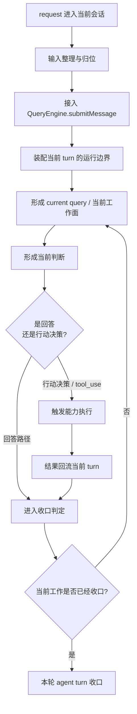

# 卷二 08｜把整条主循环重新压成一张稳定运行图

## 导读

- **所属卷**：卷二：用户输入怎么变成一次完整的 agent turn
- **卷内位置**：08 / 08
- **上一篇**：[卷二 07｜一轮 Agent Turn 什么时候继续，什么时候收口](./07-when-an-agent-turn-continues-or-stops.md)
- **下一卷方向**：卷三会继续解释执行能力层如何真正落地；卷四会继续解释上下文与状态如何让主循环长期成立

走到这一篇，卷二前七篇其实已经把整条动态主线拆开了：

- request 不是裸文本，而是将要被接入当前运行时的一次请求
- 请求不会直接撞进模型，而会先进入 `QueryEngine.submitMessage(...)`
- 当前这一轮真正处理的不是一句话，而是一个 current query / 当前工作面
- assistant 的关键产出不只是回答，还可能是把这一轮推进出去的当前决策
- 一旦出现 `tool_use`，能力执行结果还要回流当前 turn
- 结果回来之后，系统还要继续判断这一轮是继续还是收口

但如果文章只拆到这里，读者脑子里仍然可能只留下几段局部链路，而没有留下整张稳定图。

所以这一篇只做一件事：

> **把卷二真正建立的主循环，重新压成一张稳定运行图。**

它不是再重讲前七篇，也不是替卷首重写总起。它要完成的是卷二的收束：让读者最后带走一张能复述、能迁移、也能自然接到卷三和卷四的主循环总图。

---

## 先给核心判断

> **卷二真正建立的，不是几段源码链，而是 Claude Code 主循环的稳定运行图：request 如何进入、当前判断如何形成、能力如何被触发、结果如何回流、这一轮又如何继续或收口。**

这句话里最重要的是“稳定运行图”四个字。

因为卷二并不是要让读者记住一堆函数名，而是要让读者最后留下一个更稳的认识：

- Claude Code 不是“收一句话，回一句话”
- 也不是“偶尔会调几个工具”
- 它真正维持的是一条能够持续推进当前 turn 的主循环

只要这张图立住，前七篇就不会散成一堆孤立知识点。

---

## 先把卷二压成主图

这张图里，卷二最想让读者留下的不是某一个节点，而是三件事。

### 第一件事：它是一条时间线

卷二一直强调按时间顺序展开，而不是按组件百科展开，原因就在这里。

这条主线问的始终是：

> **用户输入怎么变成一次完整的 agent turn？**

所以这里的顺序不能乱：

1. 先有 request 被接住
2. 再有当前工作面被组织起来
3. 再有当前判断形成
4. 必要时切到执行路径
5. 结果再回流当前 turn
6. 最后才谈继续还是收口

一旦把顺序改成“先讲 QueryEngine、再讲 tool、再讲 context”，读者很快就会重新掉回组件视角。

### 第二件事：它推进的单位是当前 turn

从界面上看，用户像是在等一句回复；但从运行时角度看，Claude Code 真正推进的是当前 turn。

`QueryEngine.ts` 里那句很关键的注释已经把这个边界说得很明白：

> One QueryEngine per conversation. Each submitMessage() call starts a new turn within the same conversation.

这意味着卷二的主线不是“prompt 进模型”，而是“request 被接成一轮 turn”。后面的 current query、当前判断、结果回流、continue / 收口，都是围绕这一轮展开的。

### 第三件事：它不是单次调用，而是闭环

只要这一轮里出现了 `tool_use`，系统就不会把当前 assistant 输出当成终点，而会把能力执行结果重新接回消息流。

`utils/messages.ts` 里有一句很关键：

> `stop_reason === 'tool_use' is unreliable`

这句话提醒读者一件事：Claude Code 真正依赖的不是供应商回的一个结束字段，而是当前消息里有没有形成需要继续推进的结构化动作表达。

所以主循环不是“模型停了没有”，而是“当前工作闭合了没有”。

---

## 这张稳定图，怎样把前七篇重新收成一个模型

这一篇当然要回收前文，但不用重新把 01-07 逐篇讲一遍。更准确地说，前七篇只是各自钉住了一段必要责任，到了这里才合成一张完整图：

- 02 之前解决的是：request 怎样被整理成可接入运行时的材料
- 03 解决的是：它从哪里正式进入 turn 级入口
- 04 解决的是：系统当前真正面对的工作面是什么
- 05 解决的是：这一轮的当前决策怎样成形
- 06 解决的是：结果怎样回流当前 turn
- 07 解决的是：这一轮什么时候真的允许收口

所以 08 的任务不是目录复盘，而是把这些局部责任重新压成一张可复述的主循环图。

---

## 如果只留一个最稳的阅读模型，应该留什么

卷二读完后，我觉得最该留下的，不是七个局部结论，而是下面这个五步模型：

### 第一步：接入
request 先被整理，再进入 `QueryEngine.submitMessage(...)`，并入当前 conversation 的 turn 级运行面。

### 第二步：成面
系统把当前 messages、规则与上下文压成 current query / 当前工作面。

### 第三步：成判断
assistant 在当前工作面上形成当前判断；它可能是回答，也可能是足以推进执行层的当前决策。

### 第四步：回流
如果这一轮产出了 `tool_use`，能力结果就必须回流当前 turn，成为下一轮判断输入。

### 第五步：收口
系统最后判断当前工作是否已经收口；未收口就继续，已收口才结束这一轮。

把它再压缩一句，就是：

> **接入、成面、成判断、结果回流、收口。**

这五步不是源码函数列表，而是卷二真正留下的稳定模型。

---

## 为什么说这是一张“稳定运行图”

这里还要再多说一句“稳定”是什么意思。

它不是说实现不会变，也不是说所有内部文件都不会调整；它说的是：

> **即便局部实现继续演化，只要 Claude Code 还在以 agent turn 的方式工作，这条主循环的大轮廓就不会轻易消失。**

因为它抓住的不是偶然命名，而是几个更稳的运行责任：

- 谁负责把 request 接入当前 turn
- 谁负责形成当前工作面
- 谁负责产出当前判断
- 谁负责把现实结果接回当前 turn
- 谁负责判断这一轮是否收口

也就是说，这张图比“某个 helper 函数今天叫什么”更稳。

这正是 guidebook 最后应该交给读者的东西：不是记忆负担，而是可复用的认知骨架。

---

## 这张图自然会把读者带去卷三和卷四

卷二收束之后，最自然的问题只会剩下两个，而且它们正好对应下一卷的方向。

### 第一条延伸线：卷三会问，能力执行层到底是怎么真正落地的

卷二已经回答了：

- 主循环会在当前判断成形后切到执行路径
- `tool_use` 会把这一轮推进到能力层
- 结果会再回流当前 turn

但卷二并不展开执行能力层内部是怎么工作的。

所以卷三真正接手的问题是：

> **当主循环已经决定“去做事”之后，这些能力到底怎样被接住、编排、约束和落地？**

这属于执行层内部结构，不属于卷二的主问题。

### 第二条延伸线：卷四会问，这条主循环为什么能长期成立

卷二已经让读者看到：当前工作面不是裸输入，当前 turn 也不是一次性调用。

但如果会话继续拉长，系统为什么还能维持这条主循环？
为什么上下文没有把它拖垮？为什么状态还能继续支撑下一轮？

这时问题就会自然转向：

> **上下文与状态是怎样让这条主循环长期成立的？**

这才是卷四要继续展开的部分。

所以从卷二到后文的关系，不是“下一卷另起炉灶”，而是：

- 卷二先把动态主线立住
- 卷三再进入执行层内部
- 卷四再解释长期持续工作的条件

---

## 卷二最后真正完成了什么

如果现在回头看卷二的总承诺：

> **卷二不是再解释 Claude Code 是什么，而是把“用户输入如何变成一次完整的 agent turn”这条动态主线真正拆开，并重新压成一张稳定运行图。**

那这一篇的任务，其实就是把这个承诺正式收住。

读到这里，读者至少应该已经能稳定回答下面几个问题：

- 为什么 request 进入的不是一次孤立调用，而是当前 turn
- 为什么当前 query 不是一句裸提问，而是一块当前工作面
- 为什么 `tool_use` 代表当前决策已经成形
- 为什么结果回流之后，系统还要继续判断
- 为什么 turn 边界最终取决于当前工作是否已经收口

如果这些问题都能答出来，卷二就没有白写。

因为读者脑子里留下的，不再是一堆零散术语，而是一张能跑起来的主循环图。

---

## 一句话收口

> **卷二最后真正交给读者的，不是若干局部机制的说明书，而是一张稳定运行图：request 被接入当前 turn，系统在当前工作面上形成当前判断，必要时切到能力执行，再把结果回流当前 turn，并持续判断这一轮是继续还是收口。**
