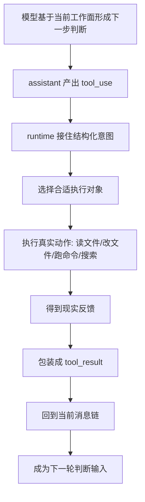
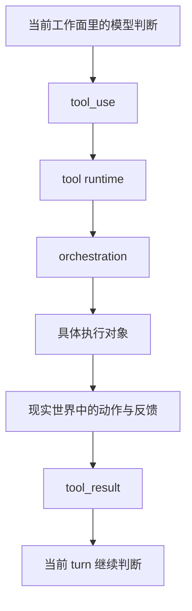

# 卷三 01｜为什么模型意图不能直接变成现实动作

## 导读

- **所属卷**：卷三：工具系统怎么把模型意图落成执行
- **卷内位置**：01 / 11
- **上一篇**：无
- **下一篇**：[卷三 02｜执行主线总图：`tool_use -> orchestration -> execution -> tool_result`](./02-tool-execution-mainline-overview.md)

## 这篇要回答的问题

卷二已经把一个分水岭立住了：assistant 一旦产出 `tool_use`，这一轮就不再只是继续说话，而会切进执行路径。

但卷二停在“何时切换”。卷三要接着回答的是另一层问题：

> **模型既然已经决定要做事，为什么它不能直接把这件事做掉，而必须经过一层 tool runtime？**

如果这里不先讲清，后面的 Tool 抽象、orchestration、本地工具家族，都会被误读成实现细节；读者会以为只是“模型调用了一些函数”，而不是一整层把意图翻译成现实动作的运行时。

这篇要先立住的核心判断是：

> **模型意图本身不是现实动作。Claude Code 必须用 tool runtime，把结构化意图变成可分发、可执行、可回流、可继续判断的现实操作。**

## 先给结论

### 结论一：模型会形成“要做什么”的判断，但不会天然拥有“怎样安全地改现实”的执行资格

模型最擅长的是根据当前工作面形成下一步判断：要读文件、要搜材料、要跑命令、要把结果写回去。

但判断不等于动作。因为现实世界里的动作都带约束：

- 要找对能力对象
- 要按协议组织输入
- 要知道执行结果怎么返回
- 要把失败、缺失、半完成状态重新接回当前 turn

也就是说，模型可以说出“下一步应该做什么”，却不能跳过运行时，直接把一句判断当成已经发生的现实动作。

### 结论二：`tool_use` 的价值，不是让模型直接控制机器，而是把意图压成 runtime 能接手的正式结构

卷二里我们已经见过：Claude Code 不依赖抽象 `stop_reason`，而是看 assistant 内容里是否真的出现 `tool_use`。

这一步之所以关键，就是因为系统不接受“模糊意图”，只接受**可被接管的结构化动作表达**。

所以这里真正的逻辑不是：

- 模型想做事
- 系统于是放权给模型

而是：

- 模型把意图表达成 `tool_use`
- runtime 才接住这个意图
- 再由 runtime 决定怎么把它翻译成现实动作

### 结论三：tool runtime 的存在，不只是为了“执行”，更是为了让执行结果重新成为当前判断的一部分

Claude Code 不是“一次调用、一次返回、一次结束”的线性系统。

真正的闭环是：

1. assistant 形成 `tool_use`
2. runtime 把它分发到合适执行对象
3. 执行对象真的碰现实：文件、命令、搜索、能力发现
4. 结果被包装成 `tool_result`
5. `tool_result` 再回到消息链，成为下一轮判断输入

所以 tool runtime 不是中间的搬运层，而是整条闭环成立的中段结构。

## 为什么模型意图不能直接落成现实动作

### 第一，意图和动作之间隔着“对象选择”

从主循环看，assistant 先产出的是“要做什么”。但 Claude Code 真正要落地时，必须先回答另一件事：

> **这一步该交给哪个执行对象？**

是 BashTool？
是 FileReadTool？
是 GrepTool？
还是 SkillTool / AgentTool 这种更高阶对象？

如果没有这一层，系统就只能让模型自己直接碰现实对象。那样的结果不是更强，而是更散：没有统一入口，也没有统一配对关系，更谈不上把不同能力放到同一条执行链里比较和组织。

### 第二，意图和动作之间隔着“协议翻译”

源码里大量围绕 `tool_use`、`tool_result`、`tool_use_id` 的处理说明了一件事：Claude Code 真正运行的不是“随口一说的动作”，而是协议化动作。

在 `utils/messages.ts` 里：

- `tool_use` 被当成 assistant 侧的动作请求块
- `tool_result` 被当成 user 侧的结果块
- `ensureToolResultPairing(...)` 会专门校验两者配对关系

这说明 Claude Code 关心的不是“有没有大概执行过”，而是：

- 哪个动作被请求了
- 哪个结果属于哪个动作
- 这份结果能不能被下一轮稳定消费

如果模型意图可以直接等于现实动作，这一层协议翻译就不需要存在。恰恰是因为不能直接等于，runtime 才必须存在。

### 第三，意图和动作之间隔着“现实反馈回流”

模型给出的下一步判断，本质上仍然属于当前工作面的内部推断。可一旦动作真的去碰现实，事情就变了：

- 文件可能不存在
- grep 可能命中为空
- bash 可能执行成功，也可能只跑出一半
- tool search 可能告诉你根本不该用 BashTool

这些都不是推断，而是反馈。

Claude Code 的设计不是让模型“自己想象结果”，而是强制把现实反馈写回消息链。于是这轮执行不再停在“我打算这么做”，而是升级成“我已经获得了现实世界的回音”。

## 图 1：为什么模型意图不能直接变成现实动作

这张图里最关键的，不是中间那些工具名，而是两次翻译：

- **意图先被翻译成可执行请求**
- **现实反馈再被翻译成可继续判断的结果**

tool runtime 就夹在这两次翻译中间。

## tool runtime 到底站在什么位置

### 它不是模型的附属插件层，而是模型与现实之间的正式中间层

从卷三视角看，tool runtime 的位置应该这样理解：

- 往前，它接收的是 assistant 已经结构化的动作意图
- 往后，它接触的是真实对象：文件系统、shell、材料检索、能力面
- 再回来，它把现实结果重新组织成消息协议

也就是说，它既不属于“纯模型内部”，也不等于“具体工具实现”。

它真正统一的是：

> **模型意图怎样合法地碰到现实，又怎样把现实结果带回主循环。**

### 它不是“单个工具调用”，而是一条执行链的开端

这点很重要。卷三后面不会把文章写成工具图鉴，因为从 runtime 视角看，真正成立的不是某个工具，而是一条统一执行链：

`tool_use -> orchestration -> execution -> tool_result`

所以第 01 篇只先回答“为什么必须有这一层”；第 02 篇再把整条执行主线画出来；第 03、04 篇再把 Tool 抽象和 orchestration 拆开讲清。

## 图 2：tool runtime 作为中间层的位置图

这张图最该记住的是：

> **Claude Code 不是让模型直接控制现实，而是让 runtime 把模型意图翻译成执行对象可承担的动作，再把现实反馈翻回主循环。**

## 这篇不展开什么

为了守住卷三边界，这一篇只立执行层存在理由，不展开三类东西：

### 1. 不展开具体工具家族

Bash / File / Search 的角色要留给第 05 到第 09 篇。这里先不抢它们的正文位置。

### 2. 不主讲权限系统

权限、批准、持久化当然和执行层关系紧，但卷三主问题是“怎么执行”，不是“怎么控制执行”。控制层主展开留给卷六。

### 3. 不把结果回流讲成卷四问题

这里会提到 `tool_result` 回流，但只把它当成执行链闭环的一段，不展开长期上下文治理、压缩、持续状态这些卷四问题。

## 和前后文的边界

### 它承接卷二

卷二讲的是：

- 工作面怎么形成
- 系统怎么判断要不要切到执行路径
- 结果怎么重新回到当前 turn

卷三从这里再往前一步，不再问“什么时候切”，而问：

> **切进去之后，为什么必须有一整层执行中间层？**

### 它导向第 02 篇

第 02 篇会把这条中间层的正式主线画出来：`tool_use -> orchestration -> execution -> tool_result`。

### 它也给第 03 篇铺路

第 03 篇要解释为什么 Tool 会成为 runtime 的正式执行接口。这一篇先把前提立住：如果没有这样一层接口对象，模型意图就无法被统一翻译成现实动作。

## 一句话收口

> **Claude Code 不能让模型意图直接等于现实动作，因为判断、对象选择、协议翻译、现实反馈回流，这几件事都必须由 tool runtime 接住；真正可运行的不是“模型自己做事”，而是“模型把意图交给执行层，由执行层把它落成现实动作，再把结果接回主循环”。**
