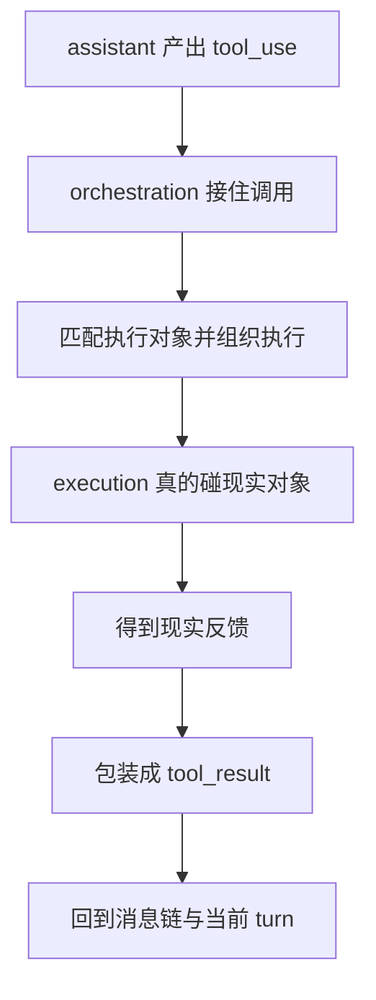
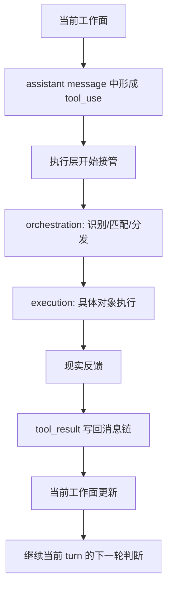

# 卷三 02｜执行主线总图：`tool_use -> orchestration -> execution -> tool_result`

## 导读

- **所属卷**：卷三：工具系统怎么把模型意图落成执行
- **卷内位置**：02 / 11
- **上一篇**：[卷三 01｜为什么模型意图不能直接变成现实动作](./01-why-model-intent-cannot-directly-become-real-world-action.md)
- **下一篇**：[卷三 03｜Tool 为什么是 runtime 的正式执行接口](./03-why-tool-is-the-formal-runtime-execution-interface.md)

## 这篇要回答的问题

第 01 篇已经先立住：模型意图不能直接落成现实动作，Claude Code 必须存在一层 tool runtime。

接下来最自然的问题就是：

> **这层 runtime 真正运行起来时，一次能力调用到底沿着什么主线往前走？**

如果这里没有一张总图，后面去看 Tool 抽象、orchestration、Bash / File / Search，很容易又掉回分散的工具文章；你知道它们都存在，却不知道它们在同一条链上分别承担什么位置。

这篇要先把整条执行主线压成一句话：

> **Claude Code 的执行层不是“工具被调一下”，而是一条从 `tool_use` 出发，经由 orchestration 和 execution，最后回到 `tool_result` 的正式闭环。**

## 先给结论

### 结论一：执行主线的起点不是某个工具文件，而是 assistant message 里出现的 `tool_use`

Claude Code 的执行层不是从工具目录开始，也不是从某个函数调用开始。

真正的起点是：assistant 先在消息里产出一个 `tool_use` block。只有当这一步出现，runtime 才知道：

- 这轮已经不是纯回答路径
- 下一步必须走执行链
- 而且这次执行是有明确对象和输入的

### 结论二：orchestration 负责把 `tool_use` 接入统一执行链，execution 负责真正碰现实对象

执行主线中间最容易混的两段就是 orchestration 和 execution。

先压成最简单的区分：

- **orchestration**：接住、识别、匹配、调度
- **execution**：真的读文件、改文件、跑命令、做检索、启动更高阶执行对象

这两层不应该混写。混了以后，文章就会变成“某些工具是怎么实现的”，而不是“执行层为什么能稳定跑起来”。

### 结论三：`tool_result` 不是执行后的附属记录，而是执行主线正式闭环的返回段

Claude Code 不以“命令跑过了”作为执行链的结束，而以“结果已经被包装回消息链”作为执行链闭环。

也就是说，这条主线最该记住的不是中间动作发生了，而是：

> **现实动作必须被重新组织成 `tool_result`，才能重新回到当前 turn。**

## 把执行主线压成最小模型

一条最小、但足够稳定的执行主线，可以先只记四段：

1. `tool_use`
2. `orchestration`
3. `execution`
4. `tool_result`

四段对应四种不同职责：

### 1. `tool_use`：动作意图已经被正式表达

assistant 不再只是描述下一步，而是已经把“该做什么”写成了可被 runtime 接手的结构化块。

### 2. `orchestration`：执行层开始接管

这一步不直接碰现实对象，而是先回答：

- 调的是哪个执行对象
- 输入是否合法
- 这次调用怎样挂到统一运行链里

### 3. `execution`：具体执行对象真的去碰现实

到了这里，动作才真正发生：

- BashTool 跑命令
- FileReadTool 取材料
- FileEdit / FileWrite 把判断落回文件
- GrepTool 做材料定位
- ToolSearchTool 在能力面里找该用什么能力

### 4. `tool_result`：现实反馈被翻译回当前 turn

执行结束并不自动等于闭环。只有结果被包装成 `tool_result` 并重新进入消息链，这条执行链才算真正回到主循环。

## 图 1：`tool_use -> orchestration -> execution -> tool_result`

这张图最该记住的，是执行层并不是一个点，而是一条链。

## 源码里能看见哪些主线证据

### `utils/messages.ts` 说明了主线的两端：`tool_use` 与 `tool_result`

如果只看实现细节，很容易把执行层理解成工具目录里的若干类。但 `utils/messages.ts` 把这条主线的两端钉得很死：

- `isToolUseRequestMessage(...)` 明确是通过消息内容里的 `tool_use` 来识别请求
- `createToolResultStopMessage(...)`、`createToolResultMessage(...)` 负责构造回流用的 `tool_result`
- `ensureToolResultPairing(...)` 进一步把配对关系当成系统正确性的一部分

这说明 Claude Code 真正在组织的，不是“一次函数调用”，而是一次**消息协议驱动的执行往返**。

### `QueryEngine.ts` 说明了这条主线总是挂在当前 turn 上

执行链不是独立后台流水线，而是当前 turn 的中段。

从 `QueryEngine.ts` 和卷二已经建立的主循环逻辑看，执行的意义从来不是“单独把事情做完”，而是：

- 在当前 turn 中间插入一次现实动作
- 再让这次动作的结果回到这条 turn 的消息链

所以卷三讲执行层时，不能把它写成独立子系统。它始终属于一次 agent turn 的后半段。

## 为什么这条主线不能再压扁

### 不能把 `tool_use` 和 execution 直接连起来

如果直接说“模型调工具，然后工具返回结果”，看起来更短，但会丢掉最关键的中间层：

- 谁来识别这次请求对应哪个对象
- 谁来处理输入与约束
- 谁来把不同执行对象统一挂进一条运行链

这正是 orchestration 的工作。

### 也不能把 execution 和 `tool_result` 混成一段

执行发生之后，Claude Code 还要处理：

- 结果格式
- 错误态
- `tool_use_id` 配对
- 结果回消息链后的继续判断

所以 `tool_result` 不是工具内部顺手返回的一个值，而是执行主线里独立的一段返回协议。

## 图 2：执行层主线总图

这张图比前一张多了一步“当前工作面更新”，为的是提醒一件事：

> **执行层的终点不是“工具结束”，而是“主循环拿回新输入”。**

## 这篇不展开什么

### 1. 不深讲 Tool 抽象

第 03 篇再回答：为什么所有这些不同能力能被统一收进 Tool 接口对象。

### 2. 不深讲 orchestration 内部职责

第 04 篇专门讲它怎样接住一次 `tool_use`，这里先只把它放在主线中段，不把正文抢完。

### 3. 不提前展开单个工具家族

Bash / File / Search 的具体执行语义，留到第 05 至第 09 篇。这里先建立统一骨架。

## 和前后文的边界

- 第 01 篇解决“为什么必须有执行层”；这篇解决“执行层真正跑起来是什么主线”。
- 第 03 篇再讲 Tool 为什么会成为统一执行接口。
- 第 04 篇再单独拆开 orchestration 这座桥。

## 一句话收口

> **Claude Code 的执行层不是某个工具临时被调用，而是一条正式主线：assistant 先产出 `tool_use`，orchestration 接住并组织调用，execution 让现实动作真正发生，最后由 `tool_result` 把现实反馈写回当前 turn；理解卷三，先要理解这条主线。**
