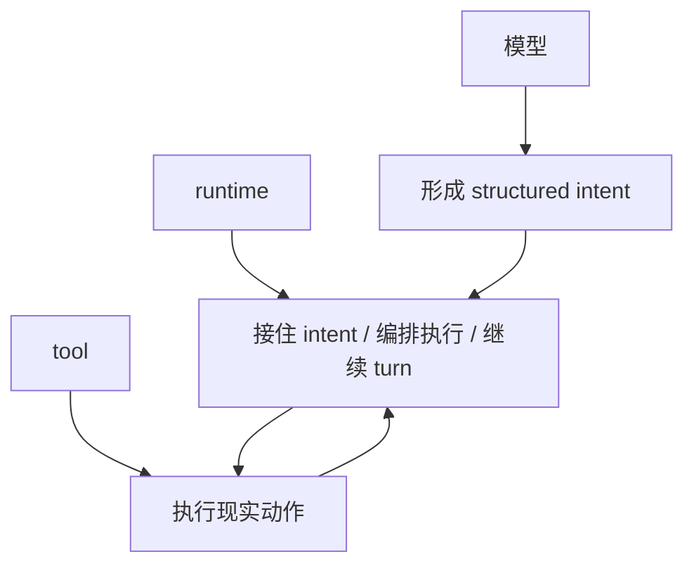
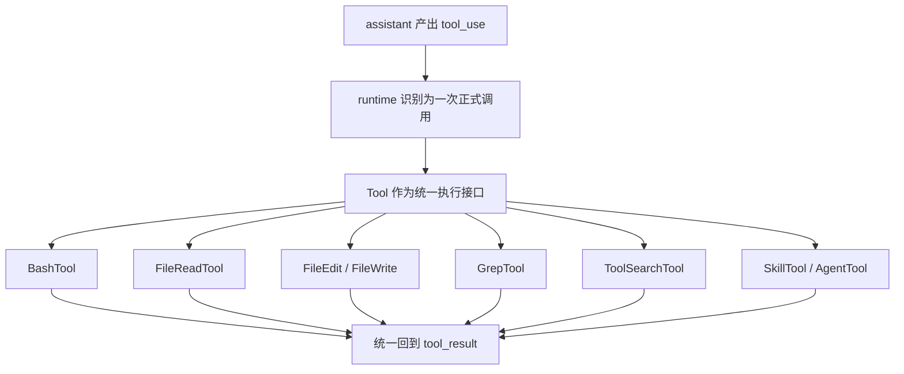

# 卷三 03｜Tool 为什么是 runtime 的正式执行接口

## 导读

- **所属卷**：卷三：工具系统怎么把模型意图落成执行
- **卷内位置**：03 / 11
- **上一篇**：[卷三 02｜执行主线总图：`tool_use -> orchestration -> execution -> tool_result`](./02-tool-execution-mainline-overview.md)
- **下一篇**：[卷三 04｜orchestration 怎么接住一次 `tool_use`](./04-how-orchestration-handles-a-tool-use.md)

## 这篇要回答的问题

第 02 篇已经给出卷三主线：`tool_use -> orchestration -> execution -> tool_result`。

但只看到这条线，还解释不了一个更硬的问题：

> **为什么 bash、读文件、改文件、搜索、能力发现，甚至 skill / agent 这种高阶对象，最后都能被 runtime 放进同一条执行链？**

答案不在某个具体工具内部，而在对象形态先被统一了。

Claude Code 没有把这些能力当成一堆彼此独立的函数入口，而是先把它们收成同一种正式对象：Tool。

这篇要立住的判断是：

> **Tool 的第一意义不是“列出系统能做什么”，而是把差异极大的能力压成同一种 runtime 可识别、可调度、可回流的执行对象。**

## 先给结论

### 结论一：Tool 统一的首先不是功能，而是对象形态

BashTool 和 FileReadTool 在功能上完全不像同一种东西：

- 一个执行命令
- 一个读取材料

但 runtime 真正先关心的不是它们各自会做什么，而是它们能不能被放进同一种调用框架里：

- 能不能被 `tool_use` 指向
- 能不能被执行层识别为正式调用对象
- 能不能产出可以接回主循环的结果

所以 Tool 的价值，先是统一对象形态，后才是承载不同语义。

### 结论二：没有 Tool，执行层就只能面对一堆彼此不兼容的入口

如果系统直接暴露零散函数，那么每加入一种能力，runtime 都要重新处理一遍：

- 怎样识别它
- 怎样给它传参
- 怎样拿回结果
- 怎样把它重新挂回当前 turn

这会让执行层不断分叉。

Tool 的作用，就是把这些差异先压平，让 runtime 面对的不是杂乱入口，而是一组**形态统一、语义不同**的执行对象。

### 结论三：卷三后半能成立，靠的就是 Tool 先把比较框架统一了

卷三后面之所以可以并排讨论 Bash、文件家族、搜索家族和高阶对象，不是因为它们天然同类，而是因为它们先被收进了同一接口层。

也正因此，后面的文章看的都不是“一个功能怎么实现”，而是同一种执行对象在不同现实面上的职责差异。

## 补图：模型 / runtime / tool 三层责任图

这张补图值在它能直接打掉一个最常见误读：**tool 不是模型直接调用函数；模型负责表达意图，runtime 负责接住与编排，tool 负责把现实动作真正落下去。**

## Tool 到底把什么统一了

### 第一，统一了“可被调用对象”的形态

一旦进入卷三视角，最重要的问题就不再是工具内部有多复杂，而是它是否已经被压成了一个可被 runtime 正式接住的对象。

这层统一至少意味着三件事：

- 模型可以用 `tool_use` 明确点名它
- runtime 可以把它识别成一次正式调用
- 主循环可以期待它以稳定方式回流结果

换句话说，Tool 先把不同能力统一成了**同一种被调用对象**。

### 第二，统一了结果回流的出口

执行层不能只负责把动作发出去，还要保证这次调用能回得来。

如果每种能力都各走各的回流路径，主循环就无法稳定处理：

- 结果配对
- 错误传播
- 当前工作面更新
- 下一轮判断继续

Tool 把内部差异留在对象内部，把外部回流压成统一出口。这才有后面那条稳定的 `tool_result` 回线。

### 第三，统一了后续所有样本篇的观察语言

没有 Tool 这一层，后面的卷三文章会变成几套互不相通的话语系统：

- Bash 是命令世界
- File 是文件世界
- Search 是搜索世界
- Skill / Agent 又是另一套世界

有了 Tool 之后，卷三终于可以用同一组问题审视它们：

- 它接的是什么执行语义
- 它碰到的是什么现实对象
- 它把什么结果送回主循环
- 它和相邻对象的边界在哪里

## 图 1：Tool 抽象分层图

这张图真正该记住的，不是下面那些具体样本，而是中间那层：**Tool 把不同能力先压成了同一种正式对象。**

## 为什么 runtime 不直接调一堆零散函数

### 因为执行层要维护的是稳定接口，不是功能拼盘

函数当然也能完成动作，但函数集合并不会自动形成一条稳定执行链。

卷三要的不是“系统会做很多事”，而是：

- 调用怎么被正式表达
- 对象怎么被统一识别
- 结果怎么被稳定接回

这不是功能仓库问题，而是接口形态问题。

### 因为模型意图必须先撞到边界清晰的对象上

Claude Code 不让模型直接伸手到底层对象，而是要求它先说清：

- 我要调用哪个对象
- 这个对象承担什么执行语义
- 结果该怎样回到主循环

Tool 的存在，就是执行层给模型意图设下的第一道正式边界。

## 这篇不展开什么

### 1. 不在这里展开 orchestration

这篇先回答“为什么必须先把对象形态统一”。
第 04 篇再回答“统一后的对象怎样被正式接入执行层”。

### 2. 不把这篇写成接口清单

这里关心的是 Tool 的架构角色，不是 types 或参数说明。

### 3. 不提前进入单个工具正文

第 05 到第 10 篇再看不同执行对象各自承担什么语义；这篇先把统一比较框架钉住。

## 和前后文的边界

### 它承接第 02 篇

第 02 篇给出执行主线；这篇进一步回答：这条主线上为什么能挂住一组看起来差异极大的对象。

### 它导向第 04 篇

只有当对象形态先被统一，下一篇才谈得上：orchestration 怎样把一次 `tool_use` 正式接进执行层。

### 它也给后半卷定了观察框架

从这一篇往后，卷三看的不再是零散功能，而是同一接口层上的不同执行对象样本。

## 一句话收口

> **Tool 的关键作用，不是把若干能力摆进一个目录，而是先把它们压成同一种 runtime 可识别、可调度、可回流的执行对象；卷三后半所有样本篇，都是在这个统一对象形态之上成立的。**
