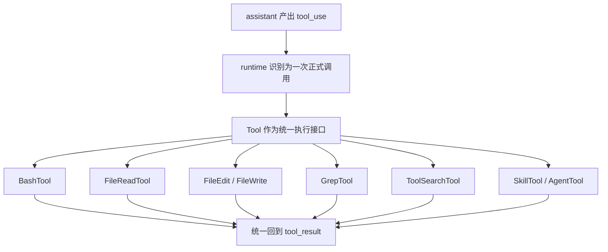
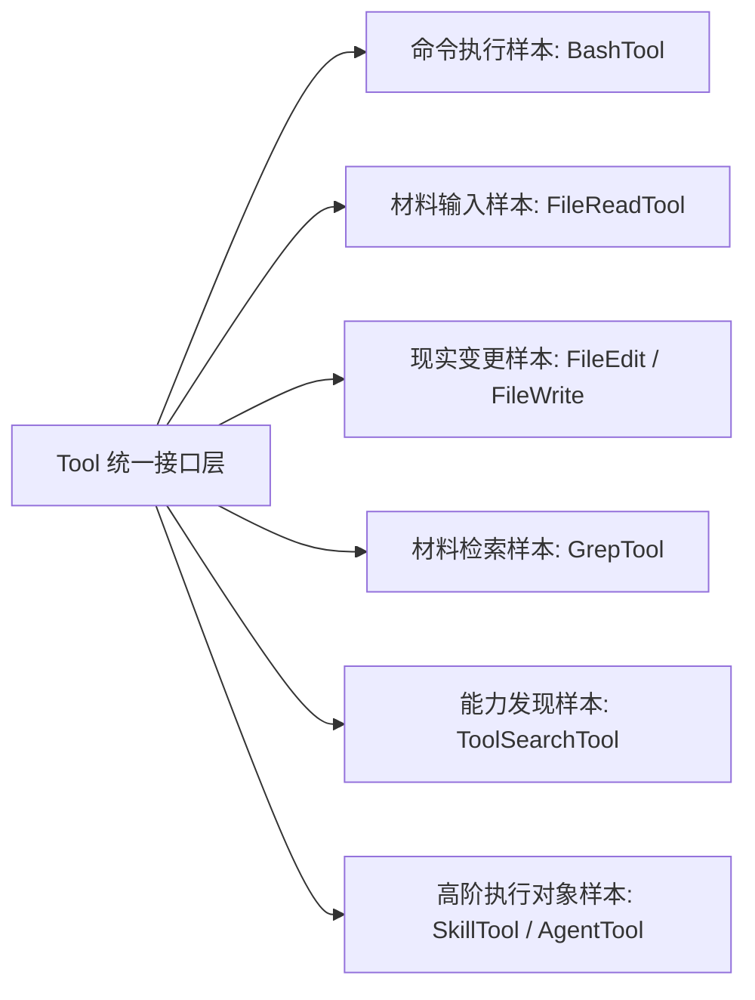

# 卷三 03｜Tool 为什么是 runtime 的正式执行接口

## 导读

- **所属卷**：卷三：工具系统怎么把模型意图落成执行
- **卷内位置**：03 / 11
- **上一篇**：[卷三 02｜执行主线总图：`tool_use -> orchestration -> execution -> tool_result`](./02-tool-execution-mainline-overview.md)
- **下一篇**：[卷三 04｜orchestration 怎么接住一次 `tool_use`](./04-how-orchestration-handles-a-tool-use.md)

## 这篇要回答的问题

前两篇已经把卷三前半的两件事立住了：

- 为什么模型意图不能直接落成现实动作
- 一次能力调用沿着什么主线往前走

接下来最自然的问题就是：

> **为什么这些完全不同的能力——bash、读文件、改文件、搜索、能力发现、skill、agent——最后都能被 runtime 放进同一条执行主线里？**

答案不在某个具体工具内部，而在更前面的一个设计选择：Claude Code 没有把它们做成零散函数集合，而是把它们统一收成了 Tool 这种正式接口对象。

这篇的核心判断是：

> **Tool 不是“工具目录里的若干实现文件”，而是 Claude Code 用来承接执行能力、组织执行语义、把不同能力挂进同一执行链的正式接口。**

## 先给结论

### 结论一：Tool 的意义首先不是“能做什么”，而是“怎样被 runtime 统一接住”

如果只从用户视角看，BashTool 和 FileReadTool 的差异非常大：一个跑命令，一个读文件。

但从 runtime 视角看，它们首先有一个共同点：

- 都能被 `tool_use` 指向
- 都能被 orchestration 匹配到
- 都会产出 `tool_result`
- 都要挂在相同的执行闭环里

也就是说，Tool 的第一价值不是表现具体能力，而是提供**统一可调度的执行对象形态**。

### 结论二：有了 Tool，runtime 组织的是“执行对象家族”，而不是“工具实现细节仓库”

Tool 把差异很大的能力压到了同一层里：

- BashTool 是通用命令执行器
- FileReadTool 是现实材料入口
- FileEdit / FileWrite 是落盘能力
- GrepTool 是材料检索
- ToolSearchTool 是能力发现
- SkillTool / AgentTool 则把更高阶执行对象也接进同一链条

这不是说它们完全一样，而是说 runtime 终于可以不必针对每种能力单独开一条总线。

### 结论三：Tool 是卷三后半所有样本篇的统一观察框架

卷三后面为什么能同时写 Bash、File、Search、Skill / Agent，而又不散？

就是因为第 03 篇先把观察框架固定了：

> **后面不是在看“各种分散功能”，而是在看同一接口层上的不同执行对象样本。**

## Tool 到底把什么统一了

### 第一，统一了执行对象的入口形态

在卷三视角里，最重要的不是每个 Tool 的内部实现，而是它们都可以作为 runtime 的“可被调用对象”出现。

这意味着 Claude Code 可以在收到 `tool_use` 之后，先不管工具内部怎样执行，而先把问题压成：

- 这次请求对应哪个 Tool
- 这个 Tool 接受怎样的输入
- 它怎样对外暴露结果

换句话说，Tool 把“不同能力对象”先统一成了“可以被 runtime 接住的对象”。

### 第二，统一了执行结果的回流方式

前两篇已经讲过：执行链真正闭环，要靠 `tool_result` 回到消息链。

Tool 的价值之一，就是让各种能力虽然内部差异很大，但最终都能把结果压回同一条回流路径里。这样 runtime 才能继续做：

- 结果配对
- 错误传播
- 当前工作面更新
- 下一轮判断继续

### 第三，统一了卷三里的“样本比较语言”

没有 Tool 这个接口对象，后面每篇工具文都会变成独立章节：

- Bash 一套语言
- File 一套语言
- Search 又一套语言

有了 Tool 以后，我们终于可以用同一种问题去看后面所有样本：

- 它接的是什么执行语义
- 它碰到的是什么现实对象
- 它在执行链里扮演什么位置
- 它最容易和哪一个邻居混淆

## 图 1：Tool 抽象分层图

这张图最该记住的是中间那一层：不是具体工具目录，而是 **Tool 作为统一接口层**。

## 为什么 runtime 不直接调一堆零散函数

### 因为卷三要解决的不是“如何实现一个功能”，而是“如何让不同能力被同一执行层接住”

如果只是为了实现功能，直接调零散函数当然也能工作。但 Claude Code 需要的不只是会工作，而是会被统一组织：

- 能进入同一条 `tool_use -> tool_result` 主线
- 能被同一种 orchestration 识别与分发
- 能在消息体系里保留明确配对与状态

这已经不是简单函数库问题，而是 runtime 设计问题。

### 因为执行层需要“边界清晰的对象”，而不是“到处可插的自由代码”

Tool 的存在，也是在给模型意图划边界。模型不是直接写程序去操纵底层对象，而是要先说清：

- 我想调用哪个能力对象
- 这个对象承担哪种执行语义
- 它把结果怎样还给主循环

这让执行层的边界更稳定，也让卷三后面所有具体能力都能守住自己的职责。

## 图 2：Tool 与具体工具样本关系图

这张图强调的是：后面各篇不是平级散文，而是同一接口层上的不同样本。

## 这篇不展开什么

### 1. 不把这篇写成 types / API 清单

Tool 的存在当然和接口定义有关，但卷三这里关心的是架构角色，不是参数手册。

### 2. 不展开 orchestration 细节

第 04 篇再单独讲“调用如何被接住、识别、分发、调度”。这篇先把中间接口对象立住。

### 3. 不提前进入单个工具正文

第 05 到第 09 篇再按 Bash / File / Search 逐个展开。这里要先守住统一观察框架。

## 和前后文的边界

### 它承接第 02 篇

第 02 篇给出执行主线；这篇回答主线中“什么对象被 runtime 正式接住”。

### 它导向第 04 篇

有了 Tool 这层接口对象，第 04 篇才能进一步回答：orchestration 怎样把一次 `tool_use` 准确送到合适对象手里。

### 它也给第 05 到第 09 篇定调

后面的工具家族篇都应该沿同一套问题写，而不是回到旧工具目录节奏。

## 一句话收口

> **Tool 的意义不在于把若干功能放进一个目录，而在于把差异巨大的执行能力压成同一种 runtime 可调度对象；Claude Code 因此组织的不是零散函数，而是一组能被同一执行链接住、比较、分发和回流的正式执行接口。**
