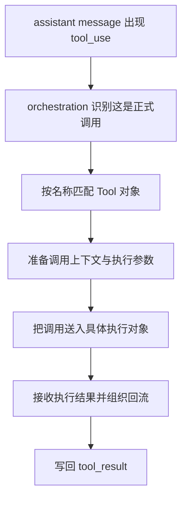
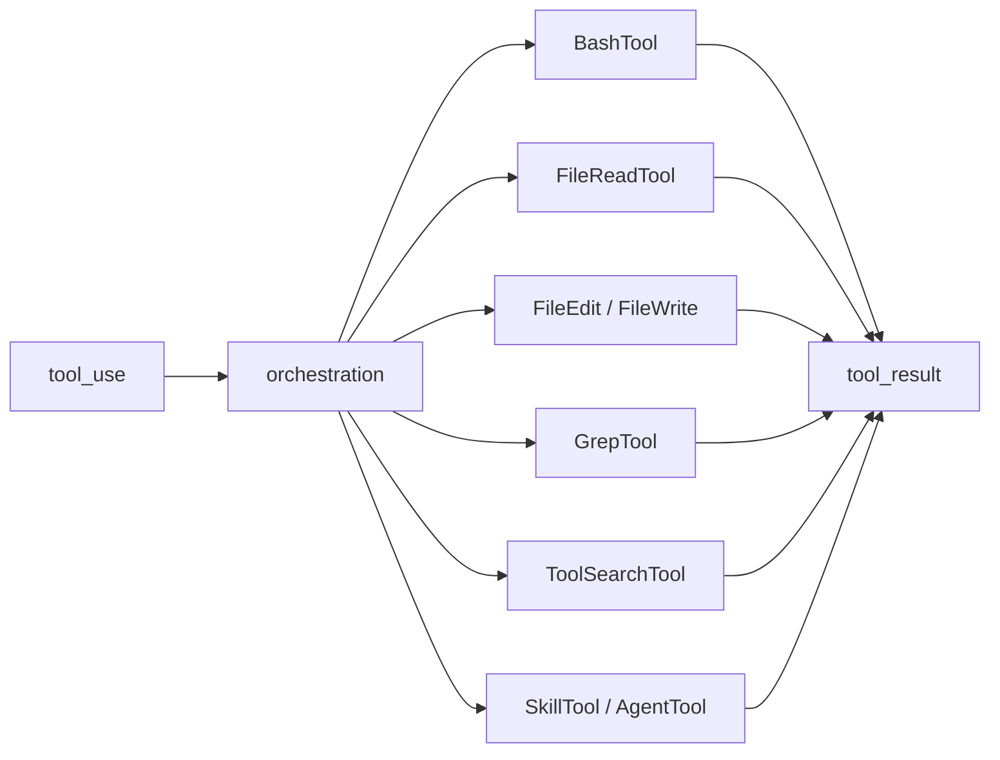

# 卷三 04｜orchestration 怎么接住一次 `tool_use`

## 导读

- **所属卷**：卷三：工具系统怎么把模型意图落成执行
- **卷内位置**：04 / 11
- **上一篇**：[卷三 03｜Tool 为什么是 runtime 的正式执行接口](./03-why-tool-is-the-formal-runtime-execution-interface.md)
- **下一篇**：[卷三 05｜BashTool 为什么像执行层的通用执行器](./05-why-bashtool-feels-like-the-general-executor.md)

## 这篇要回答的问题

到第 03 篇为止，卷三前半已经有了三块骨架：

- 为什么要有执行层
- 执行层的主线长什么样
- Tool 为什么会成为统一执行接口

接下来还缺最后一块：

> **assistant 已经给出 `tool_use`，runtime 也已经拥有一组 Tool 对象，那中间是谁把这次调用真正接住、送到合适对象手里？**

这就是 orchestration 的位置。

它最容易被误写成“工具内部实现的一部分”，也最容易被忽略成“就是普通分发代码”。但从卷三视角看，它承担的是执行链里最关键的桥接职责：

> **orchestration 不替工具做事；它负责把一次 `tool_use` 准确识别、匹配、分发、挂进统一执行链。**

## 先给结论

### 结论一：orchestration 的职责不是执行现实动作，而是让这次调用先成为一次“被正确接住的调用”

很多系统在这一步会写得很薄，好像只是一个 switch-case。Claude Code 里当然也会有匹配逻辑，但卷三里更重要的是看它承担的架构作用：

- 从 assistant message 里认出这次调用
- 找到对应 Tool
- 准备合适上下文
- 把执行结果接回统一闭环

也就是说，orchestration 的工作不是“把命令跑掉”，而是让运行时先知道自己**正在处理什么调用**。

### 结论二：有了 orchestration，Tool 抽象才不会退化成一堆静态对象

第 03 篇已经说过：Tool 是统一执行接口。但如果没有 orchestration，这些 Tool 只是“可被调用的对象集合”，还没有变成一条真的运行起来的链。

orchestration 做的事，就是把静态接口层变成动态运行层。

### 结论三：orchestration 是后面所有工具家族的统一观察入口

从第 05 篇开始进入 Bash / File / Search 样本时，我们不应该直接跳到工具内部，而应该先问：

- 这个工具怎样被 orchestration 接住
- 它被接住以后承担哪种执行语义
- 它和邻居工具为什么不会在接入层互相抢活

这正是第 04 篇要先立住的观察框架。

## 一次 `tool_use` 被接住时，发生了什么

### 第一步：识别这不是文本，而是一条正式调用

`utils/messages.ts` 把 `tool_use` 当作消息块而不是普通文本处理，本身就说明了一点：orchestration 的输入不是“自然语言意图”，而是**已经结构化的调用请求**。

这一步的意义在于：执行层不需要再猜模型是不是想做事，它只需要处理“已经明确要做哪次调用”。

### 第二步：把调用映射到正确执行对象

一旦 `tool_use` 出现，runtime 下一步不是立刻执行现实动作，而是先确认：

- 这次调用指向哪个 Tool
- 这个 Tool 是否存在
- 该调用带着什么输入

第 03 篇的接口层在这里真正发挥作用：不同能力虽然内部差异很大，但在接入层都先被当作“候选执行对象”处理。

### 第三步：把这次调用挂进统一执行链

这里才是 orchestration 最容易被忽略、却最关键的地方。

一次调用不只是“找到工具然后执行”，还要解决：

- 这次调用怎样被标识
- 它的结果如何配对
- 失败、停止、缺失结果时怎样继续回到当前 turn

`tool_use_id`、`tool_result` 配对、`ensureToolResultPairing(...)` 这些机制，都是在说明：运行时要的是一条**完整可追踪的调用链**，而不是一次随便触发的工具函数。

## 图 1：`tool_use` 被 orchestration 接住的流程图

这张图最重要的是前半段：在真正执行之前，runtime 必须先把调用接住。

## 为什么 orchestration 不能省

### 因为执行层不是单工具系统

如果 Claude Code 只有一个 BashTool，orchestration 可以写得很薄。但事实不是这样：

- 它有 Bash / File / Search 这组本地执行对象
- 还有 SkillTool / AgentTool 这样的高阶对象
- 它们都要走统一闭环

这就决定了系统必须有一层专门负责“接调用、匹配对象、组织分发”的中间结构。

### 因为执行层还要守住卷内边界

卷三后面要分别写：

- Bash 的通用执行器地位
- FileRead 的现实材料入口
- FileEdit / FileWrite 的落盘语义
- Grep 的材料定位
- ToolSearch 的能力发现

这些角色之所以能彼此分开，不只是因为工具内部不同，更因为在 orchestration 视角下，它们本来就在同一执行层里承担不同职责，而不是互相代打。

## 图 2：分发到具体执行对象的桥接图

这张图里的关键信息有两个：

1. `tool_use` 不直接跳到某个工具内部，而是先经过 orchestration。
2. 不同对象虽然分工不同，但都会重新回到同一条 `tool_result` 回流线。

## 这篇不展开什么

### 1. 不展开单个工具正文

从第 05 篇开始，再分别讲每个工具家族的独特执行语义。

### 2. 不把权限线塞进来

批准、危险命令、路径限制当然会参与实际执行，但那是执行控制层问题，不是这篇的主轴。

### 3. 不主讲 Skill / Agent 的扩展机制

第 10 篇只会把它们作为执行对象补全；至于它们怎样成为扩展能力，留给卷五。

## 和前后文的边界

### 它承接第 03 篇

第 03 篇回答“Tool 是什么对象”；这篇回答“这个对象怎样真正被 runtime 用起来”。

### 它导向第 05 到第 09 篇

有了 orchestration 这层桥，后面的 Bash / File / Search 才能作为具体样本被统一比较，而不会变成旧工具目录的影子。

## 一句话收口

> **orchestration 的职责不是替工具跑代码，而是把 assistant 产出的 `tool_use` 准确接进执行层：识别这是正式调用、匹配到合适 Tool、把这次调用挂进统一执行链，并把结果重新接回 `tool_result` 回流线；没有这层桥，Tool 抽象就无法真正运行。**
