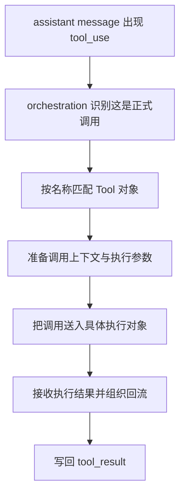
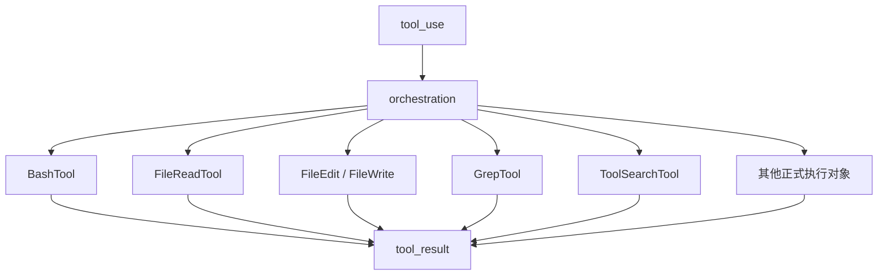

# 卷三 04｜orchestration 怎么接住一次 `tool_use`

## 导读

- **所属卷**：卷三：工具系统怎么把模型意图落成执行
- **卷内位置**：04 / 11
- **上一篇**：[卷三 03｜Tool 为什么是 runtime 的正式执行接口](./03-why-tool-is-the-formal-runtime-execution-interface.md)
- **下一篇**：[卷三 05｜BashTool 为什么像执行层的通用执行器](./05-why-bashtool-feels-like-the-general-executor.md)

## 这篇要回答的问题

到第 03 篇为止，卷三前半已经立住三件事：

- 模型意图不能直接落成现实动作
- 执行主线是 `tool_use -> orchestration -> execution -> tool_result`
- Tool 先把不同能力压成了统一对象形态

但主线里最关键的一步还没有真正钉死：

> **assistant 已经给出 `tool_use`，系统里也已经有一组 Tool，对这次调用到底是谁来正式接住、认领、分发？**

答案就是 orchestration。

这篇的重点不是再解释“为什么需要统一执行链”——前面已经讲过——而是更明确地回答：

> **一次 `tool_use` 是怎样被正式接入执行层的；没有 orchestration，这次调用根本进不了稳定运行状态。**

## 先给结论

### 结论一：orchestration 不负责替工具做事，它负责让调用先被正式认领

orchestration 最容易被误写成一句轻飘飘的“分发逻辑”。

但从卷三视角看，它做的是更前一道工作：

- 认出这不是普通文本，而是正式调用
- 把这次调用挂到正确对象上
- 维持调用与结果之间的可追踪关系

它不替 Bash 跑命令，也不替 FileRead 读文件。它先保证：**这次调用不是漂着的，而是已经进入执行层。**

### 结论二：没有 orchestration，Tool 只是一堆静态对象，执行链会在入口处断掉

第 03 篇解决的是“对象形态统一”。

但统一对象，不等于对象已经运行起来。没有 orchestration，系统只剩下：

- 一条 `tool_use`
- 一组 Tool 对象

中间没有正式接入层，结果就是：

- 调用无法稳定匹配到正确对象
- 结果无法稳定配对回原调用
- 错误、终止、缺失结果时没有统一处理位置
- 同一条执行主线会退化成各工具各接各的私线

所以 orchestration 不是锦上添花，而是执行链能否成立的入口结构。

### 结论三：后面所有工具样本，都是从“怎样被 orchestration 接住”开始分化的

从第 05 篇开始进入 Bash、文件家族、搜索家族时，真正该先问的不是“它内部怎么实现”，而是：

- 它怎样被接入执行层
- 被接住后承担什么执行语义
- 为什么它不会和邻居对象在入口处互相抢活

这正是第 04 篇的作用：先把后半卷的接入视角立住。

## 一次 `tool_use` 被正式接入时，发生了什么

### 第一步：识别这是一条正式调用，不是普通文本

`tool_use` 在消息系统里不是普通文本块，而是结构化调用块。

这意味着 orchestration 的第一步不是理解语言，而是认领一种已经被声明出来的运行时事件：

- 这不是一句建议
- 这不是一段解释
- 这是一条要求执行层接手的正式调用

执行层从这里开始，才真正和文本层分家。

### 第二步：把这次调用挂到正确对象上

一旦 `tool_use` 被认出来，下一步也不是立刻去碰现实，而是先回答：

- 调的是哪个 Tool
- 这个 Tool 是否存在
- 输入是否能被这次调用正确带过去

这里就是第 03 篇和第 04 篇的分界线：

- 第 03 篇解决“对象为什么必须先统一”
- 第 04 篇解决“统一后的对象怎样被正式认领”

### 第三步：把这次调用纳入可追踪的执行链

orchestration 真正关键的地方，不在于“找到工具”这四个字，而在于它要把这次调用变成一条完整链条，而不是一次随手触发：

- 这次调用是谁
- 结果回来时该配给谁
- 中间失败了该怎样表达
- 当前 turn 怎样继续往前走

`tool_use_id`、`tool_result` 配对、`ensureToolResultPairing(...)` 这一类机制，本质上都在服务这件事：

> **执行层要的不是一次调用被碰巧跑掉，而是一条可以被识别、跟踪、配对、回流的正式调用链。**

## 图 1：`tool_use` 被 orchestration 接住的流程图

这张图最该记住的不是“分发”两个字，而是：**调用必须先被正式接住，后面那些执行对象才有机会开始工作。**

## 没有 orchestration，会坏在哪里

### 第一，调用会重新退化成“谁爱接谁接”

没有统一接入层，每个工具都得自己处理入口问题。这样一来，执行层就不再是一条主线，而会重新散成多条私线。

### 第二，结果回流会失去稳定配对关系

执行不是发出去就算完。Claude Code 还必须知道：

- 哪个结果对应哪次调用
- 哪个失败属于哪次尝试
- 主循环接回来的是哪一段现实反馈

没有 orchestration，这条配对关系最先失稳。

### 第三，卷三后半会重新变回旧工具目录

如果没有一层统一接入视角，后面每篇工具文就会重新各讲各的：

- Bash 一套入口
- File 一套入口
- Search 一套入口

这样卷三就不再是在讲执行层，而只是在罗列工具实现。

## 图 2：分发到具体执行对象的桥接图

这张图压住两件事：

1. `tool_use` 不直接跳进某个工具内部，而是先经过正式接入层。
2. 不同对象虽然分工不同，但都要重新并回同一条 `tool_result` 回流线。

## 这篇不展开什么

### 1. 不展开单个工具正文

从第 05 篇开始，再分别看不同对象各自怎样碰现实。

### 2. 不把权限与控制线塞进来

批准、危险命令、路径限制当然会影响实际执行，但那是后面控制层要接走的问题。

### 3. 不主讲 Skill / Agent 的扩展机制

第 10 篇只把它们作为执行对象补全；它们怎样长成平台能力，是卷五的主题。

## 和前后文的边界

### 它承接第 03 篇

第 03 篇回答“为什么必须先有统一对象形态”；这篇回答“统一后的对象怎样被正式接入执行层”。

### 它导向第 05 到第 10 篇

有了 orchestration 这层入口桥，后面的 Bash / File / Search / Skill / Agent 才能被当作同一执行层上的不同对象样本，而不是重新散回目录视角。

## 一句话收口

> **orchestration 的职责，不是替工具执行现实动作，而是把 assistant 产出的 `tool_use` 正式接进执行层：认出这是调用、把它挂到正确对象上、维持调用与结果的可追踪关系；没有这层接入结构，Tool 抽象只是静态对象，执行主线会在入口处直接断掉。**
