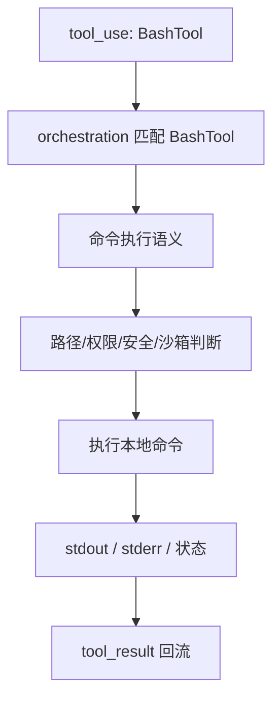
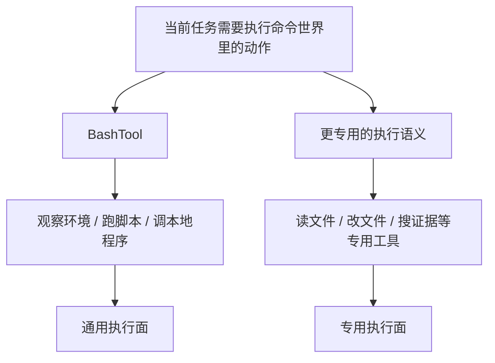

# 卷三 05｜BashTool 为什么像执行层的通用执行器

## 导读

- **所属卷**：卷三：工具系统怎么把模型意图落成执行
- **卷内位置**：05 / 11
- **上一篇**：[卷三 04｜orchestration 怎么接住一次 `tool_use`](./04-how-orchestration-handles-a-tool-use.md)
- **下一篇**：[卷三 06｜FileReadTool 怎么把现实材料接进当前判断](./06-how-filereadtool-brings-real-material-into-current-judgment.md)

## 这篇要回答的问题

卷三前四篇已经把执行层骨架立住了。接下来进入本地工具家族时，最该先看的样本就是 BashTool。

因为它在执行层里的位置很特别：

- 它确实只是一个 Tool 对象
- 但它碰到的现实对象最通用
- 它承担的动作空间也最宽

所以这篇要回答的不是“BashTool 能不能跑 shell”，而是：

> **为什么 BashTool 在执行层里不像普通工具，更像一台通用执行器？**

这篇的核心判断是：

> **BashTool 的价值不是给模型一个 shell，而是给执行层提供一个几乎可以落地各种本地动作的通用执行面。**

## 先给结论

### 结论一：BashTool 特殊，不是因为它更底层，而是因为它能接住最宽的本地动作空间

FileReadTool 的对象很明确：文件内容。
GrepTool 的对象也很明确：现实材料定位。

BashTool 不一样。它面对的是整个命令执行面：

- 列目录
- 查状态
- 跑脚本
- 调本地程序
- 管进程
- 接各种系统级输出

所以它虽然只是一个 Tool，却天然拥有接近“本地通用执行器”的地位。

### 结论二：BashTool 的 prompt 和配套校验说明，Claude Code 并没有把它当作无边界后门

`cc/src/tools/BashTool/` 下的文件结构本身就很说明问题：

- `prompt.ts`
- `bashPermissions.ts`
- `bashSecurity.ts`
- `destructiveCommandWarning.ts`
- `pathValidation.ts`
- `readOnlyValidation.ts`
- `shouldUseSandbox.ts`

这意味着 Claude Code 对 BashTool 的理解不是“开个 shell 给模型随便用”，而是：

> **这是一个极强的通用执行对象，所以必须把提示、语义、路径、权限、安全、沙箱判断一整套配套都补齐。**

### 结论三：BashTool 很强，但仍然只是执行层里的一种正式对象，而不是替代所有工具的总入口

这点也必须说准。

BashTool 的地位特殊，并不意味着别的工具都变得多余。恰恰相反：`prompt.ts` 反复强调优先使用更专用的工具，说明系统设计上并不希望它吞并一切。

它更准确的位置应该是：

- 当问题本质上是“执行命令”时，它是旗舰样本
- 当问题有更专用、更结构化的工具时，它不该越俎代庖

## BashTool 为什么会显得像通用执行器

### 第一，它接的不是单一对象，而是一整个命令世界

BashTool 与 FileReadTool 最不一样的地方，在于它不是围绕某个稳定对象类型展开，而是围绕**命令执行能力**展开。

命令一旦成为执行对象，系统就等于获得了一块非常宽的本地行动面：

- 可以观察环境
- 可以操作工作区
- 可以调用外部程序
- 可以拼接局部步骤

从执行层视角看，这让 BashTool 自然拥有了更像“通用执行器”的手感。

### 第二，它能把很多原本分散的局部动作压成同一条命令式路径

很多本地动作如果不经 BashTool，就需要分别做成特定工具：

- 查文件
- 看目录
- 批量处理文本
- 启动脚本
- 检查系统状态

而 BashTool 之所以强，是因为它可以把这些局部动作收进一条命令式路径里。这也是为什么很多人第一次看 Claude Code 时，会误以为 BashTool 就是全部执行层。

但更准确的说法应该是：

> **它不是全部执行层，而是最像“通用执行器”的那一个本地样本。**

## 图 1：BashTool 在执行层中的位置图

这张图里最重要的是中段：BashTool 不是直接把命令扔给 shell，而是带着一层执行语义与约束进入现实。

## 为什么 BashTool 不能被写成“只是 shell 包装”

### 因为它承担的是运行时执行语义，不是终端界面转发

如果只是 shell 包装，工具目录里就不需要那一整套围绕：

- destructive command warning
- read-only validation
- path validation
- security
- permissions
- sandbox

的配套文件。

Claude Code 之所以把这些判断收进 BashTool 周边，说明系统真正关心的是：

- 这次命令在执行层里该怎样被理解
- 哪些命令应该被拦、被警告、被沙箱化
- 结果怎样以工具语义返回，而不只是终端打印

### 因为它的作用是把命令世界收进统一执行链

BashTool 再强，也不是独立产品。它必须接受：

- 由 `tool_use` 发起
- 被 orchestration 接住
- 以 `tool_result` 回流

所以它本质上仍然是 runtime 下的一个正式执行对象，只不过这次对象接触的是最广的本地动作面。

## 图 2：为什么 BashTool 是通用执行面，而不是专用工具替代品

## 这篇不展开什么

### 1. 不主讲权限制度

这里会提到权限、安全、沙箱，是为了说明 BashTool 为什么不是普通 shell 包装；但卷三不把这些控制问题展开成主轴。

### 2. 不抢 File / Search 的职责

BashTool 很强，但不意味着它负责一切。后面 FileRead / FileEdit / Grep / ToolSearch 仍然各有自己的正式位置。

### 3. 不把这篇写成命令技巧文

我们关心的不是 shell 命令怎么写，而是 BashTool 在执行层里承担什么架构角色。

## 和前后文的边界

### 它承接第 04 篇

第 04 篇讲的是统一接入层；这篇第一次看见接入层送到某个具体对象之后，会出现怎样的执行语义。

### 它导向第 06、07 篇

BashTool 代表“最通用的命令执行面”；第 06、07 篇则转去看文件家族——它们不是通用执行，而是更明确地围绕现实材料与现实变更展开。

## 一句话收口

> **BashTool 之所以像执行层的通用执行器，不是因为 Claude Code 把 shell 暴露给模型，而是因为 runtime 把一整块命令执行世界收成了一个正式 Tool：它既能落地极宽的本地动作，又被提示、校验、安全与回流协议严密包住，因此成为本地工具家族里最像“通用执行面”的旗舰样本。**
