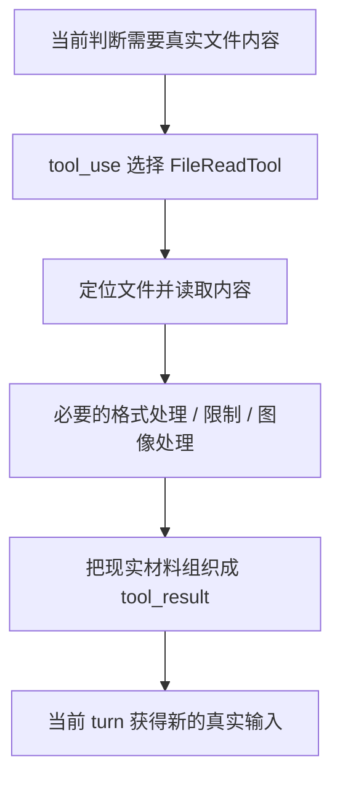
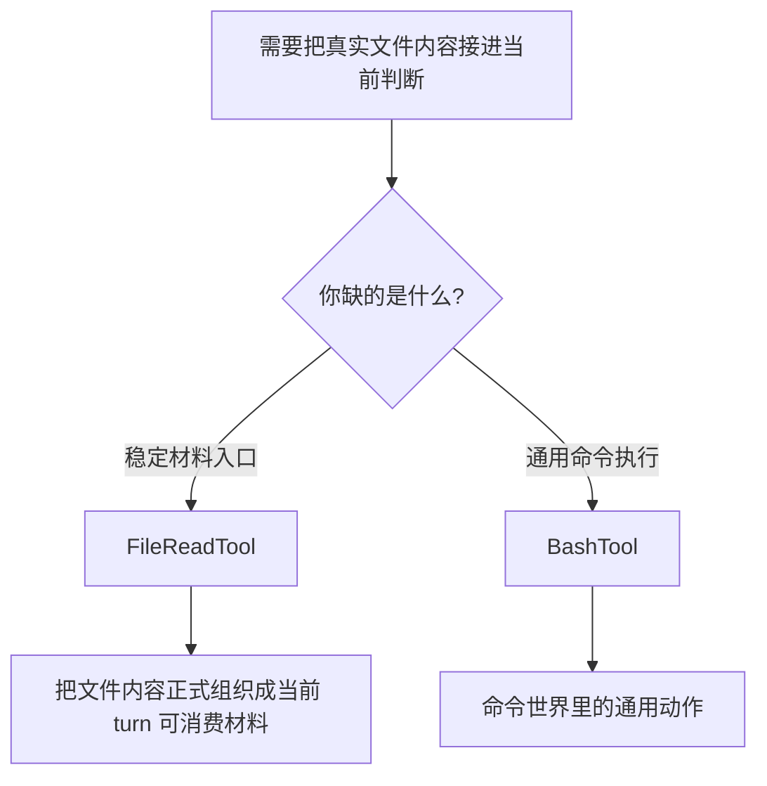

# 卷三 06｜FileReadTool 怎么把现实材料接进当前判断

## 导读

- **所属卷**：卷三：工具系统怎么把模型意图落成执行
- **卷内位置**：06 / 11
- **上一篇**：[卷三 05｜BashTool 为什么像执行层的通用执行器](./05-why-bashtool-feels-like-the-general-executor.md)
- **下一篇**：[卷三 07｜FileEdit / FileWrite 怎么把当前判断落回现实文件](./07-how-fileedit-and-filewrite-apply-judgment-back-to-files.md)

## 这篇要回答的问题

如果说 BashTool 展示的是“执行层能怎样去碰现实动作”，那文件家族要回答的则是另一组问题：

- 当前判断所依赖的现实材料从哪里来
- runtime 怎样把这些材料接进来
- 为什么“读文件”不是可有可无的前置动作，而是执行链的一部分

所以这篇不把 FileReadTool 理解成“查看文件的小工具”，而要把它放在卷三的主问题里看：

> **FileReadTool 怎样把现实材料正式带进当前判断，让执行层不靠猜，而靠真实工作对象继续推理和行动？**

核心判断是：

> **FileReadTool 的价值不在于读文件本身，而在于把真实材料接入当前 turn，使模型后续判断和执行建立在现实对象上。**

## 先给结论

### 结论一：FileReadTool 不是附属动作，而是执行层获取现实材料的正式入口

Claude Code 很多后续动作都依赖材料：

- 读源码再判断怎么改
- 看配置再决定跑什么命令
- 检查现有文稿再决定改哪里

如果没有 FileReadTool，模型只能：

- 靠已有上下文猜
- 让 BashTool 兜一圈 `cat`
- 或者凭印象继续写

这三种都不如把“读取现实材料”收成正式能力稳定。

### 结论二：FileReadTool 的真正作用，是把现实对象翻译成当前 turn 可消费的材料

`cc/src/tools/FileReadTool/` 目录下除了主文件，还有：

- `imageProcessor.ts`
- `limits.ts`
- `prompt.ts`

这透露出两个信息：

1. 它面对的不只是“读一段文本”这么单薄的问题
2. 它要考虑材料进入系统时的加工与边界

更准确地说，FileReadTool 做的不是“打开文件”而是“把现实材料整理成当前判断可继续工作的输入”。

### 结论三：FileReadTool 属于输入半边，不能和 FileEdit / FileWrite 混成一篇

文件家族常常被粗略写成“文件工具篇”，但从执行语义看，读和写不是一回事：

- FileReadTool 负责把现实材料拉进当前判断
- FileEdit / FileWrite 负责把当前判断落回现实文件

这两半如果不分，读者就看不见执行层为什么既要有材料入口，也要有现实变更出口。

## FileReadTool 在执行层里到底做了什么

### 第一，它把当前判断从“猜工作对象”推进到“看工作对象”

很多判断在没有读到真实文件前，其实都只是猜测：

- 这个函数到底怎么写的
- 这段文稿已经成什么样了
- 配置文件是不是已经存在某个字段

FileReadTool 把这一步变成正式能力之后，runtime 才能稳定地让模型先拿到真实材料，再继续判断。

这一步非常像把现实世界里的对象，正式搬进当前工作面。

### 第二，它把现实材料压进消息链，而不是藏在某个私有缓存里

卷二已经立住：执行结果真正有价值，是因为它会回到消息链，变成下一轮判断输入。

FileReadTool 读到的内容，也正应该这样理解：它不是模型偷偷看了一眼文件，而是 runtime 正式把这份材料接进当前 turn。于是后续的判断和动作就不再脱离现实对象。

### 第三，它把“读现实材料”从 Bash 的通用动作里分离出来

第 05 篇已经说过，BashTool 很强，甚至可以通过 `cat`、`sed`、`head` 等命令间接读文件。

但 Claude Code 仍然单独保留 FileReadTool，本身就在说明：

> **读取现实材料不是命令执行的附属边角，而是执行层里独立且高频的一种正式语义。**

## 图 1：FileReadTool 接入现实材料图

## 为什么 FileReadTool 不只是“读文件”

### 因为它真正改变的是当前判断的材料基础

当一个判断从“凭上下文猜”变成“基于真实文件内容判断”，它其实已经发生了质变。

FileReadTool 在执行层里最值钱的地方，不是 I/O 行为本身，而是它重新定义了后续判断的依据。

### 因为它常常是后续所有现实动作的前置桥

很多执行链在现实里都会变成：

- 先读
- 再判断
- 再改
- 再验证

如果读这一段没有被单独立住，整个执行层就会看起来像“直接动手改”，而不是“先让现实材料进入当前判断，再决定如何动手”。

## 图 2：FileReadTool 和 Bash 读文件的边界图

## 这篇不展开什么

### 1. 不讲长期上下文治理

FileReadTool 把材料接进当前判断，不等于卷四要讲的上下文治理、压缩、投影和长期状态管理。

### 2. 不和 FileEdit / FileWrite 混写

下一篇专门讲“把当前判断落回现实文件”。这篇先守住输入半边。

### 3. 不抢 GrepTool 的检索职责

FileReadTool 负责把指定对象内容带进来；GrepTool 负责在大量现实材料里定位证据。两者不是一回事。

## 和前后文的边界

### 它承接 BashTool

BashTool 展示的是通用执行面；FileReadTool 展示的是更专门、更稳定的现实材料入口。

### 它导向 FileEdit / FileWrite

第 07 篇会接着讲：当材料已经进来，当前判断怎样正式落回现实文件，构成文件家族的另一半。

## 一句话收口

> **FileReadTool 的意义不只是读取文件，而是把真实工作对象正式接进当前 turn：它让模型后续判断建立在现实材料上，而不是建立在猜测、记忆或命令式兜底上，因此构成了执行层里“现实材料进入判断”的正式入口。**
