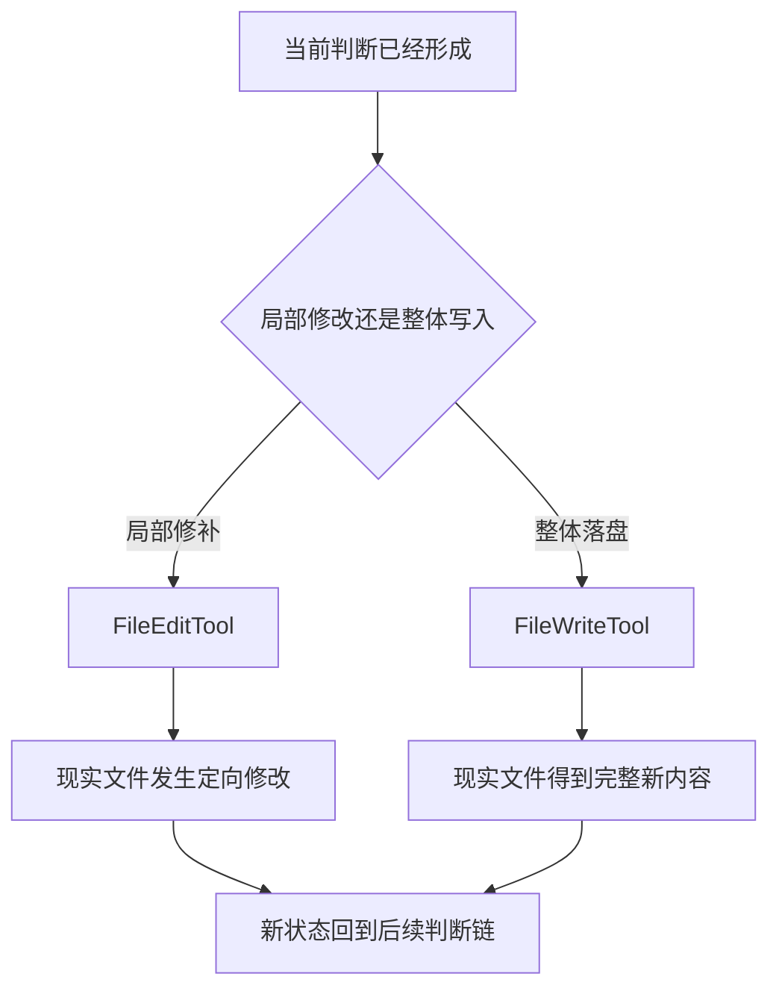
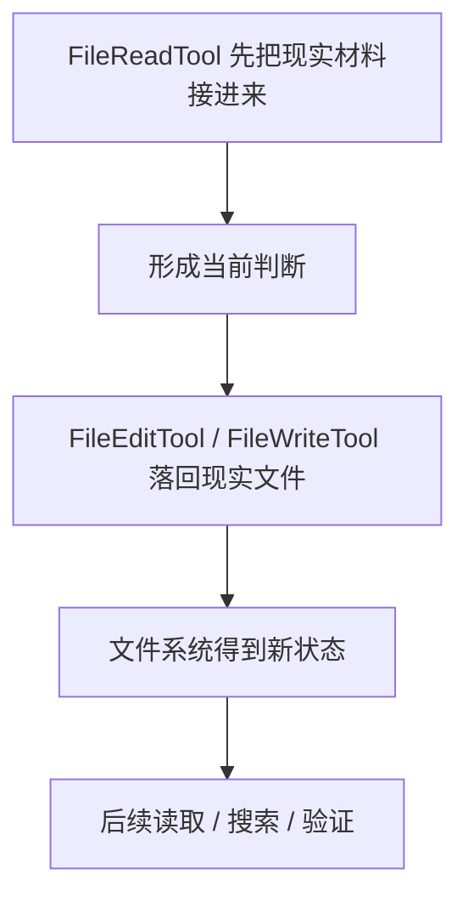

# 卷三 07｜FileEdit / FileWrite 怎么把当前判断落回现实文件

## 导读

- **所属卷**：卷三：工具系统怎么把模型意图落成执行
- **卷内位置**：07 / 11
- **上一篇**：[卷三 06｜FileReadTool 怎么把现实材料接进当前判断](./06-how-filereadtool-brings-real-material-into-current-judgment.md)
- **下一篇**：[卷三 08｜GrepTool 怎么在现实材料里找东西](./08-how-greptool-finds-things-in-real-material.md)

## 这篇要回答的问题

第 06 篇已经把文件家族的输入半边立住了：FileReadTool 负责把现实材料接进当前判断。

那另一半自然就是：

> **当前判断形成之后，Claude Code 怎样把它正式落回现实文件？**

如果没有这一半，执行层就只能停在“看到了材料、想明白了方案”，却无法真正改变工作对象。也就是说，系统有判断，却没有现实落点。

这篇的核心判断是：

> **FileEdit / FileWrite 的核心不是改几个字符，而是把当前判断正式落回现实文件，让执行层真正改变世界里的工作对象。**

## 先给结论

### 结论一：FileEdit / FileWrite 构成了文件家族的输出半边

FileReadTool 负责把现实材料带进来。
FileEdit / FileWrite 则负责把当前判断送回去。

这两半配起来，执行层才不只是“看见世界”，而是能够在看见之后改变世界。

### 结论二：Edit 与 Write 虽然都在改文件，但承担的语义不一样

从工具目录看，它们都属于文件改动；但从执行语义看可以更准确地区分：

- **FileEditTool** 更像在既有现实对象上做局部修补
- **FileWriteTool** 更像把完整内容整体落盘成一个新的现实状态

两者都不是参数手册问题，而是“当前判断如何落回现实对象”的两种正式路线。

### 结论三：把当前判断落回文件，是执行层真正开始“改变工作对象”的地方

前面几篇里，执行层一直在：

- 识别调用
- 读取现实材料
- 获取证据
- 形成下一步判断

到 FileEdit / FileWrite 这里，系统第一次明显地从“理解世界”转向“重写世界”。这也是文件家族为什么必须独立分两篇：

- 06 讲读现实材料
- 07 讲改现实对象

## FileEdit / FileWrite 在执行层里到底做了什么

### 第一，它们把模型判断变成可见的现实变更

当 Claude Code 说“我建议这样改”，那还只是判断。

当 FileEditTool 或 FileWriteTool 真正执行后，这个判断才获得现实形态：

- 某个函数被改了
- 某段文稿被重写了
- 某个新文件被写出来了

这一步让执行层不再只是在消息链里变动，而开始在文件系统里留下可被再次读取、再次验证的变化。

### 第二，它们让文件系统成为可往返的工作对象

卷三前面已经逐步建立一件事：Claude Code 的执行不是单向动作，而是闭环。

文件家族最能体现这一点：

1. 用 FileReadTool 把现实材料接进来
2. 基于材料形成当前判断
3. 用 FileEdit / FileWrite 把判断落回去
4. 再次读、搜、验，继续下一轮判断

也就是说，文件系统在执行层里不是被动存储，而是被纳入了往返式工作链。

### 第三，它们把“修改现实”从 Bash 的命令世界里分离出来

第 05 篇说过，BashTool 理论上也能通过 `sed`、重定向等方式改文件。

但 Claude Code 仍然保留 FileEditTool / FileWriteTool，说明系统不想把“文件修改”完全交给通用命令执行面，而是希望它成为更明确、更稳定的正式执行语义。

## 图 1：FileEdit / FileWrite 落盘图

## 为什么这篇不能回头重讲 FileRead

### 因为这里真正关键的是“输出语义”，不是“材料输入”

很多文件工具文章会把“读、改、写”挤在一起。这样写当然省篇幅，但会损失最重要的结构：

- **读** 是把现实材料接入当前判断
- **改 / 写** 是把当前判断压回现实文件

如果两者不分，读者就看不见执行层中的输入半边和输出半边。

### 因为执行层真正改变现实对象，是在这一篇才发生的

FileRead 会改变判断依据，但不会改变现实文件本身。

FileEdit / FileWrite 则会让现实工作对象产生新状态。这个差异足够大，值得单独成篇。

## 图 2：文件家族的往返链

## 这篇不展开什么

### 1. 不写成参数说明书

这里不讲具体参数细节，而是解释这两个工具在执行层里承担什么语义位置。

### 2. 不主讲权限线

文件改动当然涉及路径、覆盖、批准等问题，但那是控制层话题，不在卷三主线里展开。

### 3. 不抢 Grep / ToolSearch 的搜索职责

文件改动和搜索不是一回事。下一篇开始转入搜索家族。

## 和前后文的边界

### 它承接第 06 篇

06 讲现实材料如何进入判断；07 讲当前判断如何回到现实文件。两篇一起构成文件家族的往返链。

### 它导向第 08、09 篇

当文件家族的输入 / 输出闭环都立住后，搜索家族就更容易看清：它们不是读写文件，而是帮助执行层缩短“问题到证据”与“问题到能力”的距离。

## 一句话收口

> **FileEdit / FileWrite 的意义不是在文本上动几下，而是把当前判断正式落回现实文件：一个负责在既有对象上定向修补，一个负责把完整内容整体落盘；它们让 Claude Code 的执行层第一次真正改变工作对象，而不只是理解工作对象。**
