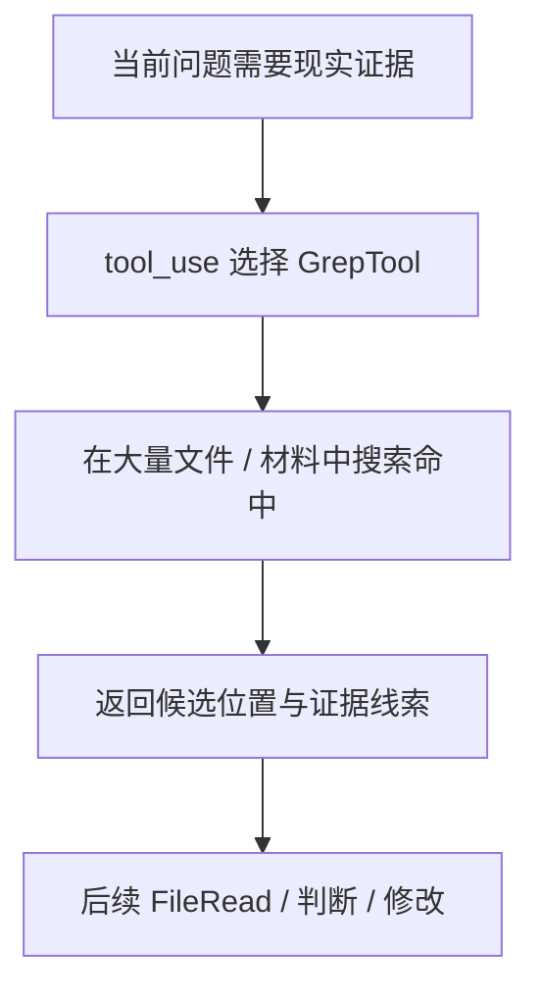

# 卷三 08｜GrepTool 怎么在现实材料里找东西

## 导读

- **所属卷**：卷三：工具系统怎么把模型意图落成执行
- **卷内位置**：08 / 11
- **上一篇**：[卷三 07｜FileEdit / FileWrite 怎么把当前判断落回现实文件](./07-how-fileedit-and-filewrite-apply-judgment-back-to-files.md)
- **下一篇**：[卷三 09｜ToolSearchTool 怎么在能力面里找该用什么工具](./09-how-toolsearchtool-finds-what-tool-to-use.md)

## 这篇要回答的问题

进入搜索家族后，最先要立住的是 GrepTool。

因为它解决的并不是泛泛“搜索”，而是更具体的一类推进动作：

> **当当前判断已经知道自己缺的是证据，而不是缺能力时，runtime 怎样在现实材料里快速把证据位置挖出来？**

这篇的核心判断是：

> **GrepTool 的职责不是帮模型“搜一搜”，而是在现实材料里做高效定位，把当前问题尽快推进到证据候选。**

## 先给结论

### 结论一：GrepTool 搜的是材料面，不是能力面

它面对的是：

- 代码库里的符号
- 文档里的表述
- 文件集合里的命中位置
- 大量现实材料中的证据线索

所以 GrepTool 解决的是“证据在哪里”，不是“该用什么工具”。

### 结论二：GrepTool 的价值在于把问题尽快推进到证据

没有 GrepTool，很多任务都会退化成：

- 盲读很多文件
- 靠 Bash 临时拼检索命令
- 在大堆材料里手工找线索

GrepTool 把“定位证据”单独立成正式执行语义后，执行层就多了一条从问题快速逼近证据的路径。

### 结论三：它常常站在 FileRead 之前，决定下一步该读哪里

FileReadTool 负责把指定内容带进当前判断。
GrepTool 更像前一道筛选动作，用来回答：

- 哪个文件值得读
- 哪几行值得看
- 证据大概落在哪一块

所以它更像“从问题到证据”的桥，而不是内容读取本身。

## GrepTool 在执行层里到底做了什么

### 第一，它把“缺证据”变成正式的定位动作

很多执行任务并不是不会做，而是还没找到该依据哪一块现实材料继续推进。

GrepTool 的作用，就是把这种“缺证据”的状态，转成一次明确的定位调用。

### 第二，它把“搜索材料”和“读取材料”拆开了

FileReadTool 解决的是内容接入。
GrepTool 解决的是证据定位。

两者经常连着用，但职责不同：

- FileRead 把内容带进来
- Grep 先把证据位置框出来

### 第三，它把“找证据”从 Bash 的通用执行面里抽成了正式语义

BashTool 当然也能跑 `grep`、`rg`、`find`。

但系统仍然保留 GrepTool，说明 Claude Code 不想把“证据定位”完全留给通用命令面，而是希望把它明确收成一种高频执行语义。

## 图 1：GrepTool 在材料检索中的位置图

## 为什么 GrepTool 不等于“普通搜索”

### 因为它搜索的不是信息空间，而是当前工作面的现实材料

它不负责联网查资料，也不负责选择能力路线。
它负责的是在当前工作区或现实材料集合里，把证据位置快速挖出来。

### 因为它经常不是终点，而是证据入口

GrepTool 往往并不给最终答案。
它更常做的是：

- 先找到命中
- 再决定读哪里
- 再决定改哪里
- 再继续验证

所以它的角色，更接近“证据入口”而不是“搜索结果终点”。

## 图 2：从问题到证据的定位链图

## 这篇不展开什么

### 1. 不和 ToolSearchTool 混成一篇

下一篇讲的是能力路线；这篇讲的是现实证据。

### 2. 不写成 bash 搜索技巧篇

我们关心的是执行语义，不是命令教程。

### 3. 不回头重讲 FileRead / FileEdit

GrepTool 负责定位，不负责完整接入内容，也不负责落盘修改。

## 和前后文的边界

### 它承接文件家族

文件家族回答了材料怎样被读入、怎样被改回现实；GrepTool 开始回答：材料很多时，系统怎样先把证据位置找出来。

### 它导向 ToolSearchTool

第 09 篇会讲另一种完全不同的搜索：不是从问题到证据，而是从问题到路线。

## 一句话收口

> **GrepTool 的作用，不是泛泛地“搜一搜”，而是在现实材料里做高效定位，把当前问题尽快推进到证据候选、命中位置和下一步应读对象上；它在执行层里承担的是“从问题到证据”的正式桥接角色。**
