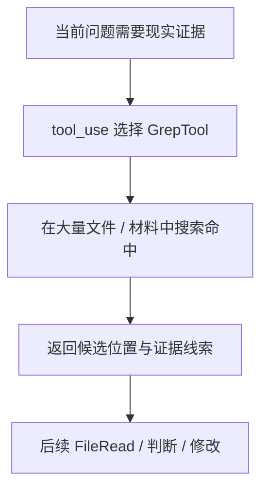

# 卷三 08｜GrepTool 怎么在现实材料里找东西

## 导读

- **所属卷**：卷三：工具系统怎么把模型意图落成执行
- **卷内位置**：08 / 11
- **上一篇**：[卷三 07｜FileEdit / FileWrite 怎么把当前判断落回现实文件](./07-how-fileedit-and-filewrite-apply-judgment-back-to-files.md)
- **下一篇**：[卷三 09｜ToolSearchTool 怎么在能力面里找该用什么工具](./09-how-toolsearchtool-finds-what-tool-to-use.md)

## 这篇要回答的问题

进入搜索家族后，最先要立住的是 GrepTool。

因为它解决的并不是泛泛“搜索”问题，而是更具体的一类工作：

> **当当前判断已经知道自己要找证据、找位置、找命中的时候，runtime 怎样在现实材料里快速定位需要的东西？**

这篇的核心判断是：

> **GrepTool 的职责不是帮模型“搜一搜”，而是在现实材料里做高效定位，缩短执行层从问题到证据的距离。**

## 先给结论

### 结论一：GrepTool 搜索的是现实材料，不是能力面

搜索这件事很容易写糊。尤其卷三后面紧挨着还有 ToolSearchTool，如果两篇不分，很容易都写成“系统帮模型搜东西”。

但 GrepTool 搜的对象非常明确：

- 代码库里的某个符号
- 文档里的某个表述
- 文件集合里的某条证据
- 大量现实材料中的命中位置

它面对的是**材料面**，不是能力面。

### 结论二：GrepTool 的价值不在“看起来会搜索”，而在“让执行层别再盲读全部材料”

如果没有 GrepTool，很多工作会退化成：

- 先读很多文件
- 再一段段找
- 或者用 BashTool 自己拼命令检索

GrepTool 把“在大量现实材料中定位证据”单独立成正式能力后，执行层就多了一条更高效的证据发现路径。

### 结论三：GrepTool 站在 FileRead 之前或旁边，经常是为了决定“下一步该读哪里”

FileReadTool 是把指定材料带进当前判断。
GrepTool 则常常先帮助系统回答：

- 哪个文件值得读
- 哪几行值得看
- 证据大概落在哪一块

所以它和 FileRead 常常相邻，但角色并不一样。

## GrepTool 在执行层里到底做了什么

### 第一，它缩短了“问题到证据”的距离

很多执行任务里，模型不是缺动作，而是缺定位：

- 某个函数在哪里定义
- 某个配置键在哪些文件出现
- 某个术语曾在哪里被写过

GrepTool 的意义就在于，它让系统不用先完整读遍材料，而能先在现实材料面上做快速筛选和定位。

### 第二，它把“搜索材料”从“读取材料”里分离出来

FileReadTool 解决的是内容接入。
GrepTool 解决的是证据定位。

这两者常常连着用，但不应混为一谈：

- FileRead 更像把对象内容搬进来
- Grep 更像先告诉你“对象在哪、命中在哪、证据在哪” 

### 第三，它把“找东西”从 Bash 的命令世界里抽成正式执行语义

理论上，BashTool 当然也能跑 `grep`、`rg`、`find` 等命令。

但 Claude Code 仍然保留 GrepTool，说明系统设计上并不希望“定位证据”完全依赖通用命令执行面，而是希望它成为可被 runtime 正式识别的一种高频工作语义。

## 图 1：GrepTool 在材料检索中的位置图

## 为什么 GrepTool 不等于“普通搜索”

### 因为它搜索的对象是现实材料，而不是一般信息空间

GrepTool 的意义不是联网查资料，也不是决定该用哪个能力。它面对的是当前工作区或现实材料集合中的可检索对象。

所以它更准确的名字，不是“搜索工具”，而是**现实材料定位工具**。

### 因为它常常是执行链里的证据入口，而不是结果终点

很多时候，GrepTool 本身并不提供最终答案。它只是把问题推进到下一步：

- 先找到命中
- 再决定读哪里
- 再决定改哪里
- 再继续验证

从这个角度看，GrepTool 更像“证据发现器”。

## 图 2：从问题到证据的定位链图

## 这篇不展开什么

### 1. 不和 ToolSearchTool 混成一篇

下一篇会专门讲能力发现。GrepTool 解决的是“材料里有什么”，不是“该用什么能力”。

### 2. 不写成 bash 搜索技巧篇

我们关心的是执行语义，不是 `grep` 命令教程。

### 3. 不回头重讲 FileRead / FileEdit

GrepTool 负责定位，不负责把材料完整拉进来，也不负责落盘修改。

## 和前后文的边界

### 它承接文件家族

文件家族建立了材料输入和现实变更；GrepTool 则开始回答：当材料很多时，系统怎样先找到值得看的那一小块。

### 它导向 ToolSearchTool

第 09 篇会解释另一种“搜索”：不是在材料面找证据，而是在能力面找该用什么工具。两篇一前一后，刚好把搜索家族分开。

## 一句话收口

> **GrepTool 的作用不是泛泛地“搜一搜”，而是在现实材料里做高效定位：它把当前问题快速推进到证据候选、命中位置和下一步应读的对象上，因此在执行层里承担的是“从问题到证据”的正式桥接角色。**
