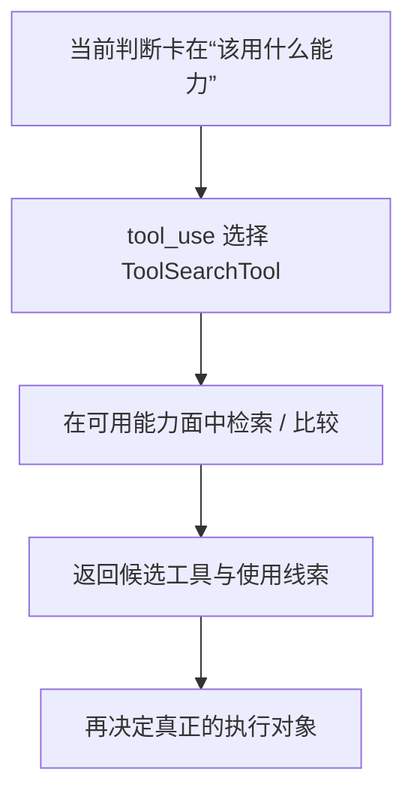

# 卷三 09｜ToolSearchTool 怎么在能力面里找该用什么工具

## 导读

- **所属卷**：卷三：工具系统怎么把模型意图落成执行
- **卷内位置**：09 / 11
- **上一篇**：[卷三 08｜GrepTool 怎么在现实材料里找东西](./08-how-greptool-finds-things-in-real-material.md)
- **下一篇**：[卷三 10｜为什么执行层不只接本地工具：SkillTool / AgentTool 的位置](./10-why-execution-layer-does-not-only-handle-local-tools.md)

## 这篇要回答的问题

第 08 篇已经把 GrepTool 的位置钉住了：它是在现实材料里找证据。

接下来要立的，是另一种完全不同的搜索：

> **当系统卡住的不是“材料在哪里”，而是“接下来该调用什么能力”时，runtime 怎样把这件事也变成可执行的一步？**

这就是 ToolSearchTool 的位置。

这篇的核心判断是：

> **ToolSearchTool 搜索的不是现实材料，而是执行能力面；它解决的是“该用什么工具”，不是“材料里有什么”。**

## 先给结论

### 结论一：ToolSearchTool 的对象不是文件、代码或文档，而是工具能力本身

这和 GrepTool 有根本区别。

GrepTool 面对的是现实材料。
ToolSearchTool 面对的是 runtime 可调用的能力集合。

也就是说，它把“找工具”这件事本身也收进了执行层，而不是把这一步留给模型纯靠记忆硬猜。

### 结论二：ToolSearchTool 说明执行层不只要找证据，也要找能力

执行任务里常见两类卡点：

- 我不知道证据在哪里
- 我不知道下一步该调什么能力

卷三前半已经铺垫过：Claude Code 不是让模型凭空做事，而是让 runtime 把判断落成正式执行链。

如果“该用什么能力”也会成为瓶颈，那 runtime 就必须给它一个正式入口。ToolSearchTool 正是在填这块空白。

### 结论三：ToolSearchTool 让能力选择也从隐含判断变成显式执行步骤

没有 ToolSearchTool 时，模型只能靠已有记忆决定用哪个 Tool。

有了 ToolSearchTool 之后，系统多了一条更稳的路径：

- 当能力边界不明确
- 当工具选择存在竞争
- 当需要重新确认最合适执行对象

就可以先调用能力发现工具，再决定真正要执行什么。

## ToolSearchTool 在执行层里到底做了什么

### 第一，它把“找能力”从纯认知动作变成正式执行动作

这点非常关键。

很多人会把“找工具”当成模型脑中的一步想法。ToolSearchTool 的存在说明 Claude Code 不满足于这种隐含判断。系统把这件事也做成了 Tool，这意味着：

> **能力发现本身，也被纳入了可被 runtime 接住的执行链。**

### 第二，它让执行层不仅能向现实材料发问，也能向能力平面发问

从卷三视角看，ToolSearchTool 很重要，因为它把执行层的对象范围扩了一下：

- 前面那些工具多半在碰现实对象
- ToolSearchTool 则在碰“系统可调用能力的描述面”

于是执行层不只是现实动作层，也开始显露出“自我导航”的一面。

### 第三，它和 GrepTool 形成一组非常关键的对照

这两篇必须分开，是因为它们刚好对应执行层里的两种不同搜索：

- **GrepTool**：在现实材料里找证据
- **ToolSearchTool**：在能力面里找下一步该用什么能力

如果这组边界不清，卷三后半很容易又长成旧工具目录影子。

## 图 1：ToolSearchTool 在能力发现中的位置图

## 为什么 ToolSearchTool 不是普通搜索

### 因为它不处理现实材料，而处理能力描述空间

这意味着它回答的问题不是：

- 哪个文件里有这个词
- 哪段代码里定义了这个函数

而是：

- 现在应该用 Bash、FileRead、Grep，还是别的工具
- 哪个工具更适合当前任务语义
- 这一步属于材料读取、现实修改、命令执行，还是能力发现本身

### 因为它改变的是“下一步执行路线”，而不是“当前证据内容”

GrepTool 往往把系统推进到一份证据上。
ToolSearchTool 则更像把系统推进到一条**更合适的执行路线**上。

它不是给出世界内容，而是帮助 runtime 重新决定走哪条路。

## 图 2：执行层“找能力”流程图

## 这篇不展开什么

### 1. 不回头重讲 GrepTool

两者都叫搜索，但对象完全不同。Grep 搜材料，ToolSearch 搜能力。

### 2. 不提前讲 SkillTool / AgentTool

ToolSearch 会帮助能力选择，但不等于高阶执行对象本身。第 10 篇再补执行对象边界。

### 3. 不把这篇写成工具清单篇

我们关心的是“能力发现为什么属于执行层”，不是枚举所有工具说明。

## 和前后文的边界

### 它承接第 08 篇

第 08 篇已经把“搜索现实材料”立住；第 09 篇再把“搜索能力对象”立住，这样搜索家族的边界才不会重新混掉。

### 它导向第 10 篇

一旦看到 ToolSearchTool，执行层就已经不只是在碰现实对象，还开始触到“能力对象如何被发现和调用”。第 10 篇会顺势补上非本地执行对象的位置。

## 一句话收口

> **ToolSearchTool 的意义不在于再多一个搜索功能，而在于把“该用什么能力”也变成 runtime 可以正式处理的一步：它搜索的是能力面而不是材料面，返回的是执行路线线索而不是现实证据，因此构成了执行层里的“能力发现”正式语义。**
