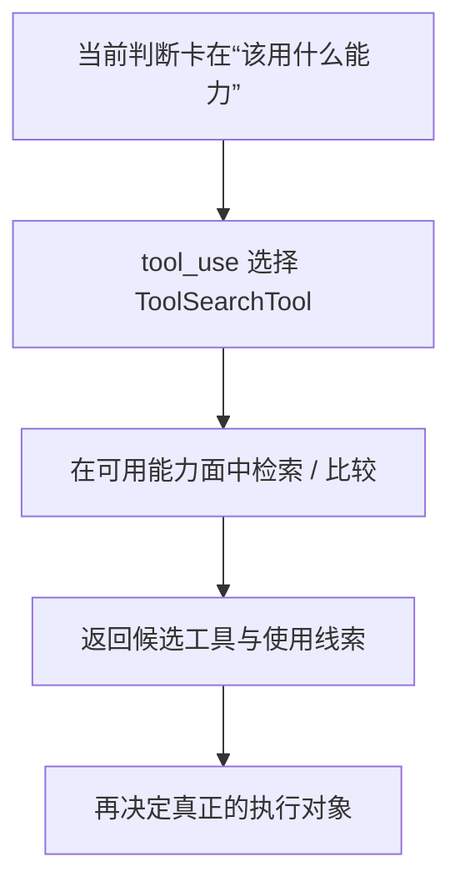

# 卷三 09｜ToolSearchTool 怎么在能力面里找该用什么工具

## 导读

- **所属卷**：卷三：工具系统怎么把模型意图落成执行
- **卷内位置**：09 / 11
- **上一篇**：[卷三 08｜GrepTool 怎么在现实材料里找东西](./08-how-greptool-finds-things-in-real-material.md)
- **下一篇**：[卷三 10｜为什么执行层不只接本地工具：SkillTool / AgentTool 的位置](./10-why-execution-layer-does-not-only-handle-local-tools.md)

## 这篇要回答的问题

第 08 篇已经把 GrepTool 的位置钉住了：它是在现实材料里找证据。

接下来要立的，是另一种完全不同的推进动作：

> **当系统卡住的不是“证据在哪”，而是“下一步该走哪条执行路线”时，runtime 怎样把这件事也变成正式的一步？**

这就是 ToolSearchTool 的位置。

这篇的核心判断是：

> **ToolSearchTool 搜索的不是现实材料，而是执行能力面；它解决的是“该走什么路线”，不是“材料里有什么”。**

## 先给结论

### 结论一：ToolSearchTool 面对的是能力集合，不是文件集合

它要处理的问题不是：

- 哪个文件里有这个词
- 哪段代码里定义了这个函数

而是：

- 现在该用 Bash、FileRead、Grep，还是别的能力
- 哪个工具更贴近当前任务语义
- 这一步属于读取、修改、搜索，还是能力发现本身

### 结论二：它把“找能力”从模型脑内判断，提升成正式执行步骤

如果没有 ToolSearchTool，模型只能靠已有记忆硬猜下一步该调什么。

有了它之后，系统就多了一条更稳的路线：

- 当工具边界不清
- 当多个工具看起来都能做
- 当下一步路线需要重新确认

就可以先调用能力发现，再决定真正执行什么。

### 结论三：它在执行层里承担的是“从问题到路线”的桥接角色

GrepTool 把问题推进到证据。
ToolSearchTool 把问题推进到路线。

这两者都叫搜索，但推进的对象完全不同。

## ToolSearchTool 在执行层里到底做了什么

### 第一，它把“找能力”从隐含判断变成正式调用

很多人会把“找工具”当成模型脑中默默完成的一步。

ToolSearchTool 的存在说明 Claude Code 不满足于这种隐含判断。系统把这件事也收成了 Tool，于是：

> **能力发现本身，也成了可以被 runtime 接住的一步执行。**

### 第二，它让执行层不仅能向现实材料发问，也能向能力面发问

前面的很多对象都在碰现实对象。
ToolSearchTool 的特别之处在于，它开始让执行层对“系统自己有哪些能力、该怎么选”发问。

这一步很关键，因为它让执行层从单纯动作层，长出了一点**路线选择能力**。

### 第三，它把下一步执行对象的选择显式化了

ToolSearchTool 返回的通常不是现实证据，而是：

- 候选工具
- 使用线索
- 更合适的后续执行方向

也就是说，它改变的不是当前世界内容，而是后续执行路线。

## 图 1：ToolSearchTool 在能力发现中的位置图

## 为什么 ToolSearchTool 不是普通搜索

### 因为它处理的是能力描述空间，而不是现实材料空间

它不回答“哪里有证据”，而回答“下一步走哪条路线更对”。

### 因为它返回的是路线线索，而不是证据内容

GrepTool 更像把系统推到证据前面。
ToolSearchTool 更像把系统推到一条更合适的执行路径上。

所以它更准确的角色，不是“搜索结果器”，而是“路线发现器”。

## 图 2：执行层“从问题到路线”的流程图

## 这篇不展开什么

### 1. 不回头重讲 GrepTool

两者都叫搜索，但 Grep 搜材料，ToolSearch 搜路线。

### 2. 不提前讲 SkillTool / AgentTool

ToolSearch 负责帮助选路，不等于高阶执行对象本身。第 10 篇再补对象谱系。

### 3. 不把这篇写成工具清单篇

我们关心的是“能力发现为什么属于执行层”，不是枚举全部工具。

## 和前后文的边界

### 它承接第 08 篇

第 08 篇立住了“从问题到证据”；这一篇立住“从问题到路线”。搜索家族到这里才真正分开。

### 它导向第 10 篇

一旦看到 ToolSearchTool，执行层就已经不只是在碰现实对象，也开始显露“执行对象如何被选择”的层面。第 10 篇顺势补齐更高阶执行对象的位置。

## 一句话收口

> **ToolSearchTool 的意义，不在于多一个搜索功能，而在于把“下一步该走什么执行路线”也变成 runtime 可以正式处理的一步：它搜索的是能力面，返回的是路线线索，因此在执行层里承担的是“从问题到路线”的桥接角色。**
