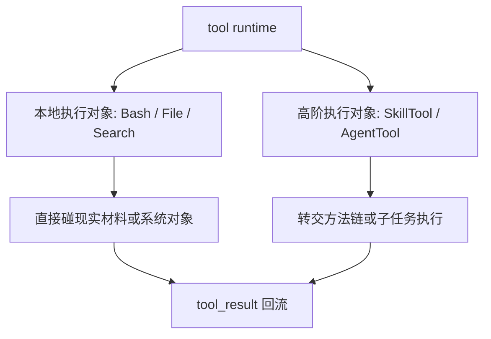
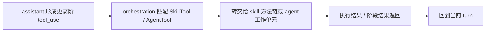

# 卷三 10｜为什么执行层不只接本地工具：SkillTool / AgentTool 的位置

## 导读

- **所属卷**：卷三：工具系统怎么把模型意图落成执行
- **卷内位置**：10 / 11
- **上一篇**：[卷三 09｜ToolSearchTool 怎么在能力面里找该用什么工具](./09-how-toolsearchtool-finds-what-tool-to-use.md)
- **下一篇**：[卷三 11｜把整条执行层重新压成一张稳定运行图](./11-stable-execution-layer-map.md)

## 这篇要回答的问题

卷三前九篇已经把本地工具家族基本铺开了：

- Bash 负责命令执行
- File 家族负责材料输入与现实变更
- Search 家族负责证据定位与能力发现

如果到这里就收，读者会很容易得到一个不完整印象：

> **好像执行层只等于本地工具。**

但 Claude Code 的执行层并不止如此。它还能把模型意图转交给 skill 或 agent 这种更高阶对象。于是第 10 篇要补的，就是卷三的对象边界：

> **为什么 SkillTool / AgentTool 也算执行对象的一种？**

核心判断是：

> **执行层真正统一的不是“本地工具”，而是“凡是能被 runtime 接住并推进现实工作的执行对象”。SkillTool / AgentTool 只是对象层级更高，不代表它们跳出了卷三。**

## 先给结论

### 结论一：卷三的统一对象不是“本地能力”，而是“可被 runtime 接住的执行对象”

这句话很关键。

如果卷三统一对象只是“本地能力”，那 SkillTool / AgentTool 就会显得像外来者。

但前面第 03 篇已经立过：Tool 的意义在于把不同能力压成同一执行接口层。顺着这个判断往后走，SkillTool / AgentTool 的出现就不是跳线，而是补全：

- 本地对象是执行对象
- 更高阶的 skill / agent 也可以成为执行对象

### 结论二：SkillTool / AgentTool 之所以能留在卷三，是因为这里讨论的是“怎样被执行层接住”，不是“它们怎样构成扩展平台”

这也是卷三和卷五的硬边界。

卷三只回答：

- 为什么它们也会出现在 `tool_use -> ... -> tool_result` 这条执行链上
- 为什么 runtime 能把它们当作一次正式调用来处理

卷五才展开：

- skills 的发现、frontmatter、方法组织
- agents / subagents / team runtime 的扩展能力
- 整个平台怎样继续长能力

### 结论三：SkillTool / AgentTool 把执行层的对象范围从“直接碰现实”扩展到“转交更高阶执行者”

前九篇里的大多数对象都在直接碰现实：命令、文件、材料、搜索。

SkillTool / AgentTool 的特殊性在于：它们常常不是自己完成所有动作，而是把当前意图转交给：

- 一套 skill 所代表的方法与步骤链
- 一个 agent 所代表的持续工作单元

也就是说，执行层不只会执行动作，也会**转交执行责任**。

## SkillTool / AgentTool 为什么仍属于执行层

### 第一，因为它们同样是由 `tool_use` 发起、由 runtime 接住的正式调用

从卷三观察框架看，最重要的不是内部细节，而是：

- 它们是不是 assistant 产出的正式执行请求
- runtime 能不能识别并匹配它们
- 它们的结果是否会回到当前 turn

在这三个维度上，SkillTool / AgentTool 仍然和前面那些 Tool 属于同一条主线。

### 第二，因为它们解决的仍然是“模型意图怎样继续推进现实工作”

只是前面的本地工具多半自己直接碰现实对象；SkillTool / AgentTool 则更像把这份推进工作交给更高一层的执行者。

但无论对象层级高低，卷三关心的那件事并没有变：

> **runtime 怎样把意图真正推进下去。**

### 第三，因为它们让执行层不再只是一层“本地动作层”

一旦 SkillTool / AgentTool 出现，执行层的地图就更完整了：

- 有些对象直接改现实
- 有些对象先去找证据
- 有些对象先去找能力
- 还有一些对象会转交一整段方法或子任务

这说明执行层真正统一的，是“可被 runtime 接住的执行对象谱系”。

## 图 1：本地工具与非本地执行对象并列图

## SkillTool / AgentTool 在卷三里到底该讲到哪里

卷三必须告诉读者：执行层不只接本地工具。否则后面看卷五时，会误以为 skills / agents 是另起炉灶的新系统。

但卷三也不能在这里把卷五提前写掉。这里最多只讲：

- 它们为什么也属于执行对象
- 它们怎样补全执行对象地图
- 它们和本地工具路径的差异在哪里

不展开：

- skill frontmatter 细节
- runtime interface 细节
- 多代理协作结构
- team runtime 主链

## 图 2：SkillTool / AgentTool 在执行层中的位置图

## 这篇不展开什么

### 1. 不展开 skill 发现与方法学系统

那是卷五与卷六要详细解释的对象。

### 2. 不展开 agent / subagent 主链

这里点到为止，只说明它们为什么属于执行对象补全。

### 3. 不让本篇变成扩展平台篇

这篇只负责把卷三执行对象地图补齐，不负责讲扩展平台如何生长。

## 和前后文的边界

### 它承接第 09 篇

第 09 篇已经把能力发现带进执行层。第 10 篇顺势告诉读者：被发现和被调用的能力，不只限于本地工具对象。

### 它导向第 11 篇

第 11 篇会把整卷重新压成稳定运行图。只有先把非本地执行对象也补进来，卷尾总图才不会漏层。

## 一句话收口

> **执行层不只接 Bash / File / Search 这类本地工具，因为 runtime 真正统一的不是“本地能力”而是“可被正式接住的执行对象”；SkillTool / AgentTool 之所以留在卷三，不是因为这里要展开扩展平台，而是因为它们同样承担了“把模型意图继续推进成现实工作”的执行职责。**
