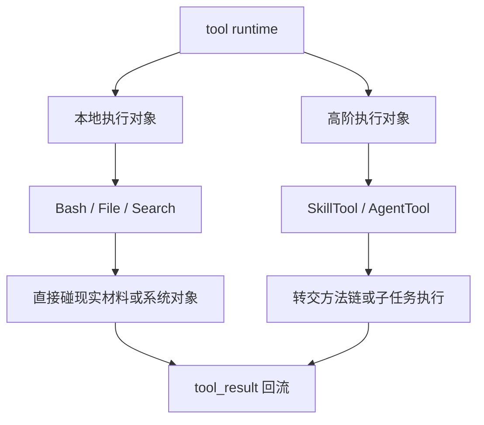
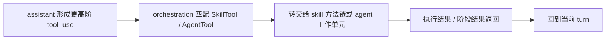

# 卷三 10｜为什么执行层不只接本地工具：SkillTool / AgentTool 的位置

## 导读

- **所属卷**：卷三：工具系统怎么把模型意图落成执行
- **卷内位置**：10 / 11
- **上一篇**：[卷三 09｜ToolSearchTool 怎么在能力面里找该用什么工具](./09-how-toolsearchtool-finds-what-tool-to-use.md)
- **下一篇**：[卷三 11｜把整条执行层重新压成一张稳定运行图](./11-stable-execution-layer-map.md)

## 这篇要回答的问题

卷三前九篇已经把本地对象大体铺开了：

- Bash 负责命令执行
- File 家族负责材料输入与现实变更
- Search 家族负责证据定位与能力发现

如果到这里收卷，读者很容易形成一个错误地图：

> **好像执行层只是一层本地工具总线。**

第 10 篇的作用，不是替卷五做防误解说明，而是把卷三这张地图补全。

因为 Claude Code 的执行层真正统一的，从来不是“本地能力”，而是：

> **凡是能被 runtime 正式接住、并继续推进工作的执行对象。**

顺着这个定义，SkillTool / AgentTool 留在卷三就不是越界，而是补地图。

## 先给结论

### 结论一：卷三统一的不是本地工具，而是执行对象谱系

这是第 10 篇最该留下来的句子。

卷三前半已经立过两层判断：

- Tool 统一的是对象形态
- orchestration 统一的是接入与分发

顺着这两层往下看，执行层真正稳定下来的，就不是一组本地实现，而是一张对象谱系：

- 有的对象直接执行命令
- 有的对象读取或改写现实材料
- 有的对象负责找证据
- 有的对象负责找能力
- 有的对象把工作转交给更高阶执行者

SkillTool / AgentTool 的加入，补全的正是这张谱系图。

### 结论二：SkillTool / AgentTool 仍然属于卷三，因为它们仍走执行链

判断它们该不该留在卷三，不该看它们“高级不高级”，而该看它们是不是还在同一条链上：

- 是否由 `tool_use` 发起
- 是否由 runtime 正式接住
- 是否会把结果重新送回当前 turn

只要这三点成立，它们就仍然属于卷三正在讨论的执行层对象。

### 结论三：它们把执行层从“直接动作层”扩成了“执行责任分配层”

前面的大多数对象，都在直接碰现实：

- 跑命令
- 读文件
- 改文件
- 找证据

而 SkillTool / AgentTool 更特殊的地方在于：它们经常不是自己把动作做完，而是把当前问题转交给：

- 一套方法链
- 一个持续工作的 agent 单元

这说明执行层不只是做动作，还会**分配执行责任**。

## 为什么 SkillTool / AgentTool 仍属于执行层

### 第一，因为它们仍然是正式调用对象，不是额外漂浮的一层能力描述

从卷三视角看，关键不在于 skill 或 agent 背后有多少扩展机制，而在于它们一旦作为 Tool 出现，就已经进入了执行层语言：

- assistant 可以调用它
- orchestration 可以识别它
- 当前 turn 可以等待它的结果回流

这说明它们并不是卷三之外突然插进来的陌生物，而是执行对象谱系中的高阶成员。

### 第二，因为它们仍然在回答同一个卷级问题

卷三从头到尾只回答一件事：

> **模型决定做事之后，runtime 怎样把这份意图继续推进成现实工作？**

对 BashTool 来说，推进方式是直接跑命令。
对 FileReadTool 来说，推进方式是把材料拉进当前判断。
对 SkillTool / AgentTool 来说，推进方式则是把工作继续委托给更高阶执行者。

推进方式不同，但回答的仍是同一个卷级问题。

### 第三，因为不补这一层，卷三的地图会少掉一类关键对象

如果卷三只写到本地工具，读者就会误以为：

- 只有直接碰文件、命令、搜索的对象才算执行对象
- skills / agents 是下一卷才突然出现的新系统

这会让卷五显得像另起炉灶。

而事实更接近于：卷三先交代**它们也走执行层**，卷五再展开**它们怎样长成平台能力**。

## 图 1：执行对象谱系图

这张图的重点不是“本地 / 非本地”的分类，而是：**它们都已经属于同一张执行对象谱系图。**

## SkillTool / AgentTool 在卷三里到底讲到哪里

卷三只需要把地图补齐到这个程度：

- 它们为什么也算执行对象
- 它们怎样沿执行链被接住
- 它们和直接动作类对象的差异是什么

也就是说，这里要讲的是**位置**，不是**展开**。

因为卷三在讲执行层地图，卷五才讲扩展平台结构。

## 图 2：SkillTool / AgentTool 在执行层中的位置图

## 这篇不展开什么

### 1. 不展开 skill 的发现、frontmatter 和方法学系统

这些会在后面讨论扩展能力时再展开。

### 2. 不展开 agent / subagent 的完整运行结构

这里只说明它们为什么属于执行对象谱系，不提前进入平台层正文。

### 3. 不把这篇写成“这里只提一下，后面再说”的说明文

这篇本身要完成的任务很明确：把卷三执行层的对象范围补齐。

## 和前后文的边界

### 它承接第 09 篇

第 09 篇已经说明执行层不仅会找现实证据，也会找能力路线。第 10 篇进一步说明：被发现、被调用的执行对象，也不只限于本地工具。

### 它导向第 11 篇

只有把 SkillTool / AgentTool 也放回执行层地图，卷尾那张稳定运行图才不会少掉一个对象层级。

## 一句话收口

> **第 10 篇真正补上的，不是“顺便提一下非本地工具”，而是卷三缺失的对象谱系：执行层统一的从来不是本地能力，而是凡是能被 runtime 正式接住并继续推进工作的执行对象；SkillTool / AgentTool 只是这张谱系图里的高阶成员。**
