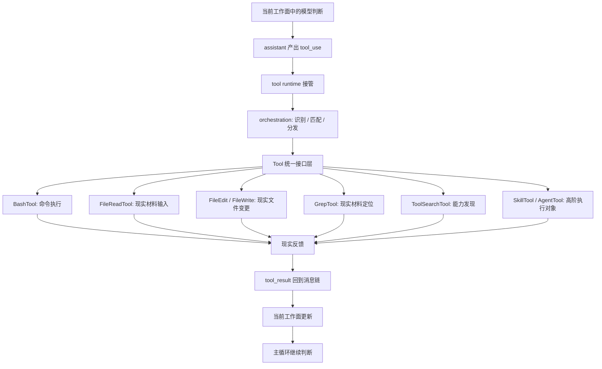

# 卷三 11｜把整条执行层重新压成一张稳定运行图

## 导读

- **所属卷**：卷三：工具系统怎么把模型意图落成执行
- **卷内位置**：11 / 15
- **上一篇**：[卷三 10｜为什么执行层不只接本地工具：SkillTool / AgentTool 的位置](./10-why-execution-layer-does-not-only-handle-local-tools.md)
- **下一篇**：[卷三 12｜为什么 Claude Code 的执行层必须先长出权限管线](./12-why-execution-layer-must-grow-a-permission-pipeline-first.md)

## 这篇要回答的问题

卷三前十篇已经分别讲了：

- 为什么模型意图不能直接变成现实动作
- `tool_use -> orchestration -> execution -> tool_result` 这条主线
- Tool 为什么先统一对象形态
- orchestration 怎样把调用正式接入执行层
- Bash / File / Search 这些样本各自承担什么执行语义
- SkillTool / AgentTool 怎样补全执行对象谱系

卷尾不该再平均回顾一遍，而要把这些内容压成最后一个更硬的判断：

> **卷三真正建立的，不是“工具目录怎么分”，而是执行层怎样稳定运行。**

也可以再压短一点：

> **模型意图不会直接碰现实；它必须先被写成 `tool_use`，被执行层接住，穿过不同执行对象，再以 `tool_result` 回到主循环。**

这就是卷三最终要留下的地图。

## 先把卷三压成三句话

### 第一句：执行层存在，是因为模型意图不能直接变成现实动作

模型会判断、会规划、会提出下一步，但现实世界不会因为一句话自动改变。

所以 Claude Code 必须在中间插入一层正式执行结构，让“想做事”先变成“可被接住的调用”。

### 第二句：执行层稳定，靠的是“统一对象 + 统一接入 + 统一回流”

卷三真正钉住的不是单个工具，而是三道稳定结构：

- Tool 把不同能力压成统一对象形态
- orchestration 把正式调用接入并分发
- `tool_result` 把现实反馈重新并回主循环

执行层之所以能长期成立，不是因为某个工具特别强，而是因为这三道结构把整条链锁住了。

### 第三句：不同工具只是这张稳定图上的不同执行对象样本

Bash、File、Search、Skill、Agent 看起来差异很大，但在卷三里它们都不是孤立话题。

它们只是同一执行层稳定图上，分担不同执行语义的对象样本。

## 图 1：卷三执行层稳定运行总图

这张图最重要的不是六个样本名称，而是中间那条不能断的链：

> **`tool_use` 负责把意图正式化，orchestration 负责把调用接进去，Tool 负责把对象形态压平，`tool_result` 负责把现实反馈接回来。**

卷三讲的就是这条链怎样稳住。

## 卷三最后真正守住了什么

### 它守住了一个硬边界：执行层不是主循环，但它必须把主循环接回去

卷三不负责解释长期上下文怎样维护，也不负责解释控制层怎样批准、拦截、整合。

但卷三必须负责一件更具体的事：

- 模型的这次调用怎样进入现实执行
- 现实反馈怎样重新回到当前 turn

也就是说，卷三讲的是**执行闭环**，不是整个系统的全部。

### 它守住了一个硬判断：Claude Code 组织的不是工具清单，而是执行对象谱系

如果把卷三读成“若干工具说明书”，就会错过真正重要的东西。

Claude Code 更像是在组织一组执行对象：

- 有的负责直接动作
- 有的负责材料接入
- 有的负责证据定位
- 有的负责能力发现
- 有的负责转交更高阶执行者

卷三真正建立的，是这组对象如何挂在同一稳定执行图上。

### 它也守住了后续三卷的入口边界

卷三压稳之后，后面三卷才能各自接走自己的问题：

- 卷四接“这条链怎么长期维持”
- 卷五接“系统怎样长出更多执行者”
- 卷六接“命令、权限、控制层怎样把它整合成产品入口”

所以卷三的结束方式，不是把话题讲完，而是把执行层边界压清。

## 为什么卷尾必须收得更硬

前面十篇可以拆开看；卷尾这一篇不能再拆。

因为读完整卷之后，读者最该带走的不是“BashTool 在第 05 篇，GrepTool 在第 08 篇”，而是下面这个更稳的判断：

> **Claude Code 不是让模型直接操纵现实，而是要求模型先把意图写成正式调用；执行层再用统一对象、统一接入和统一回流，把这份意图稳定地推进成现实工作。**

如果这句话立不住，卷三就仍然只是工具文章集合。

## 这篇不再展开什么

### 1. 不重讲每个工具家族正文

卷尾只回收角色，不复述局部实现。

### 2. 不抢卷四、卷五、卷六的主问题

这里只把边界压清，不提前展开后续正题。

## 一句话收口

> **卷三最终留下的，不是工具目录，而是一张稳定执行图：模型先把意图写成 `tool_use`，执行层再用统一对象、统一接入和统一回流，把这份意图推进成现实工作，并把结果接回主循环；从这里开始，卷四接持续性，卷五接扩展性，卷六接控制层。**
