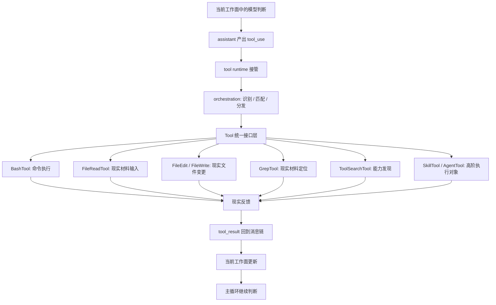
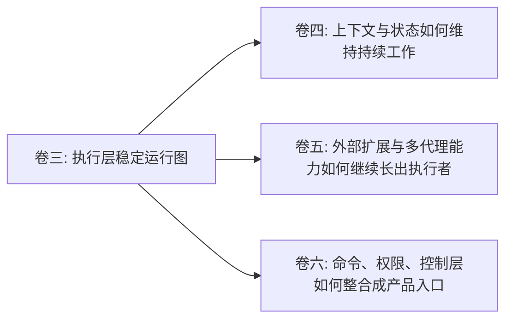

# 卷三 11｜把整条执行层重新压成一张稳定运行图

## 导读

- **所属卷**：卷三：工具系统怎么把模型意图落成执行
- **卷内位置**：11 / 11
- **上一篇**：[卷三 10｜为什么执行层不只接本地工具：SkillTool / AgentTool 的位置](./10-why-execution-layer-does-not-only-handle-local-tools.md)
- **下一篇**：卷四：上下文与状态怎么维持系统持续工作

## 这篇要回答的问题

卷三前十篇已经先后建立了：

- 为什么模型意图不能直接变成现实动作
- `tool_use -> orchestration -> execution -> tool_result` 的执行主线
- Tool 作为统一执行接口
- orchestration 作为接入与分发桥
- Bash / File / Search 三组本地样本
- SkillTool / AgentTool 作为执行对象补全

如果没有最后这一篇，卷三很容易重新散回“很多工具文章”。所以卷尾要做的不是再讲一个新知识点，而是把前面所有角色压回一张稳定图。

这篇的核心判断是：

> **卷三真正建立的，不是若干工具说明书，而是一张执行层稳定运行图：模型意图如何进入 tool runtime，被 orchestration 接住，落成不同类型的执行对象，再把结果接回主循环。**

## 先把卷三压回一句话

卷三从头到尾，其实都在回答同一个问题：

> **模型决定调用能力之后，runtime 怎么把这个意图真正落成现实执行？**

现在可以把答案压成最短版本：

1. assistant 先把意图写成 `tool_use`
2. orchestration 接住这次正式调用
3. Tool 接口层把不同能力统一成可调度对象
4. 具体执行对象去碰现实材料、现实文件、命令世界、能力面或高阶执行者
5. 结果以 `tool_result` 回流到当前 turn
6. 主循环拿回新输入，继续判断

卷三前十篇其实都在为这六步补不同侧面。

## 卷三前十篇到底各自留下了什么

### 01：先立执行层存在理由

第 01 篇解决的是：为什么模型意图不能直接等于现实动作。它把 tool runtime 先立成必要中间层。

### 02：建立执行主线

第 02 篇给出 `tool_use -> orchestration -> execution -> tool_result` 这条总图，让后文不再散。

### 03：建立 Tool 统一接口

第 03 篇解释为什么差异巨大的执行能力能被同一层接住。

### 04：建立 orchestration 桥

第 04 篇把“谁来接住一次调用、谁来分发到正确对象”讲清。

### 05-09：用本地样本把执行层落地

- 05 Bash：通用执行面
- 06 FileRead：现实材料输入
- 07 FileEdit / FileWrite：现实文件落盘
- 08 Grep：现实材料定位
- 09 ToolSearch：能力面发现

### 10：补全执行对象地图

第 10 篇说明执行层不只接本地对象，还能接 skill / agent 这种更高阶执行者。

所以前十篇并不是十个并排话题，而是十块共同搭起执行层稳定图的部件。

## 图 1：卷三执行层稳定运行总图

这张图里最重要的，不是六个样本本身，而是它们都挂在同一条稳定运行图上。

## 卷三真正守住了哪些边界

### 它没有滑进卷四

卷三会提到结果回流、当前工作面更新，但它不主讲长期上下文治理。卷四要回答的是：

- 消息怎样长期维持
- 上下文怎样构造与压缩
- 系统怎样持续工作而不爆炸

卷三只讲“怎样执行并回流”，不讲“怎样长期治理”。

### 它没有滑进卷五

卷三会提到 SkillTool / AgentTool，但只把它们当作执行对象补全。卷五才展开：

- skills 怎样组织方法
- agents / subagents 怎样扩展能力
- 系统怎样向外长出更多执行者

### 它没有滑进卷六

卷三会提到 BashTool 周围的权限、安全、校验存在，但不把控制层当主角。卷六才真正回答：

- 命令入口
- 权限系统
- runtime 接口
- 产品控制层整合

## 为什么卷三最后必须收成一张稳定图

因为如果没有这一步，前面的文章很容易被读成：

- 一篇讲 bash
- 一篇讲 file
- 一篇讲 grep
- 一篇讲 tool search

可卷三真正做的，不是按目录列工具，而是把“模型意图如何被 runtime 落成现实执行”一步步拆开，再重新合回去。

这也是为什么卷三比旧工具目录更像一本书：每篇都在回答同一主问题的不同层面，而不是各说各话。

## 图 2：卷三 -> 卷四 / 卷五 / 卷六 导流图

这张图要表达的不是“后面还有三卷”，而是：

- 卷三把执行层压稳之后
- 卷四、卷五、卷六才分别接走持续性、扩展性、控制性三条线

## 这篇不再展开什么

### 1. 不重讲每个工具家族正文

卷尾不是复读机。这里只回收角色，不再逐个复述实现细节。

### 2. 不抢后续各卷正题

导流可以给，但不能提前把卷四、卷五、卷六写掉。

## 一句话收口

> **卷三最终建立的，不是一些工具说明，而是一张稳定执行图：模型先把意图表达成 `tool_use`，runtime 通过 orchestration 和 Tool 接口层把它送到不同执行对象，现实反馈再以 `tool_result` 回流主循环；从这一卷往后，卷四接持续工作，卷五接扩展能力，卷六接控制层整合。**
