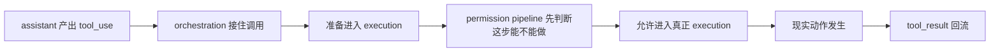
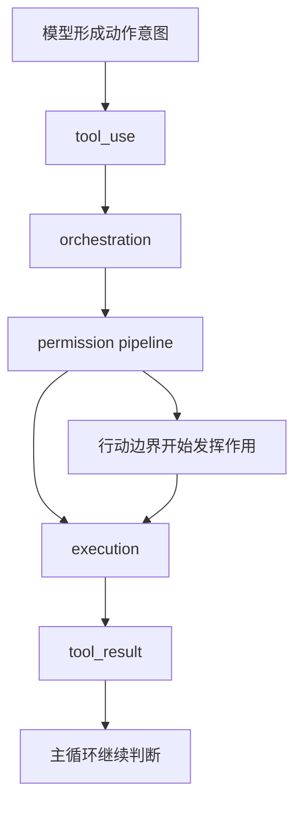

# 卷三 12｜为什么 Claude Code 的执行层必须先长出权限管线

## 导读

- **所属卷**：卷三：工具系统怎么把模型意图落成执行
- **卷内位置**：新增权限管线组 01 / 04
- **上一篇**：[卷三 11｜把整条执行层重新压成一张稳定运行图](./11-stable-execution-layer-map.md)
- **下一篇**：[卷三 13｜permission decision 是怎样接到 tool execution 之前的](./13-how-permission-decision-connects-before-tool-execution.md)

卷三前半已经把一条执行主线立住了：模型先产出 `tool_use`，执行层再把它推进成真正的现实动作。

但只把“怎么执行”讲清，还不够。Claude Code 一旦开始读文件、改文件、跑命令、做搜索，问题就不再只是“会不会做”，而会立刻变成：

> **这一步到底能不能做。**

这就是权限管线组要补上的空白。

这一组的第一篇只先立一个前提：

> **Claude Code 不是先拥有执行能力，再在执行外面补安全；它是从一开始就要求执行能力先穿过权限管线，才能获得真正的落地资格。**

## 这篇要回答的问题

前面卷三已经证明：模型意图不能直接变成现实动作，Claude Code 必须有一层 execution runtime。

这一篇接着追问的是：

> **既然 execution runtime 已经存在，为什么它还不能直接把动作落地，而必须先长出一条权限管线？**

如果这个问题不先立住，后面几篇就会被误读成“执行主线写完以后，再补几个确认框”。但权限系统在 Claude Code 里不是外挂；它是执行层一碰现实接口就必须长出来的前置结构。

## 先给结论

### 结论一：执行层一旦碰现实世界，就不能只回答“怎么做”，还必须先回答“能不能做”

Claude Code 的执行层之所以成立，是因为模型意图不能直接变成现实动作。

但执行层一旦真的接到现实接口，它面对的就不再只是翻译问题，而是落地资格问题。

因为现实动作和文本判断不一样。文本里的“建议做一下”没有副作用；现实里的读、写、搜、跑命令，都会真的碰到文件系统、shell、工作区边界和外部环境。

所以当执行层开始碰现实，它就必须先回答一个更硬的问题：

- 这次动作是否允许进入执行态
- 这次动作的触达范围在哪里
- 这次动作是不是超出了当前系统可接受的边界

也就是说，**执行层真正接住现实之后，第一件要长出来的不是更多工具，而是行动边界。**

### 结论二：权限系统管的不是“怎么把动作做完”，而是“这步动作有没有资格开始”

很多人一说权限，脑中先出现的是“执行危险命令前弹个确认框”。

这个想象太窄了。

Claude Code 里的权限系统，核心并不是帮工具把事情做完，而是在工具真正开始前，先判断这次动作能否进入执行。

换句话说：

- tool execution 管的是动作怎样落地
- permission pipeline 管的是动作能否落地

这两个问题不能互相替代。

如果只有 execution，没有 permission，系统会变成“只要模型提出动作，runtime 就负责把它做掉”。

这样的系统也许还能跑，但它不再是一个稳定的 agent runtime，而更像一个把现实接口裸露给模型的直通层。

### 结论三：权限管线不是执行层旁边的外挂，而是执行主线成立前的正式前置段

卷三前面的文章已经立住：Claude Code 的执行主线不是“模型一句话，工具跑一下”，而是 `tool_use -> orchestration -> execution -> tool_result`。

权限系统真正改变的是这条主线中间最关键的一点：

> **从“已经提出动作”到“允许进入执行”之间，Claude Code 插入了一条正式的 runtime 判断段。**

所以后面要讲的 permission decision，不应该被理解成执行主线外面的附属审查，而应该被理解成：

> **execution path 自己长出来的一段必要结构。**

## 为什么执行层不能裸奔

### 第一层原因：模型会形成动作意图，但现实世界并不会因为意图而自动变得可触达

第 01 篇已经讲过，模型最擅长的是形成“下一步应该做什么”的判断。

但到了执行层，这个判断只是获得了**被翻译成现实动作**的机会，并没有自动获得**碰现实的权限**。

这是两个不同问题：

- `tool_use` 解决的是：意图有没有被正式表达
- execution runtime 解决的是：动作有没有被正式接住
- permission pipeline 解决的是：这次被接住的动作，是否允许继续落地

如果没有第三层，前两层越完整，系统越危险。

因为它意味着 Claude Code 已经有了越来越稳定的现实触达能力，却没有一条同样正式的“能不能做”判断链。

### 第二层原因：现实接口天然带副作用，副作用必须先被边界化

卷三里已经见过几个典型接口：

- BashTool 会真的跑命令
- FileReadTool 会真的触达文件
- FileEdit / FileWrite 会真的改变文件内容
- GrepTool 会真的在现实材料里做定位

这些能力的共同点，不是“都叫工具”，而是：

> **它们都会把模型判断推进成现实世界中的实际动作。**

一旦这样，系统就不能只问：

- 输入有没有解析成功
- 工具有没有匹配正确
- 结果怎样回到 `tool_result`

它还必须问：

- 这个动作该不该发生
- 这个动作是不是超出了允许边界
- 这个动作如果放行，会不会直接改变系统所处的现实环境

所以权限系统不是一个额外装饰层，而是副作用系统的自然对价。

### 第三层原因：真正危险的不是“有没有工具”，而是“动作能不能直接落地”

如果 Claude Code 只是一个能推荐命令、解释代码、生成文本的系统，那权限线根本不会这么重。

权限问题之所以变成主系统，是因为 Claude Code 已经不是只会“说应该做什么”，而是会真的：

- 读
- 改
- 搜
- 跑

真正的分水岭不在工具目录里，而在落地资格上。

所以这篇最想先压住的一句话是：

> **Claude Code 最需要被治理的，不是“它有没有行动想法”，而是“它的行动想法是否能直接穿透到现实接口”。**

这就是为什么执行层一成熟，权限管线就必须同步长出来。

## 图 1：执行主线为什么必须先插入权限管线

这张图最关键的不是多了一个 permission 节点，而是执行主线的语义被改写了：

- 没有权限管线时，execution 看起来像自然下一步
- 有了权限管线后，execution 变成一种**被授予的资格状态**

这正是 Claude Code 权限系统的起点。

## 权限系统到底在执行层里管什么

### 它管的是“能不能做”，不是“怎么做完”

旧文里有一个判断值得直接回收：

> **权限系统管的是 Claude Code“能不能做这件事”，不是“怎么把这件事做完”。**

这句话之所以重要，是因为它一下就把权限和执行分开了。

执行层关心的是：

- 这次调用分发给谁
- 输入如何交给对象
- 结果怎样写回消息链

而权限层关心的是：

- 这次调用是不是现在就能继续
- 这次调用是不是必须被拦住或转成别的决策分支
- 这次调用在当前上下文里有没有落地资格

所以权限系统并不是 execution 的子步骤，而是 execution 之前的**资格判定层**。

### 它管的是“动作成立条件”，不是“用户体验上的确认动作”

把权限系统理解成确认框，会漏掉最重要的一层：

> **permission 并不等于 prompt；permission 首先是一套 runtime 决策结构。**

用户交互只是其中某个可能分支的外显形式。

在 Claude Code 的设计里，更重要的问题从来不是“有没有弹一下问用户”，而是：

- 这次动作的边界信息有没有被拿来判断
- 这次判断是不是正式进入执行主链
- 这次结果会不会直接改写后续执行命运

所以这一组后面要写的，也不是交互设计，而是执行层怎样长出一套前置裁决面。

### 它管的是 agent runtime 的行动边界，而不只是单次危险动作

如果把视角拉高一点，就会发现权限系统最后约束的从来不只是一条命令、一次编辑、一个路径。

它真正约束的是：

> **这个 agent 在当前环境里，到底拥有多大的现实行动权。**

旧文把这个判断压成了“分层行动边界”。

这一篇还不展开那个“分层”是怎么分出来的，但 opening article 至少要先把终点词定住：

- 不是确认框
- 不是安全提示
- 不是 UI 审批
- 而是行动边界

## 这篇先把问题收到哪里

到这里，这篇其实只想替后面三篇钉住一个前提：

> **如果系统已经能稳定地把模型意图翻译成现实动作，它就必须同时回答“哪些动作有资格继续落地”。**

所以权限管线不是执行之外突然加上的补丁，而是执行层一旦碰现实接口就必然长出来的边界要求。

但这一篇先不继续展开两个问题：

- 这条边界链具体接在调用链的哪个位置
- 它为什么会长成 `allow / deny / ask` 这样的结果结构

这两件事分别留给后面的第 13 篇和第 14 篇。opening article 先把必要性立住，就够了。

## 图 2：tool execution 与 permission boundary 的同主线关系

这张图想压住的不是实现顺序细节，而是一个架构判断：

> **permission pipeline 不是 execution 旁边的一块牌子，而是 execution 真正成立之前的边界段。**

## 这篇先收到哪里

这一篇先把“为什么必须先有权限管线”立住，不展开三类后续问题：`allow / deny / ask` 的结果结构、Bash 的高风险专门分析链，以及 settings / 长期授权 / policy limits 这些继续把边界往上推高的机制。它们都留给后文。

## 和前后文的边界

### 它承接卷三前半

卷三前半回答的是：执行层怎样把模型意图推进成现实动作。

这一篇承接的不是某个工具，而是那条主线的未完成部分：

> **既然执行已经开始碰现实，系统怎样先长出“能不能做”的正式判断。**

### 它导向权限管线组后 3 篇

接下来三篇会分别回答：

1. permission decision 是怎样正式接进 tool execution 主链的
2. `allow / deny / ask` 为什么是运行时裁决面，而不是几个交互按钮
3. 为什么权限系统最后会收口成执行边界，而不只是一次放不放行

也就是说，这篇的角色不是给出所有实现，而是先把后面三篇必须共享的前提立住。

## 一句话收口

> **Claude Code 的执行层之所以必须先长出权限管线，不是因为系统后来想补安全，而是因为执行一旦接到现实接口，问题就从“怎么做”升级成“能不能做”；权限系统因此不再是执行外面的确认框，而是 execution runtime 获得现实落地资格之前的正式边界段。**
