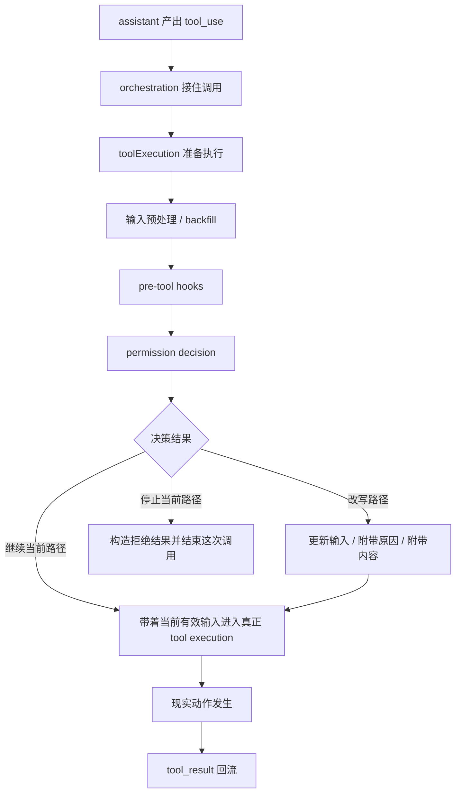
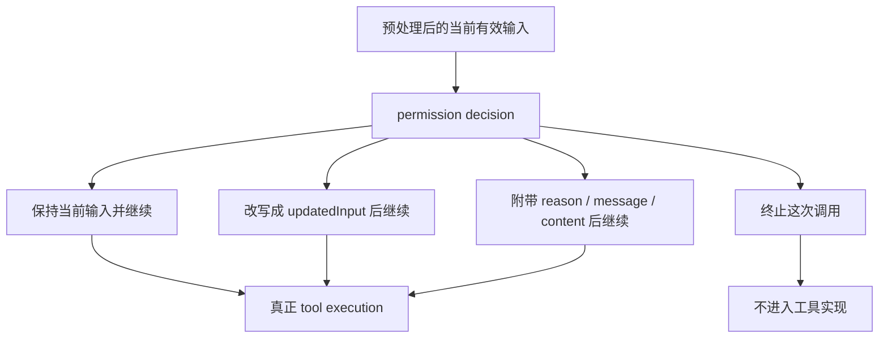

# 卷三 13｜permission decision 是怎样接到 tool execution 之前的

## 导读

- **所属卷**：卷三：工具系统怎么把模型意图落成执行
- **卷内位置**：新增权限管线组 02 / 04
- **上一篇**：[卷三 12｜为什么 Claude Code 的执行层必须先长出权限管线](./12-why-execution-layer-must-grow-a-permission-pipeline-first.md)
- **下一篇**：[卷三 14｜为什么 `allow / deny / ask` 不是 UI 选项，而是 runtime 决策面](./14-why-allow-deny-ask-are-a-runtime-decision-surface.md)

上一篇先把一个前提立住了：执行层一旦碰现实接口，就不能只问“怎么做”，还必须先问“这步能不能做”。

但只知道“必须有权限管线”还不够。下一步最自然的问题就是：

> **这条权限判断链，到底是怎样接进一次真实工具调用里的？**

这一篇不主讲 `allow / deny / ask` 的类型学，不展开 Bash 那条更重的专门分析链，也不去讲长期授权、settings 持久化和 policy limits。它只做一件事：

> **把 hooks、预处理、permission decision、真正 execution 之间的顺序钉死。**

因为真正关键的不是“系统最后给了什么结论”，而是：

> **permission decision 在 runtime 主链里站在哪里，以及它怎样改写后续执行路径。**

## 这篇要回答的问题

卷三前半已经把执行主线压成了一张稳定图：`tool_use -> orchestration -> execution -> tool_result`。

权限管线组第一篇又补上了另一个判断：execution 不能裸奔，现实动作必须先穿过行动边界。

这篇接着追问的是：

> **在一次真实 tool call 里，permission decision 到底接在执行链的哪个位置？它是在执行外面补一道确认，还是 execution path 自己的一段正式节点？**

如果这个位置不先讲清，读者就很容易把权限系统误读成：

- 工具快执行时弹一下提示
- 用户点完以后再继续
- 整体仍然是原来的 execution 主线，只是多了个交互层

这其实不对。

Claude Code 更接近的结构是：

- tool 输入先被接住
- runtime 先做预处理和 hooks
- 然后进入 permission decision
- decision 结果再把后面的 execution 改写成不同分支

也就是说，permission decision 不是主链旁边的提示框，而是主链中间的正式分叉点。

## 先给结论

### 结论一：permission decision 接在“准备执行”和“真正执行”之间

这篇最该先记住的，不是某个类型名，而是链路位置。

在 Claude Code 里，一次工具调用并不是 assistant 产出 `tool_use` 以后，立刻就撞进工具实现。中间还有一段 runtime 自己的整理过程：

- 输入预处理
- hooks 介入
- permission decision
- 再决定能不能进入真正 execution

所以权限判断既不是最前面的抽象意图阶段，也不是最后执行完才补的尾部动作。

它更准确的位置是：

> **在 execution 准备段的尾部、在真正工具执行的入口前。**

### 结论二：permission decision 不是外围确认框，而是 execution path 的正式分叉点

一旦进入 permission decision，后面的链路就不再是“原样继续执行”。

因为 permission 层返回的不是一个简单布尔值，而是一个会直接改写后续路径的结构化结果。它至少会决定两件事：

- 这次调用是否还能继续向下走
- 如果还能继续，后面应该按什么输入、什么理由、什么反馈内容继续走

所以 permission decision 在这里不是“附加说明”，而是：

> **把 execution 主链正式分出不同命运的一道 runtime 裁决面。**

### 结论三：hooks 不是 permission 的前台装饰，而是 permission 之前的上游改写层

这一点也很重要。

Claude Code 不是把 hooks 和 permission 做成两块互不相干的东西，而是让 hooks 先进入这次调用，对输入和上下文做预处理，然后 permission 再基于“当前有效版本”做判断。

这意味着 permission system 看到的，并不一定是 assistant 原始吐出来的那个输入，而是：

> **已经经过 runtime 上游改写、补全或重组后的输入。**

从这个角度看，hooks 和 permission 不是并排关系，而是严格前后相接的关系。

## 图 1：permission decision 接进 execution 主链的位置

这张图最关键的不是 `allow / ask / deny` 三个名字，而是三个位置判断：

### 第一，permission decision 不在 assistant 产出意图时

它不是模型内部判断的一部分。

assistant 负责提出 `tool_use`，但 permission decision 发生在 runtime 已经正式接手调用之后。也就是说，它属于 execution system，而不属于模型生成侧。

### 第二，permission decision 也不在真正 tool execution 之后

它不是“动作做完以后再决定是否认可”，而是动作落地前的资格裁决。

### 第三，它会回写后续路径，而不是只产出一个旁路提示

这一点最容易被忽略。

图里故意把“改写路径”单独画出来，就是为了说明：permission decision 之后的 execution，并不一定还是原来的 execution。

它可能：

- 继续原样执行
- 以更新后的输入执行
- 带着额外说明进入执行
- 直接停止，不再进入工具实现

所以 permission decision 的意义，不只是“挡一下”，而是“改写执行命运”。

## 为什么它一定要放在这个位置上

### 因为太早放，会拿不到 runtime 已经整理好的上下文

如果把 permission decision 放到最前面，也就是 assistant 刚吐出 `tool_use` 就立刻判断，那会有一个问题：

此时 runtime 还没有完成自己的预处理，hooks 也还没机会介入，这次调用仍然停留在一个“原始请求”的状态。

但 Claude Code 真正需要判断的，不是一个抽象动作标签，而是：

- 当前这次调用被整理成了什么有效输入
- 上游 hooks 有没有补充或改写信息
- 当前上下文里有哪些会影响权限判断的 runtime 条件

也就是说，permission decision 要站得足够靠后，才能判断一份**已经准备好进入执行口的请求**。

### 因为太晚放，就失去了“执行前边界”的意义

反过来，如果等真正工具实现已经开始跑，再去做 permission decision，就已经晚了。

因为权限系统在卷三这一组里，核心职责不是解释动作结果，而是决定：

> **这次动作有没有资格进入现实落地。**

只要它要完成的是这个职责，它就必须发生在真正 execution 之前。

这也解释了为什么上一篇一直强调：permission pipeline 不是执行完成后的安全补丁，而是 execution 入口前的正式前置段。

### 所以最合理的位置，只能是“准备执行”和“真正执行”之间

把上面两件事合起来，位置其实就很清楚了：

- 不能太早，因为要等 runtime 先把调用整理成可判断对象
- 不能太晚，因为它必须在现实动作发生前完成裁决

所以 permission decision 最稳定的位置就是：

> **前面接预处理和 hooks，后面接真正 tool execution。**

这不是实现巧合，而是职责逼出来的链路位置。

## hooks、预处理、permission、execution 之间到底是什么顺序

### 第一步：tool call 先被 execution runtime 接住，而不是直接打到工具对象

卷三前面已经讲过，assistant 产出 `tool_use` 之后，并不是某个工具立刻自己开始做事，而是先由 orchestration 和 execution runtime 接手。

这一步的意义是把原始意图变成一份可被执行层组织的正式调用。

一旦进入这里，后面发生的就不再是模型自由发挥，而是 runtime 主链开始运转。

### 第二步：runtime 先做输入预处理和 backfill

在真正判断权限之前，execution runtime 先要把这次调用整理好。

这里可以把它理解成“让请求进入可执行前状态”的准备段。它解决的不是能不能做，而是：

- 输入是不是完整的
- 有些上下文信息是否需要补回这次调用
- 后面各层看到的是不是一份统一格式的当前输入

这一段很重要，因为 permission decision 判断的不是抽象意图，而是“当前准备进入执行口的这份输入”。

### 第三步：pre-tool hooks 在 permission 之前介入

接下来才是这篇最想钉死的顺序点：

> **hooks 在 permission decision 之前。**

这意味着 hooks 不是执行完成后的通知，也不是 permission 之后的附属行为。

它们是在 permission 之前，先对这次调用做上游处理。

这里最重要的理解不是“hook 做了什么具体策略”，而是它的链路含义：

- hooks 有机会看到当前调用
- hooks 有机会对输入做改写
- permission 后面判断的是 hooks 处理后的当前有效版本

所以如果只用一句话压这个关系，就是：

> **permission decision 不是对原始 tool input 下判断，而是对经过 runtime 上游处理后的有效输入下判断。**

### 第四步：permission decision 才作为正式裁决点进入主链

等预处理和 hooks 走完，runtime 才把这次调用送到 permission decision。

这时候 permission 层接到的，不再只是“模型说想做某事”，而是“execution runtime 已经整理好的、准备进入执行口的一次正式调用”。

于是它承担的角色也很明确：

- 它不是继续加工输入的第一层
- 它不是最后收尾的解释层
- 它是 execution 入口前的资格裁决层

也就是说，这里发生的不是“再看一眼”，而是：

> **runtime 在真正触达现实接口前，最后一次决定这步动作如何进入执行。**

### 第五步：真正 execution 按 decision 改写后的路径继续

permission decision 一旦给出结果，后面的 execution 就不再是一条固定直线，而是被 decision 改写后的路径。

这就是这篇的重点。

真正 execution 不是简单接在 permission 后面，而是接在：

- 当前 decision 所允许的那个版本后面
- 当前 decision 所改写出的那个输入后面
- 当前 decision 所附带的那个反馈语义后面

也就是说，execution 接上的不是“原始调用”，而是“被 permission decision 处理过的调用命运”。

## permission decision 为什么会改写后续执行路径

这一篇只先立一个足够用的判断：

> **permission decision 返回的不是轻飘飘的 yes / no，而是会直接改写后续执行命运的正式结果。**

也正因为这样，permission decision 才不是站在 execution 外面“挡一下”，而是会真正决定：

- 这次调用还能不能继续往下走
- 后面的 execution 接的是不是原来的那份调用
- 这次分叉该如何被解释和回流

具体到 `allow / deny / ask` 为什么会长成一套结构化裁决面，以及这些结果为什么能携带更多字段信息，这一层放到下一篇再展开。

这一篇先把链路位置钉死就够了：

> **permission decision 站在真正 execution 的入口前，并且会把后面的 execution 改写成不同路径。**

如果只记这一句，这一篇的任务就完成了。

## 和后文的分工

下一篇会专门回答：为什么这套结果不会停在“能/不能”的二元判断，而会长成 `allow / deny / ask` 这样的 runtime 决策面。

## 图 2：permission decision 怎样改写 execution path

这张图要强调的不是分支名称，而是一个更大的判断：

> **从 permission decision 开始，execution path 已经不是“固定调用 + 固定执行”，而是“经过裁决后被重写的调用路径”。**

这也是为什么 permission decision 一定要被写进 execution 主链，而不是写成某个外围 UI 流程。

## 它为什么不是“执行前问一下用户”这么简单

### 因为用户交互只是某种后续分支的外显形式，不是 permission 本身

这篇虽然不展开 `allow / deny / ask`，但至少要先压住一个误解：

很多人会把 permission decision 想成“执行前问一下用户”。

这个说法太表面。

真正先发生的是：

- runtime 把调用整理好
- hooks 先处理一轮
- permission system 产出结构化 decision
- decision 再决定后面是不是会走到交互式处理分支

所以更准确的说法不是“permission 就是问用户”，而是：

> **permission 先是 runtime 决策节点，用户交互只是某些决策结果向后展开的一种处理方式。**

### 因为这里真正发生的是主链分叉，不是 UI 插件弹层

如果只是“问一下用户”，那整体心智模型还是：

- 主链照常执行
- 中间临时停住
- UI 处理一下
- 再回来继续

但 Claude Code 这里更像是：

- 主链运行到 permission 节点
- 节点给出结构化 decision
- 主链按 decision 进入不同后续路径

这是一种 runtime 分叉，不是一个体验层补丁。

## 这篇的边界

为了守住权限管线组内部的分工，这篇只讲“链路位置”，不讲穿后面几篇的主题。

### 这篇不展开 `allow / deny / ask` 的结构差异

这一篇只需要读者先接受：permission decision 会产出结构化决策结果，并把 execution 改写成不同路径。

至于这三类结果各自代表什么运行时意义，留给第 14 篇。

### 这篇不展开 Bash 特例

Bash 的权限分析链更重，也更复杂，但那属于“某些高风险工具为什么会把权限系统继续拉深”的问题，不属于这一篇。

这一篇只讲通用链路位置。

### 这篇不展开长期授权、settings 持久化、policy limits

这些问题都在回答更高层的边界如何长期存在、如何跨会话生效、如何被组织策略再向上约束。

而这一篇只回答一个更底层的问题：

> **在一轮具体 tool execution 里，permission decision 到底插在什么地方。**

## 和前后文的关系

### 它承接第 12 篇：把“为什么必须有权限管线”推进成“权限管线怎样长进主链”

第 12 篇先证明：执行层不能裸奔，必须先长出权限管线。

这一篇则把那个抽象必要性，推进成一个更具体的 runtime 判断：

> **这条权限管线不是挂在 execution 外面，而是正式插在准备执行与真正执行之间。**

### 它也给第 14 篇让出位置：下一篇再讲 decision 结果为什么是一块 runtime 决策面

这篇只钉位置，不展开结果结构。

下一篇再继续回答：为什么 `allow / deny / ask` 不是几个 UI 按钮，而是 runtime 的正式决策面。

## 一句话收口

> **在 Claude Code 里，permission decision 不是工具执行外面的附加确认，而是接在预处理与 hooks 之后、接在真正 execution 之前的一道正式 runtime 裁决点；它会根据结构化 decision 结果直接改写后续执行路径，所以真正进入工具实现的，已经不是原始调用，而是被 permission 层裁过一次的调用版本。**
