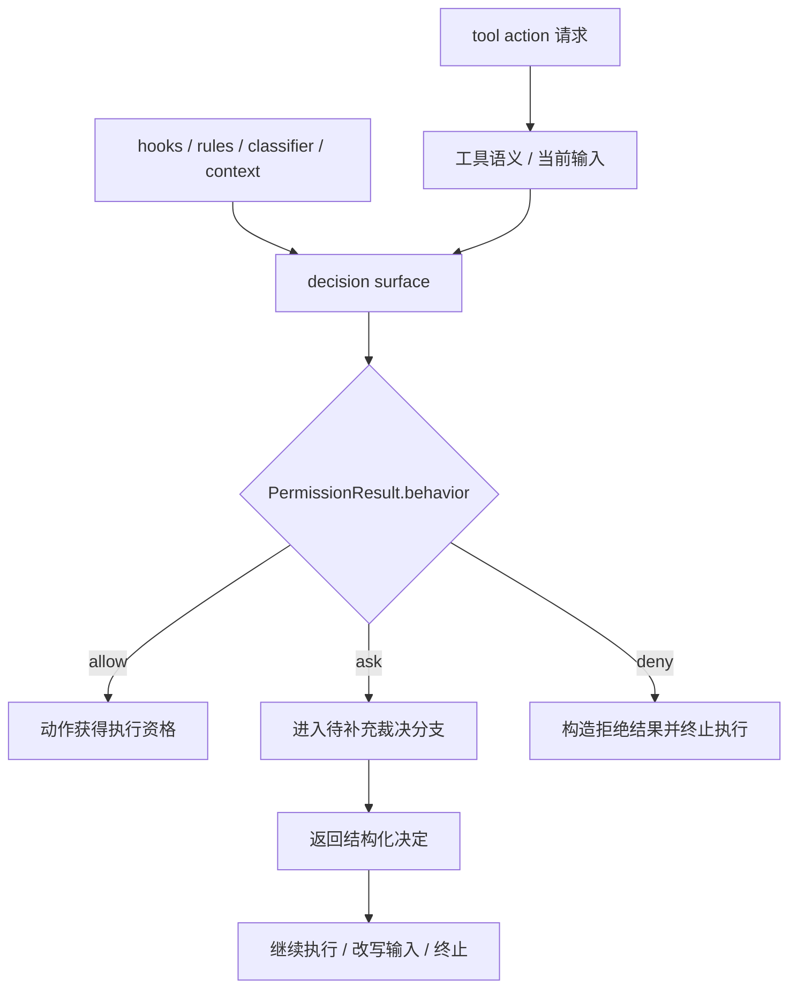
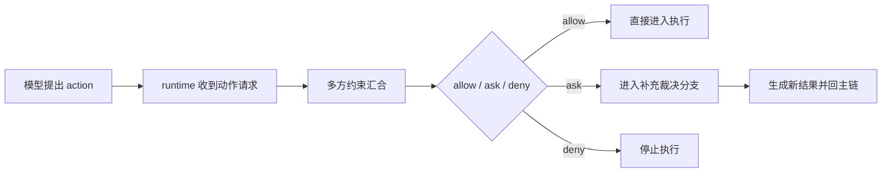

# 卷三 14｜为什么 allow / deny / ask 不是 UI 选项，而是 runtime 决策面

## 导读

- **所属卷**：卷三：工具系统怎么把模型意图落成执行
- **卷内位置**：新增权限管线组 03 / 04
- **上一篇**：[卷三 13｜permission decision 是怎样接到 tool execution 之前的](./13-how-permission-decision-connects-before-tool-execution.md)
- **下一篇**：[卷三 15｜为什么权限系统最后收口成执行边界](./15-why-the-permission-system-finally-collapses-into-an-execution-boundary.md)

上一篇的重点，是把 permission decision 放回执行主链里，说明它不是外挂确认框，而是执行前的正式节点。

这一篇不再重复追问“它接在哪个位置”，而是往前走一步，回答另一个更容易被误解的问题：

> **为什么 `allow / deny / ask` 不是三个交互按钮，而是一次动作请求在 runtime 里可能落到的三种裁决结果？**

这件事如果没立住，后面一谈权限，读者就很容易把 Claude Code 想成：系统先准备执行，再在界面上给用户摆三个按钮。

但源码和旧文给出的方向其实更硬：

- `allow / deny / ask` 首先是结果类型
- `ask` 首先是分支，不是界面名词
- 一次动作不是由某一个人单独拍板，而是由多方约束共同裁决

所以这一篇要钉住的不是 UI 体验，而是 **runtime 决策结构**。

## 这篇要回答的问题

Claude Code 里最容易被误读的一个词，就是 `ask`。

很多人看到它，会立刻脑补成：

- 弹窗
- 按钮
- 用户点一下“允许”或“拒绝”
- 然后系统继续执行

这个想象并不完全错，但它只看到了最外面那层表现。

这一篇其实只回答一个问题：

> **`allow / deny / ask` 到底是什么，为什么它们首先是一次调用的三种 runtime 命运，而不是 UI 层摆出来的三个选项？**

多方约束、交互参与、规则命中这些内容，都会讲到，但它们在这一篇里都只是为了支撑这个主问题。

## 先给结论

### 结论一：`allow / deny / ask` 代表的不是三个按钮，而是三种运行时裁决结果

把这三个词放回 execution runtime 里看，最重要的不是“用户能点哪个”，而是：

- 这次动作是否可以直接进入执行
- 这次动作是否必须转入交互式裁决分支
- 这次动作是否应当在当前上下文里被直接拦下

所以它们首先描述的是 **动作命运**，不是界面组件。

换句话说：

> **`allow / deny / ask` 是系统对一次行动请求给出的三种 runtime 结果类型，而不是产品界面提供给用户挑选的三个静态选项。**

### 结论二：`ask` 的本质不是“弹一个窗”，而是“把主链切进一个需要补充裁决的分支”

`ask` 之所以最容易被误解，是因为它最常以交互形式出现。

但交互形式不是它的本体。

`ask` 的本体是：

> **当前这次动作，现有规则与自动判断还不足以直接给出最终放行结果，所以 runtime 必须进入一个额外决策分支。**

这个分支里，用户可能参与；界面可能出现；规则也可能被更新；输入甚至可能被改写。

可真正关键的是：

- runtime 没有结束
- decision 也没有缺席
- 主链只是进入了一个正式的“待补充裁决”状态

所以 `ask` 不是界面名词，而是控制流名词。

### 结论三：一次动作不是由单一主体决定，而是由多方约束共同裁决

Claude Code 的权限判断之所以不能被压成“一个确认框”，是因为真正参与裁决的从来不止一个按钮事件。

同一次动作背后，可能同时存在：

- 工具自身携带的风险语义
- 当前输入和上下文信息
- hook / classifier 给出的判断
- 已有 allow / deny 规则
- 用户这一次的临时参与
- 决策结果对后续执行路径的改写

因此 `allow / deny / ask` 更像是一个 **汇总裁决面**：

> **多方约束在这里汇合，并产出对本次动作的最终运行时命运判断。**

## 不要把它想成“界面上有三个按钮”

### UI 只看得见最后一跳，runtime 要处理的是整个裁决结构

如果只从产品表面看，确实很容易得到下面这个印象：

1. 系统要做一件事
2. 用户看到提示
3. 用户选择允许 / 拒绝
4. 系统继续

这种理解的问题在于，它把权限系统压缩成了“最后那一下交互”。

但 Claude Code 真正需要处理的是：

- 这次动作为什么会进入 ask
- ask 之后拿到的反馈怎样变成结构化结果
- allow / deny 的理由如何归因
- 这次结果会不会改写输入或后续路径
- 这次裁决是否只对当前动作生效，还是会反过来影响后续边界

这些都不是按钮层的问题，而是 runtime 结构的问题。

### `PermissionResult` 一类结构之所以重要，是因为系统返回的是“决定”，不是“按键值”

旧文里已经反复出现一个很关键的观察：permission decision 返回的不是简单布尔值，而是结构化结果。

这意味着系统关心的不只是：

- yes / no

而是更完整的一组信息：

- `behavior` 是 `allow`、`ask` 还是 `deny`
- 这个决定的原因是什么
- 有没有附带消息
- 有没有 `updatedInput`
- 有没有需要回流给消息层的内容块

一旦你看到这一层，就很难再把它理解成“前端拿到三个按钮值”。

因为这里处理的是：

> **一次动作在 runtime 中如何被裁决、解释、改写，并继续影响后续执行。**

## 图 1：`allow / deny / ask` 不是按钮分布，而是 runtime 决策面

这张图里最关键的不是 `ask` 会不会弹界面，而是中间这一层：

### 第一，分叉点是 runtime result，不是 UI component

真正负责改写主链命运的，是 `behavior` 的结果类型。

### 第二，`ask` 进入的是一个正式处理分支

它不是“还没决定”，而是“决定进入补充裁决流程”。

### 第三，所有分支都会回到执行命运这个问题上

最后真正被决定的，始终是：这步动作怎么收场。

## 为什么 `ask` 必须被理解成分支，而不是界面名词

把 `ask` 理解成“弹窗”，最大的问题不是不准确，而是会把 runtime 里的第三种正式状态误读成一个界面现象。

更准确的说法应该是：

> **ask 的本质是自动决策到这里还不能闭合，因此系统要切换到需要补充判断的路径。**

所以它和 `allow`、`deny` 不是强弱关系，而是三种不同命运：

- `allow`：直接放行，动作继续
- `deny`：直接拦下，动作结束
- `ask`：进入额外裁决流程，再决定后续命运

用户交互只是这个路径里最常见的一种输入来源；真正被命名出来的，是一个 runtime 分支，而不是一个前端控件。

## 一次动作到底是谁在做决定

### 不是单纯“模型提议，用户按按钮”

如果把权限流程缩成“模型提议，用户确认”，会丢掉 Claude Code 最重要的一层设计：

> **动作不是由单一主体一票决定，而是在多种约束交汇后才得到一个 runtime 结果。**

从现有旧文和卡片能回收到的证据链看，这个裁决面至少包含几类力量：

- **工具与输入本身**：动作是什么、触达哪里、风险面多大
- **runtime 上游信息**：hooks、上下文、预处理后得到的有效输入
- **权限规则**：已有 allow / deny 规则会不会命中
- **交互式参与**：当自动判断不能闭合时，用户进入 ask 分支补充裁决
- **结果归因与回流**：decision reason、message、content blocks、updated input 会继续影响后续流程

把这些放在一起看，`allow / deny / ask` 才像它真正的样子：

> **不是一个点击层，而是一次动作在多方约束下被共同裁决的汇合面。**

### 所以权限系统真正做的是“把模型单方面动作，改造成可被系统共同审议的动作”

这句话很重要。

Claude Code 一旦有了权限管线，系统行为就不再是：

- 模型提出动作
- runtime 忠实执行

而会变成：

- 模型提出动作
- runtime 汇总上下文与边界信息
- 权限结构给出 allow / ask / deny
- 后续执行只接受这个裁决结果

因此模型不再独占动作命运。

真正掌握动作命运的，是这块 runtime 决策面。

## allow / deny / ask 为什么会直接改写动作命运

### `allow` 不是“表达支持”，而是授予执行资格

在权限系统里，`allow` 最重要的作用不是表示“看起来可以”，而是让动作真正获得进入执行态的资格。

所以它不是态度词，而是控制词。

### `deny` 不是“表达反对”，而是让动作在当前上下文直接终止

同理，`deny` 也不是一种意见，而是一个终止条件。

只要结果落到 deny，这次动作就不会继续沿着正常执行路径向前推进。

### `ask` 不是“等等再说”，而是让控制流切换到补充裁决路径

这也是为什么 ask 不能被当成 UI 同义词。

因为 ask 一出现，改写的是控制流：

- 主链暂停直接执行
- 系统转入交互式 handler 或等价决策分支
- 新的结构化结果再决定后续命运

所以这三者共同组成的是：

> **runtime 对一次动作请求进行命运分配的决策面。**

## 图 2：真正被裁决的不是“用户想点什么”，而是“动作接下来怎么活”

这张图想强调的只有一句话：

> **被裁决的对象不是界面，而是动作命运。**

## 这篇的边界

### 1. 不重复展开上一篇里“permission decision 接在链路哪里”

这一篇只承接一个前提：permission decision 已经是执行前的正式节点。

本文重点不是再讲链路位置，而是讲：

- 为什么返回值是三元结果类型
- 为什么 ask 是分支
- 为什么这是多方共同裁决面

### 2. 不展开 Bash 特例

Bash 为什么复杂、为什么需要更重的语义判断，这些留给后文收口，不在这里展开。

### 3. 不展开长期授权与 policy limits

这一篇只在必要处提到“结果可能影响后续边界”，但不展开：

- 长期授权怎样持久化
- 组织级 policy limits 怎样覆盖本地权限判断

因为这里要守住的是“决策结构”，不是更高层治理形态。

## 一句话收口

> **在 Claude Code 里，`allow / deny / ask` 不是三个 UI 选项，而是一次动作请求在多方约束汇合后得到的三种 runtime 裁决结果；其中 `ask` 代表的也不是弹窗，而是主链进入补充决策分支，因此这三者共同构成的不是交互按钮组，而是执行前的行动命运分配面。**
