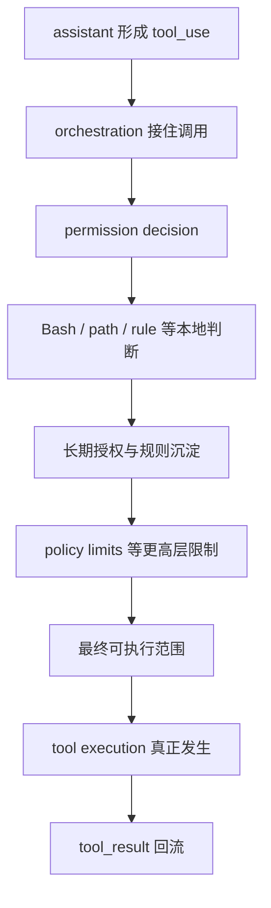
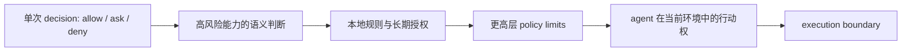

# 卷三 15｜为什么权限系统最后收口成执行边界

## 导读

- **所属卷**：卷三：工具系统怎么把模型意图落成执行
- **卷内位置**：新增权限管线组 04 / 04
- **上一篇**：[卷三 14｜为什么 `allow / deny / ask` 不是 UI 选项，而是 runtime 决策面](./14-why-allow-deny-ask-are-a-runtime-decision-surface.md)
- **下一篇**：无

到这一组最后一篇，问题已经不能再停留在：

- permission decision 接在执行链哪里
- `allow / deny / ask` 为什么不是几个 UI 按钮
- Bash 为什么要走更重的一条判断链

这些都重要，但如果只停在这里，读者仍然会把权限系统理解成：

> **执行前多做了一次放行判断。**

这还不够准确。

因为 Claude Code 一旦真的开始读文件、改文件、跑命令、沿着规则沉淀长期授权，再叠加更高层策略限制，权限系统最后管理的就不再只是“这一单能不能过”，而会变成：

> **这个 agent 在当前环境里，到底拥有多大的现实行动权。**

这就是这一篇要做的收口。

## 这篇要回答的问题

权限管线组前 3 篇，讲的都还是**单次调用如何被裁决**：

1. 为什么执行层一碰现实接口，就必须先长出权限管线
2. permission decision 不是外挂，而是 execution path 里的正式节点
3. `allow / deny / ask` 不是交互按钮，而是 runtime 的裁决面

这一篇只继续回答一步：

> **这些单次裁决，为什么最后不会停在“一步放不放行”，而会累积成整个 agent runtime 的执行边界？**

如果这个问题不收住，权限系统仍然容易被误读成“很多零散限制的总和”。

而 Claude Code 真正建立的，其实是一套把 Bash、本地规则、长期授权、以及更高层 policy limits 收成同一条边界语言的结构。

## 先给结论

### 结论一：权限系统最后约束的不是单次动作，而是动作可到达的整体范围

单次 permission decision 看起来像在回答：

- 这次能不能执行
- 这次是否需要 ask
- 这次是否必须 deny

但当这种判断不断叠加到真实 runtime 上，系统真正形成的不是一个个孤立 verdict，而是一张持续存在的行动范围图。

也就是说，Claude Code 最终回答的不是：

> **这一条命令过不过。**

而是：

> **这个 agent 在这台机器、这个工作区、这组规则、这个组织环境里，现实上能动到哪里。**

这就是“执行边界”比“权限判断”更准确的原因。

### 结论二：Bash、本地规则、长期授权、policy limits 并不是并列功能，而是在共同定义同一个边界

如果把它们拆开看，会觉得像四类东西：

- Bash 在处理高风险命令
- 本地规则在处理 allow / deny
- 长期授权在处理 settings 沉淀
- policy limits 在处理组织级限制

但从架构上看，它们都在回答同一个问题：

> **哪些现实动作可以进入执行，哪些不行；哪些现在可以，哪些长期可以；哪些本地愿意也不算，因为更高层根本不允许。**

所以这几层不是平铺功能，而是在共同收紧 agent 的现实行动边界。

### 结论三：一旦系统开始管理“agent 有多大行动权”，权限系统就自然收口成执行边界

“权限”这个词很容易让人想到一次授权、一次审批、一次点击允许。

但 Claude Code 的 runtime 真正在乎的是：

- 这次动作能否进入 execution
- 这类动作在什么风险级别下进入 execution
- 这次决定是否会变成后续长期规则
- 当前组织环境是否从更高层直接改写这类能力的命运

当这些问题被放到一起时，权限系统就已经不再只是“permission check”。

它实际上在定义：

> **execution runtime 在当前环境中的有效作用域。**

## 先把“执行边界”这个词解释清楚

这里说的“执行边界”，不是另起一个漂亮名词去替换 permission。

它指的是一个更准确的架构判断：

> **Claude Code 的执行层，不是默认拥有完整行动力，然后在外面被零散拦一下；它从一开始就是在边界内执行。**

所以“执行边界”至少同时包含四层含义：

1. **即时边界**：这次动作此刻能不能进入执行
2. **语义边界**：像 Bash 这样的高表达力能力，真实语义风险允许到哪里
3. **长期边界**：这次放行会不会沉淀成后续可复用规则
4. **更高层边界**：即使本地允许，组织或产品层是否仍然禁止

把这四层放到一起，才更接近 Claude Code 权限系统的真实形状。

## 图 1：权限系统为什么最后会收成执行边界

这张图最关键的不是节点数量，而是语义变化：

- 前面几篇更强调“执行前要先判断”
- 这一篇要收的是“这些判断最后共同决定了 execution 到底能展开到哪里”

所以最终被定义出来的，不是某个 decision 点，而是 execution 的有效边界。

## 为什么单次放行不足以描述 Claude Code 的权限系统

### 第一层原因：agent 不是只做一次动作，而是在连续回合里持续行动

如果系统只需要判断一次按钮点击，那“是否放行”就够用了。

但 Claude Code 不是这样。

它会在一个 session 里不断：

- 读材料
- 搜证据
- 改文件
- 跑命令
- 根据结果继续下一步

这意味着权限系统面对的不是一次性的静态请求，而是一个持续行动的 agent。

于是问题自然升级成：

- 当前这类动作是否总是要 ask
- 哪些路径已经被允许写入
- 哪些能力只在当前 session 可以放行
- 哪些组织限制会跨越整个运行过程一直生效

所以到最后，系统管理的必然不只是单次 verdict，而是持续行动的总体范围。

### 第二层原因：很多约束并不在单次 decision 当场结束

permission decision 只是入口。

真正影响 execution 的约束，还会继续留在系统里：

- 本地规则会留下来
- session 决策会影响后续调用
- project / user 级规则会跨会话延续
- policy limits 会从更高层持续覆盖能力边界

这说明运行时里的权限结果并不是“判完即焚”。

相反，它们会沉淀、累积、覆盖、继承，最后变成 agent 的长期行动条件。

这已经不是“审批动作”，而是边界工程。

### 第三层原因：真正重要的不是某一步危险不危险，而是系统整体默认站在哪里

Claude Code 最关键的架构判断，不是“遇到危险动作就拦”。

而是：

> **系统默认并不把所有现实能力交给 agent，而是先把能力压在边界里，再决定哪些部分可以被释放。**

这和“先全部开放，再对危险点打补丁”是两种完全不同的设计哲学。

也正因为如此，权限系统最终才会收口成 execution boundary，而不是一组零散安全提示。

## Bash 为什么会把这个问题推得最明显

这篇不重讲 Bash 的实现细节，但 Bash 必须被提一下，因为它最能暴露“权限系统为什么不能只停在单次放行”。

### Bash 的关键不在于命令多，而在于它是一种高压缩行动表达

一条 shell 命令看起来像一行字符串，实际上却可能包含：

- 文件系统触达
- 管道与组合
- 重定向
- 变量展开
- 路径绕行
- 连续副作用

所以 Bash 的问题从来不是“执行前要不要问一下”，而是：

> **系统到底允许 agent 用多大自由度去驱动这台机器。**

这就是为什么 Bash 会逼着权限系统从“点状放行”升级成“能力边界”。

### Bash 会暴露“语义边界”这层真实存在

对 FileRead / FileEdit 这类工具，边界往往更容易看成路径或操作类型。

但 Bash 不一样。

Bash 会逼系统回答：

- 只读命令和破坏性命令是不是同一类边界
- 前缀自动放行到底能宽到哪里
- 一行表面温和的命令，真实 shell 语义会不会越界

这些问题说明：

> **权限系统面对的不是字符串许可，而是行动语义许可。**

而“行动语义许可”天然就更接近执行边界，而不是简单的 yes/no。

## 本地规则为什么会把瞬时 decision 变成长期边界

### 规则系统让权限不再只存在于当下

一旦允许结果可以被写回 session、project、user 等不同层级，权限系统就开始具备“沉淀边界”的能力。

这时候系统不再只是在说：

- 这次允许
- 这次拒绝

它开始在说：

- 以后这类动作默认怎么处理
- 这个工作区里哪些路径已经算作允许范围
- 哪些规则应该长期保留
- 哪些旧规则已经被覆盖或不再有效

这说明本地规则系统真正做的，不是记住一次交互，而是把 agent 的行动范围固化下来。

### 所以“长期授权”其实是在给 execution 画稳定轮廓

这也是为什么 settings 持久化很重要。

如果没有这层，权限系统就只有瞬时闸门；有了这层以后，它才开始长出稳定形状。

从架构语言说，就是：

> **permission result 被提升成 permission state，而 permission state 又进一步定义了 execution 的稳定边界。**

这句话很抽象，但它正是收口点。

## 更高层限制为什么会把“本地能做”改写成“环境里能做”

### policy limits 证明本地 permission system 不是最终权威

如果 Claude Code 的权限系统只到本地规则为止，那么最终答案还是：

> **这台机器上的这个 runtime 愿不愿意放行。**

但 policy limits 的存在说明，系统还要再往上问一次：

- 当前组织环境是否允许某类能力
- 某些产品功能位是否已经在更高层被关闭
- 即使本地规则允许，最终能力是否仍被上层锁死

这一步非常关键，因为它把边界从“本地决定”抬成了“环境决定”。

### 一旦更高层存在，权限系统就不再只是本地安全机制

它会变成一套多层叠加的能力约束结构：

- 本地 runtime 管一次动作能否落地
- 本地规则管长期可复用的授权范围
- 更高层 policy 管环境级能力天花板

这三层合起来，最终回答的就是：

> **agent 在当前环境中实际被赋予了多大的行动权。**

这已经完全是“执行边界”的语言，而不是“单次权限”的语言。

## 图 2：从 permission decision 到 execution boundary 的收口图

这张图想强调的是一个方向：

- 起点看起来像单次 decision
- 终点其实是 agent capability envelope

所以“权限系统最后收口成执行边界”，并不是修辞，而是主线自然演进出来的架构结果。

## 把前 3 篇怎样压进这一篇

### 第 12 篇解决的是：为什么执行层不能裸奔

它把前提立住：一旦 execution runtime 接到现实接口，就必须先长出权限管线。

### 第 13 篇应该解决的是：权限判断怎样正式接进主链

它把 permission decision 放回 `tool_use -> execution` 的正式路径里，而不是放在外围。

### 第 14 篇应该解决的是：为什么 `allow / deny / ask` 是 runtime 裁决面

它把“确认框想象”进一步打碎，让我们看到权限结果会直接改写执行命运。

### 第 15 篇在这之上再收一步

这一篇不再看某个 decision 点，而是回收这些局部判断的共同结果：

> **它们最终一起定义了 execution runtime 的现实作用域。**

这就是“收口篇”的任务。

## 这篇不再展开什么

### 1. 不重讲 permission decision 的接入顺序

那是链路问题，已经属于前文分工。

### 2. 不重讲 `allow / deny / ask` 的结果结构

那是裁决面问题，已经属于前文分工。

### 3. 不把话题扩成完整 control plane 总论

这里的重点仍然是卷三内部的架构收口：

> **执行能力怎样在边界内成立。**

而不是更高一层的产品总治理。

## 最后把整组权限管线压成一句话

如果要给卷三这组权限文章留下最后一句，我会写成：

> **Claude Code 的权限系统最后定义的，不是某一步放不放行，而是 agent 在当前环境里拥有多大行动权：单次 permission decision 决定动作能否起步，Bash 这类高表达力能力暴露语义风险边界，本地规则与长期授权沉淀稳定边界，更高层 policy limits 再给出环境级天花板；这些层合在一起，最后收成 execution runtime 的执行边界。**

## 一句话收口

> **当权限系统同时开始管理即时裁决、语义风险、长期规则和更高层限制时，它最后收住的就不再是“这次过不过”，而是“这个 agent 在当前环境里到底能动到哪里”；这就是为什么 Claude Code 的权限系统最终会收口成执行边界。**
