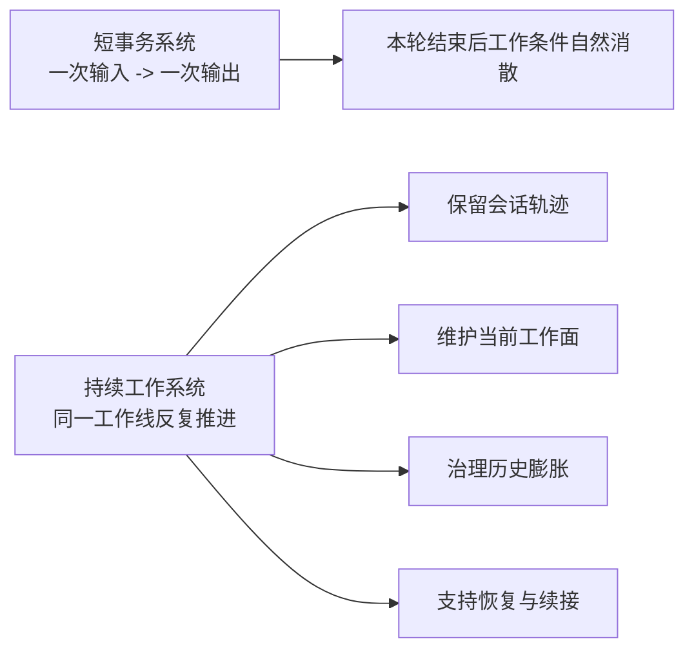
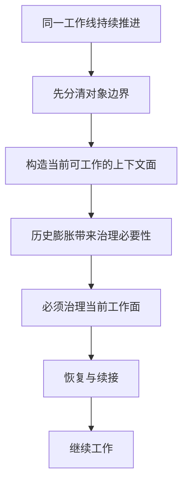

# 卷四 01｜为什么 Claude Code 不是“一轮跑完就重来”的系统

## 导读

- **所属卷**：卷四：上下文与状态怎么维持系统持续工作
- **卷内位置**：01 / 08
- **上一篇**：[卷三 11｜把整条执行层重新压成一张稳定运行图](../volume-3/11-stable-execution-layer-map.md)
- **下一篇**：[卷四 02｜messages / context / system prompt / transcript / session 为什么不是一回事](./02-why-messages-context-system-prompt-transcript-session-are-not-the-same.md)

卷二已经解释了一次 agent turn 怎么跑起来，卷三已经解释了模型意图怎样落成执行；但只看前两卷，读者仍然缺一块关键认识：Claude Code 为什么不是一轮结束就散，而是能把同一条工作线接着往前推。卷四必须从这里开篇。因为后面的对象边界、当前工作面、治理链、恢复链，都只是这件事的不同侧面。

## 这篇要回答的问题

> **Claude Code 为什么不是“一次输入、一次输出”的短事务系统，而是一套会持续维持工作条件的 runtime？**

这篇要留下的判断只有一句：

> **Claude Code 的很多内部设计，都不是为了把某一轮回答得更漂亮，而是为了让同一条工作线还能继续往下干。**

## 如果把它当成短事务系统，很多设计都会显得莫名其妙

把 Claude Code 看成聊天壳时，系统里很多东西都会显得“过重”：

- 为什么要有 session，而不是只保留一串 messages？
- 为什么既有 transcript，又有当前 query 看到的消息视图？
- 为什么会专门处理 compact、collapse、restore、recovery？
- 为什么 `context.ts` 里要维护 system context 和 user context，而不是直接把历史聊天送模？

这些设计看上去分散，实则都指向同一个前提：

> **系统默认面对的不是“回答这一次”，而是“把这条工作线继续维持下去”。**

用户并不是只想要一句回复。更常见的现实工作形态是：

- 继续补充需求
- 在上一步分析的基础上接着改
- 把工具结果纳入当前判断
- 在上下文变重之后仍然保持聚焦
- 中断之后还能回来继续

一旦工作形态是这样，Claude Code 就不可能按“一轮结束即清空现场”的方式设计。

## 持续工作系统，关心的不是本轮结束，而是下一轮还能不能接上

短事务系统只要回答当前问题；持续工作系统则必须额外处理四件事：

1. 前情不能丢，否则下一轮没有承接点。
2. 当前工作面不能散，否则模型会越做越失焦。
3. 历史不能无限膨胀，否则系统会在最需要连续工作时失去工作能力。
4. 会话必须能恢复，否则“持续”只是一种脆弱的临时状态。

Claude Code 明显属于后一类。

## 源码里，持续工作不是修辞，而是结构事实

先不展开机制细节，只看几组最能说明问题的文件：

- `cc/src/assistant/sessionHistory.ts` 不是围绕“上一轮答案”建模，而是围绕 **session event history** 分页读取历史。
- `cc/src/bridge/createSession.ts` 的职责不是发起单次请求，而是创建一个 **可承载事件流的 session 壳**，必要时还可以带着已有 events 进入。
- `cc/src/context.ts` 提供 `getSystemContext()` 与 `getUserContext()`；这说明当前工作条件不是裸聊天记录，而是会被持续构造的运行面。
- `cc/src/services/compact/compact.ts` 和 `postCompactCleanup.ts` 说明系统不会把“历史越来越长”当成偶发事故，而把它当成主路径要面对的问题。
- `cc/src/services/SessionMemory/sessionMemoryUtils.ts` 则进一步表明，系统还会维护超出即时消息链之外的长期工作记忆。

把这些放在一起看，很难再把 Claude Code 理解成“一次请求、一次回复”的轻壳。它更像一套会不断维护工作现场的 runtime。

## 卷四真正要解释的，不是“如何存状态”，而是“如何把工作继续维持下去”

这也是为什么卷四不能一上来就讲 compact。

compact 很重要，但它只是后半卷的一种治理动作。卷四如果从 compact 开讲，读者会误以为这一卷在回答“上下文满了怎么办”。可卷四真正要回答的问题更大：

- 工作线为什么能持续存在？
- 当前可工作的面到底是什么？
- 为什么系统不能背着全部历史一直往前走？
- 治理动作到底在治理什么？
- 治理之后又怎样把工作线重新接活？

换句话说，compact 不是卷四的起点，只是卷四主问题在中后段的一次展开。

## 卷四要留下的总图，应该先在这里露出来

这张图比任何单个机制名都更重要。卷四后面所有文章，都是在把这条链一段一段钉实。

## 这篇先不展开什么

### 1. 先不做对象术语表

`messages / context / system prompt / transcript / session` 下一篇再分。这里先立总问题。

### 2. 先不深讲 compact / restore

治理链与恢复链都要讲，但它们属于卷四后半，不该在开篇抢正题。

## 一句话收口

> **Claude Code 不是“一轮跑完就重来”的系统，因为它面对的不是单次回答，而是一条持续推进的工作线；卷四真正要解释的，就是这条工作线怎样被构造、治理，并在必要时重新接活。**
