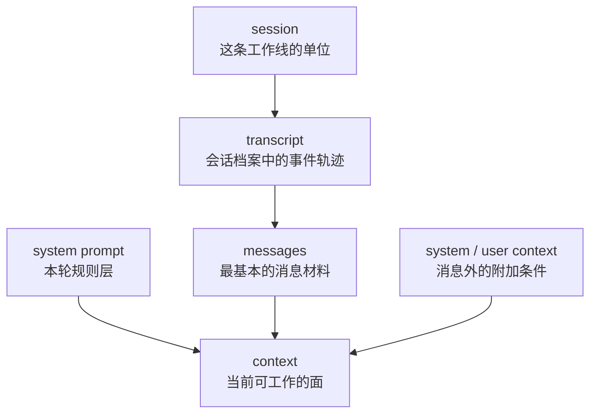

# 卷四 02｜messages / context / system prompt / transcript / session 为什么不是一回事

## 导读

- **所属卷**：卷四：上下文与状态怎么维持系统持续工作
- **卷内位置**：02 / 08
- **上一篇**：[卷四 01｜为什么 Claude Code 不是“一轮跑完就重来”的系统](./01-why-claude-code-is-not-a-one-turn-reset-system.md)
- **下一篇**：[卷四 03｜当前可工作的上下文是怎么被拼起来的](./03-how-the-current-workable-context-is-assembled.md)

卷四第一篇先立住了“持续工作”这个总问题。现在必须马上做语义校准：如果把 messages、context、system prompt、transcript、session 全部压成一个“大上下文”概念，后面的治理链一定会讲糊。因为系统保留历史、构造当前工作面、维护规则层、承载会话单位，本来就不是一件事。

## 这篇要回答的问题

> **messages、context、system prompt、transcript、session 为什么不能混成一回事？**

这篇要留下的判断是：

> **Claude Code 的持续工作能力，不是建立在“有上下文”这么一个笼统说法上，而是建立在这些对象被明确分层对待之上。**

## 先给最短分层图

这张图最重要的作用，不是定义名词，而是防止后文把不同职责混成一团。

## session：这是工作线的单位，不是更大的消息数组

在 Claude Code 里，session 更像“这条工作线的壳”。

`cc/src/bridge/createSession.ts` 创建的不是一轮 query，而是一个可承载 events 的 session；`cc/src/assistant/sessionHistory.ts` 提供的也不是“读取最近几句聊天”，而是按 session 维度分页拉取历史事件。这说明 session 关心的是：

- 这条工作线有没有独立身份
- 这条线已经累积了哪些历史事件
- 后面还能不能在同一条线里继续推进

所以 session 不是“更多一点 context”，而是 **持续工作所依附的单位**。

## transcript：这是可追溯历史，不等于当前送模内容

transcript 更像会话档案。它保存的是这条工作线发生过什么，而不是这一轮一定要带着什么。

这一层的关键点在于：

- transcript 解决的是 **历史存在**
- current context 解决的是 **当前能不能工作**

两者当然有关，但绝不是同一件事。后面讲 projection / collapse 时，最容易犯的错就是把“当前 query 不再原样携带某段旧内容”误解成“历史被系统抹掉了”。如果 transcript 和当前工作面不分层，这个误解就根本拆不开。

## messages：这是基本材料，不是最终工作面

messages 是最容易被误认成“上下文本体”的对象。因为系统里大部分东西最终都会落成 message：

- user message
- assistant message
- tool result
- 边界消息
- 各种系统消息

但 messages 的角色更接近“砖块”，而不是“房子”。

只有 message 还不够，因为系统还要决定：

- 哪些 message 进入当前工作面
- 哪些 message 只保留在 transcript 中
- 哪些 message 需要被 boundary、summary、collapse 处理后再参与当前 turn

所以说 messages 时，谈的是 **材料单位**；说 context 时，谈的是 **材料如何被组织成当前可工作的面**。

## system prompt：这是规则层，不是 transcript 的开头

`cc/src/constants/prompts.ts` 和 `cc/src/constants/systemPromptSections.ts` 很能说明问题。system prompt 在代码里不是“一段固定开场白”，而是一组可分 section、可缓存、可在 `/compact` 后清空重算的规则层。

这意味着 system prompt 的职责是：

- 定义系统行为边界
- 注入能力说明
- 提供当前 turn 的解释框架
- 以独立于消息链的方式持续参与送模

如果把它混成 transcript 的开头，就会误以为它只是历史消息的一部分；而代码里的真实地位更接近 **每一轮都参与构造当前工作面的规则层**。

## context：这是当前真正可工作的面

`cc/src/context.ts` 里有 `getSystemContext()` 和 `getUserContext()`，而且还是 memoized 的。这说明 context 不是一个天生存在的大桶，而是一块被系统按当前会话持续构造、持续复用、必要时清空重建的工作面。

这块面里至少可能包含：

- system prompt
- 用户或项目级补充材料
- 当前活动 messages 视图
- 当前运行环境里必须带着走的辅助信息

所以 context 的重点不是“更大”，而是“更能工作”。它面向当前 query，不面向整个历史档案。

## 为什么这组边界不立住，卷四后半就一定会串线

因为卷四后半要不断回答两个问题：

1. 系统到底在治理什么？
2. 系统到底在恢复什么？

如果这里不分层，就会一路误读下去：

- 把 compact 理解成删 transcript
- 把 collapse 理解成改写历史
- 把 restore 理解成重新打印旧聊天
- 把 session 理解成更大的 context 变量

而对象分层一旦站稳，后面很多判断会自然清楚：

- transcript 主要负责保留历史
- context 主要负责当前工作
- system prompt 主要负责规则层
- session 主要负责承载这条持续工作的单位

## 一句话收口

> **卷四不能用“上下文”一个词把所有对象压平：session 是工作线单位，transcript 是会话档案，messages 是基本材料，system prompt 是规则层，context 才是当前真正可工作的面。只有先把这组边界分清，后面的治理与恢复才讲得稳。**
