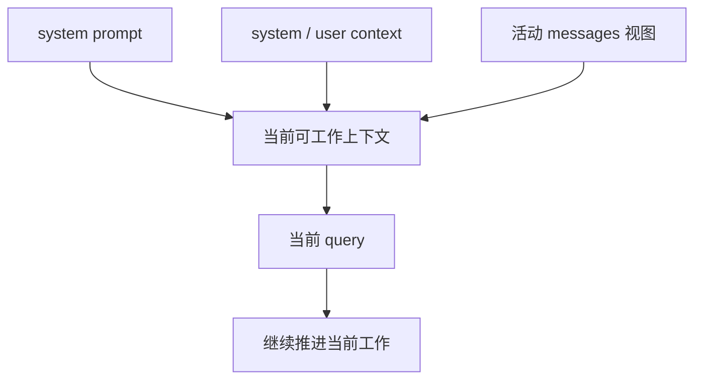

# 卷四 03｜当前可工作的上下文是怎么被拼起来的

## 导读

- **所属卷**：卷四：上下文与状态怎么维持系统持续工作
- **卷内位置**：03 / 08
- **上一篇**：[卷四 02｜messages / context / system prompt / transcript / session 为什么不是一回事](./02-why-messages-context-system-prompt-transcript-session-are-not-the-same.md)
- **下一篇**：[卷四 04｜为什么系统不能把全部历史原样一直送模](./04-why-the-system-cannot-keep-sending-the-entire-history.md)

前一篇刚把对象边界拆开，这一篇就要把它们重新接回当前 turn。Claude Code 每轮真正依赖的，不是 transcript 的原样回放，而是一块为了让当前工作继续推进而被主动拼出来的工作面。卷四前半如果不把这块“当前可工作上下文”立成正式观察框架，后面的治理链就会失去对象。

## 这篇要回答的问题

> **当前 turn 真正依赖的上下文面是怎么形成的，为什么它不等于“把全部历史直接送模”？**

这篇要留下的判断是：

> **Claude Code 每一轮依赖的不是裸历史，而是一块由规则层、附加上下文和活动消息视图共同构造出来的当前工作面。**

## 最短构造图

这里故意没有把 transcript 直接放进图中心，因为 transcript 更像材料库；真正被送进当前 turn 的，是经过选择、拼装和约束后的工作面。

## 先把“当前工作面”这个观察框架立住

这一篇真正要替卷四立住的，不只是一个构造过程，而是一个观察框架：

> **之后再看 projection、collapse、compact、restore，看的都不是“历史本身怎么变化”，而是“当前工作面怎样被构造、减负、重组和续接”。**

也就是说，卷四从这里开始，观察对象已经不再是裸 transcript，而是这一块为了让当前 turn 能继续工作的运行表面。

## 第一层：system prompt 先给这一轮定解释框架

在 `cc/src/constants/prompts.ts` 和 `systemPromptSections.ts` 里，system prompt 不是单块文本，而是一组 section。它们可以缓存、可以重算、也会在 `/compact` 后被清空再建。这说明系统一开始就默认：

- 当前工作面不是天生存在的
- 规则层要持续参与构造
- 同样一段消息，只有放进当前规则层里才有稳定含义

所以 system prompt 在这里的作用，不是“附带提示词”，而是先决定这一轮在什么运行规则下理解后面的所有材料。

## 第二层：system / user context 把消息外条件补进来

`cc/src/context.ts` 中的 `getSystemContext()` 和 `getUserContext()` 很关键，因为它们说明：系统不会只靠消息历史来决定这一轮怎样工作。

这两层 context 往当前工作面里补的是“消息外的条件”，比如：

- 当前仓库或 git 状态
- 用户级或工作区级说明
- 记忆文件与额外约束
- 需要跨多轮保留的长期背景

这类内容的价值不在于记录过去发生了什么，而在于回答：**当前模型究竟处在什么环境里工作。**

如果没有这层补充，message history 只能提供“前情”；它很难独自提供“现场”。

## 第三层：真正带进当前 turn 的，是活动 messages 视图

当前工作面当然离不开消息，但它依赖的不是 transcript 的全量原样，而是当前仍然活跃、仍然与本轮相关的消息视图。

这一点在 compact 相关代码里尤其明显。`cc/src/services/compact/compact.ts` 会使用 `getMessagesAfterCompactBoundary(...)` 之类逻辑；这说明系统天然就区分：

- 哪些消息属于档案层的旧世界
- 哪些消息还处在当前活动段里

也就是说，系统并不假定“只要是历史上出现过的消息，就该原样进入本轮 query”。它更像是在维护一块随工作推进而不断更新的活动视图。

## 这块面的目标不是最完整，而是最能继续工作

这是这一篇真正关键的一句。

Claude Code 构造当前工作面时，追求的不是“尽量像全部历史”，而是“尽量保住当前工作能力”。这意味着：

- 不是所有历史都必须进入本轮
- 不是带得越多越好
- 只要当前 turn 能保持方向、记住关键约束、接住最近工作结果，系统就已经达成目标

这也是卷四必须与“长上下文百科”拉开的地方。卷四关心的不是上下文里到底能塞多少对象，而是：**什么样的上下文面，才足以让工作继续。**

## 一旦把观察框架立住，下一篇的问题就自然出现了

如果当前工作面的目标是“可工作”，而不是“原样重演全部历史”，那么一个更深的问题就会立刻冒出来：

> 为什么系统不能简单一点，始终把全部历史都带着走？

到这里，卷四就会自然从“构造链”推进到“治理链”。因为只要工作面是被构造出来的，它就迟早要面对预算、相关性和聚焦能力的问题。

## 一句话收口

> **Claude Code 每一轮真正送给模型的，不是 transcript 的原样回放，而是由 system prompt、system / user context 与活动消息视图共同拼出来的当前工作面；而从卷四开始，后面所有治理与恢复动作，本质上也都在围绕这块工作面展开。**
