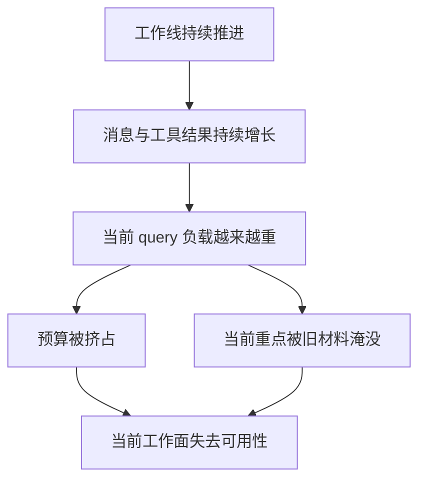

# 卷四 04｜为什么系统不能把全部历史原样一直送模

## 导读

- **所属卷**：卷四：上下文与状态怎么维持系统持续工作
- **卷内位置**：04 / 08
- **上一篇**：[卷四 03｜当前可工作的上下文是怎么被拼起来的](./03-how-the-current-workable-context-is-assembled.md)
- **下一篇**：[卷四 05｜collapse / compaction / projection / restore 的总体关系图](./05-overall-map-of-collapse-compaction-projection-restore.md)

卷四前半已经立住两个前提：Claude Code 是持续工作系统；当前 turn 依赖的是一块被主动构造出来的工作面。接下来必须回答一个更现实的问题：既然如此，为什么系统不能最省事地把全部历史原样一直送模？这一篇要立住的，就是上下文治理为什么会从“优化项”变成“必需项”。

## 这篇要回答的问题

> **为什么持续工作一旦成立，原样无限送模就会变成必然失效的路径？**

这篇要留下的判断是：

> **Claude Code 需要上下文治理，不是为了炫机制，而是因为持续工作天然会让“全部历史原样带着走”这条路越来越不可用。**

## 历史不是均匀增长，而是会不断夹带大块现实材料

一条工作线真正会膨胀的，不只是用户和 assistant 的对话。

更重的部分往往来自：

- read file 的长文件内容
- grep / search 的批量命中
- bash 命令输出
- tool result 回流
- 多轮分析里留下的大块中间结论

这意味着历史并不是一条均匀变长的文本，而是一条不断被现实材料撑大的工作轨迹。只要系统默认把它全部原样送模，迟早会发生两件事：

1. token 预算被大块结果挤占。
2. 真正还与当前任务相关的信息，被旧材料埋住。

所以问题从来不只是“长度变长了”，而是 **密度失衡了**。

## 当前 turn 要的是可工作视图，不是忠实回放全部过去

上一篇已经立住：当前工作面的目标是“让这一轮还能继续工作”。

而“把全部历史原样送模”其实在追求另一件事：尽量让模型再看一遍完整过去。这个目标听起来安全，其实和“继续工作”并不完全一致。因为很多内容对 transcript 有价值，对恢复有价值，却未必对这一轮还有同等工作价值。

一旦系统把“历史存在”与“当前工作”拆开，治理就不再是可选优化，而会变成一种必需分工：

- 档案层可以尽量保留
- 当前工作面必须重新聚焦

## 压力不是最后一刻才出现，而是在整条工作线上持续逼近

从代码里也能看出，Claude Code 不是等到彻底爆窗才想起治理。

- `cc/src/services/compact/autoCompact.ts` 负责自动 compact 路径。
- `compactWarningState.ts` 维护接近 compact 阈值时的 warning 状态。
- `CompactBoundaryMessage.tsx` 在界面里明确暴露 compact boundary。
- `postCompactCleanup.ts` 说明 compact 之后还要清理缓存与状态，避免旧工作面继续污染后续 turn。

这些文件放在一起说明一件事：

> **上下文压力不是异常，而是持续工作的常态。**

只要系统允许同一条工作线长期推进，它就必须把治理链纳入主路径。

## 图：为什么“全部历史原样送模”会失效

这张图最重要的不是“预算不够”，而是：**容量问题和聚焦问题会一起出现。**

## 治理的目标不是节流本身，而是保住工作能力

把治理理解成“省 token 技巧”会把卷四写窄。Claude Code 真正怕的，不是单纯多花一点预算，而是：

- 当前工作线越来越难接
- 模型在大量旧材料里失焦
- 最关键的最近判断和现实约束被旧内容盖住
- 系统在最需要连续工作的时候突然变得不连续

所以治理在卷四里的地位，不是附带优化，而是持续工作系统的生存条件。

## 这篇先不展开什么

### 1. 不逐个讲机制

这一篇只负责立住“为什么必须治理”，不负责把 collapse / compaction / projection / restore 逐个讲完。

### 2. 不把问题收缩成上下文窗口科普

窗口限制当然存在，但卷四真正关心的是：系统怎样在长期工作里维持一块仍然可工作的面。

## 一句话收口

> **Claude Code 不可能把全部历史原样一直送模，因为持续工作会不断带来历史膨胀、密度失衡和当前焦点被埋没的问题；上下文治理之所以成为主路径能力，是为了保住“这条工作线还能继续干”这件事。**
