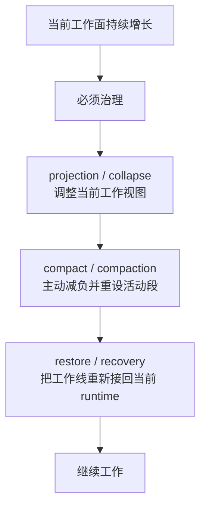

# 卷四 05｜collapse / compaction / projection / restore 的总体关系图

## 导读

- **所属卷**：卷四：上下文与状态怎么维持系统持续工作
- **卷内位置**：05 / 08
- **上一篇**：[卷四 04｜为什么系统不能把全部历史原样一直送模](./04-why-the-system-cannot-keep-sending-the-entire-history.md)
- **下一篇**：[卷四 06｜projection / collapse：系统治理的不是 transcript 本身，而是当前可工作的视图](./06-projection-and-collapse-govern-the-workable-view-not-the-transcript-itself.md)

上一篇已经说明：一旦系统允许同一条工作线长期推进，治理就会变成必需项。现在还不能直接冲进单个机制，因为那样卷四后半会退化成功能目录。更稳的做法，是先把 collapse、compaction、projection、restore 压回一张读者能复述的心智地图：它们不是并排能力，而是一条围绕“维持当前可工作的上下文面”展开的治理与恢复链。

## 这篇要回答的问题

> **collapse、compaction、projection、restore 到底是什么关系，为什么不能被写成几块并列功能？**

这篇要留下的判断是：

> **卷四后半真正展开的，不是四个功能名，而是一条围绕“当前工作面能否继续成立”组织起来的治理与恢复链。**

## 先给后半卷总图

这张图最重要的不是把四个名词摆出来，而是让读者先留下一个顺序判断：**系统先要守住当前工作面，再要重设下一段工作条件，最后还要把这条线重新接活。**

## 为什么这一组机制必须被理解成一条链

如果把它们拆成并排功能点，读者会很自然地把后半卷理解成：

- 有一个折叠机制
- 有一个压缩机制
- 有一个投影机制
- 有一个恢复机制

这种理解并不完全错，但它会漏掉卷四真正关心的东西：这些机制不是为了各自存在，而是为了让同一条工作线在变长、变重、变复杂之后仍然能继续工作。

也就是说，卷四后半不是在回答“系统有哪些长上下文 feature”，而是在回答：

> **当一条工作线持续变长时，系统靠什么把它维持在可工作的状态里？**

一旦换成这个问题，四个机制的关系就会从“并排名词”变成“连续分工”。

## 第一段：projection / collapse 先处理“当前工作面怎么看”

projection 和 collapse 更靠近视图层。它们首先回答的不是“历史是否被删除”，而是：

- 当前 turn 还需要带着哪些旧内容
- 这些旧内容该以原样、折叠、投影还是替代表达进入当前工作面
- 怎样在不要求历史总是原密度出现的前提下，维持一块可工作的视图

也因此，projection / collapse 更像 **先把当前工作面调到还能看、还能用、还能继续推进的状态**。

这也是 06 要单独成篇的原因：卷四后半最先要校正的，不是哪种压缩更厉害，而是系统真正优先治理的对象到底是什么。

## 第二段：compact / compaction 再处理“下一段工作怎么继续跑”

compact 往前走了一步。它不只是把当前视图变轻，而是明确引入：

- boundary
- summary
- retained context
- post-compact cleanup

这些动作连在一起，意味着系统不是简单“缩一缩”，而是在 **主动重设下一段工作的默认起跑线**。

所以 compact / compaction 在这条链里承担的，不只是减负，而是把系统从“这一轮已经太重”拉回“下一轮还能继续”。它处理的是工作条件重组，而不只是视图轻量化。

## 第三段：restore / recovery 最后处理“这条线怎样重新接活”

如果链条只停在治理，它仍然只是半套系统。卷四最后必须把 restore / recovery 拉回来，因为持续工作不是“能压缩”，而是“压完之后还能接着干”。

从职责上说，restore / recovery 主要处理的是：

- 从档案里整理出还能接的工作包
- 把这份工作包接回当前 runtime
- 让 session、当前状态和新一轮 query 重新连成一条线

所以它们不是治理链的尾声装饰，而是卷四总问题的最后闭环。

## 用一张更像读者心智地图的图再压一遍

如果读者读完整个后半卷，只留下这一张图，其实就够了。因为它逼着我们把四个机制理解成同一条持续工作链上的不同岗位，而不是四个互不相干的功能按钮。

## 代码里的分工，也天然更像一条链

- `cc/src/services/compact/compact.ts` 负责完整 compact 主逻辑。
- `postCompactCleanup.ts` 说明 compact 不只是加摘要，还会清理 system prompt section、user context cache、session message cache 等运行状态。
- `cc/src/constants/systemPromptSections.ts` 与 `context.ts` 说明当前工作面本来就是会被清空、重算、重建的。
- `sessionHistory.ts` 与 `createSession.ts` 则说明系统一直保留可用于恢复的会话壳与事件历史。

这些文件放在一起，展示的不是四个互不相干的 feature，而是一条从“维持当前工作面”到“重新接回工作线”的连续分工链。

## 后三篇为什么必须按这个关系来拆

如果没有这张心智地图，后面的 06 / 07 / 08 很容易互相串线：

- 06 会膨胀成全部治理总论
- 07 会吞掉 projection / collapse 的职责
- 08 会只剩 session 恢复说明，而丢掉卷尾收束

所以这一篇真正做的，不是替后文分配任务，而是先把读者看后半卷时必须带着的地图钉住：

- 06 先校正治理对象
- 07 专讲主动减负机制本体
- 08 再把恢复与卷尾总图收回来

## 一句话收口

> **collapse、projection、compact、restore 在卷四里不是并排功能，而是一条连续分工：先调节当前工作视图，再主动减负并重设活动段，最后把这条工作线重新接回当前 runtime。**
