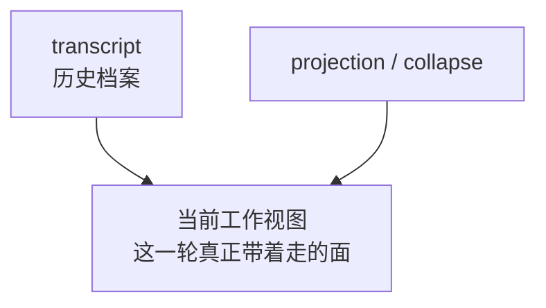
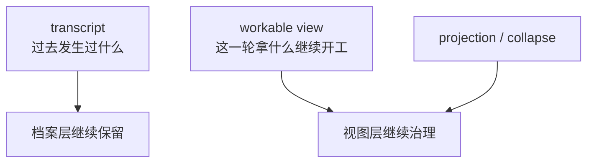
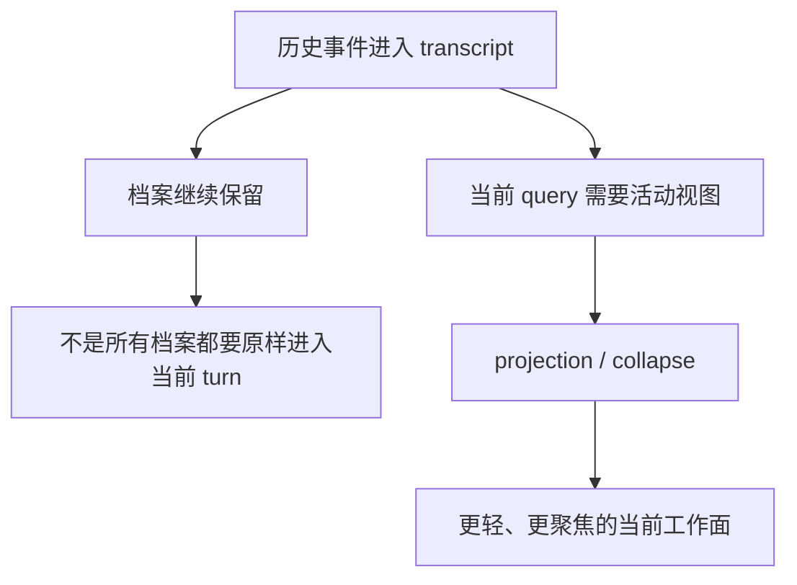

# 卷四 06｜projection / collapse：系统治理的不是 transcript 本身，而是当前可工作的视图

## 导读

- **所属卷**：卷四：上下文与状态怎么维持系统持续工作
- **卷内位置**：06 / 08
- **上一篇**：[卷四 05｜collapse / compaction / projection / restore 的总体关系图](./05-overall-map-of-collapse-compaction-projection-restore.md)
- **下一篇**：[卷四 07｜compact / compaction：主动减负机制本体](./07-compact-and-compaction-as-the-active-load-shedding-mechanism.md)

卷四后半已经有了总图，但真正最容易把读者带偏的，不是某个机制细节，而是一个更早的误解：只要看到 collapse、summary、replacement、折叠，直觉就会把它们理解成“系统在改历史”。这一篇先不急着讲复杂实现，而是先把治理对象校正过来。Claude Code 真正优先处理的，不是 transcript 这份档案本体，而是当前 turn 还能不能拿着一块可工作的视图继续推进。

## 这篇要回答的问题

> **projection / collapse 到底在治理什么，为什么这不是“改写 transcript 本身”？**

这篇要留下的判断是：

> **Claude Code 先处理的不是历史文本本体，而是当前 query 实际携带的工作视图。**

## 先给最短对照图

这张图故意把 transcript 和工作视图拆成两层，因为只有这样，后面的治理动作才不会被自动翻译成“系统在偷偷删除历史”。

## 先拆最常见的误解：为什么读者会以为系统在“改历史”

读者产生误解，其实很正常。因为从表面现象看，projection / collapse 的确会带来几件很像“改历史”的结果：

- 一些旧内容不再原样进入当前 query
- 一些 read / search 结果被折叠成组
- 一些段落被 summary 或 replacement 代表
- 当前上下文明显变轻了

如果只盯着这些现象，最顺手的结论就是：

> **既然当前看到的内容变了，那系统改的就是历史本身。**

但这个结论的问题在于，它把两件事压成了一件事：

1. 历史是否仍然作为档案被保留
2. 当前 turn 是否还需要以原始密度携带那段历史

卷四真正要校正的，就是这两个问题不能混在一起。

## 校正一：transcript 负责“历史还在”，工作视图负责“当前还能干活”

更准确地说，Claude Code 同时面对的是两个不同目标：

- **档案目标**：这条工作线发生过什么，要能追溯、能恢复、能继续引用
- **工作目标**：当前这一轮还能不能在有限预算和有限注意力里继续推进

transcript 更靠近第一个目标，当前工作视图更靠近第二个目标。

所以真正稳定的模型不是“系统只有一份上下文，然后不断改它”，而是：

> **档案层可以继续保留，视图层却必须按当前工作需要不断调整。**

一旦把这层分开，很多误读会自动消失。当前 query 不再原样带着某段旧内容，并不等于那段历史不存在了；它更可能只是在说：那段历史此刻不该再用原始密度压住当前工作面。

## 补图：transcript 与 workable view 边界图

这张补图把本篇最该校正的东西压成最短边界：**transcript 回答“过去发生了什么”，workable view 回答“这一轮拿什么继续工作”，projection / collapse 管的是后者，不是前者。**

## projection：处理的是“旧材料怎样进入当前这一轮”

projection 更像一种重投影。它不重新定义过去发生了什么，而是决定：

- 哪些过去的材料此刻仍然应该进入当前工作面
- 这些材料要以什么粒度进入
- 是否需要以替代表达、折叠表达或更轻量的方式带入

换句话说，projection 处理的是 **档案如何转成当前视图**，而不是档案本体如何被重写。

这也是为什么 projection 在卷四里重要：它逼读者接受一个更准确的模型——系统不是把历史整块搬进当前 query，而是在把历史重新投成一块此刻还能工作的面。

## collapse：处理的是“当前工作面要以什么密度继续存在”

collapse 也首先是视图层动作。它的重点不是“抹掉旧内容”，而是“让旧内容不再以原始密度压住当前工作面”。

从 UI 侧的组件命名也能看出这一点：

- `ContextVisualization.tsx` 展示的是上下文在 collapse 之后如何被可视化
- `CollapsedReadSearchContent.tsx` 关心的是 read / search 结果如何被折叠为当前可浏览、可展开的组

这些名字本身就在提示：系统首先在处理的是 **当前工作面如何呈现、如何负载、如何继续可用**，而不是偷偷去篡改 transcript。

## 新模型：Claude Code 治理的是“档案到工作面”这段转换关系

到这里，可以把新模型压成一句更完整的话：

> **Claude Code 不是直接治理 transcript 本体，而是在治理“档案如何变成当前工作面”这段转换关系。**

也因此，projection / collapse 在卷四里的位置不是过渡说明，而是认知校正：

- transcript 不等于当前送模内容
- 视图变轻不等于历史被删
- 治理的第一层不是改档案，而是改当前工作面的负载方式

图示可以再压缩成下面这样：

这张图最关键的不是流程感，而是边界感：同一条历史可以同时满足两件事——被保留在档案里，以及被以更轻量的方式带进当前工作面。

## 为什么这一层一旦讲清，07 和 08 才不会跑偏

06 真正的作用，是替后两篇扫雷。

如果不先立住“治理对象是当前工作视图”，那么：

- 07 会很容易被误读成“删历史机制”
- 08 会很容易被误读成“把删掉的历史重新读回来”

而在正确边界下，后面的分工才会自然清楚：

- 07 讲的是如何主动重组当前工作条件
- 08 讲的是治理之后，如何把这条工作线重新接活

也就是说，06 不是后半卷的过渡篇，而是后半卷真正的认知校正篇：它先把“系统到底在治理什么”这件事讲正，后面的 compact 与 restore 才不会建立在错误对象上。

## 一句话收口

> **projection / collapse 的关键，不在于它们有没有改过某段旧文本，而在于它们先处理的是当前 query 真正携带的工作视图：历史可以继续保留在 transcript 里，但当前工作面不能永远背着历史的原始密度。**
