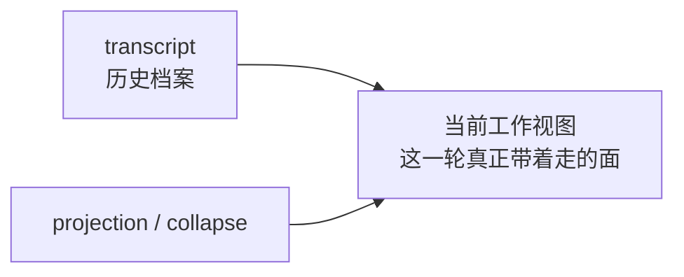
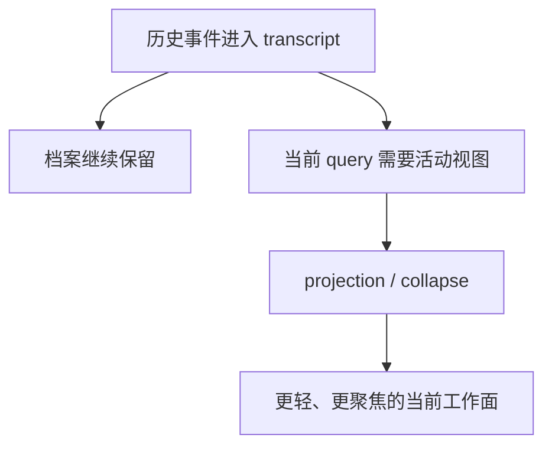

# 卷四 06｜projection / collapse：系统治理的不是 transcript 本身，而是当前可工作的视图

## 导读

- **所属卷**：卷四：上下文与状态怎么维持系统持续工作
- **卷内位置**：06 / 08
- **上一篇**：[卷四 05｜collapse / compaction / projection / restore 的总体关系图](./05-overall-map-of-collapse-compaction-projection-restore.md)
- **下一篇**：[卷四 07｜compact / compaction：主动减负机制本体](./07-compact-and-compaction-as-the-active-load-shedding-mechanism.md)

卷四后半的总图已经给出，但还有一个最容易带偏读者的误解必须先拆掉：只要看到 collapse、summary、replacement、折叠，读者就会直觉地以为系统在“改历史”。这一篇的任务，就是先把治理对象校正清楚。Claude Code 真正优先治理的，不是 transcript 本体，而是当前 turn 还能不能拿着一块可工作的视图继续往下走。

## 这篇要回答的问题

> **projection / collapse 到底在治理什么，为什么这不是“改写 transcript 本身”？**

这篇要留下的判断是：

> **Claude Code 先处理的不是历史文本本体，而是当前 query 实际携带的工作视图。**

## 先给最短对照图

这张图故意把 transcript 和工作视图拆成两层，因为只有这样，后面的治理动作才不会被误读成“系统在偷偷删除历史”。

## 为什么必须先校正“治理对象”

如果不先校正，后面几篇一定会被错误直觉拖着走：

- 旧内容不再原样进入当前 query = 历史被删了
- 出现 summary 或 collapsed span = transcript 被改写了
- 当前上下文变轻 = 系统不再保留之前的工作轨迹了

但卷四真正要建立的判断恰好相反：

> **档案层可以继续保留，视图层却必须按当前工作需要不断调整。**

也就是说，历史存在和当前可工作，本来就是两个不同目标。

## projection：处理的是“旧材料怎样进入当前这一轮”

projection 更像一种重投影。它不重新定义过去发生了什么，而是决定：

- 哪些过去的材料此刻仍然应该进入当前工作面
- 这些材料要以什么粒度进入
- 是否需要以替代表达、折叠表达或更轻量的方式带入

换句话说，projection 处理的是 **档案如何转成当前视图**，而不是档案本体如何被重写。

## collapse：处理的是“当前工作面要以什么密度继续存在”

collapse 也更像视图层动作。它的重点不在“抹掉旧内容”，而在“让旧内容不再以原始密度压住当前工作面”。

从 UI 侧的组件命名也能看出这一点：

- `ContextVisualization.tsx` 展示的是上下文在 collapse 之后如何被可视化。
- `CollapsedReadSearchContent.tsx` 关心的是 read / search 结果如何被折叠为当前可浏览、可展开的组。

这些名字本身就说明，系统首先在处理的是 **当前工作面如何呈现**，而不是偷偷去篡改 transcript。

## 图：档案保留与视图治理是两条并行要求

这张图的重点是：同一条历史可以同时满足两件事——被保留在档案里，以及被以更轻量的方式带进当前工作面。

## 为什么这一层一旦讲清，07 和 08 才不会跑偏

因为 06 实际上是在替后两篇扫雷。

如果不先立住“治理对象是当前工作视图”，那么：

- 07 会很容易被误读成“删历史机制”
- 08 会很容易被误读成“把删掉的历史重新读回来”

而在正确边界下，后面的关系就会自然清楚：

- 07 讲的是如何主动重组当前工作条件
- 08 讲的是治理之后，如何把这条工作线重新接活

## 一句话收口

> **projection / collapse 的关键，不在于它们有没有改过某段旧文本，而在于它们先处理的是当前 query 真正携带的工作视图：历史可以继续保留在 transcript 里，但当前工作面不能永远背着历史的原始密度。**
