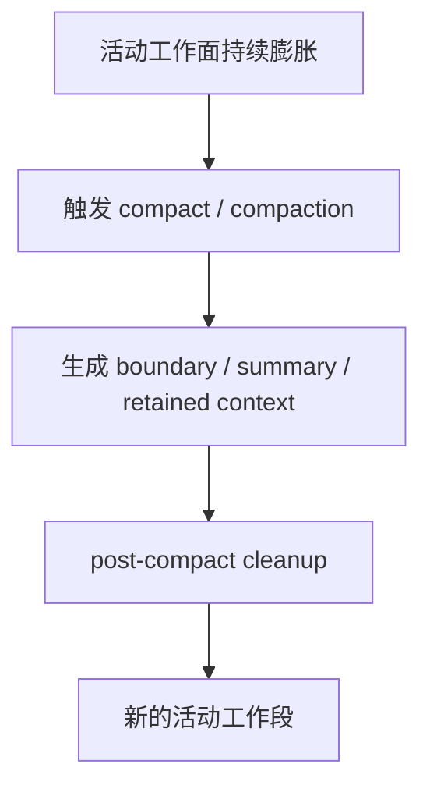
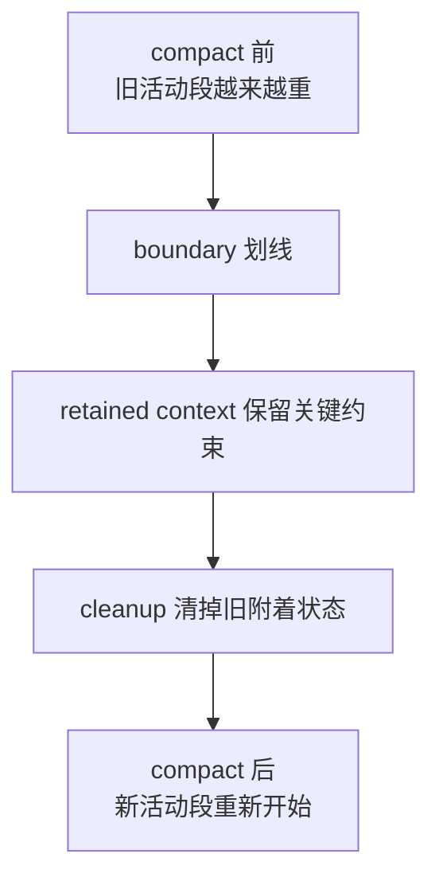
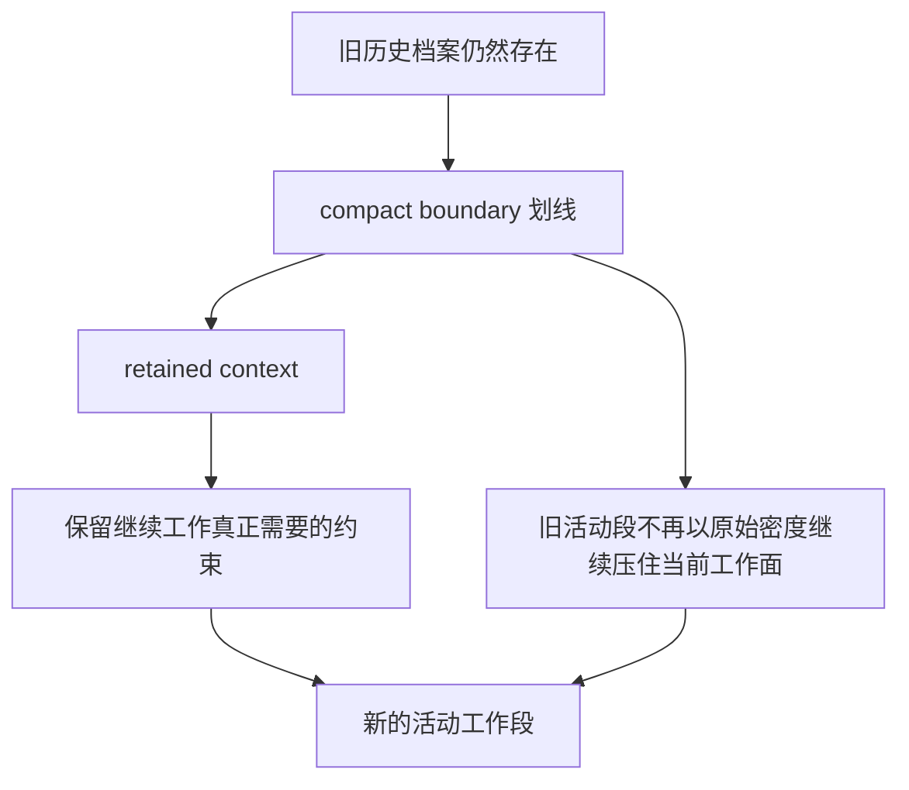

# 卷四 07｜compact / compaction：主动减负机制本体

## 导读

- **所属卷**：卷四：上下文与状态怎么维持系统持续工作
- **卷内位置**：07 / 08
- **上一篇**：[卷四 06｜projection / collapse：系统治理的不是 transcript 本身，而是当前可工作的视图](./06-projection-and-collapse-govern-the-workable-view-not-the-transcript-itself.md)
- **下一篇**：[卷四 08｜restore / session recovery：系统怎么把这条线重新接活](./08-restore-and-session-recovery-how-the-system-resumes-work.md)

上一篇已经先校正了治理对象：系统优先处理的是当前可工作的视图，而不是 transcript 本体。现在才轮到卷四后半最容易被误认成“全部治理总论”的机制：compact / compaction。它们当然会压缩、总结、切边，但真正价值不在“把文本弄短”，而在于主动重组当前工作条件，让系统从越来越沉重的工作面里重新站稳。

## 这篇要回答的问题

> **compact / compaction 在治理链里到底承担什么职责，为什么它不等于简单删历史？**

这篇要留下的判断是：

> **compact / compaction 的价值，不是压缩对话长度，而是重新划定后续工作的默认起跑线。**

## compact 的“主动性”，体现在它会重新组织下一段工作

compact 不是被动截断，而是主动做三件事：

1. **宣布边界**：旧工作段与新工作段被正式切开。
2. **生成 retained context**：系统保留的不再是原始密度，而是一份能继续工作的摘要与关键约束。
3. **清理旧状态**：compact 后还要做 cleanup，说明系统不是插入一条 summary 就完事，而是在重组后续运行条件。

这三步合起来，才叫“主动减负”。

## 图 1：compact 更像重设下一阶段的起跑线

这张图里最关键的不是 summary，而是 **新的活动工作段**。compact 的真正作用，是让系统能够带着更轻但仍可工作的条件继续跑。

## 图 2：compact 前后工作面的对照图

## boundary 为什么是 compact 的核心，而不是配角

在 `cc/src/services/compact/compact.ts` 的相关逻辑里，`getMessagesAfterCompactBoundary(...)` 这类处理很关键。它说明 compact 的结果不是“历史里多出一条总结消息”，而是：

> **后续 query 默认依赖的活动消息段，被重新划线了。**

这就是 compact 和一般摘要最大的区别。一般摘要只是帮助理解；compact 则直接影响 runtime 此后怎样组织当前工作面。

## summary 为什么不是普通总结

compact prompt 的要求之所以很重，是因为它要保留下来的不是“聊天记录缩写版”，而是继续工作真正需要的东西：

- 用户要解决什么问题
- 到目前为止已经做了什么
- 哪些文件、代码段、判断仍然重要
- 下一步最应该从哪里继续

也就是说，compact summary 的目标不是文学上的压缩，而是工程上的续航。

## 补图：retained context 和旧历史的区别

这张补图最值的地方，是把 compact 最容易被误解的一点切开：**retained context 不是“旧历史缩写版”，而是后续工作真正赖以起跑的轻量条件；旧历史仍在，但不再以原始密度继续压住当前活动段。**

## post-compact cleanup 说明：compact 真正在重设当前工作条件

`cc/src/services/compact/postCompactCleanup.ts` 很能说明问题。compact 之后，系统会清理：

- system prompt sections
- `getUserContext()` cache
- session messages cache
- 一些与 microcompact、classifier、context collapse 相关的状态

如果 compact 只是“多生成一段摘要”，根本不需要这样做。之所以要 cleanup，恰恰说明 compact 真正在做的是：

> **把旧工作面的附着状态一起清掉，让后续 turn 在新的活动段上重新开始。**

## 为什么 compact 不是“删历史”

因为历史档案层并没有因此消失。更准确地说，compact 改变的不是“历史是否存在”，而是“历史以什么方式继续参与后续工作”。

所以它真正做的是：

- 保留档案层历史
- 改写活动段边界
- 把旧世界压成 retained context
- 让新一段工作能在更轻的条件下继续进行

这和“删历史”完全不是一个层次。

## 这篇和 06、08 的边界

卷四里必须守住三篇的分工：

- 06 讲治理对象：系统先处理的是视图，不是 transcript。
- 07 讲主动减负：系统怎样重设活动段与当前工作条件。
- 08 讲恢复与续接：治理之后，这条线怎样重新接活。

只要 07 越界去讲恢复，或者回头重讲视图治理，卷四后半就会重新打结。

## 一句话收口

> **compact / compaction 在 Claude Code 里不是把对话压短这么简单；它真正做的是用 boundary、retained context 和 cleanup 重设后续工作的默认起跑线，把一条越跑越重的工作线重新拉回可继续推进的状态。**
