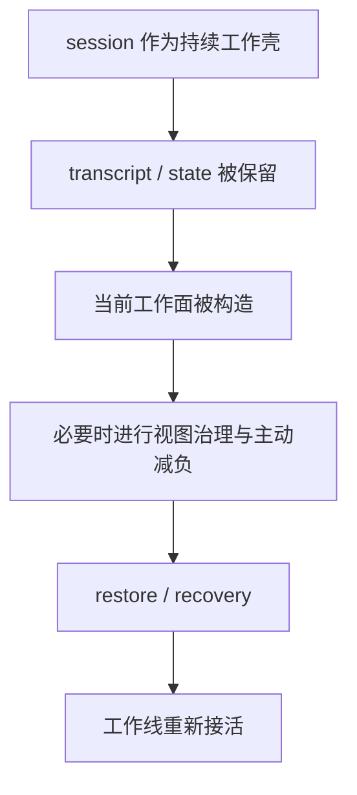

# 卷四 08｜restore / session recovery：系统怎么把这条线重新接活

## 导读

- **所属卷**：卷四：上下文与状态怎么维持系统持续工作
- **卷内位置**：08 / 08
- **上一篇**：[卷四 07｜compact / compaction：主动减负机制本体](./07-compact-and-compaction-as-the-active-load-shedding-mechanism.md)
- **下一篇**：卷五：外部扩展与多代理能力

如果卷四只讲到 projection、collapse 和 compact，那么它解释的仍然只是系统怎样防止自己被历史压垮；但卷四真正要回答的是更完整的问题：这套系统怎样在治理之后继续活着。所以最后必须把 restore / session recovery 拉回来。它们不只是把旧消息读一遍，而是把一条会话工作线、连同必要状态与当前工作条件，一起接回当前 runtime。

## 这篇要回答的问题

> **为什么治理之后还需要恢复与续接，session recovery 又怎样把工作线重新接起来？**

这篇要留下的判断是：

> **卷四真正要解释的，不是系统怎样压短历史，而是它怎样在治理之后把工作线重新接活。**

## 先给卷四卷尾总图

这张图就是卷四真正想留下的残影：对象边界、当前工作面、治理链、恢复链，本来就是一件事的四个侧面。前面 01 到 07 做的，不是铺设若干功能点，而是在回答：一条工作线怎样不散。08 则必须把这个问题收死。

## recovery 不是“把旧聊天翻出来”，而是先整理出可接的工作包

恢复链的第一步，不是把 transcript 原样重贴到屏幕上，而是从会话档案里整理出一份还能继续工作的恢复包。

`cc/src/assistant/sessionHistory.ts` 提供的是分页读取 session events 的能力，这说明系统恢复依赖的是事件线，而不是单一聊天文本。也因此，recovery 关心的重点是：

- 当前要恢复的是哪条 session
- 这条 session 留下了哪些事件和状态线索
- 哪些内容值得进入新的工作起点

所以 recovery 更像 **从档案层重新提炼出可工作的入口**。

## restore 才是“把这份工作包接回当前 runtime”

恢复链的第二步才是 restore。`cc/src/bridge/createSession.ts` 说明 session 可以带着已有 events 被创建出来；这意味着 restore 的重点不是回看过去，而是让当前运行现场重新拥有：

- 一条有效的 session 壳
- 可继续承接的事件历史
- 能重新组织当前工作面的起点

从这个意义上说，restore 更像“把工作包重新落回当前运行现场”，而不是简单“读档”。

## 图：恢复不是单层动作，而是“读出工作包 -> 接回运行现场”

这张图能把 recovery 和 restore 的分工压清：前者偏读取与整理，后者偏接回与落地。

## 为什么恢复不是附属功能，而是持续工作闭环的最后一环

如果把恢复理解成一个可有可无的附属能力，卷四就会在 07 停住：

- 系统会治理
- 系统会压缩
- 系统会减负

但这还不等于系统真的具备持续工作能力。持续工作真正困难的地方在于：

> **工作线被治理过、被重组过、被阶段化之后，还能不能重新成为一个可继续推进的现场。**

所以 restore / recovery 在卷四里不是“讲完治理以后顺手补一下”的尾声功能，而是这条链最终成立的证据。没有它，前面的 projection、collapse、compact 都只是在说明系统会处理负担；有了它，卷四才能说明系统会把处理过的工作重新接成活线。

## 把 01 到 08 压回一条闭环

到卷尾，卷四真正完成的不是 8 篇文章，而是一条闭环：

1. 01 先立住：Claude Code 不是一轮跑完就重来的系统。
2. 02 再分清：session、transcript、messages、system prompt、context 分别在解决什么问题。
3. 03 再说明：当前 turn 依赖的是被构造出来的当前工作面，而不是裸历史。
4. 04 再推出：只要工作线持续变长，原样无限送模就一定会失效。
5. 05 再给出：projection / collapse、compact / compaction、restore / recovery 是一条连续分工链。
6. 06 再校正：系统先治理的不是 transcript 本体，而是当前可工作的视图。
7. 07 再解释：compact / compaction 怎样主动减负并重设下一段工作条件。
8. 08 最后收束：治理之后，这条线怎样重新接活。

到这里，卷四留下的就不再是一组机制名，而是一张持续工作闭环图：**有工作线，有档案，有当前工作面，有治理，有恢复，所以系统能继续活。**

## 自然导向后续，但不抢后续职责

卷四收在这里，刚好把读者送到后续两卷：

- 卷五继续解释：系统怎样接入 skills、agents、MCP 等外部扩展能力。
- 卷六继续解释：命令、工作流与产品入口怎样把这些能力收成今天的 Claude Code。

但卷四自己的任务到这里已经完成：它解释的不是系统怎样长出更多能力，也不是这些能力怎样被用户入口调度，而是 **这套系统为什么能一直工作**。

## 一句话收口

> **restore / session recovery 在卷四里的作用，不是把旧聊天重新读出来，而是把会话档案、当前工作条件与新的运行现场重新接成一条线；它不是附属功能，而是持续工作闭环的最后一环。**
