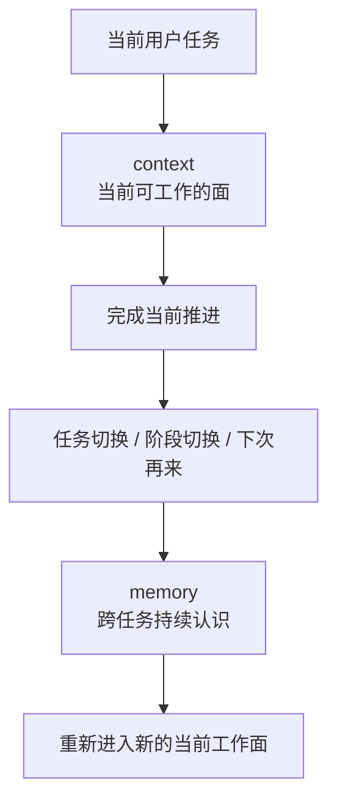

# 卷四 09｜为什么 Claude Code 的 memory 不是 context 的别名

## 导读

- **所属卷**：卷四：上下文与状态怎么维持系统持续工作
- **卷内位置**：09 / 09
- **在长期记忆组中的位置**：01 / 04
- **上一篇**：[卷四 08｜restore / session recovery 怎么让系统恢复工作](./08-restore-and-session-recovery-how-the-system-resumes-work.md)
- **下一篇**：[卷四 10｜working memory / transcript / long-term memory 为什么不是一回事](./10-why-working-memory-transcript-and-long-term-memory-are-not-the-same.md)

卷四前八篇，基本都在回答同一个问题：Claude Code 怎样把当前这条工作线维持下去。到这里，读者很容易自然滑进一个新误解：既然系统已经会维持上下文、会处理历史、会做恢复，那么所谓 memory，大概只是“更长一点的 context”。

这正是长期记忆组第一篇必须先拆掉的误会。因为一旦把 memory 误解成长上下文补丁，后面关于长期记忆分层、长期记忆载体、自动记忆提取的讨论，都会被读成“系统只是想多塞一点字给模型”。但 Claude Code 要解决的，其实不是这个问题。

## 这篇要回答的问题

> **为什么 memory 不能被理解成“更长一点的上下文”，而必须被看成另一层持续性机制？**

这篇先给结论：

> **context 更偏当前工作面的成立，memory 更偏跨任务持续认识用户与项目；所以 memory 不是长上下文，而是让系统从一次性会话器继续走向持续工作者的另一层机制。**

## 先把最短判断摆出来

如果只用一句最短的话区分两者，可以这样记：

- **context** 关心的是：当前这一轮怎样才能继续干活。
- **memory** 关心的是：下次换了任务、换了阶段、甚至换了切入点，系统还认不认识这个人和这个项目。

这两个问题当然有关，但不是同一个问题。

也正因为不是同一个问题，memory 不能被压进“更大的 context window”想象里。更长的上下文，最多只是让系统在当前工作面里带上更多材料；而长期记忆成立时，系统获得的是另一种能力：**不只延长当前会话，而是跨任务持续保留认识。**

## 为什么“更长的 context”这个理解会误导你

把 memory 想成更长 context，直觉上很顺，因为它们都会进入模型工作的条件里。但这会带来三个连续误判。

### 误判一：把“当前还能继续工作”错当成“系统已经形成长期认识”

卷四前半已经讲得很清楚，Claude Code 会维护当前工作面，会治理历史膨胀，也会在中断后恢复工作。这些能力说明系统不是“一轮即散”的短事务壳。

但这仍然主要是在回答：

- 当前这条工作线怎么续上
- 当前这一轮怎么保持可工作
- 当前 runtime 怎么别被历史压垮

换句话说，这一整套 context continuity 机制，首先保证的是**当前工作面不塌**。

可长期记忆要回答的不是“这一轮还能不能续”，而是：

- 过了这轮之后，系统还留下了什么认识
- 这些认识下次是否还能继续发挥作用
- 系统面对同一用户、同一项目时，是否不必每次都从零重新认识

这已经不是当前工作面的问题，而是**跨任务持续性**的问题。

### 误判二：把“保留了历史”错当成“形成了 memory”

很多人一看到 transcript、history、session event，就会自然觉得：既然系统已经没把东西丢掉，那不就是 memory 吗？

不是。

保留历史，首先解决的是“过去发生过什么还能不能追溯”；而形成 memory，解决的是“过去发生过的东西里，什么已经被系统保留下来，变成可复用的长期认识”。

两者的区别在于：

- **history / transcript** 更像档案
- **memory** 更像沉淀下来的认识

档案可以很多，认识必须更少、更稳、更能跨任务复用。否则系统只是有一堆过去发生过的事，并没有真正“记住”什么。

### 误判三：把“多放一点字”错当成“长期记忆机制已经成立”

如果 memory 只是更长 context，那么问题就会退化成：

- 还能再塞多少
- 哪些内容优先带着走
- 怎样别超 token

这些当然是 context 问题，但不是长期记忆最根上的问题。

长期记忆真正关心的是另一件事：

> **系统决定长期保留什么认识，并且让这些认识在后续任务里继续起作用。**

所以它的难点不是“容量再大一点”，而是“什么东西值得跨任务留下来”。这已经从工作面组织问题，转成了持续认识问题。

## 用一张图把两层持续性拆开

这张图最重要的不是画出两个名词，而是让读者看到它们分居在两段不同的位置：

- **context** 更靠近“现在怎么干”
- **memory** 更靠近“以后还认不认识”

前者是当前工作条件，后者是跨任务持续认识。

## 卷四前八篇已经把 context 讲得很清楚，但还没自动推出 memory

这也是这篇最容易被误读的地方。

卷四 01 到 08 已经建立了一个很强的判断：Claude Code 不是一次输入、一次输出的短事务系统，而是一套会维持工作线、治理工作面、支持恢复续接的 runtime。

这条线非常重要，但它先证明的是：

> **Claude Code 不只是会话器，它至少已经是一个能持续维持当前工作条件的系统。**

可长期记忆组要再往前推进一步，补上的不是“当前工作面继续维持”，而是“系统怎样持续认识用户与项目”。

也就是说：

- 前八篇更偏 **同一工作线如何不断续上**
- 从第九篇开始，要补 **跨任务怎样不断积累认识**

所以 memory 和 context 的关系，不是上位词和下位词的关系，也不是容量大和容量小的关系，而是**两层持续性分工**：

- 一层保证当前能继续工作
- 一层保证以后不必重新认识

## 为什么长期记忆一旦成立，系统就不再只是一次性会话器

这其实才是本篇真正要立住的判断。

一次性会话器即便有很长的上下文，本质上仍然是在一段会话里临时工作。上下文再长，只要会话结束、任务切换、工作面重组之后系统没有留下稳定认识，它仍然只是“这一回合里带得比较多”。

长期记忆一旦成立，系统状态就发生了变化：

1. 它不只处理当前任务，还会积累对用户与项目的认识。
2. 这些认识不会等同于整段历史，而会成为之后工作的长期前提。
3. 新任务开始时，系统不再总是从纯零开始理解对象。

这意味着 Claude Code 的系统形态已经发生跃迁：

- 不再只是“本轮输入 -> 本轮输出”
- 也不再只是“同一 session 里往前续”
- 而是开始具备“跨任务持续形成认识”的能力

一旦走到这里，memory 的位置就不再是 context 边上的辅助补丁，而是**正式持续性层**。

## 这里最容易混掉的三句话

为了避免后文继续串线，这里先把三句最容易混的判断钉住。

### 1. transcript 的存在，不等于 memory 已经成立

有轨迹，不等于有长期认识。

### 2. context 的延长，不等于 memory 的出现

能带更多当前材料，不等于能跨任务持续认识。

### 3. session 的续接，不等于系统已经不再是会话器

只有当系统开始保留并复用跨任务认识时，它才真正继续走出“一次性会话器”形态。

## 从源码职责看，memory 处理的也不是同一个问题

如果只看卷四已经出现过的主线文件，其实也能看出这种分工差异。

- `cc/src/context.ts` 更直接对应当前运行时要怎么构造可工作的面。
- `cc/src/assistant/sessionHistory.ts` 更直接对应这条工作线的事件轨迹怎样保留和读取。
- `cc/src/constants/prompts.ts` 更直接对应每一轮工作的规则层怎样参与构造。
- `cc/src/services/SessionMemory/sessionMemory.ts` 这个命名本身就已经在提示：系统并没有把所有持续性都压进 context，而是单独把 memory 作为另一类问题来处理。

这里只需要看到职责方向，不必在本篇里细讲具体载体和运行链。因为对这一篇来说，最重要的不是 implementation 细节，而是先承认：**代码结构也没有把 memory 当作 context 的别名。**

## 边界：这篇先不展开什么

为了把根误解拆干净，这篇故意不往下展开三类问题。

### 1. 不细讲 working memory / transcript / long-term memory 三层怎么分

这是下一篇要专门处理的事。本篇先立住 memory ≠ context 的总边界。

### 2. 不细讲长期记忆的具体载体是什么

本篇不展开具体文件或目录载体，因为那是“长期记忆如何对象化”的问题，不是“它为什么不是 context”的问题。

### 3. 不细讲自动提取、后台 runtime 与安全隔离

这些都属于长期记忆组后续文章。现在先把读者从“长上下文幻想”里拉出来，才有资格谈后面的正式机制。

## 一句话收口

> **memory 不是更长一点的 context；context 负责维持当前工作面，memory 负责保留跨任务持续认识。长期记忆一旦成立，Claude Code 就不再只是把一次会话尽量拉长，而是开始以系统方式持续认识用户与项目。**
