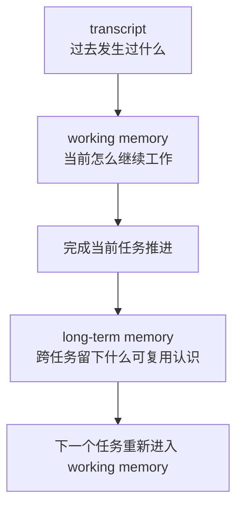
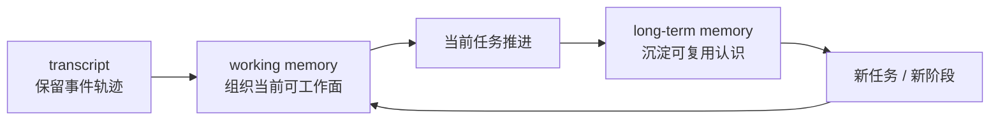

# 卷四 10｜working memory / transcript / long-term memory 为什么不是一回事

## 导读

- **所属卷**：卷四：上下文与状态怎么维持系统持续工作
- **卷内位置**：10 / 10
- **在长期记忆组中的位置**：02 / 04
- **上一篇**：[卷四 09｜为什么 Claude Code 的 memory 不是 context 的别名](./09-why-memory-is-not-just-another-name-for-context.md)
- **下一篇**：[卷四 11｜MEMORY.md / memdir 为什么不是普通文件，而是正式长期记忆层](./11-why-memory-md-and-memdir-are-a-formal-long-term-memory-layer.md)

上一篇先拆掉了一个总误解：memory 不是更长一点的 context。可只做到这一步还不够。因为很多读者接下来还是会把 Claude Code 的连续性想成一个“大记忆池”——里面混着聊天历史、当前工作面和系统留下来的长期认识，只是离当前 query 远近不同而已。

这正是本篇要继续拆开的地方。

如果 working memory、transcript、long-term memory 不分层，后面关于长期记忆怎么成立、为什么它会进入运行时、它和当前工作面是什么关系，都会被误读成“系统换了种方式保存聊天记录”。

## 这篇要回答的问题

> **为什么 Claude Code 的连续性不能被压成一个“大记忆池”，而必须区分 working memory、transcript 和 long-term memory？**

这篇先给结论：

> **transcript 回答“发生过什么”，working memory 回答“当前怎么继续工作”，long-term memory 回答“跨任务留下了什么可复用认识”；三层解决的是三类不同问题，所以不能被当成同一个东西的不同叫法。**

## 先给最短分层图

这张图最重要的不是画出先后顺序，而是先钉住三层职责：

- **transcript 是轨迹层**
- **working memory 是当前工作层**
- **long-term memory 是跨任务认识层**

它们彼此相关，但不能互相代替。

## 先把一句最容易记住的话立住

如果只保留一句最短判断，可以这样记：

- **transcript**：我能不能追溯这条工作线里发生过什么。
- **working memory**：我现在凭什么还能接着干下去。
- **long-term memory**：下次换任务后，系统还留下了什么值得继续带着的认识。

这三句话一旦分清，很多常见混淆会自动消失。

## 第一层：transcript 先回答“发生过什么”

transcript 最像会话档案。

它关心的首先不是当前 query 要带多少材料，也不是系统已经沉淀出了哪些长期认识，而是：

- 这条工作线上发生过哪些事件
- 这些事件之后还能不能被追溯
- 系统在需要恢复、回看、重建时，还有没有依据

所以 transcript 的角色更接近**轨迹保留**。

它的重要性在于：如果没有 transcript，系统对过去就只剩模糊印象，很多恢复、重连和历史理解都会失去依据。但 transcript 再完整，也只是说明“事情发生过”。

这和“系统已经真正记住了什么”并不是一回事。

### 为什么 transcript 不能直接等于 memory

因为档案和认识不是同一层东西。

- 档案可以很多、很细、很原始
- 认识必须更少、更稳、可复用

也就是说，transcript 能回答的是：

> **过去发生过什么？**

它不能单独回答的是：

> **这些过去里，哪些已经变成以后还值得继续使用的认识？**

所以“保存了历史”不等于“形成了长期记忆”。

## 第二层：working memory 回答“当前怎么继续工作”

卷四前半其实一直在讲这件事，只是当时更多用的是“当前可工作的上下文面”这个说法。

working memory 关心的是：在当前这一轮、当前这一段推进里，系统到底凭什么还能继续工作。它更接近一个**当前可操作的工作面**，而不是完整档案，也不是长期沉淀层。

这一层通常要解决的是：

- 当前目标和方向还在不在
- 最近的关键结果有没有接住
- 当前规则、约束和现场条件是否还可用
- 模型是否还能在这一轮里继续做出连贯动作

所以 working memory 不是“过去所有东西的仓库”，而是“现在还能继续干活的那一小块有效面”。

### 为什么 working memory 不能等于 transcript

因为当前能继续工作，不需要把全部过去原样背在身上。

transcript 更像全程录像；working memory 更像当前桌面。

- 全程录像解决的是可追溯
- 当前桌面解决的是可继续操作

这也是为什么卷四前面的 compact、collapse、projection、restore 都更像在围绕当前工作面治理，而不是围绕 transcript 本体做删改。系统真正想保住的，首先是**工作能力**，不是**历史原样在场**。

所以 working memory 回答的不是“发生过什么最完整”，而是：

> **为了让当前继续推进，什么必须在场？**

## 第三层：long-term memory 回答“跨任务留下了什么可复用认识”

long-term memory 再往前走了一步。

它关心的已经不是当前这条工作线怎样不断续上，而是当任务切换、阶段变化、下次再来时，系统是否还保留了对用户与项目的稳定认识。

这一层回答的问题是：

- 这一段工作之后，到底留下了什么可复用认识
- 下次换个任务入口时，哪些认识仍然成立
- 系统是否不必每次都从零重新理解同一个人和同一个项目

所以 long-term memory 的重点从来不是“再保存一份原始记录”，而是：

> **让跨任务还能继续起作用的认识被保留下来。**

### 为什么 long-term memory 不能等于 working memory

因为 working memory 主要服务于**当前推进**，long-term memory 服务于**之后还认得出来**。

两者最大的区别在时间尺度：

- working memory 更偏当前任务阶段
- long-term memory 更偏跨任务持续性

前者只要保证现在能干活就够了；后者必须能在任务切换后仍然有价值。

因此，当前工作面里很重要的东西，不一定值得长期留下；而值得长期留下的认识，也不一定要以当前工作面的原样出现。

## 把三层放在同一张图里看，误会就会少很多

这张图真正想强调的是：Claude Code 的连续性不是“有一个越来越大的记忆池”，而是至少有三种不同的连续性机制在协同：

1. **轨迹连续性**：过去发生过的东西没有完全失踪。
2. **工作连续性**：当前任务还能接着往前推。
3. **认识连续性**：系统对用户和项目的理解可以跨任务延续。

如果把这三种连续性压成一个词，系统就会被误读成“只是很会保存历史”。

但 Claude Code 真正往前走的一步，是它不只在保存历史，还在维持当前工作能力，并逐渐形成跨任务认识。

## 为什么一旦不分层，连续性就会被误读成“堆历史”

这是本篇最关键的风险提示。

如果把 working memory、transcript、long-term memory 混在一起，读者通常会连续犯三种错。

### 误读一：把“历史还在”当成“当前就能继续工作”

不是历史还在，当前工作就一定接得上。

很多旧材料即使仍然存在于 transcript 中，也未必还是当前任务真正需要的工作条件。当前可工作面能不能成立，依赖的是 working memory 是否还保住了方向、约束、结果和现场，而不是 transcript 是否无限完整。

### 误读二：把“当前还能继续工作”当成“系统已经形成长期认识”

这也是上一篇刚刚拆开的误会的继续版。

一个系统完全可能：

- 当前这轮干得很顺
- 当前工作面维护得也很好
- 但任务一换，仍然没有留下任何稳定认识

这说明 working memory 成立，不自动推出 long-term memory 成立。

### 误读三：把“长期记忆”理解成“把 transcript 再存一份”

long-term memory 的价值不在于多一份原始备份，而在于它留下的是**以后还能继续使用的认识**。如果只是把过去原样堆起来，系统得到的仍然主要是档案，不是长期认识。

## 这一分层为什么对长期记忆组尤其关键

长期记忆组后面的文章还要继续推进两步：

- 一步回答：长期记忆为什么会变成正式层，而不是聊天外的附属便签
- 一步回答：为什么系统会把长期记忆做成持续运行的一条链

但这两步都建立在今天这个前提上：

> **你得先承认“发生过什么”“当前怎么继续工作”“跨任务留下了什么认识”是三种不同问题。**

如果这个前提不成立，后面所有讨论都会塌成一句话：系统不过是在换着花样存聊天记录。

而这显然不足以解释 Claude Code 为什么会从会话连续性，继续走向长期认识连续性。

## 边界：这篇先不展开什么

为了守住第二篇的分工，这里故意不往下展开三类问题。

### 1. 不细讲长期记忆怎样被自动提取

本篇只讲分层认知，不讲后台提取链路和实现细节。

### 2. 不细讲长期记忆的具体载体和文件形式

本篇先不讨论它最终落成什么外形，因为那是下一篇“正式层对象化”的主题。

### 3. 不展开安全隔离、作用域治理和更细的机制边界

这些都不是本篇的主问题。本篇最重要的任务，是先把三层连续性容器拆开。

## 一句话收口

> **transcript 负责回答“发生过什么”，working memory 负责回答“当前怎么继续工作”，long-term memory 负责回答“跨任务留下了什么可复用认识”；Claude Code 的连续性不是把三者堆成一个大记忆池，而是让轨迹、当前工作面与长期认识分别承担不同职责。**
