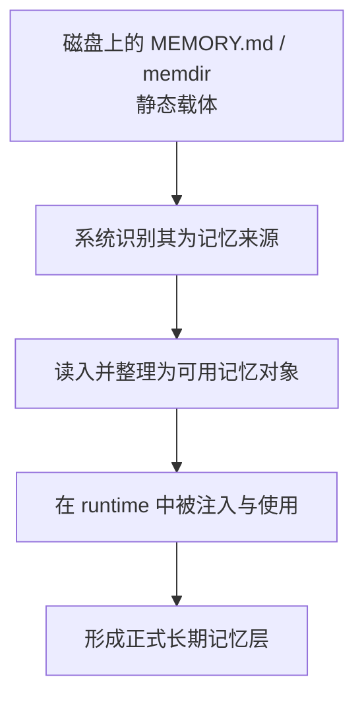
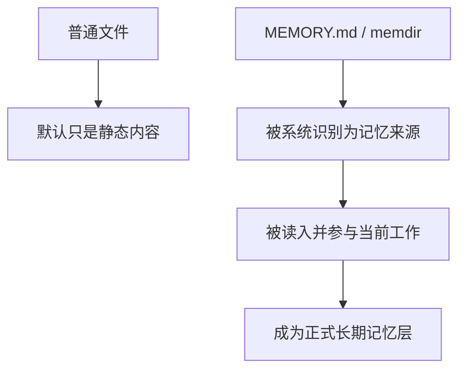

# 卷四 11｜MEMORY.md / memdir 为什么不是普通文件，而是正式长期记忆层

## 导读

- **所属卷**：卷四：上下文与状态怎么维持系统持续工作
- **卷内位置**：11 / 11
- **上一篇**：[卷四 10｜working memory / transcript / long-term memory 为什么不是一回事](./10-why-working-memory-transcript-and-long-term-memory-are-not-the-same.md)
- **下一篇**：[卷四 12｜为什么自动记忆提取不是小功能，而是系统持续性的后台 runtime](./12-why-automatic-memory-extraction-is-a-background-runtime-for-system-continuity.md)

第二篇已经把 working memory、transcript、long-term memory 这三层连续性容器拆开了。这一篇不再重讲分工，而是把视角往前推一步：**长期记忆到底以什么对象形态进入系统。**

很多读者看到 `MEMORY.md` 或 memdir 的第一反应，都是“这不就是文件吗”“这不就是用户自己写的笔记目录吗”。这种直觉并不完全错，但它会错过最关键的一层：Claude Code 真正关心的，从来不是它外表像不像文件，而是它有没有被系统识别成一层可加载、可注入、可继续参与运行时的长期记忆对象。

所以这一篇真正要回答的，不是“为什么系统喜欢用 markdown 文件存东西”，而是：**为什么同样长得像文件的东西，一旦进入识别、读入、使用链，就不再只是静态文档，而会变成正式长期记忆层。**

## 这篇要回答的问题

> **为什么 `MEMORY.md` / memdir 不只是用户手工放的笔记文件，而是一旦进入 Claude Code 运行时就会变成正式长期记忆层？**

先给这一篇的结论：

> **`MEMORY.md` / memdir 的关键不在文件外形，而在它是否被系统识别、读入、并作为长期认识重新带回 runtime；一旦这条链成立，它就已经不是普通文档，而是正式长期记忆层。**

## 先把最容易卡住的直觉纠正掉：文件外形不是决定因素

把 `MEMORY.md` 看成“文件”，当然没错；它在文件系统里本来就是文件。memdir 看起来也只是一个目录，里面放着若干记忆片段。问题在于，如果讨论停在这里，读者会很自然地把长期记忆理解成：

- 用户自己维护的一份说明书
- 项目根目录里的一堆辅助文档
- 需要时才手动翻看的笔记
- 和运行时没有正式关系的外挂材料

这正是这一篇要拆掉的误解。

因为在 Claude Code 里，**“是不是文件”只决定它怎样落地存放；“是不是长期记忆层”则取决于系统怎样识别和使用它。**

同样是 markdown：

- 一个普通 `README.md` 也许只是项目介绍
- 一个随手写的 `notes.md` 也许只是人工备忘
- 但 `MEMORY.md` / memdir 一旦被系统按记忆对象对待，它承担的就不再是“被动摆在那里等人打开”，而是“作为长期认识层参与当前工作”

也就是说，真正的分界线不在磁盘层，而在 runtime 身份层。

## 第二篇已经解决“它和别的容器不是一回事”；这一篇只解决“它怎样成为正式对象”

这里要特别守住和第二篇的边界。

第二篇回答的是：

- transcript 不是 long-term memory
- working memory 不是 transcript
- long-term memory 不是“更大的那一层历史池”

而这一篇不再重复三层容器分工。这里真正要补的是另一个问题：

> **长期记忆既然不是普通历史，也不是当前工作面，那它到底以什么对象形式存在？**

Claude Code 给出的答案并不抽象：它不是靠一个纯概念层存在，而是落在 `MEMORY.md` / memdir 这样的载体上；但更关键的是，系统会把这些载体进一步提升成正式记忆对象。

所以这一篇的重点不是“长期记忆和 transcript 有什么不同”，而是“为什么 `MEMORY.md` / memdir 这种载体一旦被系统纳入运行链，就从静态文件变成了正式层”。

## 先给最短对象化关系图

这张图最重要的地方，在于它把“有个文件”与“形成长期记忆层”拆成了两个阶段。

- 只有 A，没有后面几步，它仍然更像静态文档
- 一旦 B、C、D 成立，E 就已经成立

所以长期记忆真正成立的标志，不是仓库里出现了一个名字叫 `MEMORY.md` 的文件，而是系统开始把它当成长期认识来源来处理。

## 为什么 `MEMORY.md` 不是普通文档：因为它带着被系统承认的角色

可以把普通文档和 `MEMORY.md` 的差别，压成一句最短判断：

> **普通文档默认只是“可被人阅读的内容”；`MEMORY.md` 默认还带着“可被系统识别并转入运行时”的角色声明。**

这不是说每个叫 `MEMORY.md` 的文件天然就会自动生效，而是说 Claude Code 在架构上预留了这样一个对象位：

- 某些路径不是随意文本，而是记忆来源
- 某些内容不是一般说明，而是长期认识候选
- 某些载体一旦被会话创建、状态构造、运行时读取链纳入，就会影响系统对用户和项目的认识

从这个角度看，`MEMORY.md` 的本质更接近 **系统约定过的记忆入口**，而不只是“大家恰好爱用的一个文件名”。

## memdir 也不是“很多普通文件的集合”，而是被对象化后的记忆容器

很多人对 memdir 的误解更深。因为一个目录看起来比单个文件还像“纯存储层”：

- 只是多放几个文件
- 只是方便分类
- 只是把大文档拆散了

但系统视角下，memdir 的意义并不只是分拆文本，而是把长期记忆进一步做成 **可组织、可分片、可按范围参与的容器**。

也就是说，memdir 的重点不在“目录”这个外形，而在：

- 系统承认它是一组记忆对象的承载处
- 里面的片段不是随便摆放，而是会以记忆单位被纳入
- 目录结构、命名、所在位置，会一起参与这层记忆怎样被识别和适用

因此，memdir 不是“普通文件变多了”，而是长期记忆从单文档对象继续走向容器化、对象化。

## 一旦进入 runtime，静态文档就变成了系统长期认识层

这是整篇最核心的一步。

很多时候，读者卡住，是因为脑子里一直保留着一个静态模型：

- 文档就是文档
- 目录就是目录
- 运行时是另一回事

但对 Claude Code 来说，长期记忆真正有意义的时刻，不在写下那一刻，而在 **它被重新带回当前运行时** 的那一刻。

一旦系统会：

- 在 session 或工作线建立时识别这些记忆来源
- 在构造当前工作条件时把它们读入
- 在后续任务里把它们当成“系统已经知道的长期认识”来使用

那么 `MEMORY.md` / memdir 就已经完成了身份变化：

- 在磁盘上，它们仍然是文件或目录
- 在系统里，它们已经是正式长期记忆层

这就像 transcript 既是记录，又是恢复时的历史来源；session 既是一个概念，又要通过具体对象来承载。Claude Code 的很多关键层，都是这样完成“从存储形态到运行时身份”的转换。长期记忆也是一样。

## 路径、作用域、项目边界为什么不是存放细节，而是机制的一部分

一旦接受“关键不在文件外形，而在 runtime 身份”，就会马上看懂另一件事：为什么路径和边界这么重要。

如果 `MEMORY.md` / memdir 真只是普通文件，那么它放哪里，最多影响查找方便不方便；但如果它们是正式长期记忆层的载体，那么路径本身就会变成机制的一部分。因为路径会参与决定：

- 这是用户级长期认识，还是项目级长期认识
- 这份记忆应该在哪个工作边界里生效
- 哪些会话可以继承它，哪些不该继承它
- 系统对“这是谁的记忆、属于哪个项目、在哪个作用域有效”如何做判断

所以项目边界不只是文件归档边界，而是长期记忆的作用域边界。

可以把这层关系压成下面这张图：

这也是为什么这一篇必须讲“载体与对象化”。因为长期记忆不是飘在空中的抽象层，它总要落到具体路径、具体边界、具体对象上；而这些外表上像“存放细节”的东西，恰恰决定了系统怎样正式承认这层记忆。

## 从用户视角看像“我写了一份笔记”，从系统视角看其实是“我注册了一层长期认识来源”

这是理解这一篇最顺手的角度转换。

用户视角里，动作很简单：

- 写一个 `MEMORY.md`
- 建一个 memdir
- 往里面补充偏好、项目约束、长期事实

如果停在这个视角，事情当然像“写文档”。

但系统视角里，同一个动作其实更接近：

- 声明长期记忆来源
- 把长期认识放入可识别位置
- 让后续运行时可以持续读到这层认识

也正因此，Claude Code 的长期记忆和“在仓库里顺手放一篇说明文”不是一个层级。前者是正式机制的一部分，后者只是可能被看见的材料。

## 这篇先不展开什么

### 1. 不重讲三层连续性容器分工

working memory、transcript、long-term memory 的分层，第二篇已经解决。这一篇不再回到“谁负责什么容器”去兜圈。

### 2. 不细讲自动提取流程

这里可以承认：长期记忆不只有人工维护这一种来源，后面还会牵涉自动提取、沉淀、回注。但那是下一篇的问题。这里先守住对象化：**先有正式记忆层，才谈得上自动往里沉淀。**

### 3. 不展开完整后台守护逻辑

后台如何持续筛选、更新、治理长期记忆，是另一条 runtime 链。这一篇只需说明：`MEMORY.md` / memdir 一旦进入运行链，长期记忆层已经成立；不需要在这里把整套后台逻辑写完。

## 最后用一张对照图收口

这张图想留下的不是“`MEMORY.md` 比别的文件高级”，而是一个更准确的判断：**同样是文本载体，只有那些被系统识别、读入、使用的对象，才真正完成了从静态文档到长期记忆层的身份跃迁。**

## 一句话收口

> **`MEMORY.md` / memdir 之所以不是普通文件，不是因为它们长得特别，而是因为 Claude Code 会把它们识别成长期认识来源，并在运行时重新带回当前工作；一旦这条识别—读入—使用链成立，它们就已经是正式长期记忆层。**
